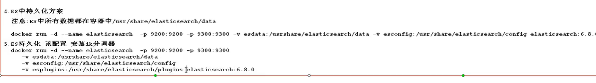

# Docker

## 1 什么是 Docker


> 官网的介绍是Docker is the world’s leading software container platform. 
>
> 官方给Docker的定位是一个应用容器平台。

## 2 为什么是Docker

```markdown
合作开发的时候，在本机可以跑，别人的电脑跑不起来
这里我们拿java Web应用程序举例，我们一个java Web应用程序涉及很多东西，比如jdk、tomcat、spring等等。当这些其中某一项版本不一致的时候，可能就会导致应用程序跑不起来这种情况。Docker则将程序直接打包成镜像，直接运行在容器中即可。

服务器自己的程序挂了，结果发现是别人程序出了问题把内存吃完了，自己程序因为内存不够就挂了

这种也是一种比较常见的情况，如果你的程序重要性不是特别高的话，公司基本上不可能让你的程序独享一台服务器的，这时候你的服务器就会跟公司其他人的程序共享一台服务器，所以不可避免地就会受到其他程序的干扰，导致自己的程序出现问题。Docker就很好解决了环境隔离的问题，别人程序不会影响到自己的程序。

公司要弄一个活动，可能会有大量的流量进来，公司需要再多部署几十台服务器
在没有Docker的情况下，要在几天内部署几十台服务器，这对运维来说是一件非常折磨人的事，而且每台服务器的环境还不一定一样，就会出现各种问题，最后部署地头皮发麻。用Docker的话，我只需要将程序打包到镜像，你要多少台服务，我就给力跑多少容器，极大地提高了部署效率。

```

## 3 Docker和虚拟机区别

> 关于Docker与虚拟机的区别，我在网上找到的一张图，非常直观形象地展示出来，话不多说，直接上图。


比较上面两张图，我们发现

- 虚拟机是携带操作系统，本身很小的应用程序却因为携带了操作系统而变得非常大，很笨重。
- Docker是不携带操作系统的，所以Docker的应用就非常的轻巧。
- 另外在调用宿主机的CPU、磁盘等等这些资源的时候，拿内存举例，`虚拟机`是利用Hypervisor去虚拟化内存，整个调用过程是虚拟内存->虚拟物理内存->真正物理内存，但是`Docker`是利用Docker Engine去调用宿主的的资源，这时候过程是虚拟内存->真正物理内存。

|             |              传统虚拟机              |            **Docker容器**             |
| ----------- | :----------------------------------: | :-----------------------------------: |
| 磁盘占用    |         几个GB到几十个GB左右         |          几十MB到几百MB左右           |
| CPU内存占用 |    虚拟操作系统非常占用CPU和内存     |          Docker引擎占用极低           |
| 启动速度    |      （从开机到运行项目）几分钟      |     （从开启容器到运行项目）几秒      |
| 安装管理    |          需要专门的运维技术          |            安装、管理方便             |
| 应用部署    |          每次部署都费时费力          |       从第二次部署开始轻松简捷        |
| 耦合性      | 多个应用服务安装到一起，容易互相影响 |    每个应用服务一个容器，达成隔离     |
| 系统依赖    |                  无                  | 需求相同或相似的内核，目前推荐是Linux |

## 4 Docker 的核心


- `镜像`: 一个镜像代表一个应用环境,他是一个只读的文件,如 mysql镜像,tomcat镜像,nginx镜像等
- `容器`:镜像每次运行之后就是产生一个容器,就是正在运行的镜像,特点就是可读可写
- `仓库`:用来存放镜像的位置,类似于maven仓库,也是镜像下载和上传的位置
- `dockerFile`:docker生成镜像配置文件,用来书写自定义镜像的一些配置
- `tar`:一个对镜像打包的文件,日后可以还原成镜像

## 5 Docker的安装(centos)

### 5.1 卸载原有 docker

```markdown
$ sudo yum remove docker \
                  docker-client \
                  docker-client-latest \
                  docker-common \
                  docker-latest \
                  docker-latest-logrotate \
                  docker-logrotate \
                  docker-engine

```

### 5.2 安装docker

> 官网：https://docs.docker.com/engine/install/centos/


```markdown
安装docker依赖
$ sudo yum install -y yum-utils

设置docker的yum源
$ sudo yum-config-manager \
    --add-repo \
    https://download.docker.com/linux/centos/docker-ce.repo

安装最新版的docker
$ sudo yum install docker-ce docker-ce-cli containerd.io

指定版本安装docker
$ yum list docker-ce --showduplicates | sort -r
$ sudo yum install docker-ce-<VERSION_STRING> docker-ce-cli-<VERSION_STRING> containerd.io
$ sudo yum install docker-ce-18.09.5-3.el7 docker-ce-cli-18.09.5-3.el7 containerd.io


启动docker
$ sudo systemctl start docker

关闭docker
$ sudo systemctl stop docker

测试docker安装
$ sudo docker run hello-world

```

sudo mkdir -p /etc/docker sudo tee /etc/docker/daemon.json <<-'EOF' {  "registry-mirrors": ["https://dq5u74r1.mirror.aliyuncs.com"] } EOF sudo systemctl daemon-reload sudo systemctl restart docker

## 6 Docker 配置阿里镜像加速服务

### 6.1 docker 运行流程


### 6.2 docker配置阿里云镜像加速

> 访问阿里云登录自己账号查看docker镜像加速服务

```markdown
sudo mkdir -p /etc/docker
sudo tee /etc/docker/daemon.json <<-'EOF'
{
  "registry-mirrors": ["https://dq5u74r1.mirror.aliyuncs.com"]
}
EOF
sudo systemctl daemon-reload
sudo systemctl restart docker
```

验证docker的镜像加速是否生效

```markdown
[root@localhost ~]# docker info
..........
127.0.0.0/8
Registry Mirrors:
'https://lz2nib3q.mirror.aliyuncs.com/'
Live Restore Enabled: false
Product License: Community Engine

```

## 7 Docker的入门应用

### 7.1 docker 的第一个程序

```markdown
docker  run hello-world
```

```markdown
[root@localhost ~]# docker run hello-world

Hello from Docker!
This message shows that your installation appears to be working correctly.

To generate this message, Docker took the following steps:
 1. The Docker client contacted the Docker daemon.
 2. The Docker daemon pulled the "hello-world" image from the Docker Hub.
    (amd64)
 3. The Docker daemon created a new container from that image which runs the
    executable that produces the output you are currently reading.
 4. The Docker daemon streamed that output to the Docker client, which sent it
    to your terminal.

To try something more ambitious, you can run an Ubuntu container with:
 $ docker run -it ubuntu bash

Share images, automate workflows, and more with a free Docker ID:
 https://hub.docker.com/

For more examples and ideas, visit:
 https://docs.docker.com/get-started/

```

## 8 常用命令

### 8.1 辅助命令

```markdown
# 1.安装完成辅助命令

docker version  --	查看docker的信息
docker info		--	查看更详细的信息
docker --help    --	帮助命令

```

### 8.2 Images 镜像命令

>  1.查看本机中所有镜像

docker images	   --------->	列出本地所有镜像
-a	 列出所有镜像（包含中间映像层）
-q	 只显示镜像id

> 2.搜索镜像

docker search [options] 镜像名 -------->	去dockerhub上查询当前镜像
-s 指定值		列出收藏数不少于指定值的镜像
--no-trunc	  显示完整的镜像信息

> 3.从仓库下载镜像

docker pull  镜像名  [:TAG|@DIGEST]	-------> 下载镜像

> 4.删除镜像

docker rmi 镜像名	------->  删除镜像
-f		强制删除

### 8.3 Contrainer 容器命令

#### 1.通过镜像运行一个容器

```markdown
# 
docker run   镜像名:tag |  镜像id

   a.以tomcat镜像为例运行tomcat容器(运行tomcat实例)
   docker run tomcat:8 0-jre8

   b.宿主机端口与容器中端口进行映射-P
   docker run -P 8080( 系统上外部端口):8080(容器内服务监听的端口) toncat:8. 0-jre8(或者直接写IMAGE的ID) 
   
   c.启动容器映射外部端口后台启动
  docker run -p 8080( 系统上外部端口):8080(容器内服务监听的端口) -d(后台运行)tomcat:8.0-jre8


   d.启动容器指定名称后台运行端口映射
docker run -d(后台运行) -P 8081:8080(书写多个) --name tomcat0l(容器名称)
tomcat:8. 0-jre8(镜像名称: tag)


```

#### 2.查看当前运行的容器

```markdown

# 
docker ps       查看正在运行容器

docker ps -a    查看所有容器(运行&非运行)

docker ps -q    返回正在运行容器id

docker ps -qa   返回所有容器的id
```


####  3.停止重启容器的命令

```markdown
#

docker start   容器名字或者容器id          开启容器
docker restart 容器名或者容器id            重启容器
docker stop    容器名或者容器id            正常停止容器运行
docker kill    容器名或者容器id           立即停止容器运行

```

#### 4.删除容器

```markdown

# 
docker rm          容器名称 | 容器id    删除停止的容器
docker rm -f       容器名称|容器id      删除正在运行的容器
docker rm -f $(docker ps -aq)        删除所有容器


```

#### 5.查看容器内服务运行日志

```markdown
# 
docker logs        容器id|容器名称
docker logs -f     容器id|容器名称      ===>实时展示日志
docker logs -tf    容器id|容器名称      ===>加入时间戳实时展示日志
docker logs --tail N(5)容器id |容器名称  ===>查看容器日志最后5(N)行
```

#### 6.查看容器内进程

```markdown
# 
docker top        容器id或者容器名       --查看容器内的进程
```

####  7.进行容器内部交互

```markdown
# 
docker exec -it 容器id或者容器名  bash(命令行)  ====>  进入容器,并与容器内命令终端进行交互
  退出容器exit
```

#### 8.操作系统与容器的传输文件

```markdown

# 
从容器复制文件到操作系统: docker cp  容器唯一标识(id ,name):容器内资源路径操作文件路径/文件目录

从操作系统复制文件到容器:
docker cp 文件|目录名容器唯一标识(id,name):/容器内资源路径
```

#### 9.查看容器内部细节

```markdown
# 
docker inspect  容器id|容器名称
```

#### 10.将容器打包成一个新的镜像

```markdown

# 
必须是正在运行的容器才可以打包
docker commit -m "描述信息" -a "作者信息"
(容器id或者名称)打包的镜像名称:标签
```

#### 11.将镜像备份出来

```markdown

# 
docker save 镜像名称:Tag -o文件名
docker save test-tomcat:1.0 -0 test-tomcat-1. 0. tar
docker load -1 test-tomcat-1. 0. tar

```


## 9 docker的镜像原理

### 9.1 镜像是什么？

> 镜像是一种轻量级的，可执行的独立软件包，用来打包软件运行环境和基于运行环境开发的软件，它包含运行某个软件所需的所有内容，包括代码、运行时所需的库、环境变量和配置文件。

### 9.2 为什么一个镜像会那么大？


==镜像==就是花卷
`UnionFS（联合文件系统）`:
Union文件系统是一种分层，轻量级并且高性能的文件系统，它支持对文件系统的修改作为一次提交来一层层的叠加，同时可以将不同目录挂载到同一个虚拟文件系统下。Union文件系统是Docker镜像的基础。这种文件系统特性:就是一次同时加载多个文件系统，但从外面看起来，只能看到一个文件系统，联合加载会把各层文件系统叠加起来，这样最终的文件系统会包含所有底层的文件和目录 。	

### 9.3 Docker镜像原理

docker的镜像实际是由一层一层的文件系统组成。

`bootfs`（boot file system）主要包含bootloader和kernel，bootloader主要是引导加载kernel，Linux刚启动时会加载bootfs文件系统。在docker镜像的最底层就是bootfs。这一层与Linux/Unix 系统是一样的，包含boot加载器（bootloader）和内核（kernel）。当boot加载完,后整个内核就都在内存中了，此时内存的使用权已由bootfs转交给内核，此时会卸载bootfs。

`rootfs`（root file system），在bootfs之上，包含的就是典型的linux系统中的/dev，/proc，/bin，/etc等标准的目录和文件。rootfs就是各种不同的操作系统发行版，比如Ubuntu/CentOS等等。

我们平时安装进虚拟机的centos都有1到几个GB，为什么docker这里才200MB？对于一个精简的OS，rootfs可以很小，只需要包括最基本的命令，工具，和程序库就可以了，因为底层直接使用Host的Kernal，自己只需要提供rootfs就行了。由此可见不同的linux发行版，他们的bootfs是一致的，rootfs会有差别。因此不同的发行版可以共用bootfs。


### 9.4 为什么docker镜像要采用这种分层结构呢?

> 最大的一个好处就是资源共享

`比如`：有多个镜像都是从相同的base镜像构建而来的，那么宿主机只需在磁盘中保存一份base镜像。同时内存中也只需要加载一份base镜像，就可以为所有容器服务了。而且镜像的每一层都可以被共享。Docker镜像都是只读的。当容器启动时，一个新的可写层被加载到镜像的顶部。这一层通常被称为容器层，容器层之下都叫镜像层。


## 10 . docker网桥配置

```markdown
# Docker允许通过外部访问容器或容器互联的方式来提供网络服务.
1. docker容器与操作系统通信机制


2. docker网络使用
`注意`:一般在使用docker网桥(bridge)实现容器与容器通信时,都是站在一个应用角度进行容器通信
  - a.查看docker网桥配置
       docker network ls
  - b.创建自定义网桥
       docker create ems( 网桥名称) ===> docker create -d bridge ems( 网桥)
       docker run -d -P 8082:8080 --network ems --name mytomcat01 tomcat:8. 0-jre8 172.18. 0.2==>mytomcat01
docker run -d -P 8083:8080 --network ems - -name mytomcat02 tomcat:8. 0-jre8
`注意:`
一旦在启动容器时指定了网桥之后,日后可以在任何这个网桥关联的容器中使用容器名字进行与其他容器通信
   - c.删除网桥
      docker network rm 网桥名称
   - d.查看网桥详细
      docker inspect ems

```


## 11.数据卷详解

### 1.数据卷作用?  volume
> 用来实现容器与宿主机之间数据共享

### 2.数据卷特点
a. 数据卷可以在容器之.间共享和重用
b. 对数据卷的修改会立即影响到对应容器
c. 对、数据卷、的更新修改，不会影响镜像
d. 数据卷默认会一直存在，即使容器被删除

### 3.数据卷操作
1. 自定义数据卷目录
   docker run -v  绝对路径 : 容器内路径

docker run -d -P 8081:8080 --name tomcat02 -V /root/apps/: /usr/1ocal/tomcat/webapps tomcat:8.0-jre8

2. 自动创建数据卷
   docker  run  -v  卷名(随便起的自动创建) : 容器内路径

   docker run -d -P 8081:8080 --name tomcat02 -V aa: /usr/local/tomcat/webapps tomcat:8. 0-jre8

   > `注意`:
   > 1.aa代表一个数据卷名字，名称可以随便写,docker在不存在时自动创建这个数据卷同时自动映射宿主机中某个目录
   > 2.同时在启动容器时会将a对应容器目录中全部内容复制到aa映射目录中

### ==4.docker操作数据卷指令==
a. 查看生成的数据卷
``   docker volume ls ``


b. 查看某个数据卷的细节
``    docker volume inspect 卷名``


c. 创建数据卷
    docker volume create 卷名


d. 删除没有使用的数据卷
    docker volume prune
    docker volumen rm  卷名

## 12 . 安装其他服务

### ==**启动失败建议重启虚拟机**==

### 1. docker安装Mysql

去dockerHub下载相关的镜像

> 如何使用镜像


a.基本启动mysql服务
`docker  run -d  -e  MYSQL_ROOT_PASSWORD=root -p 3306:3306  mysql:5.5`
-e MYSQL_ ROOT_ PASSWORD=root 代表给root用户指定密码


==b.启动一个mysq1服务后台运行,指定root用户密码,指定容器名字 ,  并使用数据卷将数据持久化到宿主机系统指定名字==
`docker run -p 3306:3306 --name mysql \
-v /mydata/mysql/log:/var/log/mysql \
-v /mydata/mysql/data:/var/lib/mysql \
-v /mydata/mysql/conf:/etc/mysql \
-e MYSQL_ROOT_PASSWORD=root \
-d mysql:5.7.32 `


> 参数解释：
>
> docker run -p 3306:3306 --name mysql\      #将容器3306端口映射到主机的3306端口 
> -v /mydata/mysql/log:/var/log/mysql\    #将日志文件挂载到主机
> -v /mydata/mysql/data:/var/lib/mysql\   #将数据文件挂载到主机
> -v /mydata/mysql/conf:/etc/mysql\         #将配置文件挂载到主机
> -e MYSQL_ROOT_PASSWORD=root\         #初始化root用户的密码为root
> -d mysql:5.7.32                                          #开机启动mysql


c.启动一个mysq1后台运行,指定root用户密码,指定容器名字,使用数据卷将数据持久化到宿主机系统指定名字
注意:通过dockerhub描述得知mysq1存储数据文件目录放置在容器中这个目录/var/lib/mysq1
`docker run -d -p 3307:3306 -e MYSQL_ROOT_PASSWORD=root --name mysql -v mysqldata: /var/1ib/mysq1 mysq1:5.5`


d.启动--个mysq1服务后台运行指定root用户密码指定容器名使用数据卷进行数据持久化,已修改之后的配置文件启动
`docker run -d -P 3308:3306 -e MYSQL_ROOT_PASSWORD=root --name mysq13308 -v nysqldata: /var/1ib/mysq1 -v mysqlconfig: /etc/mysq1 mysq1:5.7.32`

### 2 . docker 安装redis

1.下载redis**镜像**
docker pull redis:5.0. 10


2.启动redis
docker run -d -P 6379:6379 --name redis redis : 5. 0.10


3.开启redis持久化
docker run -P 6379:6379 --name redis -d -P 6379:6379 -v redisdata:/data redis:5.0.10 redis-server -- appendonly yes
注意:一旦开启持久化之后,持久化生成aof文件会被放入容器中/data目录中


4.修改redis配置文件,以配置文件方式启动
注意:在当前/root /redisconf目录中存在redis. conf配置文件
docker run -p 6380:6379 -v /root /redisconf: /usr/local/etc/redis --name myredis -d redis:5. 0.10 redis-server /usr/local/etc/redis/redis . conf


**==docker-compose==文件启动**

创建项目结构,

复制redis.conf文件到conf中


当你想要修改配置文件时，直接修改本地创建的配置文件即可，它会映射到容器内部的配置文件中去

> ***注意***：配置文件的端口号，要与docker-compose文件的端口号一致

```yaml
version: '3'
services:
  redis:
    image: redis:5.0.10
    container_name: redis_stu
    volumes:
      - ./datadir:/data
      - ./conf/redis.conf:/usr/local/etc/redis/redis.conf
      - ./logs:/logs
    command: redis-server /usr/local/etc/redis/redis.conf
    ports:
      - "6379:6379"   #要一致

```


### 3 安装Nginx

```markdown
1 在docker hub搜索nginx
docker search nginx

2 拉取nginx镜像到本地
[root@localhost ~]# docker pull nginx
Using default tag: latest
latest: Pulling from library/nginx
afb6ec6fdc1c: Pull complete 
b90c53a0b692: Pull complete 
11fa52a0fdc0: Pull complete 
Digest: sha256:30dfa439718a17baafefadf16c5e7c9d0a1cde97b4fd84f63b69e13513be7097
Status: Downloaded newer image for nginx:latest
docker.io/library/nginx:latest

3 启动nginx容器
docker run -p 80:80 --name nginx01 -d nginx

4 进入容器
docker exec -it nginx01 /bin/bash
查找目录:  whereis nginx
配置文件:  /etc/nginx/nginx.conf

5 复制配置文件到宿主机
docker cp nginx01(容器id|容器名称):/etc/nginx/nginx.conf 宿主机名录

6 挂在nginx配置以及html到宿主机外部
docker run --name nginx02 -v /root/nginx/nginx.conf:/etc/nginx/nginx.conf -v /root/nginx/html:/usr/share/nginx/html -p 80:80 -d nginx		

docker-compose.yml
  nginx:
    image: nginx:1.9.9
    container_name: nginx_blog
    ports:
      - "80:80"
    volumes:
      - nginx:/etc/nginx/
      - nginx.html:/usr/share/nginx/html
      - nginx.conf:/etc/nginx/nginx.conf
    networks:
      - myblog


```

### 4 安装ElasticSearch

```markdown
1 拉取镜像运行elasticsearch

1.1 dockerhub 拉取镜像
docker pull elasticsearch:6.4.2
1.2 查看docker镜像
docker images
1.3 运行docker镜像
docker run -p 9200:9200 -p 9300:9300 elasticsearch:6.8.0


#  启动报错
OpenJDK 64-Bit Server VM warning: Option UseConcMarkSweepGC was deprecated in version 9.0 and will likely be removed in a future release.


# 解决方案
可以通过如下方法修改

 
[root@nova-92 logs]# find /var/lib/docker/ -name jvm.options


/var/lib/docker/overlay2/f394fa1197ace3d592bb37738b95335fc722950c6a39167a0106586f0d2f2382/diff/etc/elasticsearch/jvm.options
/var/lib/docker/overlay2/1bda3723143784e9db1324180f741dc2532addf41f9224248ade99964966cf18/merged/etc/elasticsearch/jvm.options

 

然后 vim /var/lib/docker/overlay2/f394fa1197ace3d592bb37738b95335fc722950c6a39167a0106586f0d2f2382/diff/etc/elasticsearch/jvm.options

 

修改里面

-Xms4g
-Xmx4g

 

然后保存，我发现2个文件都被改成了4g内存大小
改成512m
 
然后重启docker 里的 elasticsearch 容器

```

如果启动出现如下错误


```markdown
2 预先配置

2.1 在centos虚拟机中，修改配置sysctl.conf
vim /etc/sysctl.conf
2.2 加入如下配置
vm.max_map_count=262144 
2.3 启用配置
sysctl -p

注：这一步是为了防止启动容器时，报出如下错误：
bootstrap checks failed max virtual memory areas vm.max_map_count [65530] likely too low, increase to at least [262144]


3 启动EleasticSearch容器

3.1 复制容器中data目录到宿主机中
docker cp 容器id:/usr/share/share/elasticsearch/data /root/es

3.2 运行ES容器 指定jvm内存大小并指定ik分词器位置
docker run -d --name es -p 9200:9200 -p 9300:9300 
-v /root/es/plugins:/usr/share/elasticsearch/plugins 
-v /root/es/data:/usr/share/elasticsearch/data 
-v /root/es/config:/usr/share/elasticsearch/config    //配置指定卷会出错，建议不要
elasticsearch:6.8.0

# 持久化
```



```markdown


4 安装IK分词器
4.1 下载对应版本的IK分词器
	wget https://github.com/medcl/elasticsearch-analysis-ik/releases/download/v6.8.0/elasticsearch-analysis-ik-6.8.0.zip

4.2 解压到plugins文件夹中
	yum install -y unzip
	unzip -d ik elasticsearch-analysis-ik-6.4.2.zip

4.3 添加自定义扩展词和停用词
	cd plugins/elasticsearch/config
	vim IKAnalyzer.cfg.xml
	<properties>
		<comment>IK Analyzer 扩展配置</comment>
		<!--用户可以在这里配置自己的扩展字典 -->
		<entry key="ext_dict">ext_dict.dic</entry>
		<!--用户可以在这里配置自己的扩展停止词字典-->
		<entry key="ext_stopwords">ext_stopwords.dic</entry>
	</properties>

4.4 在ik分词器目录下config目录中创建ext_dict.dic文件   编码一定要为UTF-8才能生效
	vim ext_dict.dic 加入扩展词即可
	
4.5 在ik分词器目录下config目录中创建ext_stopword.dic文件 
	vim ext_stopwords.dic 加入停用词即可

4.6 重启容器生效
	docker restart 容器id
	
4.8 将此容器提交成为一个新的镜像
	docker commit -a="xiaochen" -m="es with IKAnalyzer" 容器id xiaochen/elasticsearch:6.4.2
	
# 5 安装Kibana

5.1 下载kibana镜像到本地
docker pull kibana:6.8.0

5.2 启动kibana容器
docker run -d --name kibana -e ELASTICSEARCH_URL=http://192.168.47.128:9200 -p 5601:5601 kibana:6.8.0

```


## 13 Dockerfile

### 13.1 什么是Dockerfile

**Dockerfile可以认为是Docker镜像的描述文件，是由一系列命令和参数构成的脚本。主要作用是用来构建docker镜像的构建文件。**


> 通过架构图可以看出通过DockerFile可以直接构建镜像

### 13.2 Dockerfile解析过程


### 13.3 Dockerfile的保留命令

```markdown
官方说明:https://docs.docker.com/engine/reference/builder/
```

| 保留字         | 作用                                                         |
| -------------- | ------------------------------------------------------------ |
| **FROM**       | **当前镜像是基于哪个镜像的** `第一个指令必须是FROM`          |
| MAINTAINER     | 镜像维护者的姓名和邮箱地址                                   |
| **RUN**        | **构建镜像时需要运行的指令**                                 |
| **EXPOSE**     | **当前容器对外暴露出的端口号**                               |
| **WORKDIR**    | **指定在创建容器后，终端默认登录进来的工作目录，一个落脚点** |
| **ENV**        | **用来在构建镜像过程中设置环境变量**                         |
| **ADD**        | **将宿主机目录下的文件拷贝进镜像且ADD命令会自动处理URL和解压tar包** |
| **COPY**       | **类似于ADD，拷贝文件和目录到镜像中 将从构建上下文目录中<原路径>的文件/目录复制到新的一层的镜像内的<目标路径>位置** |
| **VOLUME**     | **容器数据卷，用于数据保存和持久化工作**                     |
| **CMD**        | **指定一个容器启动时要运行的命令 Dockerfile中可以有多个CMD指令，但只有最后一个生效，CMD会被docker run之后的参数替换** |
| **ENTRYPOINT** | **指定一个容器启动时要运行的命令 ENTRYPOINT的目的和CMD一样，都是在指定容器启动程序及其参数** |

#### 1 FROM 命令

```markdown
基于那个镜像进行构建新的镜像,在构建时会自动从docker hub拉取base镜像 必须作为Dockerfile的第一个指令出现
```

```markdown
语法:
FROM  <image>
FROM  <image>[:<tag>]     使用版本不写为latest
FROM  <image>[@<digest>]  使用摘要

```

#### 2 MAINTAINER 命令

```markdown
镜像维护者的姓名和邮箱地址[废弃]

语法:
  MAINTAINER <name>

```

#### 3 RUN 命令

RUN指令将在当前映像之上的新层中执行任何命令并提交结果。生成的提交映像将用于Dockerfile中的下一步

```markdown
语法:
RUN <command> (shell form, the command is run in a shell, which by default is /bin/sh -c on Linux or cmd /S /C on Windows)
RUN echo hello

RUN ["executable", "param1", "param2"] (exec form)
RUN ["/bin/bash", "-c", "echo hello"]

```

#### 4 EXPOSE 命令

```markdown
用来指定构建的镜像在运行为容器时对外暴露的端口

语法:
EXPOSE 80/tcp  如果没有显示指定则默认暴露都是tcp
EXPOSE 80/udp

```

#### 5 CMD 命令

```markdown
用来为启动的容器指定执行的命令,在Dockerfile中只能有一条CMD指令。如果列出多个命令，则只有最后一个命令才会生效。

注意: Dockerfile中只能有一条CMD指令。如果列出多个命令，则只有最后一个命令才会生效。

语法:
CMD ["executable","param1","param2"] (exec form, this is the preferred form)
CMD ["param1","param2"] (as default parameters to ENTRYPOINT)
CMD command param1 param2 (shell form)

```

#### 6 WORKDIR 命令

```markdown
用来为Dockerfile中的任何RUN、CMD、ENTRYPOINT、COPY和ADD指令设置工作目录。如果WORKDIR不存在，即使它没有在任何后续Dockerfile指令中使用，它也将被创建。

语法:
WORKDIR /path/to/workdir

WORKDIR /a
WORKDIR b
WORKDIR c
注意:WORKDIR指令可以在Dockerfile中多次使用。如果提供了相对路径，则该路径将与先前WORKDIR指令的路径相对


```

#### 7 ENV 命令

```markdown
用来为构建镜像设置环境变量。这个值将出现在构建阶段中所有后续指令的环境中。

语法：
ENV <key> <value>
ENV <key>=<value> ... 

```

#### 8 ADD 命令

用来从context上下文复制新文件、目录或远程文件url，并将它们添加到位于指定路径的映像文件系统中。

```markdown
语法:
ADD hom* /mydir/       通配符添加多个文件
ADD hom?.txt /mydir/   通配符添加
ADD test.txt relativeDir/  可以指定相对路径
ADD test.txt /absoluteDir/ 也可以指定绝对路径
ADD url 

```

#### 9 COPY 命令

```markdown
用来将context目录中指定文件复制到镜像的指定目录中

语法:
COPY src dest
COPY ["<src>",... "<dest>"]

```

#### 10 VOLUME 命令

```markdown
用来定义容器运行时可以挂在到宿主机的目录
语法:
VOLUME ["/data"]

```

#### 11 ENTRYPOINT命令

```mariadb
用来指定容器启动时执行命令和CMD类似

语法:
ENTRYPOINT ["executable", "param1", "param2"]
ENTRYPOINT command param1 param2

ENTRYPOINT指令，往往用于设置容器启动后的**第一个命令**，这对一个容器来说往往是固定的。
CMD指令，往往用于设置容器启动的第一个命令的**默认参数**，这对一个容器来说可以是变化的。

```

## 14 Dockerfile构建springboot项目部署

### 14.1 准备springboot可运行项目


### 14.2 将可运行项目放入linux虚拟机中


### 14.3 编写Dockerfile

```markdown
FROM openjdk:8      #基于哪个镜像进行构建
WORKDIR /ems        #定义进入容器时默认位置,接下来后序操作工作位置
ADD hello-0.0.1-SNAPSHOT.jar hello.jar     #将上线文中名字为hello-xx.jar重命名为hello.jar
EXPOSE 8080         #让当前容器保露哪个端口因为项目使用端口是8080
ENTRYPOINT ["java","-jar"] #启动应用固定命令
CMD ["hello.jar"]      #执行jar名称


```

### 14.4 构建镜像

```bash
[root@localhost Docker]# docker build -t hello .
```

### 14.5 运行镜像

```bash
[root@localhost Docker]# docker run -p 8080:8080 hello
```

### 14.6 访问项目

```markdown
http://192.168.47.128:8080/index.html
```

## 15 Docker-compose

### 简介

`Compose`项目是Docker官方的开源项目，负责实现对`Docker`容器集群的快速编排。从功能上看，跟``OpenStack` 中的`Heat` 十分类似。
其代码目前在[htps://ithub.com/docker/compose](htps://ithub.com/docker/compose)上开源。

`Compose`定位是「定 义和运行多个Docker容器的应用(Defining and running multi-container Docker applications)」，其前身是开源项目Fig。

通过第一部分中的介绍，我们知道使用一个``Dockerfile `模板文件，可以让用户很方便的定义-个单独的应用容器。然而，在日常工作中，经常会碰到需要多个容器相互配合来完成某项任务的情况。例如要实现一一个Web项目，除了Web服务容器本身，往往还需要再加上后端的数据库服务容器，甚至还包括负载均衡容器等。

`Compose`恰好满足了这样的需求。它允许用户通过一-个单独的docker -compose .yml模板文件(YAML 格式)来定义一组相关联的应用容器为一一个``项目(project)``，

`Compose`中有两个重要的概念:

`服务( service )`:一个应用的容器，实际上可以包括若干运行相同镜像的容器实例。
项目( project ):由一组关联的应用容器组成的一个完整业务单元，在``docker- compose . yml`文件中定义。
`Compose`的默认管理对象是项目，通过子命令对项目中的一组容器进行便捷地生命周期管理。

`Compose`项目由Python编写，实现上调用了Docker服务提供的API来对容器进行管理。因此，只要所操作的平台支持DockerAPI,就可以在其上利用Compose 来进行编排管理。

### 安装

在 https://github.com/docker/compose/releases 中下载对应的版本，这里选择的是 [1.23.2](https://www.oschina.net/action/GoToLink?url=https%3A%2F%2Fgithub.com%2Fdocker%2Fcompose%2Freleases%2Ftag%2F1.23.2) 的 

我们已经提前下载并存放在了 /home/download/docker-compose_1.23.2/ 目录

```bash
[root@localhost /]# ls /home/download/docker-compose_1.23.2/
docker-compose-Linux-x86_64
```

移动到bin目录并更改执行权限

```bash
mv /home/download/docker-compose_1.23.2/docker-compose-Linux-x86_64 /usr/local/bin/docker-compose
```

添加执行权限

```bash
sudo chmod +x /usr/local/bin/docker-compose
```

安装完成


### 命令模板

**1 . 重要两个概念**
`服务(service)` : 一个服务就是一个应用容器

`项目(Project)` : 有多个服务共同组成一个具有相同业务逻辑单元项目在docker-compose.yml文件中进行定义

**2 . docker- compose命令**

```yaml

version: ”3.8“  # 指定版本，最高4.0  官网
services:
  mysql: #服务名称
    image: mysql:5.5 #使用哪个镜像相 当于run image
    container_name: mysql_01 #相当于run的--name,起别名
    ports:
      - "3306:3306" #用来完成host与容器的端口映射关系相当于run -p
    volumes:  #完成宿主机与容器中目录数据卷共享相当于run -v
      - mysqldata:/var/lib/mysql  #使用自动路径映射到mysqldata，要先在volumes中声明
      - mysqlconf:/etc/mysql
      #/root/apps: /usr/local/tomcat/webapps #使用自定义路径映射
    environment:
      - MYSQL_ROOT_PASSWORD=root  #配置环境变量
    networks:   # 配置网桥
      - hello
   # cmd : 	redis-server /...      #用来覆盖容器默认启动指令
   # sysctls: #用来修改 容器中系统内部参数并不是必须 有些服务启动受容器内操作系统参数限制可能会无                法启动必须通过修改容器中参数才能启动
#     - net.core.somaxconn=1024
#     - net.ipv4.tcp_syncookies=0
#     ulimits: #用来修改容器 中系统内部进程数限制日后使用时可根据当前容器运行服务要求进行修改
#       nproc: 65535
#       nofile:
#         soft: 20000
#         hard: 40000


volumes:     # 声明上面服务所使用的自动创建的卷名
  mysqldata: #声明指令的卷名compose自动创建该卷名但是会在之前加入项目名
  mysqlconf:
    external: #使用自定义卷名
      false   #trne确定使用指定卷名注意:一旦使用外部自定义卷名启动服务之.前必须手动创建

networks: #定义服务用到桥，最外顶格写
    hello:       #定义上面的服务用到的网桥名称默认创建就是bridge


```

### 参数解释

```markdown
services :
  服务id:
    image: #使用镜像是谁 image:tag image image: @digest
    container_name:#服务启动之后容器名称，相当docker run之后的--name
    ports:#用来指定容器与宿主机端口映射，相当docker run之后的-p
      - "8080:8080"
    volumes:#用来指定容器中目录与宿主机目录进行数据卷映射docker run之后-v
      - /root/apps:容器内路径
      - aa(自动):容器内路径注意:一旦使用卷名自动,必须通过volume进行声明
    networks: #用来指定容器使用的是哪个网桥docker run --network
      - ems(网桥名称自动创建)注意:一旦指定网桥必须通过network进行声明
    environment:#用来给容器中某些环境进行赋值操作
      - MYSQL_ROOT_PASSWORD=root
    env_file: #用来给容器中某些环境进行賦值操作，将环境变量赋值转移到配置文件中
      - mysql. env #文件中内容必须是MYSQL_ RO0T_ PAS SWORD=root
    comunand: redis-server /usr/redis/conf/redis.conf #用来覆盖容器启动默认指令
healthcheck :
#心跳机制
test: ["CMD"， "cur1"， "-f"， "http: //localhost "]
interval: 1m30s .
timeout: 10s
retries: 
    sysctls: #用来修改容器内系统的参数
       net.core.somaxconn=1024
       net.ipv4.tcp_syncookies=0
    ulimits: #用来修改容器内系统的最大进程数
       nproc: 65535
       nofile:
         soft: 20000
         hard: 40000
    depends_on:#用来指定当前服务启动依赖哪些服务,依赖的服务会在当前服务之前优先启动.
       - mysql  #注意:这个地方书写服务id |服务名
volumes :
  aa:
networks:
  ems :

```

### ==build指令==

```markdown
# 1.build指令
`作用`:用来将指定DockerFile打包成对应镜像,然后在运行该镜像
services :
  web:
    build: #用来指定Dockerfile所在目录,先根据build中Dockerfile自动构建镜像,自动运行容器


# eg:

services :
  demo:
    build:#启动服务时先将build命令中指定dockerfile打包成镜像,在运行该镜像
       context: demo #指定上下文目录dockerfile所在目录
       dockerfile: Dockerfile
    container_name: demo
    ports: "8082: 8081"
    networks:
      - hello
    depends_on :
      - tomcat01

```

### 常用指令

```markdown
1. compose模板指令和指令区别
模板指令:用来书写在docker-compose.yml文件中指令称之为模板指令用来为服务进行服务的指令, 用来对整个docker-compose.yml对应的这个项目操作书写docker-compose命令之后命令
docker-compose up(指令)
2.常用指令
`1.up指令`
   作用:用来启动所有docker-compose服务
   选项: -d 后台启动所有服务
`2.down指令`
   作用:用来关闭所有docker-compose服务
3. exec指令
作用:进入容器
docker-compose exec redis (docker-compose. yml中声明服务id) bash
4.ps指令
作用:用来展示当前docker- compose运行的所有容器
docker-compose ps
5. restart指令
作用:用来重启项目中某个服务如果不写服务id默认重启所有服务
docker-compose restart [服 务di] .
6. rm指令
作用:用来删除项目服务
docker -compose rm -fv [服务id] 注意:谨慎操作-v删除服务的数据卷
7. start指令 启动服务docker-compose start [服务id]
8. stop指令关闭服务docker-composestop
[服务id]
9.top指令用来查看compose容器内运行的进程docker-composetop
10.docker-compose unpause
服务id.
11、docker-compose pause服务id
`12，docker-compose logs 服务id 查看服务日志`

```

### 可视化工具

```markdown
porttainer docker 可视化工具
1.下载可视化工具
docker pu1ll port ainer /port ainer
2.启动port ainer
docker run -d
-p 8000: 8000
p 9000: 9000
-- n ame=port ainer
-- rest art= always .
-v /var /run/docker. sock: /var /run /docker. sock
-v portainer_ data: /data
port ainer /port ainer
3.通过docker -compose启动
port ainer :
image: port ainer / port ainer
cont ainer_ name: port ainer
volumes :
/var /run/docker . sock: /var /run/docker . sock
- portainer data: /dat a
networks:
hello
ports:
"-'8000: 8000"
-"9000: 9000"

```

## es_travel部署案例

### 1 依赖地址改变

> 将配置地址改成目的地址

```properties
spring.datasource.driver-class-name=com.mysql.cj.jdbc.Driver
spring.datasource.url=jdbc:mysql://192.168.47.128:3306/travel?useUnicode=true&useSSL=false&characterEncoding=utf8&serverTimezone=Asia/Shanghai
spring.datasource.username=root
spring.datasource.password=599121412
spring.datasource.type=com.alibaba.druid.pool.DruidDataSource
server.port=8989
# redis 配置
spring.redis.database=0
spring.redis.host=192.168.47.128
spring.redis.port=6379
```


### 2  打jar包

### 3 编写Dockerfile文件

```dockerfile
FROM java:8
WORKDIR /es_travel
ADD es_demo-0.0.1-SNAPSHOT.jar es_demo.jar
EXPOSE 8989   # 暴露的端口要和上面的配置文件对应上
ENTRYPOINT ["java","-jar"]
CMD ["es_demo.jar"]
```

### 4 编写docker-compose.yml文件

```yaml
version: "3.8"
services:
  es_travel:
    build:                #启动服务时先将build命令中指定Dockerfile打包成镜像,再运行该镜像
       context: es_travel #指定上下文目录dockerfile所在目录
       dockerfile: Dockerfile
    container_name: es_travel
    ports:
      - "8989:8989"      # 暴露的端口要和Dockerfile中的一致
    networks:
      - es_travel       # 网桥一定要是同一个，才可以有进程间通信
    depends_on:
      - es
      - mysql
      - redis
  es:
    image: elasticsearch:6.8.0
    container_name: es
    ports:
      - "9200:9200"
      - "9300:9300"
    volumes:
      - /root/es/plugins:/usr/share/elasticsearch/plugins
      - /root/es/data:/usr/share/elasticsearch/data
    networks:
      - es_travel
  mysql:
    image: mysql:5.5
    container_name: mysql_es
    ports:
      - "3306:3306"
    volumes:
      - mysqldata:/var/lib/mysql
      - mysqlconf:/etc/mysql
    environment:
      - MYSQL_ROOT_PASSWORD=599121412
    networks:
      - es_travel
  redis:
   image: redis:5.0.10
   container_name: redis_es
   ports:
     - "6379:6379"
   volumes:
     - redisconf:/usr/local/etc/redis
   networks:
     - es_travel


volumes:
  mysqldata:
  mysqlconf:
  redisconf:
networks:
  es_travel:
```

### 5 运行全部的镜像(docker-compose)

```bash
docker-compose up
```


