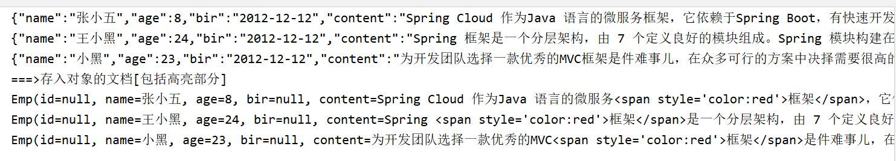

# 1.什么是RestFul

```markdown
`REST` :  表现层状态转化(Representational State Transfer)，如果一个架构符合REST原则，就称它为 RESTful 架构风格。 

`资源(Resources)`: 所谓"资源"，就是网络上的一个实体，或者说是网络上的一个具体信息 

`表现层(Representation)` :我们把"资源"具体呈现出来的形式，叫做它的"表现层"。

`状态转化(State Transfer)`:如果客户端想要操作服务器，必须通过某种手段，让服务器端发生"状态转 化"(State Transfer)。而这种转化是建立在表现层之上的，所以就是"表现层状态转化"。

REST原则就是指一个URL代表一个唯一资源，并且通过HTTP协议里面四个动词:GET、POST、PUT、DELETE对应四种服务器端的基本操作: GET用来获取资源，POST用来更新资源(也可以用于添加资源)，PUT用来添加资源(也可以用于更新资源)，DELETE用来删除资源。

```

# 2. 什么是全文检索

​      ==全文检索是计算机程序通过扫描文章中的每一个词==，对每一个词建立一个索引，指明该词在文章中出现的次数和位置。当用户查询时根据建立的索引查找，类似于通过字典的检索字表查字的过程。

全文检索（Full-Text Retrieval(检索)）以文本作为检索对象，找出含有指定词汇的文本。全面、准确和快速是衡量全文检索系统的关键指标。

**关于全文检索，我们要知道：**

1. 只处理文本。
2. 不处理语义。
3. 搜索时英文不区分大小写。
4. 结果列表有相关度排序。

# 3. 什么是ElasticSearch

`Elasticsearch`是一个基于``Apache Lucene(TM)``的开源搜索引擎。无论在开源还是专有领域，Lucene可以被认为是迄今为止最先进、性能最好的、功能最全的搜索引擎库。

但是，Lucene只是一个库。想要 使用它，你必须使用Java来作为开发语言并将其直接集成到你的
应用中，更糟糕的是，Lucene非常复杂，你需要深入了解检索的相关知识来理解它是如何工作的。

Elasticsearch也使用Java开发并使用Lucene作为其核心来实现所有索引和搜索的功能，但是它的目
的是通过简单的 RESTful API 来隐藏Lucene的复杂性，从而让全文搜索变得简单。

# 4. ES的诞生

# 5 .ES的应用场景 json格式数据 restful

> `ES`主要以轻量级JSON作为数据存储格式，这点与MongoDB有点类似，但它在读写性能上优于 MongoDB 。同时也支持地理位置查询 ，还方便地理位置和文本混合查询 。 以及在统计、日志类数据存储和分析、可视化这方面是引领者。
>
> `国外:`
>
> `Wikipedia(`维基百科)使用ES提供全文搜索并高亮关键字、StackOverflow(IT问答网站)结合全文搜索与地理位置查询、Github使用Elasticsearch检索1300亿行的代码。 
>
> `国内:`
> `百度`(在云分析、网盟、预测、文库、钱包、风控等业务上都应用了ES，单集群每天导入30TB+数据， 总共每天60TB+)、新浪 、阿里巴巴、腾讯等公司均有对ES的使用。
>
> 使用比较广泛的平台ELK(ElasticSearch 全文检索服务器 核心, Logstash, Kibana)。

# 6.安装ElasticSearch

启动报已杀死：

`修改ES中config目录下的jvm.options文件
vim jvm.options
将
-Xms1g
-Xmx1g
改为
-Xms512m
-Xmx512m
就启动成功了`

```markdown
# 1 安装前准备
	centos7 +
	java 8  +
	elastic 7.10.2

# 2 在官方网站下载ES
		wget http://artifacts.elastic.co/downloads/elasticsearch/elasticsearch-6.4.1.tar.gz

# 3 安装JDK(必须JDK1.8+)
	

# 4 配置java环境变量
	vim /etc/profile
	在文件末尾加入:
		export JAVA_HOME=jdk的位置
		export PATH=$PATH:$JAVA_HOME/bin

# 5 重载系统配置
		source /etc/profile

# 6 创建普通用户(es不能作为root用户启动)
		a 在linux系统中创建新的组
			groupadd es

		b 创建新的用户es并将es用户放入es组中
			useradd es -g es 

		c 修改es用户密码
			passwd es

# 7 上传es到普通用户的家目录,并安装elasticsearch
		tar -zxvf elasticsearch-7.10.2.tar.gz

# 8 elasticsearch的目录结构
        bin                         可执行的二进制文件的目录
        config                    	配置文件的目录
        lib                         运行时依赖的库
        logs        	           	运行时日志文件
        plugins                   	es中提供的插件

# 9 运行es服务
		在bin目录中执行   ./elasticsearch

		
# 10 测试ES是否启动成功
	在命令终端中执行: curl http://localhost:9200 出现以下信息:
		{
  "name" : "DESKTOP-2NN438G",
  "cluster_name" : "elasticsearch",
  "cluster_uuid" : "YExzP7U1Q3iHj56RhfmMDQ",
  "version" : {
    "number" : "7.10.2",
    "build_flavor" : "default",
    "build_type" : "zip",
    "build_hash" : "747e1cc71def077253878a59143c1f785afa92b9",
    "build_date" : "2021-01-13T00:42:12.435326Z",
    "build_snapshot" : false,
    "lucene_version" : "8.7.0",
    "minimum_wire_compatibility_version" : "6.8.0",
    "minimum_index_compatibility_version" : "6.0.0-beta1"
  },
  "tagline" : "You Know, for Search"
}
        
# 10. 开启ES远程访问
		vim elasticsearch.yml 将原来network修改为以下配置:
		network.host: 0.0.0.0

# 11. 关闭网络防火墙
		systemctl stop firewalld   关闭本次防火墙服务
		systemctl disable firewalld 关闭开启自启动防火墙服务

# 各种报错解决方案：
启动时错误解决方案
# 12. 外部浏览器访问即可
	http://es的主机名:9200 出现如下信息说明安装成功:
		{
  "name" : "DESKTOP-2NN438G",
  "cluster_name" : "elasticsearch",
  "cluster_uuid" : "YExzP7U1Q3iHj56RhfmMDQ",
  "version" : {
    "number" : "7.10.2",
    "build_flavor" : "default",
    "build_type" : "zip",
    "build_hash" : "747e1cc71def077253878a59143c1f785afa92b9",
    "build_date" : "2021-01-13T00:42:12.435326Z",
    "build_snapshot" : false,
    "lucene_version" : "8.7.0",
    "minimum_wire_compatibility_version" : "6.8.0",
    "minimum_index_compatibility_version" : "6.0.0-beta1"
  },
  "tagline" : "You Know, for Search"
}

# 13 权限不足解决方法：
vim /etc/security/limits.d/20-nproc . conf
启动ES用户名soft nproc 4096


# 14 内存不足解决方案
max virtual memory areas vm.max_map_count [65530] is too low, increase to at least [262144]
elasticsearch启动时遇到的错误
问题翻译过来就是：elasticsearch用户拥有的内存权限太小，至少需要262144；
解决：
切换到root用户
执行命令：
sysctl -w vm.max_map_count=262144
查看结果：
sysctl -a|grep vm.max_map_count
显示：
vm.max_map_count = 262144
上述方法修改之后，如果重启虚拟机将失效，所以：
解决办法：
在   /etc/sysctl.conf文件最后添加一行
vm.max_map_count=262144
即可永久修改


# 16 max file descriptors [4096] for elasticsearch process is too low, increase to at least [65535]
解决办法：

将当前用户的软硬限制调大。

vim /etc/ security/limits . conf在最后面追加 下面内容
* soft nofile 65536
* hard nofile  65536
* soft nproc  4096
* hard nproc 4096

soft nofile表示软限制，hard nofile表示硬限制，

上面两行语句表示，用户的软限制为65535，硬限制为65537，

即表示用户能打开的最大文件数量为65537，不管它开启多少个shell。

硬限制是严格的设定，必定不能超过这个设定的数值。

软限制是警告的设定，可以超过这个设定的值，但是若超过，则有警告信息。

在设定上，通常soft会比hard小，举例来说，soft可以设定为80，而hard设定为100，那么你可以使用到90（因为没有超过100），但介于80~100之间时，系统会有警告信息。

修改了limits.conf，不需要重启，重新登录即生效。

查看当前用户的软限制
命令：ulimit -n  等价于 ulimit -S -n
结果：65535

查看当前用户的硬限制
命令：ulimit -H -n
结果：65537

```

## 开启远程链接

**注意 : ES 服务默认启动是受保护的,只允许本地客户端连接,如果想要通过远程客户端访问,必须开启远程连接**

### 1.开启ES远程访问

conf目录下

 vim elasticsearch.yml

- 原始配置
  
- 修改后配置


### 2.重启启动ES服务

./elasticsearch


重新启动es出现如下错误:

```markdown
ERROR: [3] bootstrap checks failed
[1]: max file descriptors [4096] for elasticsearch process is too low, increase to at least [65535]
[2]: max number of threads [3802] for user [es] is too low, increase to at least [4096]
[3]: max virtual memory areas vm.max_map_count [65530] is too low, increase to at least [262144]

```

### 3.解决错误

**解决错误[1]**

使用root用户修改系统配置

```
vim /etc/security/limits.conf
```

在最后面追加下面内容

	*               soft    nofile          65536
	*               hard    nofile          65536
	*               soft    nproc           4096
	*               hard    nproc           4096


登录重新在检测配置是否生效

```
ulimit -Hn
ulimit -Sn
ulimit -Hu
ulimit -Su
```

**解决错误[2]**

使用root用户修改系统配置

```
vim /etc/security/limits.d/20-nproc.conf 
```

启动ES用户名 soft nproc 4096


**解决错误[3]**

使用root用户修改系统配置

```
vim /etc/sysctl.conf
```

在末尾添加：

```
vm.max_map_count=655360
```


执行如下命令检测是否生效

```
sysctl -p
```

### 4.重新连接启动服务

```
./elasticsearch
```

### 5.测试远程访问

```
http://192.168.47.128/:9200
```

# 7.Kibana安装

```markdown
Kibana是世界上最受欢迎的开源日志分析平台ELK Stack中的“K” ，它为用户提供了一个工具，用于
在存储于Elasticsearch集群中的日志数据进行检索，可视化和构建仪表板。
Kibana的核心功能是数据查询和分析。使用各种方法，用户可以搜索Elasticsearch中索引的数据，
以查找其数据中的特定事件或字符串，以进行根本原因分析和诊断。基于这些查询，用户可以使用
Kibana的可视化功能，允许用户使用图表，表格，地理图和其他类型的可视化以各种不同的方式可
视化数据。
1 下载Kibana
	https://www.elastic.co/downloads/kibana
	rpm的安装包
	
	rpm -ivh kibana-6.8.0-x86_64.rpm 进行安装
2 编辑kibana配置文件
	[root@localhost /]# vim /etc/kibana/kibana.yml

3 修改如下配置
	server.host: "192.168.47.128"                		#Kibana服务器主机名
	elasticsearch.hosts: ["http://192.168.47.128:9200/"] #Elasticsearch服务器地址

启动： 查看kibana状态systemctl status kibana
      启动    systemctl start kibana


4 访问kibana的web界面  
	http://10.102.115.3:5601/   #kibana默认端口为5601 使用主机:端口直接访问即可    
5 kibana启动bug
 Error: Unable to write Kibana UUID file, please check the uuid.server configuration value in kibana.yml and ensure Kibana has sufficient permissions to read / write to this file. Error was: EACCES

解决：在root下为 为kibana赋权
chown -R elsearch:elsearch /home/es/kibana-7.6.1-linux-x86_64/ # elsearch表示用户

```

# 8.操作Kibana

==使用客户端kibana操作ElasticSearch==


> 你在左边缩写的语句，kibana会帮助你进行缓存，所以你不用担心kibana关闭后消失。

## 索引(Index)的基本操作

```markdown
# 创建索引
PUT /dangdang/ 

# 删除索引
DELETE /dangdang

# 删除所有索引[慎用:ElasticSearch会自带两个索引,如果删除kibana客户端将不能使用,只有重启]
DELETE /*	

# 查看所有索引信息
GET /_cat/indices?v 


```

## 类型(type)的基本操作

#### 创建类型

> **注意:** 这种方式创建类型要求索引不能存在，不要自己写id，系统会自动生成

```json
# 创建/book索引并创建(musicbook)类型
PUT /book
{
  "mappings": {
    "musicbook": {
      "properties": {
        "name":{
          "type":"keyword"
        },
        "price":{
          "type":"double"
        },
        "desc":{
          "type":"text"
        }
      }
    }
  }
}

```

book：即我们创建的索引名字

“mappimgs”：映射，固定写法，即对类型的数据结构进行约束，这样在添加文档时，就会有约束

“musicbook”：即类型名，ES6之后建议一个索引创建一个类型

“properties”：属性，固定写法，即将类型所要创建的属性添加在里面

“name”…等：属性名

“type”：固定写法，约束类型，可以根据属性的不同写不同类型

`Mapping Type: : text , keyword , date ,integer, long , double , boolean or ip`

#### 查看类型

```json
# 语法
GET /索引名/_mapping

# 比如
GET /book/_mapping

结果：
{
  "book" : {
    "mappings" : {
      "musicBook" : {
        "properties" : {
          "desc" : {
            "type" : "text"
          },
          "name" : {
            "type" : "keyword"
          },
          "price" : {
            "type" : "double"
          }
        }
      }
    }
  }
}

```

## 文档(document)的基本操作

#### 添加文档

> 如果不指定id，ES默认会生成一个随机id，后面操作文档都根据此id

==这也是为什么在给类型添加属性时，一般不添加id属性==

```json
# 语法 PUT /索引/类型/id

PUT /book/musicBook/1
{
  "name":"音乐书",
  "price":"22.0",
  "desc":"这是一本音乐书"
}

返回结果：
{
  "_index" : "book",
  "_type" : "musicBook",
  "_id" : "1",
  "_version" : 3,
  "result" : "created",
  "_shards" : {
    "total" : 2,
    "successful" : 1,
    "failed" : 0
  },
  "_seq_no" : 2,
  "_primary_term" : 1
}

```

#### 查询文档

```json
# 语法 GET /索引/类型/id

GET /book/musicBook/1

返回结果：
{
  "_index" : "book",
  "_type" : "musicBook",
  "_id" : "1",
  "_version" : 3,
  "_seq_no" : 2,
  "_primary_term" : 1,
  "found" : true,
  "_source" : {
    "name" : "音乐书",
    "price" : "22.0",
    "desc" : "这是一本音乐书"
  }
}

```

#### 删除文档

```json
# 语法 DELETE /索引/类型/id

DELETE /book/musicBook/1

返回结果：
{
  "_index" : "book",
  "_type" : "musicBook",
  "_id" : "1",
  "_version" : 4,
  "result" : "deleted",
  "_shards" : {
    "total" : 2,
    "successful" : 1,
    "failed" : 0
  },
  "_seq_no" : 3,
  "_primary_term" : 1
}

```

#### 更新文档

**错误方式**:

```json
POST /book/musicBook/1
{
  "name":"张三"
}

# 查看文档:覆盖掉了原有的属性信息，只有新更新的
{
  "_index" : "book",
  "_type" : "musicBook",
  "_id" : "1",
  "_version" : 2,
  "_seq_no" : 5,
  "_primary_term" : 1,
  "found" : true,
  "_source" : {
    "name" : "张三"
  }
}


```

**正确方式：** 使用关键词_update

```json
 POST /索引/类型/id/_update
    {
      "doc":{
        "属性名":"值"
      }
    }

# 方式一：在原有数据基础上进行更新

POST /book/musicBook/1/_update
{
  "doc": {
    "price":"40"
  }
}

# 第二种方式：添加新的约束的数据
这种方式，type并没有color属性，但你添加的时候，ES会给你进行相应的匹配

POST /book/musicBook/1/_update
{
  "doc": {
    "color":"红色"
  }
}

# 第三种方式：根据script脚本进行更新[使用较少]

POST /book/musicBook/1/_update
{
  "script": "ctx._source.price += 5.0"
}

```

#### 批量操作

有时候，想要同时添加文档、删除文档、修改文档、索引文档组合进行

使用关键词 _bulk

```json
# 同时索引(添加)两个文档
PUT /book/musicBook/_bulk
{"index":{"_id": "3"}}
  { "name":"童话书", "price":"21","des":"这是一本童话书"}
{"index":{"_id": "4"}}
  {"name":"冒险书","price":"24","desc":"这是一本冒险书"}
  
# 同时修改和删除文档
PUT /book/musicBook/_bulk
{"update":{"_id":"3"}}
{"doc":{"name":"修改后的童话书"}}
{"delete":{"_id":"4"}}

```

> 注意：所谓批量操作，简单说就是你想进行删除操作，你就使用"delete"关键词，想要进行修改操作，你就使用"update"关键词
>
> 批量时不会因为一个失败而全部失败,而是继续执行后续操作,批量在返回时按照执行的状态开始返回

# 9. ES的高级检索

## 检索方式 _search

ES官方提供了两中检索方式:一种是通过 `URL 参数`进行搜索 , 另一种是通过 `DSL(Domain Specified Language`) 进行搜索。官方更推荐使用第二种方式第二种方式是基于传递JSON作为请求体(request body)格式与ES进行交互，这种方式更强大，更简洁


**语法：**

-  URL查询: GET /索引/类型/_search?参数
-  DSL查询: GET /索引/类型/_search {}


> **测试数据**

```json
# 1.删除索引
DELETE /ems

# 2.创建索引并指定类型
PUT /ems
{
  "mappings":{
    "emp":{
      "properties":{
        "name":{
          "type":"text"
        },
        "age":{
          "type":"integer"
        },
        "bir":{
          "type":"date"
        },
        "content":{
          "type":"text"
        },
        "address":{
          "type":"keyword"
        }
      }
    }
  }
}

# 3.插入测试数据
PUT /ems/emp/_bulk
  {"index":{}}
  {"name":"小黑","age":23,"bir":"2012-12-12","content":"为开发团队选择一款优秀的MVC框架是件难事儿，在众多可行的方案中决择需要很高的经验和水平","address":"北京"}
  {"index":{}}
  {"name":"王小黑","age":24,"bir":"2012-12-12","content":"Spring 框架是一个分层架构，由 7 个定义良好的模块组成。Spring 模块构建在核心容器之上，核心容器定义了创建、配置和管理 bean 的方式","address":"上海"}
  {"index":{}}
  {"name":"张小五","age":8,"bir":"2012-12-12","content":"Spring Cloud 作为Java 语言的微服务框架，它依赖于Spring Boot，有快速开发、持续交付和容易部署等特点。Spring Cloud 的组件非常多，涉及微服务的方方面面，井在开源社区Spring 和Netflix 、Pivotal 两大公司的推动下越来越完善","address":"无锡"}
  {"index":{}}
  {"name":"win7","age":9,"bir":"2012-12-12","content":"Spring的目标是致力于全方位的简化Java开发。 这势必引出更多的解释， Spring是如何简化Java开发的？","address":"南京"}
  {"index":{}}
  {"name":"梅超风","age":43,"bir":"2012-12-12","content":"Redis是一个开源的使用ANSI C语言编写、支持网络、可基于内存亦可持久化的日志型、Key-Value数据库，并提供多种语言的API","address":"杭州"}
  {"index":{}}
  {"name":"张无忌","age":59,"bir":"2012-12-12","content":"ElasticSearch是一个基于Lucene的搜索服务器。它提供了一个分布式多用户能力的全文搜索引擎，基于RESTful web接口","address":"北京"}

```

## URL检索

了解即可，有助于更好了解DSL

> GET /ems/emp/_search?q=*&sort=age:desc&size=5&from=0&_source=name,age,bir


```markdown
`_search`：搜索的API

`q=* `：匹配所有文档

`sort=age`：按照指定字段进行排序，默认为升序，:desc 降序排列

`size`：展示多少条数据

`from`：展示第几页

`_source`：只匹配哪些字段
```

## DSL检索

#### 0.查询所有(match_all)

**match_all关键字:** 返回索引中的全部文档0.查询所有(match_all)

**match_all关键字:** 返回索引中的全部文档

```json
GET /ems/emp/_search
{
  "query": {
    "match_all": {}
  }
}

```

#### 1.查询结果中返回指定条数(size)

**size 关键字**: 指定查询结果中返回指定条数。 **默认返回值10条**

是对查询的结果进行处理

```json
GET /ems/emp/_search
{
  "query": {
    "match_all": {}
  },
  "size": 5
}

```

#### 2.分页查询(from)

**from 关键字**: 用来指定起始返回位置，和**size关键字连用可实现分页效果**

```json
GET /ems/emp/_search
{
  "query": {
    "match_all": {}
  },
  "size": 5,
  "from": 0
}

```

#### 3. 查询结果中返回指定字段(_source)

**_source 关键字**: 是一个数组,在数组中用来指定展示那些字段

```json
# 展示单个字段
GET /ems/emp/_search
{
  "query": {
    "match_all": {}
  },
  "_source": "name"
}


# 展示多个字段
GET /ems/emp/_search
{
  "query": {
    "match_all": {}
  },
  "_source": ["name","age"]
}

```

#### ==**4. 关键词查询(term)**==

**term 关键字**: 用来使用关键词查询

```json
# name 是text类型，会进行分词，所以name包含“张”的文档都行
GET /ems/emp/_search
{
  "query": {
    "term": {
      "name": {
        "value": "张"
      }
    }
  }
}

# bir 是date类型，不会进行分词，所以按照整体查询，查不到数据
GET /ems/emp/_search
{
  "query": {
    "term": {
      "bir": {
        "value": "2012-12"
      }
    }
  }
}

```

`总结`：

> `NOTE1`: 通过使用term查询得知ES中默认使用分词器为标准分词器(StandardAnalyzer),标准分词器对于**英文单词分词**，对于**中文单字分词**。

> `NOTE2`: 通过使用term查询得知,在ES的Mapping Type 中 keyword , date ,integer, long , double , boolean or ip 这些类型不分词，==**只有text类型分词**。==

#### 5. 范围查询(range)

**range 关键字**: 用来指定查询指定范围内的文档

当然只是针对一些特殊的字段比如age等

```json
# 查询age>=5,<=10的文档
GET /ems/emp/_search
{
  "query": {
    "range": {
      "age": {
        "gte": 5,
        "lte": 10
      }
    }
  }
}

```

#### 6. 前缀查询(prefix)

**prefix 关键字**: 用来检索含有指定前缀的关键词的相关文档

```json
GET /ems/emp/_search
{
  "query": {
    "prefix": {
      "name": {
        "value": "无"
      }
    }
  }
}

# 结果：
{
  "took" : 11,
  "timed_out" : false,
  "_shards" : {
    "total" : 5,
    "successful" : 5,
    "skipped" : 0,
    "failed" : 0
  },
  "hits" : {
    "total" : 1,
    "max_score" : 1.0,
    "hits" : [
      {
        "_index" : "ems",
        "_type" : "emp",
        "_id" : "BVSspHYBh-o7eO8i7bUf",
        "_score" : 1.0,
        "_source" : {
          "name" : "张无忌",
          "age" : 59,
          "bir" : "2012-12-12",
          "content" : "ElasticSearch是一个基于Lucene的搜索服务器。它提供了一个分布式多用户能力的全文搜索引擎，基于RESTful web接口",
          "address" : "北京"
        }
      }
    ]
  }
}


```

> **注意：** 指定的前缀并不是说元数据文档中name属性以"张"为前缀的，而是匹配的经过分词器分词后索引区的数据，这里"张无忌"经过分词后为：“张”,“无”,“忌”，无论匹配到哪个都会指向那份文档

#### 7. 通配符查询(wildcard)

**wildcard 关键字**: 通配符查询 **? 用来匹配一个任意字符 \* 用来匹配多个任意字符**

```json
GET /ems/emp/_search
{
  "query": {
    "wildcard": {
      "name": {
        "value": "张?"
      }
    }
  }
}

```

这里的匹配也是针对索引区里面的数据

#### 8. 多id查询(ids)

> **ids 关键字** : 值为数组类型,用来根据一组id获取多个对应的文档

```json
GET /ems/emp/_search
{
  "query": {
    "ids": {
      "values": ["AlSspHYBh-o7eO8i7bUf","BVSspHYBh-o7eO8i7bUf"]
    }
  }
}

```

#### 9. 模糊查询(fuzzy)

> **fuzzy 关键字**: 用来模糊查询含有指定关键字的文档

```json
GET /ems/emp/_search
{
  "query": {
      "fuzzy": {
        "content": "sprin"
      }
  }
}

# 这里搜索的关键词长度为5，允许一次模糊，索引区的数据为spring能相应匹配，刚好差1

```

**模糊查询的规则：** fuzzy 模糊查询 最大模糊错误 必须在0-2之间

- 搜索关键词长度为 2 不允许存在模糊 0
- 搜索关键词长度为3-5 允许一次模糊 0 1
- 搜索关键词长度大于5 允许最大2模糊


#### 10. 布尔查询(bool)

> **bool 关键字**: 用来组合多个条件实现复杂查询

-  **must: 相当于&& 同时成立**
-  **should: 相当于|| 成立一个就行**
-  **must_not: 相当于! 不能满足任何一个**

```json

# 单条数据
GET /ems/emp/_search
{
  "query": {
    "bool": {
 
        "must": {"match":{"address":"上海"}}
       
    }
  }
  }


# 多条数据
GET /ems/emp/_search
{
  "query": {
    "bool": {
 
          "must":[
               {"match":{"address":"上海"}},
               {"match":{"name":"小黑"}}
          
            ]
    }
  }
  }
# must为条件数组
```

#### 11. 高亮查询(highlight)

>  **highlight 关键字**: 可以让符合条件的文档中的关键词高亮

```json
GET /ems/emp/_search
{
  "query": {
    "term": {
      "name": {
        "value": "五"
      }
    }
  },
  "highlight": {
    "fields": {
      "name":{}
    }
  }
}

# 结果
{
  "took" : 1,
  "timed_out" : false,
  "_shards" : {
    "total" : 5,
    "successful" : 5,
    "skipped" : 0,
    "failed" : 0
  },
  "hits" : {
    "total" : 1,
    "max_score" : 0.2876821,
    "hits" : [
      {
        "_index" : "ems",
        "_type" : "emp",
        "_id" : "AlSspHYBh-o7eO8i7bUf",
        "_score" : 0.2876821,
        "_source" : {
          "name" : "张小五",
          "age" : 8,
          "bir" : "2012-12-12",
          "content" : "Spring Cloud 作为Java 语言的微服务框架，它依赖于Spring Boot，有快速开发、持续交付和容易部署等特点。Spring Cloud 的组件非常多，涉及微服务的方方面面，井在开源社区Spring 和Netflix 、Pivotal 两大公司的推动下越来越完善",
          "address" : "无锡"
        },
        "highlight" : {
          "name" : [
            "张小<em>五</em>"
          ]
        }
      }
    ]
  }
}

```

highlight 是对查询后的结果进行高亮，所以要放在"query"之后进行，同时，并不是在原数据上进行操作，而是新增了，并增加的为

**自定义高亮html标签**: 可以在highlight中使用`pre_tags`和`post_tags`

```json
GET /ems/emp/_search
{
  "query": {
    "term": {
      "name": {
        "value": "五"
      }
    }
  },
  "highlight": {
    "pre_tags": ["<span style='color:red'>"], 
    "post_tags": ["</span>"], 
    "fields": {
      "name":{}
    }
  }
}

# 结果
{
  "took" : 1,
  "timed_out" : false,
  "_shards" : {
    "total" : 5,
    "successful" : 5,
    "skipped" : 0,
    "failed" : 0
  },
  "hits" : {
    "total" : 1,
    "max_score" : 0.2876821,
    "hits" : [
      {
        "_index" : "ems",
        "_type" : "emp",
        "_id" : "AlSspHYBh-o7eO8i7bUf",
        "_score" : 0.2876821,
        "_source" : {
          "name" : "张小五",
          "age" : 8,
          "bir" : "2012-12-12",
          "content" : "Spring Cloud 作为Java 语言的微服务框架，它依赖于Spring Boot，有快速开发、持续交付和容易部署等特点。Spring Cloud 的组件非常多，涉及微服务的方方面面，井在开源社区Spring 和Netflix 、Pivotal 两大公司的推动下越来越完善",
          "address" : "无锡"
        },
        "highlight" : {
          "name" : [
            "张小<span style='color:red'>五</span>"
          ]
        }
      }
    ]
  }
}


```

#### 12. 多字段查询(multi_match)

> 有时候光进行一项字段匹配体验效果并不是很好，所以可以同时多字段匹配

```json
GET /ems/emp/_search
{
  "query": {
    "multi_match": {
      "query": "中国", # 关键词
      "fields": ["name","content"]  #这里写要检索的指定字段
    }
  }
}

```

**注意：** 检索的关键词是否需要拆开来检索还需要看指定的字段是否有分词

#### 13. 多字段分词查询(query_string)

> 该关键词可以增加分词器

```json
GET /dangdang/book/_search
{
  "query": {
    "query_string": {
      "query": "中国声音",
      "analyzer": "ik_max_word", 
      "fields": ["name","content"]
    }
  }
}


```

# 10.索引库的底层原理

> 最初刚学习ElasticSearch的时候，为了便于理解，我们将其与我们所学习的MySQL数据进行了类别学习


但是ElasticSearch相对于MySQL数据库，更好的我们叫它为索引库，它分为两个过程：先是建立索引，再是检索


ElasticSearch 对于不同的服务建立了不同的索引，每个索引又创建了类型[6以后只能创建一个]，同时对类型进行了约束，现在我们往ES中索引文档，它内部是怎样工作的呢？

现在我们添加按照其类型的约束添加“张三”这条数据，ES拿到这条数据后，首先把整个文档进行储存在元数据区，同时会生成对应的"_id"，比如这里为0，到时候我们拿0去查询，就可以得到这个文档；然后按照分词器[所谓分词器就是对你输入的数据，按照一定的规则进行划分，这里以标准分词器为例]进行划分，因为name属性是"text"类型，所以需要分词，按照规则，进行单字划分，先分“张”，然后记录这个字在右边哪个文档中出现，同时出现了几次[当然这里只是简单列举一下，实际情况可能更复杂]，再分“三”，一样的操作；接下来是"age"属性，因为age是"Integer"类型，所以不需要分词，直接存储，记录。一直如此操作，直到对输入的数据完成…

现在我们要插入第二条数据，同样是现在元数据区进行储存，为其分配"_id"，然后是索引区操作，现在"张"这个字不仅在0文档出现，也出现在1文档。

需求： 现在用户想要查找address为"北京"的文档，ES会进行两次搜索，先是在索引区[分词后存放的数据]找到相匹配的文档的"id"，再是按照"id"去找到元数据区对应的文档，最后按照：比如在0文档出现的次数多，就把0文档排在前面，展示给用户。

总结 :索引库储存数据，分为索引区和元数据区，元数据区储存完整文档，索引区存放分词过后的数据


# 11.IK分词器

默认ES中采用标准分词器进行分词,这种方式并不适用于中文网站,因此需要修改ES对中文友好分词,从而达到更佳的搜索的效果

参考官网：

```
https://github.com/medcl/elasticsearch-analysis-ik
```

## IK 安装

在线安装IK

在线安装IK (v5.5.1版本后开始支持在线安装 )

### 1、删除ES原始数据

因为之前可能使用的标准分词器，如果存在数据，现在又使用IK分词器会出现冲突

进入es安装目录中将data目录数据删除

rm -rf data

### 2、安装IK

在es安装的bin目录中执行如下命令

```markdown
./elasticsearch-plugin install https://github.com/medcl/elasticsearch-analysis-ik/releases/download/v6.8.0/elasticsearch-analysis-ik-6.8.0.zip

```

### 3、查看IK

安装完成后会在plugins目录下，生成IK

```
[root@linux elasticsearch-6.8.0]$ ls plugins/
analysis-ik
```

### 4、重启es生效

进入bin目录下

```
./elasticsearch
```

### 5、测试

```json
GET /_analyze
{
  "text": "中华人民共和国国歌",
  "analyzer": "ik_smart"
}

# 结果
{
  "tokens" : [
    {
      "token" : "中华人民共和国",
      "start_offset" : 0,
      "end_offset" : 7,
      "type" : "CN_WORD",
      "position" : 0
    },
    {
      "token" : "国歌",
      "start_offset" : 7,
      "end_offset" : 9,
      "type" : "CN_WORD",
      "position" : 1
    }
  ]
}

```

## IK分词类型

IK分词器提供了两种mapping类型用来做文档的分词分别是 `ik_max_word `和` ik_smart`

ik_max_word 和 ik_smart 什么区别?

==ik_max_word==: 会将文本做最细粒度的拆分，比如会将“中华人民共和国国歌”拆分为“中华人民共和国,中华人民,中华,华人,人民共和国,人民,人,民,共和国,共和,和,国国,国歌”，会穷尽各种可能的组合；
==ik_smart==: 会做最粗粒度的拆分，比如会将“中华人民共和国国歌”拆分为“中华人民共和国,国歌”

### 测试数据

```json
# 删除原有的ems索引数据
DELETE /ems

# 新建索引/类型/约束
# 同时针对属性增加了使用IK分词器
PUT /ems
{
  "mappings":{
    "emp":{
      "properties":{
        "name":{
          "type":"text",
           "analyzer": "ik_max_word",
           "search_analyzer": "ik_max_word"
        },
        "age":{
          "type":"integer"
        },
        "bir":{
          "type":"date"
        },
        "content":{
          "type":"text",
          "analyzer": "ik_max_word",
          "search_analyzer": "ik_max_word"
        },
        "address":{
          "type":"keyword"
        }
      }
    }
  }
}

# 添加数据
PUT /ems/emp/_bulk
  {"index":{}}
  {"name":"小黑","age":23,"bir":"2012-12-12","content":"为开发团队选择一款优秀的MVC框架是件难事儿，在众多可行的方案中决择需要很高的经验和水平","address":"北京"}
  {"index":{}}
  {"name":"王小黑","age":24,"bir":"2012-12-12","content":"Spring 框架是一个分层架构，由 7 个定义良好的模块组成。Spring 模块构建在核心容器之上，核心容器定义了创建、配置和管理 bean 的方式","address":"上海"}
  {"index":{}}
  {"name":"张小五","age":8,"bir":"2012-12-12","content":"Spring Cloud 作为Java 语言的微服务框架，它依赖于Spring Boot，有快速开发、持续交付和容易部署等特点。Spring Cloud 的组件非常多，涉及微服务的方方面面，井在开源社区Spring 和Netflix 、Pivotal 两大公司的推动下越来越完善","address":"无锡"}
  {"index":{}}
  {"name":"win7","age":9,"bir":"2012-12-12","content":"Spring的目标是致力于全方位的简化Java开发。 这势必引出更多的解释， Spring是如何简化Java开发的？","address":"南京"}
  {"index":{}}
  {"name":"梅超风","age":43,"bir":"2012-12-12","content":"Redis是一个开源的使用ANSI C语言编写、支持网络、可基于内存亦可持久化的日志型、Key-Value数据库，并提供多种语言的API","address":"杭州"}
  {"index":{}}
  {"name":"张无忌","age":59,"bir":"2012-12-12","content":"ElasticSearch是一个基于Lucene的搜索服务器。它提供了一个分布式多用户能力的全文搜索引擎，基于RESTful web接口","address":"北京"}


# 测试
GET /ems/emp/_search
{
  "query":{
    "term":{
      "content":"框架"
    }
  },
  "highlight": {
    "pre_tags": ["<span style='color:red'>"],
    "post_tags": ["</span>"],
    "fields": {
      "*":{}
    }
  }
}

```

## 配置扩展词

是什么
IK支持自定义 `扩展词典` 和 `停用词典`

`扩展词典`： 就是有些词并不是关键词,但是也希望被ES用来作为检索的关键词,可以将这些词加入扩展词典。

`停用词典`： 就是有些词是关键词,但是出于业务场景不想使用这些关键词被检索到，可以将这些词放入停用词典。

### 配置本地词典

##### **1、如何扩展**

```markdown
进入到cd config/analysis-ik/路径下
```

这里采用的网络安装：可以修改IK分词器中config/analysis-ik/目录中 IKAnalyzer.cfg.xml 这个文件

1、建分词文件
进入安装的IK分词文件的config/analysis-ik/路径下，新建 `ext.dic`

NOTE：

词典的编码必须为UTF-8，否则无法生效

- 多个词要分行放置

- 填入你想要扩展的词：

  ```markdown
  杠精
  ```

##### 2、改配置文件

一定要注意ES你采用的是哪种安装方式

vim IKAnalyzer.cfg.xml

```xml
<?xml version="1.0" encoding="UTF-8"?>
<!DOCTYPE properties SYSTEM "http://java.sun.com/dtd/properties.dtd">
<properties>
    <comment>IK Analyzer 扩展配置</comment>
    <!--用户可以在这里配置自己的扩展字典 -->
    <entry key="ext_dict">ext.dic</entry>
    <!--用户可以在这里配置自己的扩展停止词字典-->
    <entry key="ext_stopwords"></entry>
</properties>

```

##### 3、重启ES

删除之前的数据进行重启

```
./elasticsearch
```

##### 4、测试

```json
GET /_analyze
{
  "text":"碰瓷",
  "analyzer": "ik_max_word"
}

# 结果
{
  "tokens" : [
    {
      "token" : "碰瓷",
      "start_offset" : 0,
      "end_offset" : 2,
      "type" : "CN_WORD",
      "position" : 0
    }
  ]
}

```

配置的扩展器只针对配置过后索引的文档有效，之前已经索引的文档想要使用改扩展词，需要重新索引

### 配置远程词典

本地词典写入的词一旦写入，后面再想去填入或者停用，比较麻烦

比如，我这个博客网站我想根据用户输入的词的搜索达到多少后将其认定为热词添加到词典中，并且一段时间后进行一定的更新


EMS这个应用就相当于我们的博客，在这个下面我们创建了一个文件ext.txt，专门用于存放热词，而这个热词具体怎么来，我们可以结合redis，当用户搜索词的次数达到多少，我们通过IO写入这个文件中，然后ES通过监听url这个地址上的数据发生了变化，就进行相应的更新

#### 1、建SpringBoot应用


#### 2、改项目访问路径

想要访问到静态资源，需要修改一下配置


#### 3、测试访问项目

之前我们一直使用localhost访问本地，但是后面需要在Linux端访问，所以需要用windows的ip地址：

使用：ipconfig查看

http://192.168.47.1:8989/ex.txt

#### 4、改ES配置文件

```
vim IKAnalyzer.cfg.xml
```

```xml
<?xml version="1.0" encoding="UTF-8"?>
<!DOCTYPE properties SYSTEM "http://java.sun.com/dtd/properties.dtd">
<properties>
        <comment>IK Analyzer 扩展配置</comment>
        <!--用户可以在这里配置自己的扩展字典 -->
        <entry key="ext_dict">ex.dic</entry>
         <!--用户可以在这里配置自己的扩展停止词字典-->
        <entry key="ext_stopwords"></entry>
        <!--用户可以在这里配置远程扩展字典 -->
        <entry key="remote_ext_dict">http://192.168.47.1:8989/ex.txt</entry>
        <!--用户可以在这里配置远程扩展停止词字典-->
        <entry key="remote_ext_stopwords">http://192.168.77.1:8888/stop.txt</entry>
</properties>

```

#### 5、重启ES

先删除data文件

```
./elasticsearch
```

#### 6、测试

```json
GET /_analyze
{
  "text":"打工人",
  "analyzer": "ik_max_word"
}

# 结果
{
  "tokens" : [
    {
      "token" : "打工人",
      "start_offset" : 0,
      "end_offset" : 3,
      "type" : "CN_WORD",
      "position" : 0
    },
    {
      "token" : "打工",
      "start_offset" : 0,
      "end_offset" : 2,
      "type" : "CN_WORD",
      "position" : 1
    },
    {
      "token" : "工人",
      "start_offset" : 1,
      "end_offset" : 3,
      "type" : "CN_WORD",
      "position" : 2
    }
  ]
}

```

发现"打工人"这个词作为分词关键词了


------

下面我们试试停用分词，我们将"打工"这个词停用

在stop.txt中写入：  打工

重启springboot项目

我们看一下ES界面的变化，它会去拉取远程需要加入或者停用的词到字典中


发现就没有将"打工"这个词作为分词关键字了

# 12.(过滤查询) Filter Query

## 是什么

准确来说，ES中的查询操作分为2种: 查询(query)和过滤(filter)

查询即是之前提到的query查询，它 (查询)默认会计算每个返回文档的得分，然后根据得分排序。而过滤(filter)只会筛选出符合的文档，并不计算 得分，且它可以缓存文档 。所以，单从性能考虑，过滤比查询更快。

换句话说，过滤适合在大范围筛选数据，而查询则适合精确匹配数据。一般应用时， 应先使用过滤操作过滤数据， 然后使用查询匹配数据。


## 过滤语法

> **NOTE:**

- 在执行filter和query时,先执行filter再执行query
- Elasticsearch会自动缓存经常使用的过滤器，以加快性能
- 使用过滤查询`必须`使用bool查询

```json
GET /ems/emp/_search
{
  "query": {
    "bool": {
      "must": [
        {
         "term": {
           "name": {
             "value": "小五"
           }
         }
        }
      ],
      "filter": {
        "range": {
          "age": {
            "gte": 1,
            "lte": 10
          }
        }
      }
    }
  }
}

```

**执行过程：** 先从ES从执行过滤查询，找到符合年龄范围在[1,10]的文档，这个过程不会计算得分，然后再执行查询操作，从满足条件的这些文档中又去查找"name"属性的值为"小五"的文档，并将可能的文档计算的得分。

------

## 常见的过滤器类型

### term Filter

term 用在过滤中查询，表示查询指定字段含有该词的文档

```json
GET /ems/emp/_search
{
  "query": {
    "bool": {
      "must": [
        {
          "term": {
            "name": {
              "value": "小五"
            }
          }
        }
      ],
      "filter": {
        "term": {
          "content": "spring"
        }
      }
    }
  }
}

```

### terms Filter

term只能匹配一个字段，要想过滤多个字段，使用terms

```json
GET /ems/emp/_search
{
  "query": {
    "bool": {
      "must": [
        {
          "term": {
            "name": {
              "value": "小五"
            }
          }
        }
      ],
      "filter": {
        "terms": {
          "content": ["spring","java"]
        }
      }
    }
  }
}

```

### range Filter

顾名思义：就是先查找满足某个指定范围的字段

```json
GET /ems/emp/_search
{
  "query": {
    "bool": {
      "must": [
        {
         "term": {
           "name": {
             "value": "小五"
           }
         }
        }
      ],
      "filter": {
        "range": {
          "age": {
            "gte": 1,
            "lte": 10
          }
        }
      }
    }
  }
}

```

### exists Filter

先过滤掉不存在指定字段的文档

```json
GET /ems/emp/_search
{
  "query": {
    "bool": {
      "must": [
        {
          "match_all": {}
        }
      ],
      "filter": {
        "exists": {
          "field": "age"
        }
      }
    }
  }
} 

```

### ids Filter

查找含有指定字段的索引记录

```json
GET /ems/emp/_search
{
  "query": {
    "bool": {
      "must": [
        {
          "match_all": {}
        }
      ],
      "filter": {
          "ids": {
            "values": [
              "1","OY0TqnYB5vZ1Et4zupDf"
            ]
          }
      }
    }
  }
} 

```

# 13.Java操作ES

## 1.索引相关操作

###  导入依赖

```xml
<!--        导入ES的依赖-->
        <dependency>
            <groupId>org.elasticsearch</groupId>
            <artifactId>elasticsearch</artifactId>
            <version>6.8.0</version>
        </dependency>
        <dependency>
            <groupId>org.elasticsearch.client</groupId>
            <artifactId>transport</artifactId>
            <version>6.8.0</version>
        </dependency>
        <dependency>
            <groupId>org.elasticsearch.plugin</groupId>
            <artifactId>transport-netty4-client</artifactId>
            <version>6.8.0</version>
        </dependency>
        <!--json格式转化-->
        <dependency>
            <groupId>com.alibaba</groupId>
            <artifactId>fastjson</artifactId>
            <version>1.1.37</version>
        </dependency>

```

###  创建索引/类型/映射

我们在kibana中定义索引/类型/映射，而这里索引和类型都通过api实现了，只需要我们定义映射，即

properties部分，要注意这里映射的格式必须是json格式，同时如果你从上面给的数据进行复制的话，还需要对其进行压缩。

```java
@Test
public void testIndexAndType() throws UnknownHostException, ExecutionException, InterruptedException {
    //创建连接
    TransportClient transportClient = new PreBuiltTransportClient(Settings.EMPTY);
    transportClient.addTransportAddress(new TransportAddress(InetAddress.getByName("192.168.77.138"),9300));

    //创建索引
    CreateIndexRequest indexRequest = new CreateIndexRequest("ems");
    //定义json格式的映射
    String mappingJson = "{\"properties\":{\"name\":{\"type\":\"text\",\"analyzer\":\"ik_max_word\"},\"age\":{\"type\":\"integer\"},\"sex\":{\"type\":\"keyword\"},\"content\":{\"type\":\"text\",\"analyzer\":\"ik_max_word\"}}}";
    indexRequest.mapping("emp",mappingJson, XContentType.JSON);
    //创建类型和映射
    CreateIndexResponse response =            transportClient.admin().indices().create(indexRequest).get();
    System.out.println(response.isAcknowledged());//查看创建结果


    //关闭连接
    transportClient.close();
}

```

### 删除索引

```java
@Test
public void testDeleteIndex() throws UnknownHostException, ExecutionException, InterruptedException {
    //创建连接
    TransportClient transportClient = new PreBuiltTransportClient(Settings.EMPTY);
    transportClient.addTransportAddress(new TransportAddress(InetAddress.getByName("192.168.77.138"),9300));

    //删除索引:需要一个DeleteIndexRequest请求
    DeleteIndexRequest deleteIndexRequest = new DeleteIndexRequest("ems");
    AcknowledgedResponse response = transportClient.admin().indices().delete(deleteIndexRequest).get();
    System.out.println(response.isAcknowledged());
    //关闭连接
    transportClient.close();
}

```

### 创建一条记录

随机id

```java
 /**
     * 创建一条索引记录
     * @throws UnknownHostException
     * @throws ExecutionException
     * @throws InterruptedException
     */
    @Test
    void createIndex() throws UnknownHostException, ExecutionException, InterruptedException {
    TransportClient transportClient = new PreBuiltTransportClient(Settings.EMPTY);
        // Kibanan连接ES的端口为9200,Java 连接ES的方式为TCP,所以使用的端口为9300
        transportClient.addTransportAddress(new TransportAddress(InetAddress.getByName("192.168.47.128"), 9300));
        //ES相关操作
        Emp emp = new Emp("小肥羊",23,new Date(),"小肥羊是一只单纯的羊,他很单纯！","北京");
       String s = JSONObject.toJSONStringWithDateFormat(emp,"yyyy-MM-dd");
        IndexResponse indexResponse =
                transportClient.prepareIndex("ems", "emp").setSource(s, XContentType.JSON).get();
        System.out.println(indexResponse.status());

        //关闭连接
        transportClient.close();
    }
```

### 更新一条记录

我们需要保持原有文档数据不变，在此基础上进行更新

```java
/**
     * 更新
     * @throws UnknownHostException
     * @throws ExecutionException
     * @throws InterruptedException
     */
    @Test
    void updateIndex() throws UnknownHostException, ExecutionException, InterruptedException {

        // Kibanan连接ES的端口为9200,Java 连接ES的方式为TCP,所以使用的端口为9300
        transportClient.addTransportAddress(new TransportAddress(InetAddress.getByName("192.168.47.128"), 9300));
        //ES相关操作
        Emp emp = new Emp();
        emp.setContent("小肥羊是一只单纯的羊,他很单纯！aaa");
        String s = JSONObject.toJSONStringWithDateFormat(emp,"yyyy-MM-dd");
        UpdateResponse updateResponse =
                transportClient.prepareUpdate("ems", "emp","gu5e8ngBLjYCFvN7wUCf").setDoc(s, XContentType.JSON).get();
        System.out.println(updateResponse.status());

        //关闭连接
        transportClient.close();
    }
```

> setDoc 表示原有数据文档不变 , prepareUpdate表示为更新一条文档

### 删除一条记录

传入我们所需要删除文档的id即可

```java
    /**
     * 删除一条记录
     * @throws UnknownHostException
     * @throws ExecutionException
     * @throws InterruptedException
     */
    @Test
    void deleteIndex_record() throws UnknownHostException, ExecutionException, InterruptedException {

        // Kibanan连接ES的端口为9200,Java 连接ES的方式为TCP,所以使用的端口为9300
        transportClient.addTransportAddress(new TransportAddress(InetAddress.getByName("192.168.47.128"), 9300));
        //ES相关操作
        DeleteResponse deleteResponse = transportClient.prepareDelete("ems", "emp", "gu5e8ngBLjYCFvN7wUCf").get();
        System.out.println(deleteResponse.status());

        //关闭连接
        transportClient.close();
    }
```

### 查询一条记录

```java
    @Test
    void findIndex() throws UnknownHostException, ExecutionException, InterruptedException {

        // Kibanan连接ES的端口为9200,Java 连接ES的方式为TCP,所以使用的端口为9300
        transportClient.addTransportAddress(new TransportAddress(InetAddress.getByName("192.168.47.128"), 9300));
        //ES相关操作
        GetResponse response = transportClient.prepareGet("ems", "emp", "dhxO8ngBmfhlEAPWqBLR").get();
        System.out.println(response.getSourceAsString());
        //关闭连接
        transportClient.close();
    }
```


### 批量操作

```java
@Test
public void testBulkDocument() throws UnknownHostException, ExecutionException, InterruptedException {
    //创建连接
    TransportClient transportClient = new PreBuiltTransportClient(Settings.EMPTY);
    transportClient.addTransportAddress(new TransportAddress(InetAddress.getByName("192.168.77.138"), 9300));

    //批量处理
    //1.添加文档
    IndexRequest indexRequest = new IndexRequest("ems","emp","3");
    Emp emp = new Emp("2", "小飞", 30, new Date(), "小飞飞往太空", "太空");
    String s = JSONObject.toJSONString(emp);
    indexRequest.source(s, XContentType.JSON);

    //2.更新文档
    UpdateRequest updateRequest = new UpdateRequest("ems","emp","1");
    Emp emp1 = new Emp();
    emp1.setName("中国军人");
    String s1 = JSONObject.toJSONString(emp1);
    updateRequest.doc(s1, XContentType.JSON);

    //3.删除文档
    DeleteRequest deleteRequest = new DeleteRequest("ems", "emp", "1");

    //将需要执行的操作加入构建的bulk中:add可以添加多个
    BulkResponse itemResponses = transportClient.prepareBulk()
        .add(indexRequest)
        .add(updateRequest)
        .add(deleteRequest)
        .get();
    //ES批量操作不支持原子性：可以成功,可以失败
    BulkItemResponse[] items = itemResponses.getItems();
    for (BulkItemResponse b : items) {
        System.out.println(b.status());
    }

    //关闭连接
    transportClient.close();
}

```

## ==2.检索==

### 1. 查询所有并排序

- ASC 升序 DESC 降序
- addSort(“age”, SortOrder.ASC) 指定排序字段以及使用哪种方式排序
- addSort(“age”, SortOrder.DESC) 指定排序字段以及使用哪种方式排序

```java
package com.example.elasticsearch01;

import org.elasticsearch.action.search.SearchRequestBuilder;
import org.elasticsearch.action.search.SearchResponse;
import org.elasticsearch.client.transport.TransportClient;
import org.elasticsearch.common.settings.Settings;
import org.elasticsearch.common.transport.TransportAddress;
import org.elasticsearch.index.query.QueryBuilder;
import org.elasticsearch.index.query.QueryBuilders;
import org.elasticsearch.search.SearchHit;
import org.elasticsearch.search.sort.SortOrder;
import org.elasticsearch.transport.client.PreBuiltTransportClient;
import org.junit.jupiter.api.Test;
import org.springframework.boot.test.context.SpringBootTest;

import java.net.InetAddress;
import java.net.UnknownHostException;

@SpringBootTest
public class SearchAll {
    @Test
    public void testQueryMathAll() throws UnknownHostException {
        TransportClient client = new PreBuiltTransportClient(Settings.EMPTY);
        client.addTransportAddress(new TransportAddress(InetAddress.getByName("192.168.47.128"), 9300));
        //查询所有文档
        SearchResponse searchResponse = client.prepareSearch("ems")
                .setTypes("emp")
                .setQuery(QueryBuilders.matchAllQuery())
                .addSort("age", SortOrder.DESC)
                .get();

        System.out.println("符合的总条数为：" +searchResponse.getHits().getTotalHits());
        System.out.println("最高的得分"+searchResponse.getHits().getMaxScore());
        System.out.println("============记录============");
        SearchHit[] hits = searchResponse.getHits().getHits();
        for (SearchHit hit : hits) {
            System.out.println("当前记录的得分："+hit.getScore());
            System.out.println(hit.getSourceAsString());
        }

    }
}

```


**注意：**

- 如果按照指定字段进行排序展示，就打乱了分数排序的规则，其分数就会失效为NaN

> 如果想要将查询的结果进行封装，可以这样做：将结果映射返回到对象中

```java
@Test
public void testQueryMathAll() throws UnknownHostException, ExecutionException, InterruptedException {

    List<Emp> list =  new ArrayList<>();

    //创建连接
    TransportClient transportClient = new PreBuiltTransportClient(Settings.EMPTY);
    transportClient.addTransportAddress(new TransportAddress(InetAddress.getByName("192.168.47.128"), 9300));

    //查询所有文档
    SearchResponse searchResponse = transportClient.prepareSearch("ems")//索引
        .setTypes("emp")//类型
        .setQuery(QueryBuilders.matchAllQuery()) //查询所有
        .addSort("age", SortOrder.DESC) //结果排序
        .get();//开始查询
    System.out.println("符合条件的总条数:" + searchResponse.getHits().getTotalHits());
    System.out.println("最高得分:" + searchResponse.getHits().getMaxScore());
    System.out.println("详细记录如下：");
    SearchHit[] hits = searchResponse.getHits().getHits();
    for (SearchHit h:hits) {
        System.out.println("当前索引分数:" + h.getScore());
        System.out.println("[字符串形式打印]====>" + h.getSourceAsString());
        System.out.println("[map集合形式打印]====>" + h.getSourceAsMap());
        Emp emp = new Emp();//=====>
        emp.setName((String) h.getSourceAsMap().get("name"));
        emp.setContent((String) h.getSourceAsMap().get("content"));
        list.add(emp);
    }
    System.out.println(list);
    //关闭连接
    transportClient.close();
}

```

### 2. From Size分页查询

分页查询

- From 从那条记录开始 默认从0 开始 from = (pageNow-1)*size
- Size 每次返回多少条符合条件的结果 默认10

注意是将查询后的结果进行分页

```java
        //分页查询文档
        SearchResponse searchResponse = client.prepareSearch("ems")
                .setTypes("emp")
                .setQuery(QueryBuilders.matchAllQuery())
                .setFrom(0)  //设置起始页
                .setSize(3)  //设置每页的条数
                .get();
```

### 3. source 查询返回字段

```java
/**
 *  查询返回指定字段(source) 默认返回所有:
 *      setFetchSource 参数1:包含哪些字段   参数2:排除哪些字段
 *      setFetchSource("*","age")  返回所有字段  除了age字段
 *      setFetchSource("name","")  只返回name字段
 *      setFetchSource(new String[]{"name","age"},new String[]{""})  只返回name 和age
 */

```

```java
 SearchResponse searchResponse = client.prepareSearch("ems")
                .setTypes("emp")
                .setQuery(QueryBuilders.matchAllQuery())
                .setFetchSource("*","age")  //设置指定的返回字段
                .get();
```

### _. 方法模板

后面几个由于其写法大致差不多，只是传入查询的类型不一样，我将其封装为一个方法，到时候根据查询的不同传入不同的参数即可

```java
@Test
    public void testQuery(QueryBuilder query) throws UnknownHostException {
        TransportClient client = new PreBuiltTransportClient(Settings.EMPTY);
        client.addTransportAddress(new TransportAddress(InetAddress.getByName("192.168.47.128"), 9300));
        //查询所有文档
        SearchResponse searchResponse = client.prepareSearch("ems")
                .setTypes("emp")
                .setQuery(query)   //封装了查询的条件
                .get();

        System.out.println("符合的总条数为：" + searchResponse.getHits().getTotalHits());
        System.out.println("最高的得分" + searchResponse.getHits().getMaxScore());
        System.out.println("============记录============");
        SearchHit[] hits = searchResponse.getHits().getHits();
        for (SearchHit hit : hits) {
            System.out.println("当前记录的得分：" + hit.getScore());
            System.out.println("[字符串形式打印]====>" + hit.getSourceAsString());
            System.out.println("[map集合形式打印]====>" + hit.getSourceAsMap());
        }
        client.close();
    }
```

### 4. term 指定查询

查询指定字段含有指定值

```java
@Test
public void testTermQuery() throws UnknownHostException {
    TermQueryBuilder termQueryBuilder = QueryBuilders.termQuery("name","黑");
  
        testQuery(termQueryBuilder);
   
}
```

### 5.multiMatch多字段查询

```java
       //多字段查询
        MultiMatchQueryBuilder multiMatchQueryBuilder = QueryBuilders.multiMatchQuery("框架", "name", "content");

   testQuery(multiMatchQueryBuilder);
```


### 6. range 范围查询

```java
/**
*  rang查询
*     lt    小于
*     lte   小于等于
*     gt    大于
*     gte   大于等于
*/ 


@Test
    public void testRangeQuery() throws UnknownHostException {
        RangeQueryBuilder queryBuilder = QueryBuilders.rangeQuery("age").gte(10).lte(30);

        testQuery(queryBuilder);

    }
```

### 7.prefix 前缀查询

查询指定属性[根据是否分词后的结果]是否含有指定的前缀

```java
@Test
public void testPrefix() throws UnknownHostException {
    PrefixQueryBuilder prefixQueryBuilder = QueryBuilders.prefixQuery("name", "小");
    testQuery(prefixQueryBuilder);
}

```

### 8.wildcard 通配符查询

根据通配符类型进行补全后查询

- ? ：补全一个字符
- *：补全任意字符

```java
@Test
public void testWildcardQuery() throws UnknownHostException {
    WildcardQueryBuilder wildcardQuery = QueryBuilders.wildcardQuery("content", "小*");
    testQuery(wildcardQuery);
}

```

### 9.Ids 指定id查询

注意：这里要查询的id紧跟后面书写

```java
@Test
public void testIds() throws UnknownHostException {
    IdsQueryBuilder queryBuilder = QueryBuilders.idsQuery().addIds("1","3");
    testQuery(queryBuilder);
}

```

### 10.fuzzy 模糊查询

根据查询的大小，可以模糊不同的个数

- 查询的个数0-2：必须和ES的词条完全匹配
- 3-5：可以模糊一个
- 大于5：可以模糊两个

```java
Test
    public void testFuzzy() throws UnknownHostException {
    FuzzyQueryBuilder fuzzyQueryBuilder = QueryBuilders.fuzzyQuery("content", "努力");
    testQuery(fuzzyQueryBuilder);
}

```

### 11.bool 复杂查询

可以有不同组合：传入的参数为同一类型

- must()：查询必须满足的
- mustNot()：查询相反的
- should()：只要满足就行

```java
@Test
public void testBool() throws UnknownHostException {
    BoolQueryBuilder boolQueryBuilder = QueryBuilders.boolQuery();
    boolQueryBuilder.must(QueryBuilders.termQuery("age","30"));
    boolQueryBuilder.should(QueryBuilders.prefixQuery("content","努"));
    testQuery(boolQueryBuilder);
}

```

### 12.高亮查询

#### 高亮配置

```java
/**
     * 高亮查询
     *  .highlighter(highlightBuilder) 用来指定高亮设置
     *  requireFieldMatch(false) 开启多个字段高亮 [默认只高亮匹配部分]
     *  field 用来定义高亮字段
     *  preTags("<span style='color:red'>")  用来指定高亮前缀
     *  postTags("</span>") 用来指定高亮后缀
     */

```

```java
@Test
public void testHighlight() throws UnknownHostException {

    //===>高亮配置
    HighlightBuilder highlightBuilder = new HighlightBuilder();
    highlightBuilder.requireFieldMatch(false);//默认只渲染匹配的字段
    highlightBuilder.field("name");
    highlightBuilder.field("content");
    highlightBuilder.preTags("<span style='color:red'>");
    highlightBuilder.postTags("</span>");

    //创建连接
    TransportClient transportClient = new PreBuiltTransportClient(Settings.EMPTY);
    transportClient.addTransportAddress(new TransportAddress(InetAddress.getByName("192.168.47.128"), 9300));
    //查询所有文档
    SearchResponse searchResponse = transportClient.prepareSearch("ems")//索引
        .setTypes("emp")//类型
        .setQuery(QueryBuilders.termQuery("content","努力")) //====>
        .highlighter(highlightBuilder)//====>
        .get();//开始查询
    System.out.println("符合条件的总条数:" + searchResponse.getHits().getTotalHits());
    System.out.println("最高得分:" + searchResponse.getHits().getMaxScore());
    System.out.println("详细记录如下：");
    SearchHit[] hits = searchResponse.getHits().getHits();
    for (SearchHit h : hits) {
        System.out.println("当前索引分数:" + h.getScore());
        System.out.println("[字符串形式打印]====>" + h.getSourceAsString());
        System.out.println("[map集合形式打印]====>" + h.getSourceAsMap());
    }
    //关闭连接
    transportClient.close();
}

```


#### 回显高亮数据

高亮数据和原数据是分开显示的，如何将高亮部分存入对象：先将原数据存入对象，再把高亮部分遍历出来替换掉需要高亮显示的部分

```java
@Test
public void testHighlight() throws UnknownHostException {


    //用于储存数据:===>
    List<Emp> list = new ArrayList<>();

    HighlightBuilder highlightBuilder = new HighlightBuilder();
    highlightBuilder.requireFieldMatch(false);//默认只渲染匹配的字段
    highlightBuilder.field("name");
    highlightBuilder.field("content");
    highlightBuilder.preTags("<span style='color:red'>");
    highlightBuilder.postTags("</span>");

    //创建连接
    TransportClient transportClient = new PreBuiltTransportClient(Settings.EMPTY);
    transportClient.addTransportAddress(new TransportAddress(InetAddress.getByName("192.168.47.128"), 9300));
    //查询所有文档
    SearchResponse searchResponse = transportClient.prepareSearch("ems")//索引
        .setTypes("emp")//类型
        .setQuery(QueryBuilders.termQuery("content", "努力")) //====>
        .highlighter(highlightBuilder)//====>
        .get();//开始查询
    System.out.println("符合条件的总条数:" + searchResponse.getHits().getTotalHits());
    System.out.println("最高得分:" + searchResponse.getHits().getMaxScore());
    System.out.println("详细记录如下：");
    SearchHit[] hits = searchResponse.getHits().getHits();
    for (SearchHit h : hits) {
        System.out.println("当前索引分数:" + h.getScore());
        System.out.println("[字符串形式打印]====>" + h.getSourceAsString());
        System.out.println("[map集合形式打印]====>" + h.getSourceAsMap());

        //打印高亮部分
        System.out.println(h.getHighlightFields());

        //原数据
        Emp emp = new Emp();
        emp.setName((String) h.getSourceAsMap().get("name"));
        emp.setAge((Integer) h.getSourceAsMap().get("age"));
        emp.setAddress((String) h.getSourceAsMap().get("address"));

        //高亮数据
        Map<String, HighlightField> highlightFields = h.getHighlightFields();
        if (highlightFields.containsKey("name")) {
            String nameHigh = highlightFields.get("name").fragments()[0].toString();
            //替换
            emp.setName(nameHigh);
        }
        if (highlightFields.containsKey("content")) {
            String contentHigh = highlightFields.get("content").fragments()[0].toString();
            emp.setContent(contentHigh);
        }
        list.add(emp);
    }
    //遍历集合
    System.out.println("对象方式显示高亮部分===>:");
    list.forEach(emp -> {
        System.out.println(emp);
    });

    //关闭连接
    transportClient.close();
}

```

## 3.FilterQuery 过滤查询

过滤查询主要用于查询执行之前对大量数据进行筛选，传入过滤后的数据

```java
@Test
public void testFilterQuery() throws UnknownHostException {

    //创建连接
    TransportClient transportClient = new PreBuiltTransportClient(Settings.EMPTY);
    transportClient.addTransportAddress(new TransportAddress(InetAddress.getByName("192.168.47.128"), 9300));
    //查询所有文档
    SearchResponse searchResponse = transportClient.prepareSearch("ems")//索引
        .setTypes("emp")//类型
        .setPostFilter(QueryBuilders.rangeQuery("age").gte(21).lte(30))//===>过滤
        .setQuery(QueryBuilders.matchAllQuery()) //===>传入查询的类型
        .get();//开始查询
    System.out.println("符合条件的总条数:" + searchResponse.getHits().getTotalHits());
    System.out.println("最高得分:" + searchResponse.getHits().getMaxScore());
    System.out.println("详细记录如下：");
    SearchHit[] hits = searchResponse.getHits().getHits();
    for (SearchHit h : hits) {
        System.out.println("当前索引分数:" + h.getScore());
        System.out.println("[字符串形式打印]====>" + h.getSourceAsString());
        System.out.println("[map集合形式打印]====>" + h.getSourceAsMap());
    }
    //关闭连接
    transportClient.close();
}

```

# 14.SpringBoot Data操作ES 6.8.0

## 1.环境搭建

> 引入依赖

`注意如果你使用自动引入依赖，默认使用的springboot版本为最新的，需要将版本改低一点！！！`

```xml
        <!--elasticsearch for springboot-->
        <dependency>
            <groupId>org.springframework.boot</groupId>
            <artifactId>spring-boot-starter-data-elasticsearch</artifactId>
        </dependency>
```

> 配置类
>
> spring-data(新版本推荐配置) RestHighLevelClient rest客户端 ElasticSearchRespositoy接口

```java
1
@Configuration
public class RestClientConfig extends AbstractElasticsearchConfiguration {

    @Override
    @Bean
    //RestHighLevelClient用来替换transportClient
    public RestHighLevelClient elasticsearchClient() {
        final ClientConfiguration clientConfiguration = ClientConfiguration.builder()
            .connectedTo("192.168.47.128:9200")  //===>与kibana客户端类型都是restful分格,都是连接9200端口
            .build();
        return RestClients.create(clientConfiguration).rest();
    }

}
2
@Configuration
public class RestClientConfig extends AbstractElasticsearchConfiguration {

    @Override
    @Bean
    public RestHighLevelClient elasticsearchClient() {
        RestHighLevelClient client = new RestHighLevelClient(
                RestClient.builder(
                        new HttpHost("192.168.47.128", 9200, "http")

                        /** 多个节点也是在当前地方配置 */
//                        , new HttpHost("localhost", 9300, "http")
                ));
        return client;
    }


}
```

## 2.ElasticSearchRespositoy 实现基本crud

> 实体类

ES操作相关的实体类，可以只需要业务实体类的某一些字段

@Document  :  代表一个文档记录

 indexName  :  用来指定索引名称

 type  :  用来指定索引类型

@Id  :  用来将对象中id和ES中_id映射

@Field  :  用来指定ES中的字段对应Mapping

 type  :  用来指定ES中存储类型

 analyzer  :  用来指定使用哪种分词器


```java
/**
 * [用在类上]作用: 将Emp的对象映射成ES中一条json格式文档
 * 			indexName  : 用来指定这个对象的转为json文档存入那个索引中 要求:ES服务器中之前不能存在此索引名
 * 			type     : 用来指定在当前这个索引下创建的类型名称
 */
@Document(indexName = "ems", type = "emp")
@Data
@AllArgsConstructor
@NoArgsConstructor
public class Emp {

    @Id //与ES中_id进行映射
    private String id;

    /**
     * @Description: 用在属性上 代表mapping中一个属性 一个字段
     * type:属性 用来指定字段类型 analyzer:指定分词器
     * 
     * 
     */
    @Field(type = FieldType.Text, analyzer = "ik_max_word")
    private String name;

    @Field(type = FieldType.Integer)
    private Integer age;

    @Field(type = FieldType.Date)
    @JsonFormat(pattern = "yyyy-MM-dd")
    private Date bir;

    @Field(type = FieldType.Text, analyzer = "ik_max_word")
    private String content;

    @Field(type = FieldType.Keyword)
    private String address;
}

```

>  **通用接口**
> 对一些简单的crud操作，可以使用 ElasticSearchRespositoy 接口

```java
/**

 * @Description: ElasticsearchRepository ：ES提供的操作CRUD接口
 * 第一个参数：指定对象类型
 * 第二个参数：ID类型
 * @Date Created in 2020-12-30 14:23
 * @Modified By:
   */
   public interface EmpRepository extends ElasticsearchRepository<Emp,String> {
   }
```

#### 添加or更新一条记录

这种方式根据实体类中中配置自动在ES创建索引,类型以及映射

- 不传入id表示添加操作，会自动生成id
- 传入id，ES中有此id表示更新，没有表示添加

```java
 @Autowired
    EmpRepository empRepository;

    @Test
    public void testSaveOrUpdate(){
        Emp emp = new Emp();
        emp.setId("1");
        emp.setName("asdas");
        emp.setAge(23);
        emp.setAddress("asdaqweqwe");
        emp.setContent("氨基酸的空间安徽省");
        emp.setBir(new Date());
        empRepository.save(emp);

    }
```

#### 删除一条记录

两种方式：根据id，根据对象属性值

```java
@Test
public void testDelete(){
    Book book = new Book();
    book.setId("21");
    bookRespistory.delete(book);
     
    //根据id删除 id为1的记录
      empRepository.deleteById("1");
}

```

#### 查询

```java
/**
*  查询一个
*/
@Test
public void testFindOne(){
     Optional<Emp> emp = empRepository.findById("Go9Q93gBXuyUwuaOXpx0");
        System.out.println(emp);
}

/**
*  查询所有
*/
@Test
public void testFindAll(){
           Iterable<Emp> emps = empRepository.findAll();
        for (Emp emp : emps) {
            System.out.println(emp);
        }
}

```

#### 查询并排序

```java
    
    //年龄降序
    @Test
    public void testFindAllOrder(){
        Iterable<Emp> all = empRepository.findAll(Sort.by(Sort.Order.desc("age")));
        for (Emp emp : all) {
            System.out.println(emp);
        }
    }

```

#### 自定义基本查询

通过 ElasticsearchRepository 接口除了ES提供的api还可以在自定义接口中自定义一些查询的方法

| Keyword                           | Sample                                  |                  Elasticsearch Query String                  |
| --------------------------------- | --------------------------------------- | :----------------------------------------------------------: |
| `And`：同时满足                   | `findByNameAndPrice`                    | `{"bool" : {"must" : [ {"field" : {"name" : "?"}}, {"field" : {"price" : "?"}} ]}}` |
| `Or`：满足其一                    | `findByNameOrPrice`                     | `{"bool" : {"should" : [ {"field" : {"name" : "?"}}, {"field" : {"price" : "?"}} ]}}` |
| `Is`：据某个字段查询              | `findByName`                            |      `{"bool" : {"must" : {"field" : {"name" : "?"}}}}`      |
| `Not`：不包含                     | `findByNameNot`                         |    `{"bool" : {"must_not" : {"field" : {"name" : "?"}}}}`    |
| `Between`：某个字段在某个范围之间 | `findByPriceBetween`                    | `{"bool" : {"must" : {"range" : {"price" : {"from" : ?,"to" : ?,"include_lower" : true,"include_upper" : true}}}}}` |
| `LessThanEqual`：<=               | `findByPriceLessThanEqual`              | `{"bool" : {"must" : {"range" : {"price" : {"from" : null,"to" : ?,"include_lower" : true,"include_upper" : true}}}}}` |
| `GreaterThanEqual`：>=            | `findByPriceGreaterThanEqual`           | `{"bool" : {"must" : {"range" : {"price" : {"from" : ?,"to" : null,"include_lower" : true,"include_upper" : true}}}}}` |
| `Before`：…之前                   | `findByPriceBefore`                     | `{"bool" : {"must" : {"range" : {"price" : {"from" : null,"to" : ?,"include_lower" : true,"include_upper" : true}}}}}` |
| `After`：…之后                    | `findByPriceAfter`                      | `{"bool" : {"must" : {"range" : {"price" : {"from" : ?,"to" : null,"include_lower" : true,"include_upper" : true}}}}}` |
| `Like`：模糊匹配                  | `findByNameLike`                        | `{"bool" : {"must" : {"field" : {"name" : {"query" : "?*","analyze_wildcard" : true}}}}}` |
| `StartingWith`                    | `findByNameStartingWith`                | `{"bool" : {"must" : {"field" : {"name" : {"query" : "?*","analyze_wildcard" : true}}}}}` |
| `EndingWith`                      | `findByNameEndingWith`                  | `{"bool" : {"must" : {"field" : {"name" : {"query" : "*?","analyze_wildcard" : true}}}}}` |
| `Contains/Containing`             | `findByNameContaining`                  | `{"bool" : {"must" : {"field" : {"name" : {"query" : "**?**","analyze_wildcard" : true}}}}}` |
| `In`                              | `findByNameIn` `(Collectionnames)`      | `{"bool" : {"must" : {"bool" : {"should" : [ {"field" : {"name" : "?"}}, {"field" : {"name" : "?"}} ]}}}}` |
| `NotIn`                           | `findByNameNotIn` `(Collectionnames)`   | `{"bool" : {"must_not" : {"bool" : {"should" : {"field" : {"name" : "?"}}}}}}` |
| `Near`                            | `findByStoreNear`                       |                    `Not Supported Yet !`                     |
| `True`                            | `findByAvailableTrue`                   |   `{"bool" : {"must" : {"field" : {"available" : true}}}}`   |
| `False`                           | `findByAvailableFalse`                  |  `{"bool" : {"must" : {"field" : {"available" : false}}}}`   |
| `OrderBy`                         | `findByAvailable` `TrueOrderByNameDesc` | `{"sort" : [{ "name" : {"order" : "desc"} }],"bool" : {"must" : {"field" : {"available" : true}}}}` |

**eg   :**    

```java
public interface BookRepository extends ElasticsearchRepository<Emp,String > {

    //根据作者查询
   List<Emp> findByName(String name);

    //根据内容查询
    List<Book> findByContent(String keyword);

    //根据内容和名字查
    List<Book> findByNameAndContent(String name,String content);

    //根据内容或名称查询
    List<Book> findByNameOrContent(String name,String content);

    //范围查询
    List<Book> findByPriceBetween(Double start,Double end);

    //查询名字以xx开始的
    List<Book>  findByNameStartingWith(String name);

    //查询某个字段值是否为false
    List<Book>  findByNameFalse();

    //.......
    
    //根据名字查询，然后 根据Pageable 参数进行分页
    //调用时： Pageable pageable = PageRequest.of(1,1);
    //        List<Emp> content = empRepository.findByContent("框架", pageable);
    List<Emp> findByContent(String name, Pageable pageable);
}

```


## 3.RestHighLevelClient 实现复杂查询

### 分页查询并排序

```java
 @Autowired
  private RestHighLevelClient restHighLevelClient;

@Test
public void testSearchPage() throws IOException {
    //查询请求
    SearchRequest searchRequest = new SearchRequest();

    //查询条件
    SearchSourceBuilder sourceBuilder = new SearchSourceBuilder();
    sourceBuilder.from(0).size(2).sort("age", SortOrder.ASC).query(QueryBuilders.matchAllQuery());

    //去哪个索引/类型查询
    searchRequest.indices("ems").types("emp").source(sourceBuilder);

    //====>查询方法
    SearchResponse search = restHighLevelClient.search(searchRequest, RequestOptions.DEFAULT);

    SearchHit[] hits = search.getHits().getHits();
    for (SearchHit hit : hits) {
        //字符串格式展示
        System.out.println(hit.getSourceAsString());
    }
}

```

### 高亮查询

```java
@Test
public void testLight() throws IOException {

    //集合存放查找到的数据
    List<Emp> list = new ArrayList<>();

    //查询请求
    SearchRequest searchRequest = new SearchRequest();

    //查询条件[对象]
    SearchSourceBuilder builder = new SearchSourceBuilder();

    //高亮配置
    HighlightBuilder highlightBuilder = new HighlightBuilder();
    highlightBuilder.field("*").requireFieldMatch(false).preTags("<span style='color:red'>").postTags("</span>");

    //具体按...查询
    builder.from(0).size(2)
        .sort("age", SortOrder.DESC)
        .highlighter(highlightBuilder)
        .query(QueryBuilders.multiMatchQuery("小黑喜欢小红", "name", "content"));

    //从哪个索引/类型查找
    searchRequest.indices("ems").types("emp").source(builder);

    //===>查询方法
    SearchResponse searchResponse = restHighLevelClient.search(searchRequest, RequestOptions.DEFAULT);

    System.out.println("符合条件总数:" + searchResponse.getHits().getTotalHits());
    System.out.println("最大得分:" + searchResponse.getHits().getMaxScore());

    System.out.println("每条文档详细信息===>");
    SearchHit[] hits = searchResponse.getHits().getHits();
    for (SearchHit s :hits) {
        //===>原文档部分
        System.out.println(s.getSourceAsMap());
        //返回对象
        Emp emp = new Emp();
        emp.setId((String) s.getSourceAsMap().get("id"));
        emp.setName((String) s.getSourceAsMap().get("name"));
        emp.setContent((String) s.getSourceAsMap().get("content"));
        emp.setAddress((String) s.getSourceAsMap().get("address"));
        emp.setAge((Integer) s.getSourceAsMap().get("age"));

        //==>高亮部分
        Map<String, HighlightField> highlightFields = s.getHighlightFields();
        if(highlightFields.containsKey("name")){
            emp.setName(highlightFields.get("name").fragments()[0].toString());
        }
        if(highlightFields.containsKey("content")){
            emp.setContent(highlightFields.get("content").fragments()[0].toString());
        }
        list.add(emp);
    }
    //===>存入对象的文档[包括高亮部分]
    System.out.println("===>存入对象的文档[包括高亮部分]");
    list.forEach(emp -> {
        System.out.println(emp);
    });

}

```



# 15.搭建 ElasticSearch 集群

## 相关概念

### 集群(cluster)

> **是什么**

一个集群就是由一个或多个节点组织在一起，它们共同持有你整个的数据，并一起提供索引和搜索功能。一个集群 由一个唯一的名字标识，这个名字默认就是elasticsearch。这个名字是重要的，因为一个节点只能通过指定某个集群的名字，来加入这个集群。在产品环境中显式地设定这个名字是一个好习惯，但是使用默认值来进行测试/开发也是不错的。

> **能干嘛**

1.单节点压力问题 并发压力 物理资源上限压力

2.数据冗余备份能力

### 节点(node)

> **是什么**

一个节点是你集群中的一个服务器，作为集群的一部分，它存储你的数据，参与集群的索引和搜索功能。和集群类似，一个节点也是由一个名字来标识的，默认情况下，这个名字是一个随机的漫威漫画角色的名字，这个名字会在启动的时候赋予节点。这个名字对于管理工作来说挺重要的，因为在这个管理过程中，你会去确定网络中的哪些服务器对应于Elasticsearch集群中的哪些节点。

> **能干嘛**


一个节点可以通过配置集群名称的方式来加入一个指定的集群。默认情况下，每个节点都会被安排加入到一个叫 做“elasticsearch”的集群中，这意味着，如果你在你的网络中启动了若干个节点，并假定它们能够相互发现彼此，它们将会自动地形成并加入到一个叫做“elasticsearch”的集群中。

在一个集群里，只要你想，可以拥有任意多个节点。而且，如果当前你的网络中没有运行任何Elasticsearch节点， 这时启动一个节点，会默认创建并加入一个叫做“elasticsearch”的集群。

### 分片和复制(shards & replicas)

> 分片是什么

一个索引可以存储超出单个结点硬件限制的大量数据。比如，一个具有10亿文档的索引占据1TB的磁盘空间，而任一节点都没有这样大的磁盘空间;或者单个节点处理搜索请求，响应太慢。为了解决这个问题，Elasticsearch提供了将索引划分成多份的能力，这些份就叫做分片。当你创建一个索引的时候，你可以指定你想要的分片的数量。每个分片本身也是一个功能完善并且独立的“索引”，这个“索引”可以被放置 到集群中的任何节点上。


分片之所以重要，主要有两方面的原因:

允许你水平分割/扩展你的内容容量允许你在分片(潜在地，位于多个节点上)之上进行分布式的、并行的操作，进而提高性能/吞吐量 至于一个分片怎样分布，它的文档怎样聚合回搜索请求，是完全由Elasticsearch管理的，对于作为用户的你来说，这些都是透明的。

> 复制是什么

在一个网络/云的环境里，失败随时都可能发生，在某个分片/节点不知怎么的就处于离线状态，或者由于任何原因 消失了。这种情况下，有一个故障转移机制是非常有用并且是强烈推荐的。为此目的，**Elasticsearch允许你创建分片的一份或多份拷贝，这些拷贝叫做复制分片，或者直接叫复制**。 复制之所以重要，主要有两方面的原因:

在分片/节点失败的情况下，提供了高可用性。**因为这个原因，注意到复制分片从不与原/主要 (original/primary)分片置于同一节点上是非常重要的**。 扩展你的搜索量/吞吐量，因为搜索可以在所有的复制上并行运行

总之，每个索引可以被分成多个分片。一个索引也可以被复制0次(意思是没有复制)或多次。一旦复制了，每个索引就有了主分片(作为复制源的原来的分片)和复制分片(主分片的拷贝)之别。分片和复制的数量可以在索引创建的时候指定。在索引创建之后，你可以在任何时候动态地改变复制数量，但是不能改变分片的数量。

默认情况下，**Elasticsearch 7 之前ES中的每个索引被分片5个主分片和1个复制，这意味着，如果你的集群中至少有两个节点，你的索引将会有5个主分片和另外5个复制分片(1个完全拷贝)，这样的话每个索引总共就有10个分片。**一个 索引的多个分片可以存放在集群中的一台主机上，也可以存放在多台主机上，这取决于你的集群机器数量。主分片和复制分片的具体位置是由ES内在的策略所决定的。

### 集群架构图


## 环境搭建

#### 1、将原有ES安装包复制三份

```markdown
cp -r elasticsearch-6.8.0/  es_node1/
cp -r elasticsearch-6.8.0/  es_node2/
cp -r elasticsearch-6.8.0/  es_node3/
```

#### 2. 删除复制目录中data目录

由于复制目录之前使用过因此需要在创建集群时将原来数据删除

**注意:** 如果你是重新安装的ES，这个步骤可以省略

但是如果你之前安装过IK分词器，建议你直接复制，这样就可以省略重新去安装IK分词器

```markdown
rm -rf es_node1/data
rm -rf es_node2/data
rm -rf es_node3/data

```

#### 3、调整JVM内存

由于ES启动时比较消耗内存，需要进行调整，你有两种方式可以选择：

- 第一种：调大虚拟机分配的内存
- 第二种：调整ES所占用内存

这里选择第二种

编辑没有文件夹中config目录中jvm.options文件跳转启动内存

```markdown
vim es_node1/config/jvm.options  
vim es_node2/config/jvm.options
vim es_node3/config/jvm.options

```

分别调整为：[根据个人虚拟机情况调整，我这里虚拟机分配了1G，我有三台ES,所以选择分配300m]

```makefile
-Xms300m -Xmx300m
```

#### 4、集群配置

分别修改三个文件夹中config目录中elasticsearch.yml文件

```markdown


vim es_node1/config/elasticsearch.yml
vim es_node2/config/elasticsearch.yml
vim es_node3/config/elasticsearch.yml
```


分别修改如下配置:

第一台

```properties
#集群名称(集群名称必须一致)
cluster.name: es  

#节点名称(节点名称不能一致)
node.name: node1  

 #监听地址(必须开启远程权限,并关闭防火墙)
network.host: 0.0.0.0     

#监听端口(在一台机器时服务端口不能一致)
http.port: 9201                           	

#另外两个节点的ip
discovery.zen.ping.unicast.hosts: ["192.168.77.138:9302", "192.168.77.138:9303"]  	

#集群可做master的最小节点数	
gateway.recover_after_nodes: 3    

 #集群TCP端口(在一台机器搭建必须修改)  
transport.tcp.port: 9301				  						
```

第二台

```properties
#集群名称(集群名称必须一致)
cluster.name: es  

#节点名称(节点名称不能一致)
node.name: node2

 #监听地址(必须开启远程权限,并关闭防火墙)
network.host: 0.0.0.0     

#监听端口(在一台机器时服务端口不能一致)
http.port: 9202                        	

#另外两个节点的ip
discovery.zen.ping.unicast.hosts: ["192.168.77.138:9301", "192.168.77.138:9303"]  	

#集群可做master的最小节点数	
gateway.recover_after_nodes: 3    

 #集群TCP端口(在一台机器搭建必须修改)  
transport.tcp.port: 9302				  						
```

第三台

```properties
#集群名称(集群名称必须一致)
cluster.name: es  

#节点名称(节点名称不能一致)
node.name: node3 

 #监听地址(必须开启远程权限,并关闭防火墙)
network.host: 0.0.0.0     

#监听端口(在一台机器时服务端口不能一致)
http.port: 9203                         	

#另外两个节点的ip
discovery.zen.ping.unicast.hosts: ["192.168.77.138:9301", "192.168.77.138:9302"]  	

#集群可做master的最小节点数	
gateway.recover_after_nodes: 3    

 #集群TCP端口(在一台机器搭建必须修改)  
transport.tcp.port: 9303				  						
```

**注意：**

- 监听端口是指web页面访问的端口，TCP端口是集群服务器之间通信用的端口
- transport.tcp.port需要在末尾自己添加

#### 5、启动ElasticSearch

切换到非root身份，启动多个es

```
./es_node1/bin/elasticsearch
./es_node2/bin/elasticsearch
./es_node3/bin/elasticsearch
```

**启动报错：解决**

```markdown
[admin@localhost bin]$ ./elasticsearch
Exception in thread "main" java.nio.file.AccessDeniedException: /home/leyou/elasticsearch/config/jvm.options
        at sun.nio.fs.UnixException.translateToIOException(UnixException.java:84)
        at sun.nio.fs.UnixException.rethrowAsIOException(UnixException.java:102)
        at sun.nio.fs.UnixException.rethrowAsIOException(UnixException.java:107)
        at sun.nio.fs.UnixFileSystemProvider.newByteChannel(UnixFileSystemProvider.java:214)
        at java.nio.file.Files.newByteChannel(Files.java:361)
        at java.nio.file.Files.newByteChannel(Files.java:407)
        at java.nio.file.spi.FileSystemProvider.newInputStream(FileSystemProvider.java:384)
        at java.nio.file.Files.newInputStream(Files.java:152)
        at org.elasticsearch.tools.launchers.JvmOptionsParser.main(JvmOptionsParser.java:58)

```

**出现原因：**

Elasticsearch不能以root方式启动

查看节点是什么启动


**解决方法**

改变目录及其目录下所有文件的所有者为你自己的用户名

```markdown
chown -R yourname dirname

# 比如我的
chown -R yourname es_node1
```

重新启动ES，可以正常启动！


#### 6、查看节点状态

浏览器分别访问：

```
http://192.168.77.138:9201/
http://192.168.77.138:9202/
http://192.168.77.138:9203/
```

如果出现以下数据：

#### 7、 查看集群健康

如果你想要看集群的整体情况，你可以访问：

http://192.168.47.128:9201/_cat/health?v


#### 8、kiabana 连接 ES集群

如果你之前连接过一台ES集群[为什么说一台也是集群呢？因为ES启动方式就是集群启动，只是集群数量为一台]，其实需要修改的地方都差不多

进入kibana配置文件：

```markdown
vim kibana-6.8.0-linux-x86_64/config/kibana.yml

```

修改连接ES的地址为集群中的任意一台：

```
server.host: "192.168.47.128"
elasticsearch.hosts: ["http://192.168.47.128:9201"]
```

#### 9、SpringBoot 连接ES集群

如果你之前有用SpringBoot连接ES，这里的配置差不多，只是需要将连接地址改为所有的节点地址（防止其中某一台断掉不可用）

```java
@Configuration
public class RestClientConfig extends AbstractElasticsearchConfiguration {

    @Override
    @Bean
    public RestHighLevelClient elasticsearchClient() {
        final ClientConfiguration clientConfiguration = ClientConfiguration.builder()
            .connectedTo("192.168.47.128:9201","192.168.47.128:9202")  //===>与kibana客户端类型都是restful分格,都是连接9200端口
            .build();
        return RestClients.create(clientConfiguration).rest();
    }

}
```

