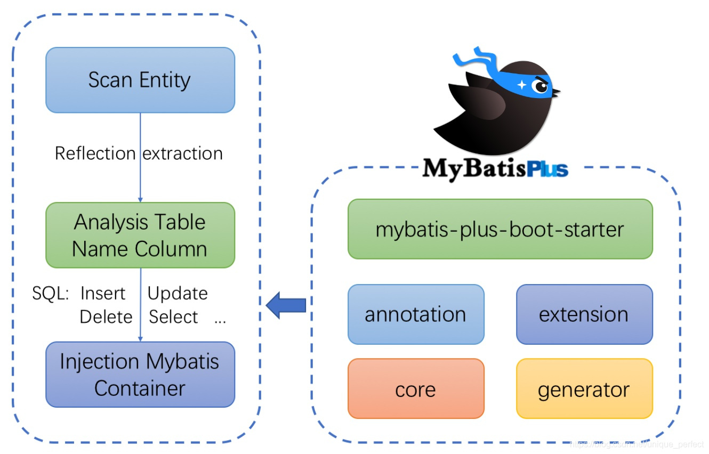
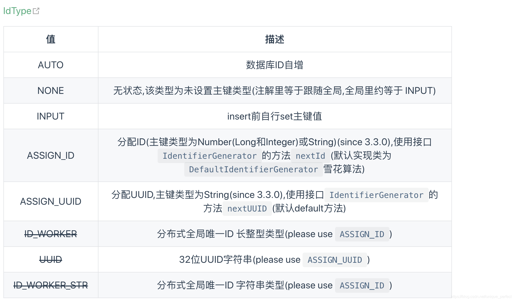
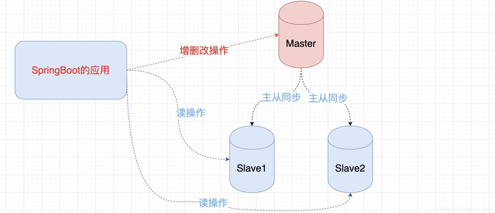

# 1 什么是Mybatis-Plus

## 1.1 什么是mybatis-plus

> [MyBatis-Plus](https://github.com/baomidou/mybatis-plus)（简称 MP）是一个 [MyBatis](http://www.mybatis.org/mybatis-3/) 的增强工具，在 MyBatis 的基础上只做增强不做改变，为简化开发、提高效率而生。


## 1.2 官方愿景


## 1.3 特性

```markdown
无侵入：只做增强不做改变，引入它不会对现有工程产生影响，如丝般顺滑
损耗小：启动即会自动注入基本 CURD，性能基本无损耗，直接面向对象操作
强大的 CRUD 操作：内置通用 Mapper、通用 Service，仅仅通过少量配置即可实现单表大部分 CRUD 操作，更有强大的条件构造器，满足各类使用需求
支持 Lambda 形式调用：通过 Lambda 表达式，方便的编写各类查询条件，无需再担心字段写错
支持主键自动生成：支持多达 4 种主键策略（内含分布式唯一 ID 生成器 - Sequence），可自由配置，完美解决主键问题
支持 ActiveRecord 模式：支持 ActiveRecord 形式调用，实体类只需继承 Model 类即可进行强大的 CRUD 操作
支持自定义全局通用操作：支持全局通用方法注入（ Write once, use anywhere ）
内置代码生成器：采用代码或者 Maven 插件可快速生成 Mapper 、 Model 、 Service 、 Controller 层代码，支持模板引擎，更有超多自定义配置等您来使用
内置分页插件：基于 MyBatis 物理分页，开发者无需关心具体操作，配置好插件之后，写分页等同于普通 List 查询
分页插件支持多种数据库：支持 MySQL、MariaDB、Oracle、DB2、H2、HSQL、SQLite、Postgre、SQLServer 等多种数据库
内置性能分析插件：可输出 Sql 语句以及其执行时间，建议开发测试时启用该功能，能快速揪出慢查询
内置全局拦截插件：提供全表 delete 、 update 操作智能分析阻断，也可自定义拦截规则，预防误操作

```

## 1.4 框架结构



# 2 QuickStart

## 2.1 引入依赖

```xml
<!--mybatis-plus依赖-->
<dependency>
   <groupId>com.baomidou</groupId>
   <artifactId>mybatis-plus-boot-starter</artifactId>
   <version>3.2.0</version>
</dependency>

```

> `注意`:不需要在引入mybatis的相关依赖,只引入这一个即可,当然数据库相关的驱动还的显式引入

## 2.2 在入口类加入注解

```java
@SpringBootApplication
@MapperScan("com.example.mybatis_plus.mapper")
public class MybatisApplication {
    public static void main(String[] args) {
        SpringApplication.run(MybatisApplication.class, args);
    }
}

```

## 2.3 编写配置文件

```properties
spring.datasource.type=com.alibaba.druid.pool.DruidDataSource
spring.datasource.driver-class-name=com.mysql.cj.jdbc.Driver
spring.datasource.url=jdbc:mysql://localhost:3306/db1?characterEncoding=UTF-8
spring.datasource.username=root
spring.datasource.password=599121412

```

## 2.4 创建数据库

```sql
DROP TABLE IF EXISTS `user`;
CREATE TABLE `user` (
  `id` int(11) NOT NULL AUTO_INCREMENT,
  `name` varchar(255) DEFAULT NULL,
  `age` int(11) DEFAULT NULL,
  `bir` timestamp NULL DEFAULT NULL,
  PRIMARY KEY (`id`)
) ENGINE=InnoDB DEFAULT CHARSET=utf8;

SET FOREIGN_KEY_CHECKS = 1;

```

## 2.5 开发实体类

```java
@Data
@ToString
public class Account {
    private Integer id;
    private String name;
    private Integer balance;
}
```

## 2.6 开发mapper通用实现

```java

import com.baomidou.mybatisplus.core.mapper.BaseMapper; //提供了各种CRUD方法
import com.example.mybatis_plus.entity.Account;

public interface AccountMapper extends BaseMapper<Account> {
}

```

## 2.7 运行

```java
    @Autowired
    private AccountMapper mapper;
    @Test
    void contextLoads() {
        List<Account> accounts = mapper.selectList(null);
        System.out.println(accounts);
    }
```

# 3 常用注解

> @TableName
> @TableId
> @TableField

## 3.1 @TableName注解

```markdown
`描述`:用来将实体对象与数据库表名完成映射 ,当表名和实体类名不一致时使用 
修饰范围: 用在实体类上
常见属性:
value : String类型,指定映射的表名
resultMap:String类型,用来指定XML配置中resultMap的id值

```

## 3.2 @TableId注解

```markdown
`描述`：主键注解

修饰范围 : 用在实体类的属性上

常见属性:
value:String类型,指定实体类中与表中对应的主键列名
type:枚举类型,指定主键生成类型
@TableId(type = IdType.AUTO)   设置主键id自增
```




## 3.3 @TableField

```markdown
`描述`：字段注解(非主键)
修饰范围:用在属性上
常用属性:
value:	String类型,用来指定对应的数据库表中的字段名
el: String类型,映射为原生 #{ ... } 逻辑,相当于写在 xml 里的 #{ ... } 部分 3.0已废弃

`exist`	boolean是否为数据库表字段 true代表是数据库字段,false代表不是

```

# 4.常用方法

## 4.1 查询方法

> 查询所有

```java
 @Test
    void contextLoads() {
        List<Account> accounts = mapper.selectList(null);
        System.out.println(accounts);
    }

```

> 查询一个

```java
  @Test
    void contextLoads() {
        Account account = mapper.selectById(1);
        System.out.println(account);
    }
```

> 条件查询

```java
    @Test
    void find() {
        QueryWrapper<Account> wrapper = new QueryWrapper<>();
        wrapper.eq("name","lisi");//设置等值查询
        // wrapper.gt("balance",3000);//设置大于查询
        //wrapper.ge("age",23);//大于等于查询    lt 小于  le 小于等于
        List<Account> accounts = mapper.selectList(wrapper);
        System.out.println(accounts);
    }
```

> 模糊查询

- ==like 相当于 %?%==

- ==likeLeft 相当于 %?==

- ==likeRight 相当于 ?%==

```java
 @Test
    void test() {
        QueryWrapper<Account> wrapper = new QueryWrapper<>();
        wrapper.like("name","%王%");  //带有 王  的
        //wrapper.likeLeft("name","%王");   //右边有  王 的
        
        、、 wrapper.likeRight("name","王%");   //左边有  王 的
        List<Account> accounts = mapper.selectList(wrapper);
        System.out.println(accounts);
    }
```

## 4.2 添加方法

```java
@Test
    void test2() {
        Account account = new Account();
        account.setId(4);
        account.setName("小明");
        account.setBalance(8000);
        mapper.insert(account);
    }
```

## 4.3 修改方法

> 基于条件修改

```java
 @Test
    void test3() {
        Account account = new Account();//设置修改的新对象的值
        account.setName("小明明");
        account.setBalance(11000);
        QueryWrapper<Account> wrapper = new QueryWrapper();
        wrapper.eq("name","小明");  //修改指定的数据库对应的数据
        mapper.update(account,wrapper);
    }
```

## 4.4 删除方法

> 基于id删除

```java
    @Test
    void test4() {
       mapper.deleteById(1);
    }
```

> 基于条件删除

```java
  @Test
    void test4() {
        //QueryWrapper 一般都是设置条件的
       QueryWrapper<Account> wrapper = new QueryWrapper<>();
       wrapper.gt("balance",10000);
       mapper.delete(wrapper);
    }
```

# 5. Mybatis-Plus分页查询

## 5.1 预先配置

> 注意:使用分页查询必须设置mybatis-plus提供的分页插件,才能实现分页效果

```java
@EnableTransactionManagement
@Configuration
@MapperScan("com.example.mybatis_plus.mapper")
public class MybatisPlusConfig {
    @Bean
    public PaginationInterceptor paginationInterceptor() {
        PaginationInterceptor paginationInterceptor = new PaginationInterceptor();
        return paginationInterceptor;
    }
}

```

~~注意事项:目前分页查询仅仅支持单表查询,不能再表连接时使用分页插件~~

## 5.2 分页查询

> 非条件分页查询

```java
    @Test
    void test5(){
        IPage<User> page = new Page<>(1,5);//从第一页开始的5条数据
        page = userMapper.selectPage(page, null);
        List<User> records = page.getRecords();
        for (User record : records) {
            System.out.println(record);
        }
    }

```

> 带条件分页查询

```java
@Test
    void test5(){
        QueryWrapper<User> wrapper = new QueryWrapper<>();
        wrapper.eq("age",23);     //满足age = 23 的前5条数据
        IPage<User> page = new Page<>(1,5);
         page = userMapper.selectPage(page, wrapper);
        System.out.println(page);
        List<User> records = page.getRecords();
        for (User record : records) {
            System.out.println(record);
        }
    }
```

# 6. Mybatis-Plus多数据源配置

> 为了确保数据库产品的稳定性，很多数据库拥有双机热备功能。也就是，
>
> 第一台数据库服务器，是对外提供增删改业务的生产服务器；
>
> 第二台数据库服务器，主要进行读的操作。

 

## 6.1 引入dynamic-datasource-spring-boot-starter

```xml
<dependency>
    <groupId>com.baomidou</groupId>
    <artifactId>dynamic-datasource-spring-boot-starter</artifactId>
    <version>3.0.0</version>
</dependency>

```

## 6.2 配置数据源

```properties
spring.datasource.primary=master  #指定默认数据源
spring.datasource.dynamic.datasource.master.driver-class-name=com.mysql.jdbc.Driver
spring.datasource.dynamic.datasource.master.url=jdbc:mysql://localhost:3306/mybatis-plus?characterEncoding=UTF-8
spring.datasource.dynamic.datasource.master.username=root
spring.datasource.dynamic.datasource.master.password=root
spring.datasource.dynamic.datasource.slave_1.driver-class-name=com.mysql.jdbc.Driver
spring.datasource.dynamic.datasource.slave_1.url=jdbc:mysql://localhost:3306/mybatis-plus-1?characterEncoding=UTF-8
spring.datasource.dynamic.datasource.slave_1.username=root
spring.datasource.dynamic.datasource.slave_1.password=root

```

## 6.3 创建多个数据库模拟不同mysql服务

**@DS注解**

```markdown
`作用`:用来切换数据源的注解 
`修饰范围`:方法上和类上，同时存在方法注解优先于类上注解。
`Value属性`:切换数据源名称

```

## 6.4 开发业务层

> 业务接口

```java
public interface UserService{
    List<User> findAll();
    void save(User user);
}

```

> 业务实现类

```java
@Service
@Transactional
public class UserServiceImpl implements UserService {

    @Autowired
    private UserDAO userDAO;

    @Override
    public List<User> findAll() {
        return userDAO.selectList(null);
    }

    @Override
    public void save(User user) {
        userDAO.insert(user);
    }
}

```

## 6.5 结果

```java
@SpringBootTest
public class TestUserService {

    
    @Autowired
    private UserService userService;
    
    @Test
    public void testFindAll(){
        userService.findAll().forEach(user-> System.out.println("user = " + user));
    }

    @Test
    public void testSave(){
        User user = new User();
        user.setName("aaa").setAge(23).setBir(new Date());
        userService.save(user);
    }
}

```

