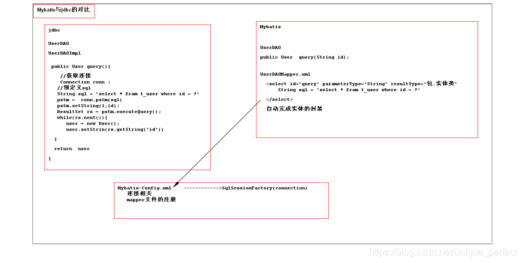
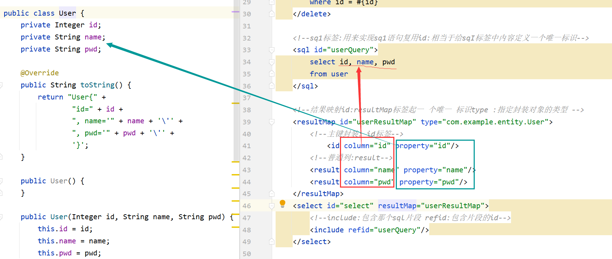
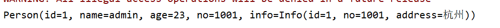
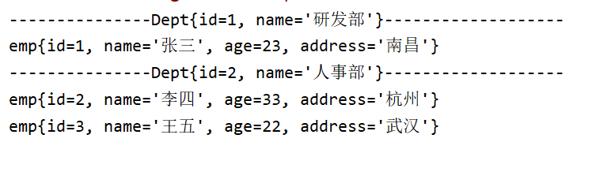
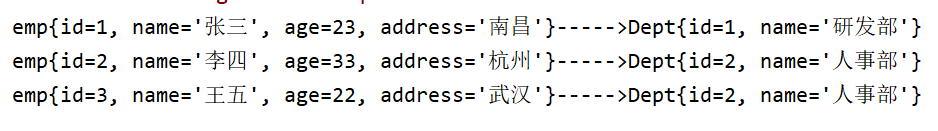
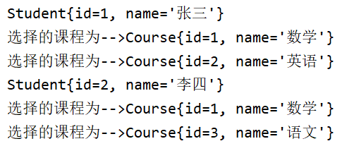
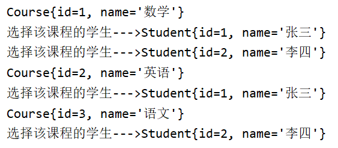

## 1 Mybatis的引言

> Mybatis是个基于java语⾔的持久层的框架，主要用来简化数据库的访问操作,内部封装了原来的jdbc代码,替换了原有项目开发中的jdbc技术,他可以自动完成对象与关系的映射(ORM),极度简化了我们的开发,提高开发效率。

## 2 Jdbc中存在问题

1)  大量的代码冗余 (处理结果集的时候存在大量的冗余)
2)  不能完成数据库和实体的自动转换 (需要手动动封装实体,不能自定封装实体类)

## 3 Mybatis框架的开发思路



## 4 Mybatis的环境搭建

### 4.1 书写连接相关的配置

mybatis-config.xml

```xml
<?xml version="1.0" encoding="UTF-8"?>
<!DOCTYPE configuration
        PUBLIC "-//mybatis.org//DTD Config 3.0//EN"
        "http://mybatis.org/dtd/mybatis-3-config.dtd">
<!-- mybatis的主配置文件 -->
<configuration>
    <!-- 配置使用哪套环境 -->
    <!--default 为默认使用的环境-->
    <environments default="mysql">
        <!-- 配置mysql的环境-->
        <!--第1套环境  名字为mysql-->
        <environment id="mysql">
            <!-- 配置事务的类型-->
            <transactionManager type="JDBC"></transactionManager>
            <!-- 配置数据源（连接池） -->
            <dataSource type="POOLED">
                <!-- 配置连接数据库的4个基本信息 -->
                <property name="driver" value="com.mysql.jdbc.Driver"/>
                <property name="url" value="jdbc:mysql://localhost:3306/mybatis?characterEncoding=utf-8"/>
                <property name="username" value="root"/>
                <property name="password" value="root"/>
            </dataSource>
        </environment>
    </environments>

    <!-- 指定映射配置文件的位置，映射配置文件指的是每个mapper独立的配置文件 -->
    <mappers>
        <mapper resource="com/example/mapper/UserMapper.xml"/>
    </mappers>
</configuration>

```

### 4.2 编写mapper文件

接口

```java
public interface UserMapper {
    /**
     * 添加用户
     * @param user
     * @return
     */
    int insert(User user);

}
```

xml

```xml
<?xml version="1.0" encoding="UTF-8"?>
<!DOCTYPE mapper
        PUBLIC "-//mybatis.org//DTD Mapper 3.0//EN"
        "http://mybatis.org/dtd/mybatis-3-mapper.dtd">
<mapper namespace="com.example.mapper.UserMapper">
<!--    useGeneratedKeys 设置为主键自增-->
<!--保存
   insert:插入操作
   id:方法名
   parameterType:参数类型包.类
注意:
    1. insert标签内部写sq1语句
    2. # (对象中属性名}
       useGeneratedKeys= "true"使用数据库自动生成id策略这个属性只对mysq1数据库有效
       keyProperty=""主键属性:当使用数据库 自动主键生成策略时,将自动生成主键值赋值给参数对象中那个属性
-->
    <insert id="insert" parameterType="com.example.entity.User" useGeneratedKeys="true" keyProperty="id">
        insert into user(id,name,pwd) values (#{id},#{name},#{pwd})
    </insert>
    <select id="select" resultType="com.example.entity.User">
        select id,name,pwd
        from user
    </select>
</mapper>

```

### 4.3 测试

```java
public class App {
    public static void main(String[] args) throws IOException {
        //1.读取配置文件
        InputStream is = Resources.getResourceAsStream("mybatis-config.xml");
        //2.创建SqlSessionFactory工厂
        SqlSessionFactoryBuilder builder = new SqlSessionFactoryBuilder();
        SqlSessionFactory factory = builder.build(is);
        //3.使用工厂生产SqlSession对象
        SqlSession session = factory.openSession();
        //4.使用SqlSession创建mapper接口的代理对象
        UserMapper mapper = session.getMapper(UserMapper.class);
        User user = new User();
        user.setName("安迪鲁宾");
        user.setPwd("123123");
         //5.使用代理对象执行方法
        int insert = mapper.insert(user);
        //6.提交事务
        session.commit();
        System.out.println(insert);
        session.close();
        is.close();
    }
}

```

### 4.4 封装工具类

```java
public class MybatisUtil {
    private static SqlSessionFactory sqlSessionFactory;
    static {
        //获取sqlSessionFactory对象
        String resource = "mybatis-config.xml";
        InputStream inputStream = null;
        try {
            //1.读取配置文件
            inputStream = Resources.getResourceAsStream(resource);
        } catch (IOException e) {
            e.printStackTrace();
        }
        //2.创建SqlSessionFactory工厂
         sqlSessionFactory = new SqlSessionFactoryBuilder().build(inputStream);
        //关闭输入流
        try {
            inputStream.close();
        } catch (IOException e) {
            e.printStackTrace();
        }
    }

    public static SqlSession getSqlSession() {
           //自动提交事务
          //3.使用工厂生产SqlSession对象
          return sqlSessionFactory.openSession(true);

    }

}

```

使用

```java
public class App {
    public static void main(String[] args) throws IOException {

        SqlSession session = MybatisUtil.getSqlSession();

        UserMapper mapper = session.getMapper(UserMapper.class);
        User user = new User();
        user.setName("安迪鲁宾");
        user.setPwd("123123");
        int insert = mapper.insert(user);
        System.out.println(insert);
        session.close();
    }
}

```

## CRUD

**上面的为创建Create**


### 添加create

```xml
<!--    useGeneratedKeys 设置为主键自增-->
<!--保存
   insert:插入操作
   id:方法名
   parameterType:参数类型包.类
注意:
    1. insert标签内部写sq1语句
    2. # (对象中属性名}
       useGeneratedKeys= "true"使用数据库自动生成id策略这个属性只对mysq1数据库有效
       keyProperty=""主键属性:当使用数据库 自动主键生成策略时,将自动生成主键值赋值给参数对象中那个属性
-->
    <insert id="insert" parameterType="com.example.entity.User" useGeneratedKeys="true" keyProperty="id">
        insert into user(id,name,pwd) values (#{id},#{name},#{pwd})
    </insert>
```

### 更新update

```java
    /**
     *
     * @param user
     * @return
     */
    int update(User user);
```

```xml
<update id="update" parameterType="com.example.entity.User">
        update  user
        <!--动态sql-->
        <set> <!--set标签动态去掉赋值语句前后多余的  , -->
             <!--test里面属性name为对象的属性名-->
            <if test="name!=null and name!=''">
                name =#{name},
            </if>
            <if test="pwd!=null and pwd!=''">
                pwd =#{pwd},
            </if>
        </set>
        where id=#{id}
    </update>
```

```java
    public void update() {
        SqlSession session = MybatisUtil.getSqlSession();
        UserMapper mapper = session.getMapper(UserMapper.class);
        User user = new User(13, "知识", "123123");
        int update = mapper.update(user);
        System.out.println(update);
    }
```

### 删除delete

```java
    int delete(Integer id);
```

```xml

    <delete id="delete" parameterType="Integer">
        delete from user where id = #{id}
    </delete>
```

```java
    @Test
    public void delete() {
        SqlSession session = MybatisUtil.getSqlSession();
        UserMapper mapper = session.getMapper(UserMapper.class);
        mapper.delete(15);
    }
```

### 查询 select

> **查询所有**

```xml
    <select id="selectAll" resultType="com.example.entity.User">
        select id, name, pwd
        from user
    </select>
```

*封装sql语句*

```xml
 <!--sq1标签:用来实现sq1语句复用id:相当于给sqI标签中内容定义一个唯一标识-->
    <sql id="userQuery">
        select id, name, pwd
        from user
    </sql>

    <select id="select" resultType="com.example.entity.User">
        <!--include:包含那个sql片段 refid:包含片段的id-->
        <include refid="userQuery"/>
    </select>
```


> **查询一个**

```java
    /**
     * id查询
     * @param id
     * @return
     */
    User selectOne(Integer id);
```

```xml
    <select id="selectOne" parameterType="Integer" resultType="com.example.entity.User">
        <include refid="userQuery"/> 
        where id = #{id}
    </select>
```

> **模糊查询**

*方法一*

```xml
    <select id="selectLikeName" parameterType="String" resultType="com.example.entity.User">
        <include refid="userQuery"/> where name like #{name}
    </select>
```

```java
  /**
     * 名字模糊查询
     * @param name
     * @return
     */
    List<User> selectLikeName(String name);

    @Test
    public void selectLikeName() {
        SqlSession session = MybatisUtil.getSqlSession();
        UserMapper mapper = session.getMapper(UserMapper.class);
        List<User> user = mapper.selectLikeName("%"+"知"+"%");
        System.out.println(user);
    }
```

*方法二(***)*

```xml
    <select id="selectLikeName" parameterType="String" resultType="com.example.entity.User">
        <include refid="userQuery"/>
        where name like concat('%',#{name},'%')<!--concat拼接字符串-->
    </select>
```

```java
    @Test
    public void selectLikeName() {
        SqlSession session = MybatisUtil.getSqlSession();
        UserMapper mapper = session.getMapper(UserMapper.class);
        List<User> user = mapper.selectLikeName("知");
        System.out.println(user);
    }
```

> **分页查询**

```java
/**
     * 分页查询
     * @param start 起始条数
     * @param rows  每页记录的条数
     * @return
     */
    List<User> selectByPage(@Param("start") Integer start,@Param("rows") Integer rows);
```

```xml
    <select id="selectByPage" resultType="com.example.entity.User">
        <include refid="userQuery"/>
        limit #{start},#{rows}
    </select>
```

*分页查询select....from...limit起始条数,每页显示的记录数*

```java
  @Test
    public void selectByPage() {

        //前端传来当前页数
        int currentPage = 3;
        SqlSession session = MybatisUtil.getSqlSession();
        UserMapper mapper = session.getMapper(UserMapper.class);

        //（当前页 - 1） * 3 = 查询的起始页
        List<User> users = mapper.selectByPage((currentPage-1)*3, 3);
        System.out.println(users);
    }
```

> **查询总记录数**

```java
 /**
     * 查询总条数
     * @return
     */
    Long selectTotal();
```

```xml
    <select id="selectTotal" resultType="Long">
        select count(id) from user
    </select>
```

```java
    @Test
    public void selectTotal() {
        SqlSession session = MybatisUtil.getSqlSession();
        UserMapper mapper = session.getMapper(UserMapper.class);
        Long aLong = mapper.selectTotal();
        System.out.println(aLong);
    }
```

## ResultMap和ResultType(*)

> **总结**：resultType、resultMap都 是用来对数据库中返回的结果进行封装的

 *resultType* 只能封装简单类型的对象简单类型对象：对象中没有对象类型的属性------->简单对象
*resultMap* 封装复杂类型对象的        处理库表关联关系------>一对一 、一对多、多对多关系时封装对象



**column**对应的为数据库里的字段名

**property**对应的为实体类中的字段名

```xml
 <!--结果映射id:resultMap标签起一 个唯一 标识type :指定封装对象的类型 -->
    <resultMap id="userResultMap" type="com.example.entity.User">
        <!--主键封装: id标签-->
            <id column="id" property="id"/>
        <!--普通列:result-->
        <result column="name" property="name"/>
        <result column="pwd" property="pwd"/>
    </resultMap>
    <select id="select" resultMap="userResultMap">
        <!--include:包含那个sql片段 refid:包含片段的id-->
        <include refid="userQuery"/>
    </select>
```

## 关联关系

**对于*增删改*操作与上述操作无异，主要为*查询*操作的封装**

### 一对一

> **创建数据库表**

```sql
USE mybatis;
-- 创建用户表
CREATE TABLE t_person(
id INT(6) PRIMARY KEY AUTO_INCREMENT,
NAME VARCHAR(64),
age INT(3),
-- 关联外键
NO VARCHAR(18) REFERENCES t_info(NO)
);
-- 创建用户信息表
USE mybatis;
CREATE TABLE t_info(
id INT(6) PRIMARY KEY AUTO_INCREMENT,
NO VARCHAR(18),
address VARCHAR(100)
);
```

> **实体类**

```java
public class Info {
    private Integer id;
    private String no;
    private String address;
}

public class Person {
    private Integer id;
    private String name;
    private Integer age;
    
    //外键信息
    private String no;
    //关系属性  对象体现关系
    private Info info;
}

```

> **mapper**

```java
public interface PersonMapper {
    int insertPerson(Person person);

    /**
     * 查询所有用户信息
     * @return
     */
    List<Person> selectAll();
}
```

```xml
<?xml version="1.0" encoding="UTF-8"?>
<!DOCTYPE mapper
        PUBLIC "-//mybatis.org//DTD Mapper 3.0//EN"
        "http://mybatis.org/dtd/mybatis-3-mapper.dtd">
<mapper namespace="com.example.mapper.PersonMapper">
    <insert id="insertPerson" parameterType="Person" useGeneratedKeys="true" keyProperty="id">
        insert into t_person
        values (#{id}, #{name}, #{age}, #{no});
    </insert>
   
    
    
    
    <!--
    处理一对一：
    association: 用来处理一对一关联关系标签
    property: 用来书写封装的关系属性名
    javaType :关系属性的java类型-->
    <resultMap id="selectMap" type="Person">
        <id property="id" column="id"/>
        <result property="name" column="name"/>
        <result property="age" column="age"/>
        <result property="no" column="no"/>
        <association property="info" javaType="Info">
            <id property="id" column="iid"/>
            <result property="no" column="ino"/>
            <result property="address" column="address"/>
        </association>
    </resultMap>
    <select id="selectAll" resultMap="selectMap">
        SELECT p.id,
               p.name,
               p.age,
               p.no,
               i.id iid,
               i.no ino,
               i.address
        FROM t_person p
        LEFT JOIN t_info i ON p.no = i.no
    </select>
</mapper>

```

```java
    @Test
    public void selectAll(){
        SqlSession sqlSession = MybatisUtil.getSqlSession();
        PersonMapper mapper = sqlSession.getMapper(PersonMapper.class);
        List<Person> people = mapper.selectAll();
        people.forEach(p-> System.out.println(p));
    }
```



### 一对多

> **创建数据库**

```sql
USE mybatis;
-- 创建部门表
CREATE TABLE t_dept(
id INT(6) PRIMARY KEY AUTO_INCREMENT,
NAME VARCHAR(40)
);

-- 创建员工信息表
USE mybatis;
CREATE TABLE t_emp(
id INT(6) PRIMARY KEY AUTO_INCREMENT,
NAME VARCHAR(40),
age INT(3),
address varchar(64),
deptid INT(6) REFERENCES t_dept(id)
);

```

> **实体类**

```java
public class Emp {
    private Integer id;
    private String name;
    private Integer age;
    private String address;
    //封装员工的部门信息
    private Dept dept;
    @Override
    public String toString() {
        return "emp{" +
                "id=" + id +
                ", name='" + name + '\'' +
                ", age=" + age +
                ", address='" + address + '\'' +
                '}';
    }
}
```

```java
public class Dept {
    private Integer id;
    private String name;
    //对象  关系属性   封装部门下的员工信息
    private List<Emp> emps;

    @Override
    public String toString() {
        return "Dept{" +
                "id=" + id +
                ", name='" + name + '\'' +
                '}';
    }
}
```

> **mapper**  站在部门的角度

```java
public interface DeptMapper {
    /**
     * 查询所有部门  及   部门下的所有员工
     * @return
     */
    List<Dept> SelectAll();
}
```

```xml
<mapper namespace="com.example.mapper.DeptMapper">
<resultMap id="Selectmap" type="Dept">
    <id column="id" property="id"/>
    <result column="name" property="name"/>
    <!--封装员工信息collection用来处理一对多关联关系标签
         javaType:关系属性类型
         ofType :用来书写关系属性类型中泛型的类型
         property:封装关系属性名
         List   <Emp>   emps
      -->
     <collection javaType="list" ofType="Emp" property="emps">
         <id column="eid" property="id"/>
         <result column="ename" property="name"/>
         <result column="age" property="age"/>
         <result column="address" property="address"/>
     </collection>
</resultMap>

    <select id="SelectAll" resultMap="Selectmap">
        SELECT d.id,
               d.name,
               e.id   eid,
               e.name ename,
               e.age,
               e.address,
               e.deptid
        FROM t_dept d
            LEFT JOIN t_emp e
            ON d.id = e.deptid
    </select>
</mapper>
```

> **test**

```java
public class DeptTest {
    @Test
    public void TestDept(){
        SqlSession sqlSession = MybatisUtil.getSqlSession();
        DeptMapper mapper = sqlSession.getMapper(DeptMapper.class);
        List<Dept> depts = mapper.SelectAll();
        for (Dept dept : depts) {
            System.out.println("---------------"+dept.toString()+"-------------------");
            List<Emp> emps = dept.getEmps();
            emps.forEach(emp -> System.out.println(emp));
        }
        sqlSession.close();
    }
}
```



> **mapper** 站在员工的角度

```java
public interface EmpMapper {
    /**
     * 查询所有员工 及  员工的所属部门
     * @return
     */
    List<Emp> SelectAll();
}
```

```xml
<mapper namespace="com.example.mapper.EmpMapper">
    <resultMap id="SelectMap" type="Emp">
        <id column="eid" property="id"/>
        <result column="ename" property="name"/>
        <result column="age" property="age"/>
        <result column="address" property="address"/>
        <association property="dept" javaType="Dept">
            <id column="id" property="id"/>
            <result column="name" property="name"/>
        </association>
    </resultMap>

   <select id="SelectAll" resultMap="SelectMap">
       SELECT e.id eid,
              e.name ename,
              e.age,
              e.address,
              d.id,
              d.name
       FROM t_emp e
           LEFT JOIN t_dept d
           ON e.deptid = d.id
   </select>
</mapper>
```

> **test**

```java
@Test
public void TestEmp() {

    SqlSession sqlSession = MybatisUtil.getSqlSession();
    EmpMapper mapper = sqlSession.getMapper(EmpMapper.class);
    List<Emp> emps = mapper.SelectAll();
    emps.forEach(emp -> System.out.println(emp+"----->"+emp.getDept()));
    sqlSession.close();
}
```


### 多对多

> **创建数据库表**

```sql
USE mybatis;
-- 创建学生表
CREATE TABLE t_student(
id INT(6) PRIMARY KEY AUTO_INCREMENT,
NAME VARCHAR(40)
);

-- 创建课程表
USE mybatis;
CREATE TABLE t_course(
id INT(6) PRIMARY KEY AUTO_INCREMENT,
NAME VARCHAR(8)
);

-- 创建中间表
USE mybatis;
CREATE TABLE t_student_course(
id INT(6) PRIMARY KEY AUTO_INCREMENT,
sid INT(6) REFERENCES t_student(id),
cid INT(6) REFERENCES t_course(id)
);
```

> **实体类**

```java
public class Student {
    private Integer id;
    private String name;

    //一个学生可以有多门课程
    private List<Course> courses;
    @Override
    public String toString() {
        return "Student{" +
                "id=" + id +
                ", name='" + name + '\'' +
                '}';
    }
}


public class Course {
    private Integer id;
    private String name;
    //一门课程可以有多个学生
    private List<Student> students;

    @Override
    public String toString() {
        return "Course{" +
                "id=" + id +
                ", name='" + name + '\'' +
                '}';
    }
}

```

> **mapper**  站在学生的角度

```java
    /**
     * 查询所有学生信息 和 学生所选的课程
     * @return
     */
    List<Student> selectAll();
```

```xml
<mapper namespace="com.example.mapper.StudentMapper">

    <resultMap id="StudentMap" type="Student">
        <id column="sid" property="id"/>
        <result column="sname" property="name"/>
        <collection property="courses" javaType="List" ofType="Course">
            <id column="cid" property="id"/>
            <result column="cname" property="name"/>
        </collection>
    </resultMap>
    <select id="selectAll" resultMap="StudentMap">
        SELECT s.id sid,
               s.name sname,
               c.id cid,
               c.name cname
        FROM t_student s
                 LEFT JOIN t_student_course tc
                           ON s.id = tc.sid
                 LEFT JOIN t_course c
                           ON tc.cid = c.id
    </select>
</mapper>
```

> **test**

```java
    @Test
    public void test(){
        SqlSession sqlSession = MybatisUtil.getSqlSession();

        StudentMapper mapper = sqlSession.getMapper(StudentMapper.class);
        List<Student> students = mapper.selectAll();
        for (Student student : students) {
            System.out.println(student);
            List<Course> courses = student.getCourses();
            courses.forEach(course -> System.out.println("选择的课程为-->"+course.toString()));
        }
        sqlSession.close();
    }
```



> **mapper**  站在课程的角度

```java
    /**
     * 查询所有课程信息 和 课程所选的学生
     * @return
     */
    List<Course> SelectAll();
```

```xml
<mapper namespace="com.example.mapper.CourseMapper">

    <resultMap id="CourseMap" type="Course">
        <id column="cid" property="id"/>
        <result column="cname" property="name"/>
        <collection property="students" javaType="List" ofType="Student">
            <id column="sid" property="id"/>
            <result column="sname" property="name"/>
        </collection>
    </resultMap>
    <select id="SelectAll" resultMap="CourseMap">
        SELECT c.id   cid,
               c.name cname,
               s.id   sid,
               s.name sname
        FROM t_course c
                 LEFT JOIN t_student_course tc ON c.id = tc.cid
                 LEFT JOIN t_student s ON s.id = tc.sid
    </select>
</mapper>
```

> **test**

```java
    @Test
    public void test(){
        SqlSession sqlSession = MybatisUtil.getSqlSession();
        CourseMapper mapper = sqlSession.getMapper(CourseMapper.class);
        List<Course> courses = mapper.SelectAll();
        for (Course course : courses) {
            System.out.println(course);
            List<Student> students = course.getStudents();
            students.forEach(student -> System.out.println("选择该课程的学生--->"+student));
        }
        sqlSession.close();
    }
```

