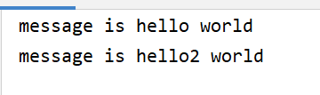
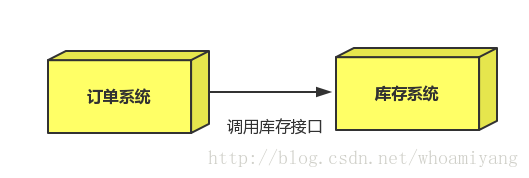

# RabbitMQ

## 1 MQ引言

### 1.1 什么是MQ

> **MQ(Message Quene)** :  翻译为*消息队列*，通过典型的生产者和消费者模型，生产者不断向消息队列中生产消息，消费者不断的从队列中获取消息。因为消息的生产和消费都是异步的，而且只关心消息的发送和接收，没有业务逻辑的侵入，轻松的实现系统间解耦。别名为 **消息中间件**通过利用高效可靠的消息传递机制进行平台无关的数据交流，并基于数据通信来进行分布式系统的集成。

### 1.2 MQ有哪些

```markdown
当今市面上有很多主流的消息中间件，如老牌的ActiveMQ、RabbitMQ，炙手可热的Kafka，阿里巴巴自主开发`RocketMQ`等。
```

### 1.3 不同MQ特点

```markdown
1.ActiveMQ
		ActiveMQ 是Apache出品，最流行的，能力强劲的开源消息总线。它是一个完全支持JMS规范的的消息中间件。丰富的API,多种集群架构模式让ActiveMQ在业界成为老牌的消息中间件,在中小型企业颇受欢迎!

2.Kafka
		Kafka是LinkedIn开源的分布式发布-订阅消息系统，目前归属于Apache顶级项目。Kafka主要特点是基于Pull的模式来处理消息消费，追求高吞吐量，一开始的目的就是用于日志收集和传输。0.8版本开始支持复制，不支持事务，对消息的重复、丢失、错误没有严格要求，适合产生大量数据的互联网服务的数据收集业务。

3.RocketMQ
		RocketMQ是阿里开源的消息中间件，它是纯Java开发，具有高吞吐量、高可用性、适合大规模分布式系统应用的特点。RocketMQ思路起源于Kafka，但并不是Kafka的一个Copy，它对消息的可靠传输及事务性做了优化，目前在阿里集团被广泛应用于交易、充值、流计算、消息推送、日志流式处理、binglog分发等场景。

4.RabbitMQ
		RabbitMQ是使用Erlang语言开发的开源消息队列系统，基于AMQP协议来实现。AMQP的主要特征是面向消息、队列、路由（包括点对点和发布/订阅）、可靠性、安全。AMQP协议更多用在企业系统内对数据一致性、稳定性和可靠性要求很高的场景，对性能和吞吐量的要求还在其次。
		

```

> **RabbitMQ**比Kafka可靠，Kafka更适合IO高吞吐的处理，一般应用在大数据日志处理或对实时性（少量延迟），可靠性（少量丢数据）要求稍低的场景使用，比如ELK日志收集。

## 2 RabbitMQ 的引言

### 2.1 RabbitMQ

> 基于``AMQP`协议，erlang语言开发，是部署最广泛的开源消息中间件,是最受欢迎的开源消息中间件之一。

 

 ### AMQP 协议
```markdown
	AMQP（advanced message queuing protocol）,即高级消息队列协议 ，在2003年时被提出，最早用于解决金融领不同平台之间的消息传递交互问题。顾名思义，AMQP是一种协议，更准确的说是一种binary wire-level protocol（链接协议）。这是其和JMS的本质差别，AMQP不从API层进行限定，而是直接定义网络交换的数据格式。这使得实现了AMQP的provider天然性就是跨平台的。以下是AMQP协议模型:
```


### 2.2 RabbitMQ（docker） 的安装

项目结构


配置文件

 ```yaml
version: '3.8'
services:
  rabbitmq:
    image: rabbitmq:3.7.18-management-alpine
    container_name: rabbitmq
    restart: always
    hostname: myRabbitmq
    ports:
      - 15672:15672
      - 5672:5672
    volumes:
      - ./data:/var/lib/rabbitmq
    environment:
      - RABBITMQ_DEFAULT_USER=root
      - RABBITMQ_DEFAULT_PASS=root
 ```

***注意***：application.yml文件中推荐为docker容器设置hostname，因为rabbitmq默认使用hostname作为存储数据的节点名，设置hostname可以避免生成随机的节点名，方便追踪数据。

 RABBITMQ_DEFAULT_USER 和 RABBITMQ_DEFAULT_PASS 用来设置超级管理员的账号和密码，如果不设置，默认都是 guest

访问：http://192.168.47.128:15672/

username：root        

password：root


## 3 RabiitMQ 配置

###  web管理界面介绍

#### overview概览


```markdown
`connections`：无论生产者还是消费者，都需要与RabbitMQ建立连接后才可以完成消息的生产和消费，在这里可以查看连接情况`

`channels`：通道，建立连接后，会形成通道，消息的投递获取依赖通道。

`Exchanges`：交换机，用来实现消息的路由

`Queues`：队列，即消息队列，消息存放在队列中，等待消费，消费后被移除队列。


```

####  Admin用户和虚拟主机管理

#####  添加用户


```markdown
上面的Tags选项，其实是指定用户的角色，可选的有以下几个：

超级管理员(administrator)

可登陆管理控制台，可查看所有的信息，并且可以对用户，策略(policy)进行操作。

监控者(monitoring)

可登陆管理控制台，同时可以查看rabbitmq节点的相关信息(进程数，内存使用情况，磁盘使用情况等)

策略制定者(policymaker)

可登陆管理控制台, 同时可以对policy进行管理。但无法查看节点的相关信息(上图红框标识的部分)。

普通管理者(management)

仅可登陆管理控制台，无法看到节点信息，也无法对策略进行管理。

其他

无法登陆管理控制台，通常就是普通的生产者和消费者。

```

#####  创建虚拟主机

> **虚拟主机**
>
> 为了让各个用户可以互不干扰的工作，RabbitMQ添加了**虚拟主机**（Virtual Hosts）的概念。其实就是一个独立的访问路径，不同用户使用不同路径，各自有自己的队列、交换机，互相不会影响。


##### 绑定虚拟主机和用户

创建好虚拟主机，我们还要给用户添加访问权限：

点击添加好的虚拟主机：


进入虚拟机设置界面


## 4 RabbitMQ 的第一个程序

### 4.1 AMQP协议的回顾


### 4.2 RabbitMQ支持的消息模型


 

### 4.3 引入依赖

```xml
<dependency>   
     <groupId>com.rabbitmq</groupId>
    <artifactId>amqp-client</artifactId>
    <version>5.7.2</version>
</dependency>
```

### 4.4 第一种模型(直连)


在上图的模型中，有以下概念：

- *P：***生产者**，也就是要发送消息的程序
- *C：***消费者**：消息的接受者，会一直等待消息到来。
- *queue*：**消息队列**，图中红色部分。类似一个邮箱，可以缓存消息；生产者向其中投递消息，消费者从其中取出消息。

#### 4.4.1 开发生产者

```java
 @Test
    public void test() throws IOException, TimeoutException {
        //创建连接mq的连接工厂对象，重量级对象，类加载时创建一次即可
        ConnectionFactory connectionFactory = new ConnectionFactory();
        //设置连接rabbitmq的主机
        connectionFactory.setHost("192.168.47.128");
        //设置端口号
        connectionFactory.setPort(5672);
        //设置连接的虚拟主机
        connectionFactory.setVirtualHost("/ems");

        //设置访问虚拟主机的用户名和密码
        connectionFactory.setUsername("ems");
        connectionFactory.setPassword("123");

        //获取连接对象
        Connection connection = connectionFactory.newConnection();
        //获取连接中的通道
        Channel channel = connection.createChannel();
        /*
         * 通道绑定对应消息队列
         * 参数1:队列名称如果队列不存在自动创建
         * 参数2 :用来定义队列特性是否要持久化     true持久化队列  false不持久化
         * 参数3: exclusive 是否独占队列      true独占队列  false  不独占
         * 参数4: autoDelete: 是否在消费完成后自动删除队列     true自动删除     false自动删除
         * 参数5: 额外附加参数
         */
        channel.queueDeclare("hello", true, false, false, null);

        //发布信息
        //参数1:交换机名称    参数2:队列名称    参数3:传递消息额外设置     参数4:消息的具体内容
        channel.basicPublish("","hello",null,"hello,rabbitMQ".getBytes(StandardCharsets.UTF_8));
        channel.close();
        connection.close();
    }
```

#### 4.4.2 开发消费者

```java
      //创建连接mq的连接工厂对象，重量级对象，类加载时创建一次即可
        ConnectionFactory connectionFactory = new ConnectionFactory();
        //设置连接rabbitmq的主机
        connectionFactory.setHost("192.168.47.128");
        //设置端口号
        connectionFactory.setPort(5672);
        //设置连接的虚拟主机
        connectionFactory.setVirtualHost("/ems");

  Connection connection = connectionFactory.newConnection();
  Channel channel = connection.createChannel();
  channel.queueDeclare("hello", true, false, false, null);

        /**
         * 消费消息
         * 参数1: 消费那个队列的消息队列名称
         * 参数2:开始消息的自动确认机制
         * 参数3: 消费时的回调接口
         */
  channel.basicConsume("hello",true,new DefaultConsumer(channel){
    @Override//最后一个参数，消息队列中取出的参数
    public void handleDelivery(String consumerTag, Envelope envelope, AMQP.BasicProperties properties, byte[] body) throws IOException {
      System.out.println(new String(body));
    }
  });

```

### 封装工具类

```java
public class RabbitMQUtil {

    private static  ConnectionFactory connectionFactory;
    //获取连接对象
    private static Connection connection;
    static {
        //创建连接mq的连接工厂对象，重量级对象，类加载时创建一次即可
        connectionFactory = new ConnectionFactory();
        //设置连接rabbitmq的主机
        connectionFactory.setHost("192.168.47.128");
        //设置端口号
        connectionFactory.setPort(5672);
        //设置连接的虚拟主机
        connectionFactory.setVirtualHost("/ems");
        //设置访问虚拟主机的用户名和密码
        connectionFactory.setUsername("ems");
        connectionFactory.setPassword("123");
    }
    public static Connection  getConnection(){
        try {
            connection = connectionFactory.newConnection();
        } catch (IOException | TimeoutException e) {
            e.printStackTrace();
        }
        return connection;
    }
    public static void closeAll(Channel channel,Connection connection){
        try {
            if (channel!=null){
                channel.close();
            }
            if(connection!=null){
                connection.close();
            }
        } catch (TimeoutException | IOException e) {
            e.printStackTrace();
        }
    }
}
```

### 参数的说明

```java
channel.queueDeclare("hello",true,false,false,null);
'参数1':用来声明通道对应的队列
'参数2':用来指定是否持久化队列
'参数3':用来指定是否独占队列
'参数4':用来指定是否自动删除队列
'参数5':对队列的额外配置

```

### 4.5 第二种模型(work quene)

> **Work queues**，也被称为（**Task queues**），*任务模型*。当消息处理比较耗时的时候，可能生产消息的速度会远远大于消息的消费速度。长此以往，消息就会堆积越来越多，无法及时处理。此时就可以使用work 模型：让多个消费者绑定到一个队列，共同消费队列中的消息。队列中的消息一旦消费，就会消失，因此任务是不会被重复执行的。

 

**角色：**

- *P*：生产者：任务的发布者
- *C1*：消费者-1，领取任务并且完成任务，假设完成速度较慢
- *C2*：消费者-2：领取任务并完成任务，假设完成速度快

#### 4.5.1 开发生产者

```java
 @Test
    public void workProduct() throws IOException, TimeoutException {
        Connection connection = RabbitMQUtil.getConnection();
        Channel channel = connection.createChannel();
        /*
         * 通道绑定对应消息队列
         * 参数1:队列名称如果队列不存在自动创建
         * 参数2 :用来定义队列特性是否要持久化     true持久化队列  false不持久化
         * 参数3: exclusive 是否独占队列      true独占队列  false  不独占
         * 参数4: autoDelete: 是否在消费完成后自动删除队列     true自动删除     false自动删除
         * 参数5:额外附加参数
         */
        channel.queueDeclare("work", true, false, false, null);
        //发布信息
        //参数1:交换机名称     参数2:队列名称    参数3:传递消息额外设置     参数4:消息的具体内容
        for (int i = 1;i<=10;i++){
            channel.basicPublish("","work",null,("this"+i+"work,rabbitMQ").getBytes(StandardCharsets.UTF_8));
        }

        RabbitMQUtil.closeAll(channel,connection);
    }

```

#### 4.5.2 开发消费者-1

```java
public class work1 {
    public static void main(String[] args) throws IOException {
        Connection connection = RabbitMQUtil.getConnection();
        Channel channel = connection.createChannel();
        channel.queueDeclare("work",true,false,false,null);
        channel.basicConsume("work",true,new DefaultConsumer(channel){
            @Override
            public void handleDelivery(String consumerTag, Envelope envelope, AMQP.BasicProperties properties, byte[] body) throws IOException {
                System.out.println("consumer_1"+new String(body));
            }
        });
    }
}
```


#### 4.5.2 开发消费者-2

```java
public class work2 {
    public static void main(String[] args) throws IOException {
        Connection connection = RabbitMQUtil.getConnection();
        Channel channel = connection.createChannel();
        channel.queueDeclare("work",true,false,false,null);
        channel.basicConsume("work",true,new DefaultConsumer(channel){
            @Override
            public void handleDelivery(String consumerTag, Envelope envelope, AMQP.BasicProperties properties, byte[] body) throws IOException {
                try {
                    //模拟处理消息的速度较慢
                    Thread.sleep(2000);
                } catch (InterruptedException e) {
                    e.printStackTrace();
                }
                System.out.println("consumer_2"+new String(body));
            }
        });
    }
}
```


> **总结** : 默认情况下，RabbitMQ将按顺序将每个消息发送给下一个使用者。平均而言，每个消费者都会收到相同数量的消息。这种分发消息的方式称为循环。

#### 消息自动确认机制

即  实现了 **能者多劳**

> Doing a task can take a few seconds. You may wonder what happens if one of the consumers starts a long task and dies with it only partly done. With our current code, once RabbitMQ delivers a message to the consumer it immediately marks it for deletion. In this case, if you kill a worker we will lose the message it was just processing. We'll also lose all the messages that were dispatched to this particular worker but were not yet handled.
>
> But we don't want to lose any tasks. If a worker dies, we'd like the task to be delivered to another worker.

> 完成一项任务可能只需要几秒钟。您可能想知道，如果某个消费者开始了一项很长的任务，但只完成了一部分就死了，会发生什么情况。在我们目前的代码中，一旦RabbitMQ向用户发送了一条消息，它就会立即将其标记为删除。在这种情况下，如果你杀死一个工人，我们将丢失它正在处理的消息。我们还将丢失所有被分派到这个特定工作器但尚未处理的消息。
>
> 但我们不想失去任何任务。如果一个工人死亡，我们希望任务被交付给另一个工人。

work1（处理较快）

```java
       //参数2:关闭自动确认消息
        channel.basicConsume("work",false,new DefaultConsumer(channel){
            @Override
            public void handleDelivery(String consumerTag, Envelope envelope, AMQP.BasicProperties properties, byte[] body) throws IOException {
                System.out.println("consumer_1"+new String(body));
               //参数1：确认队列中那个具体消息  参数2：是否开启多个消息同时确认
                channel.basicAck(envelope.getDeliveryTag(),false);
            }
        });
```


work2（处理较慢）

```java
       //一次只接受一条未确认的消息
        channel.basicQos(1);
        //参数2:关闭自动确认消息
        channel.basicConsume("work",false,new DefaultConsumer(channel){
            @Override
            public void handleDelivery(String consumerTag, Envelope envelope, AMQP.BasicProperties properties, byte[] body) throws IOException {
                try {
                    Thread.sleep(2000);
                } catch (InterruptedException e) {
                    e.printStackTrace();
                }
                System.out.println("consumer_2"+new String(body));
                //手动确认消息
                channel.basicAck(envelope.getDeliveryTag(),false);
            }
        });
```


```markdown
设置通道一次只能消费一个消息

关闭消息的自动确认,开启手动确认消息
```

### 4.6 第三种模型(fanout)

> **fanout** 扇出 也称为``广播``

 

在*广播模式*下，消息发送流程是这样的：

- 可以有多个消费者
- 每个消费者有自己的queue（队列）
- 每个队列都要绑定到Exchange（交换机）
- 生产者发送的消息，只能发送到交换机，交换机来决定要发给哪个队列，生产者无法决定。
- 交换机把消息发送给绑定过的所有队列
- 队列的消费者都能拿到消息。实现**一条消息被多个消费者消费**

#### 开发生产者

```java

public class pro {
    public static void main(String[] args) throws IOException {
        Connection connection = RabbitMQUtil.getConnection();
        Channel channel = connection.createChannel();

        //注意：fanout是将消息放入交换机中
        //声明交换机，  参数1：交换机名称  参数2：交换机的类型     fanout代表广播类型
        channel.exchangeDeclare("logs","fanout");//广播 一条消息多个消费者同时消费

        //发布信息
        //参数1:交换机名称    参数2:队列名称    参数3:传递消息额外设置     参数4:消息的具体内容
        channel.basicPublish("logs","",null,"fanout message say hello".getBytes());
        RabbitMQUtil.closeAll(channel, connection);
    }
}
```

#### 开发消费者1

```java
public class consumer1 {
    public static void main(String[] args) throws IOException {
        Connection connection = RabbitMQUtil.getConnection();
        Channel channel = connection.createChannel();
        //绑定交换机
        channel.exchangeDeclare("logs","fanout");
        //创建临时队列
        String queue = channel.queueDeclare().getQueue();

        //将临时队列绑定exchange
        channel.queueBind(queue,"logs","");

        //处理消息
        channel.basicConsume(queue,true,new DefaultConsumer(channel){
            @Override
            public void handleDelivery(String consumerTag, Envelope envelope, AMQP.BasicProperties properties, byte[] body) throws IOException {
                System.out.println("consumer_1------>"+new String(body));
            }
        });
    }
}
```


#### 开发消费者2

```java
public class consumer2 {
    public static void main(String[] args) throws IOException {
        Connection connection = RabbitMQUtil.getConnection();
        Channel channel = connection.createChannel();
        //绑定交换机
        channel.exchangeDeclare("logs","fanout");
        //创建临时队列
        String queue = channel.queueDeclare().getQueue();

        //将临时队列绑定exchange
        channel.queueBind(queue,"logs","");

        //处理消息
        channel.basicConsume(queue,true,new DefaultConsumer(channel){
            @Override
            public void handleDelivery(String consumerTag, Envelope envelope, AMQP.BasicProperties properties, byte[] body) throws IOException {
                System.out.println("consumer_2------>"+new String(body));
            }
        });
    }
}

```


###  4.7 第四种模型 * (Routing)

Routing 之订阅模型 - **Direct(直连)**

> 在***Fanout***模式中，一条消息，会被所有订阅的队列都消费。但是，在某些场景下，我们希望不同的消息被不同的队列消费。这时就要用到**Direct类型**的**Exchange**。

在Direct模型下：

- 队列与交换机的绑定，不能是任意绑定了，而是要指定一个RoutingKey（路由key）
- 消息的发送方在 向 Exchange发送消息时，也必须指定消息的 RoutingKey。

- Exchange不再把消息交给每一个绑定的队列，而是根据消息的Routing Key进行判断，只有队列Routingkey与消息的 Routing key完全一致，才会接收到消息

 

*P*：生产者，向Exchange发送消息，发送消息时，会指定一个routing key。
*X*：Exchange（交换机），接收生产者的消息，然后把消息递交给 与routing key完全匹配的队列
*C1*：消费者，其所在队列指定了需要routing key 为 error 的消息
*C2*：消费者，其所在队列指定了需要routing key 为 info、error、warning 的消息

####  开发生产者

```java
public class pro {
    public static void main(String[] args) throws IOException {
        String exangeName = "logs_direct";
        Connection connection = RabbitMQUtil.getConnection();
        Channel channel = connection.createChannel();

        //注意：direct是将消息放入交换机中
        //声明交换机  参数1:交换机名称 参数2:交换机类型 基于指令的Routing key转发
        channel.exchangeDeclare(exangeName,"direct");

        //设定消息的类型，只有consumer中配置了相同的类型才能读取
        String key = "error";
        //发布信息
        //参数1:交换机名称     参数2:队列名称    参数3:传递消息额外设置    参数4:消息的具体内容
        channel.basicPublish(exangeName,key,null,("direct sent message key is+["+key+"]").getBytes());
        RabbitMQUtil.closeAll(channel, connection);
    }
}

```

#### 消费者1

```java
public class consumer1 {
    public static void main(String[] args) throws IOException {
        String exangeName = "logs_direct";
        Connection connection = RabbitMQUtil.getConnection();
        Channel channel = connection.createChannel();
        //声明交换价
        channel.exchangeDeclare(exangeName,"direct");

        //创建临时队列
        String queue = channel.queueDeclare().getQueue();

        //绑定队列和交换机  以及接收消息的类型
        channel.queueBind(queue,exangeName,"error");
        channel.queueBind(queue,exangeName,"info");
        channel.queueBind(queue,exangeName,"success");
       //消费消息
        channel.basicConsume(queue,true,new DefaultConsumer(channel){
            @Override
            public void handleDelivery(String consumerTag, Envelope envelope, AMQP.BasicProperties properties, byte[] body) throws IOException {
                System.out.println("consumer_1----->"+new String(body));
            }
        });
    }
}
```


#### 消费者2

```java
public class consumer2 {
    public static void main(String[] args) throws IOException {
        String exangeName = "logs_direct";
        Connection connection = RabbitMQUtil.getConnection();
        Channel channel = connection.createChannel();
        //声明交换价
        channel.exchangeDeclare(exangeName,"direct");

        //创建临时队列
        String queue = channel.queueDeclare().getQueue();

        //绑定队列和交换机  以及接收消息的类型
        channel.queueBind(queue,exangeName,"success");
       //消费消息
        channel.basicConsume(queue,true,new DefaultConsumer(channel){
            @Override
            public void handleDelivery(String consumerTag, Envelope envelope, AMQP.BasicProperties properties, byte[] body) throws IOException {
                System.out.println("consumer_2----->"+new String(body));
            }
        });
    }
}

```


### 4.8 Routing 之订阅模型 (Topic)

***动态路由***

> **Topic类型**的Exchange与Direct相比，都是可以根据RoutingKey把消息路由到不同的队列。只不过Topic类型Exchange可以让队列在绑定Routing key的时候**使用通配符**！这种模型Routingkey 一般都是由一个或多个单词组成，多个单词之间以”.”分割，例如： item.insert

 

```markdown
# 统配符
		* (star) can substitute for exactly one word.    匹配不多不少恰好1个词
		# (hash) can substitute for zero or more words.  匹配一个或多个词
# 如:
		audit.#    匹配audit.irs.corporate或者 audit.irs 等
        audit.*   只能匹配 audit.irs

```

#### 生产者

 ```java
public class pro {
    public static void main(String[] args) throws IOException {
        String exchangeName = "logs_topic";
        Connection connection = RabbitMQUtil.getConnection();
        Channel channel = connection.createChannel();

        //声明交换机和交换机类型 topic 使用动态路由(通配符方式)
        //声明交换机  参数1:交换机名称 参数2:交换机类型 基于指令的Routing key转发
        channel.exchangeDeclare(exchangeName,"topic");

        //动态路由key
        String key = "user.update";

        //发布信息
        //参数1:交换机名称     参数2:队列名称    参数3:传递消息额外设置    参数4:消息的具体内容
        channel.basicPublish(exchangeName,key,null,("这是动态路由，key:["+key+"]").getBytes(StandardCharsets.UTF_8));

        RabbitMQUtil.closeAll(channel,connection);
    }
}
 ```


#### 消费者-1

```java
public class consumer1 {
    public static void main(String[] args) throws IOException {

        String exchangeName = "logs_topic";
        Connection connection = RabbitMQUtil.getConnection();
        Channel channel = connection.createChannel();
        //声明交换机
        channel.exchangeDeclare(exchangeName,"topic");
        //创建临时队列
        String queue = channel.queueDeclare().getQueue();
        //绑定队列和交换机  以及接收消息的类型，通配符方式接收路由的消息
        // 接收user.后的一个所有方式，要是匹配全部的为：user.#
        channel.queueBind(queue,exchangeName,"user.*");

        //消费消息
        channel.basicConsume(queue,true,new DefaultConsumer(channel){
            @Override
            public void handleDelivery(String consumerTag, Envelope envelope, AMQP.BasicProperties properties, byte[] body) throws IOException {
                System.out.println("this consumer1  :  "+new String(body));
            }
        });
    }
}
```


#### 消费者-2

```java
public class consumer2 {
    public static void main(String[] args) throws IOException {

        String exchangeName = "logs_topic";
        Connection connection = RabbitMQUtil.getConnection();
        Channel channel = connection.createChannel();
        //声明交换机
        channel.exchangeDeclare(exchangeName,"topic");
        //创建临时队列
        String queue = channel.queueDeclare().getQueue();
        //绑定队列和交换机  以及接收消息的类型   只接收save方式
        channel.queueBind(queue,exchangeName,"user.save");

        //消费消息
        channel.basicConsume(queue,true,new DefaultConsumer(channel){
            @Override
            public void handleDelivery(String consumerTag, Envelope envelope, AMQP.BasicProperties properties, byte[] body) throws IOException {
                System.out.println("this consumer2  :  "+new String(body));
            }
        });
    }
}

```


## 5 springboot使用RabbitMQ

### 5.1 搭建初始环境

#### 5.1.1 引入依赖

```xml
<dependency>
  <groupId>org.springframework.boot</groupId>
  <artifactId>spring-boot-starter-amqp</artifactId>
</dependency>

```

#### 5.1.2 配置配置文件

```properties
spring.application.name=springboot_rabbitMQ
spring.rabbitmq.host=192.168.47.128
spring.rabbitmq.port=5672
spring.rabbitmq.username=ems
spring.rabbitmq.password=123
# 虚拟主机
spring.rabbitmq.virtual-host=/ems
```

### 5.2 hello world模型使用

> **RabbitTemplate**用来简化操作    使用时候直接在项目中注入即可使用

*开发生产者*

```java
@Autowired
private RabbitTemplate rabbitTemplate;

@Test
public void testHello(){
    //参数1： 队列名称    参数2：参数信息
  rabbitTemplate.convertAndSend("hello","hello world");
}

```

*开发消费者*

```java
//开发消费者
@Component
//指定要消费的队列
@RabbitListener(queuesToDeclare = @Queue("hello"))
public class Customer {
    @RabbitHandler
    public void receivel(String message){
      System.out.println("message is "+message);
  }
}
```



### 5.3 work模型使用

*生产者*

```java
@Test
    void workModel(){
        for (int i = 0; i < 10; i++) {
            rabbitTemplate.convertAndSend("work","work model +"+i);
        }
    }
```


*消费者*

```java
@Component
public class consumer {
    @RabbitListener(queuesToDeclare = @Queue("work"))
    public void recivel(String message){
        System.out.println("work1 message1 = "+message);
    }
    @RabbitListener(queuesToDeclare = @Queue("work"))
    public void recivel2(String message){
        System.out.println("work2 message2 = "+message);
    }
}

```

> **说明:**默认在Spring AMQP实现中Work这种方式就是公平调度,如果需要实现能者多劳需要外配置

### 5.4 Fanout 广播模型

*生产者*

```java
@Autowired
private RabbitTemplate rabbitTemplate;

@Test
public void testFanout() throws InterruptedException {
  rabbitTemplate.convertAndSend("logs","","这是日志广播");
}

```


*消费者*

```java
@Component
public class FanoutCustomer {

   @RabbitListener(bindings = @QueueBinding(
           value = @Queue, //创建临时队列
           exchange = @Exchange(name="logs",type = "fanout")  //绑定交换机类型
   ))
   public void receive1(String message){
       System.out.println("message1 = " + message);
   }

   @RabbitListener(bindings = @QueueBinding(
           value = @Queue, //创建临时队列
           exchange = @Exchange(name="logs",type = "fanout")  //绑定交换机类型
   ))
   public void receive2(String message){
       System.out.println("message2 = " + message);
   }
}

```

### 5.5 Route 路由模型*

*生产者*

```java

    @Test
    void testDirect(){
        rabbitTemplate.convertAndSend("directs","error","get errorMessage");
    }
```

*消费者*

```java
@Component
public class DirectCustomer {
    @RabbitListener(bindings = {
            @QueueBinding(
                    value = @Queue(),
                    key = {"info","error"},//处理info和error消息
                    exchange = @Exchange(type = "direct",name = "directs")
            )
    })
    public void receivel(String message){
        System.out.println("message1 = "+message);
    }

    @RabbitListener(bindings = {
            @QueueBinding(
                    value = @Queue(),
                    key = {"info"},//只处理info消息
                    exchange = @Exchange(type = "direct",name = "directs")
            )
    })
    public void receivel2(String message){
        System.out.println("message2 = "+message);
    }
}
```

### 5.6 Topic 订阅模型(动态路由)*

*生产者*

```java
    //topic
    @Test
    public void testTopic(){
        rabbitTemplate.convertAndSend("topics","user.save.findAll","user.save.findAll 的消息");
    }
```


*消费者*

```java
@Component
public class TopicCustomer {
    @RabbitListener(bindings = {
            @QueueBinding(
                    value = @Queue,
                   //绑定队列和交换机  以及接收消息的类型，通配符方式接收路由的消息
                   // 接收user.后的一个所有方式，要是匹配全部的为：user.#
                    key = {"user.*"},
                    exchange = @Exchange(type = "topic",name = "topics")
            )
    })
    public void receivel(String message){
        System.out.println("message1 = "+message);
    }

    @RabbitListener(bindings = {
            @QueueBinding(
                    value = @Queue,
                    key = {"user.#"},//接收user下的所有消息
                    exchange = @Exchange(type = "topic",name = "topics")
            )
    })
    public void receivel2(String message){
        System.out.println("message2 = "+message);
    }
}
```

## 6 MQ的应用场景

### 6.1 异步处理

> **场景说明**：用户注册后，需要发注册邮件和注册短信,
>
> 传统的做法有两种 
>
> 1.串行的方式 2.并行的方式

*1 串行方式*: 将注册信息写入数据库后，发送注册邮件，再发送注册短信，以上三个任务全部完成后才返回给客户端。

 这有一个问题是,邮件,短信并不是必须的,它只是一个通知,而这种做法让客户端等待没有必要等待的东西. 


*2 并行方式:* 将注册信息写入数据库后,发送邮件的同时,发送短信,以上三个任务完成后,返回给客户端,并行的方式能提高处理的时间。 


*3 消息队列:*假设三个业务节点分别使用50ms,串行方式使用时间150ms,并行使用时间100ms。虽然并行已经提高的处理时间,但是,前面说过,邮件和短信对我正常的使用网站没有任何影响，客户端没有必要等着其发送完成才显示注册成功,应该是写入数据库后就返回.  消息队列: 引入消息队列后，把发送邮件,短信不是必须的业务逻辑异步处理 


> 由此可以看出,引入消息队列后，用户的响应时间就等于写入数据库的时间 + 写入消息队列的时间(可以忽略不计),引入消息队列后处理后,响应时间是串行的3倍,是并行的2倍。

### 6.2 应用解耦

> *场景*：双11是购物狂节,用户下单后,订单系统需要通知库存系统,传统的做法就是订单系统调用库存系统的接口. 



这种做法有一个**缺点:**
当库存系统出现故障时，订单就会失败。 订单系统和库存系统高耦合。引入消息队列 


*订单系统*：用户下单后,订单系统完成持久化处理,将消息写入消息队列,返回用户订单下单成功。

*库存系统*：订阅下单的消息,获取下单消息,进行库操作。  就算库存系统出现故障，消息队列也能保证消息的可靠投递，不会导致消息丢失.

### 6.3 流量削峰

> 场景: 秒杀活动，一般会因为流量过大，导致应用挂掉,为了解决这个问题，一般在应用前端加入消息队列。  

**作用**:

1.可以控制活动人数，超过此一定阀值的订单直接丢弃(我为什么秒杀一次都没有成功过呢^^) 

2.可以缓解短时间的高流量压垮应用(应用程序按自己的最大处理能力获取订单) 


1.用户的请求，服务器收到之后,首先写入消息队列，加入消息队列长度超过最大值，则直接抛弃用户请求或跳转到错误页面.  

2.秒杀业务根据消息队列中的请求信息，再做后续处理.

## 7 RabbitMQ的集群

### 7.1 集群架构

#### 7.1.1 普通集群(副本集群)

```markdown
All data/state required for the operation of a RabbitMQ broker is replicated across all nodes. An exception to this are message queues, which by default reside on one node, though they are visible and reachable from all nodes. To replicate queues across nodes in a cluster   --摘自官网
默认情况下:RabbitMQ代理操作所需的所有数据/状态都将跨所有节点复制。这方面的一个例外是消息队列，默认情况下，消息队列位于一个节点上，尽管它们可以从所有节点看到和访问

```

架构图


> 核心解决问题:  当集群中某一时刻master节点宕机,可以对Quene中信息,进行备份