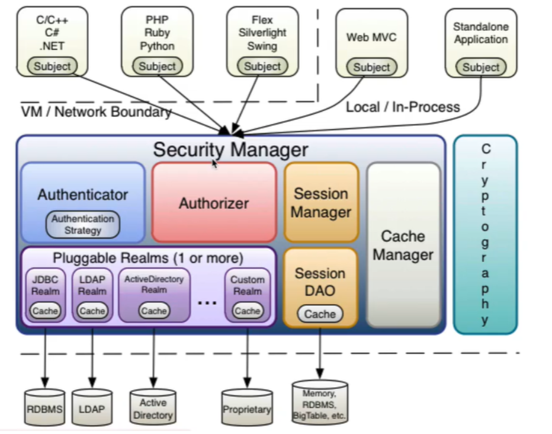
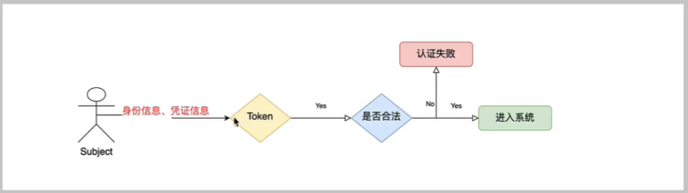
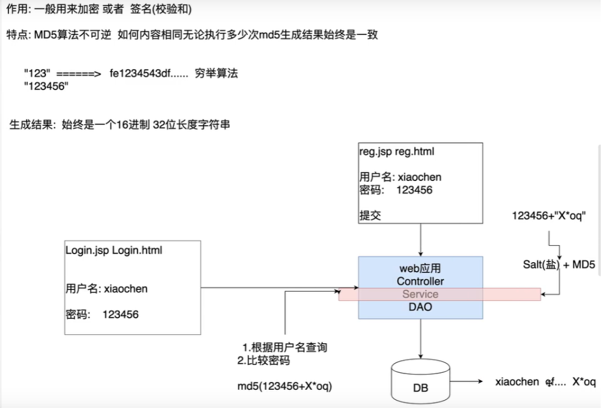
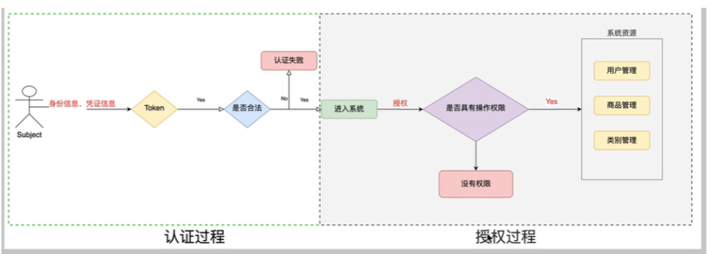
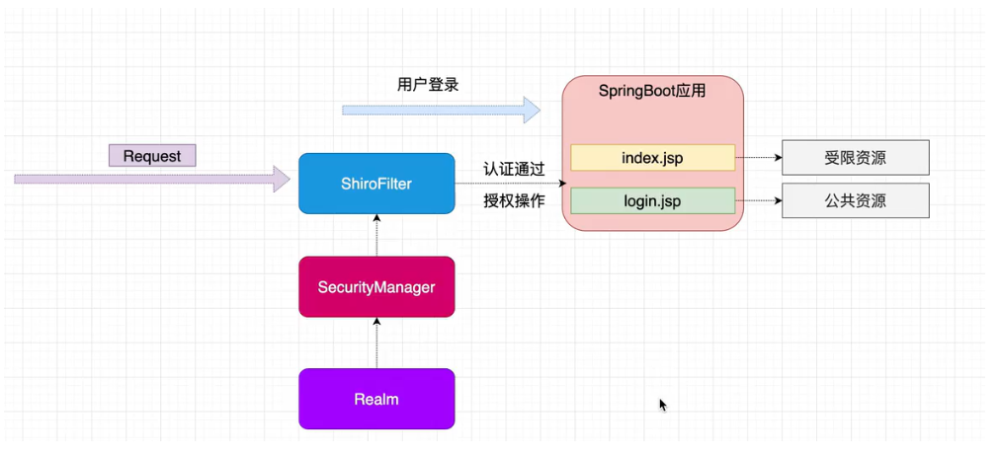

# 1、什么是shiro

Shiro是一个功能强大且易于使用的Java安全框架，它执行身份验证、授权、加密和会话管理。使用Shiro易于理解的API，您可以快速轻松地保护任何应用程序-从最小的移动应 用程序到最大的web和企业应用程序。Shiro是apache旗下一个开源框架，它将软件系统的安全认证相关的功能抽取出来，实现用户身份认证，权限授权、加密、会话管理等功能，组成了一个通用的安全认证框架。



## 解释

####   1.1Subject

Subject即主体，外部应用与subject进行交互，subject记录 了当前操作用户，将用户的概念理解为当前操作的主体，可能是一个通过浏览器请求的用户，也可能是一个运行的程序。Subject在shiro中是一 个接口，接口中定义了很多认证授相关的方法，外部程序通过subject进行认证授，而subject是 通过SecurityManager安全管理器进行认证授权

#### 1.2 SecurityManager

SecurityManager即安全管理器，对全部的subject进行安全管理， 它是shiro的核心， 负责对所有的subject进行安全管理。通过SecurityManager可以完成subject的认证、 授权等，实质上SecurityManager是通过Authenticator进行认证，通过Authorizer进行授权，通过SessionManager进行会话管理等 。
SecurityManager是一个接口， 继承了Authenticator, Authorizer, SessionManager这三个接口。

#### 1.3 Authenticator

Authenticator即认证器，对用户身份进行认证，Authenticator是一 个接口， shiro提 供ModularRealmAuthenticator实现
类，通过ModularRealmAuthenticator基本 上可以满足大多数需求，也可以自定义认证器。

#### 1.4 Authorizer

Authorizer即授权器，用户通过认证器认证通过，在访问功能时需要通过授权器判断用户是否有此功能的操作权限。

#### 1.5 Realm

Realm即领域，相当于datasource数据源， securityManager进行安全认证需要 通过Realm获取用户权限数据，比如:如果
用户身份数据在数据库那么realm就需要从数据库获取用户身份信息。
● 注意:不要把realm理解成只是从数据源取数据，在realm中还有认证授权校验的相关的代码。

#### 1.6 SessionManager

sessionManager即会话管理，shiro框架定义了一套会话管理， 它不依赖web容器的session,所以shiro可以使用在非web
应用上，也可以将分布式应用的会话集中在一点管理， 此特性可使它实现单点登录。

#### 1.7 SessionDAO

SessionDAO即会话dao，是对session会话操作的一 套接口，比如要将session存储到数据库， 可以通过jdbc将会话存储到数据库

#### 1.8 CacheManager

CacheManager即缓存管理，将用户权限数据存储在缓存，这样可以提高性能。

#### 1.9 Cryptography

Cryptography即密码管理，shiro提供了 -套加密/解密的组件，方便开发。比如提供常用的散列、加/解密等功能。

# 2、shiro的认证

#### 2.1认证

身份认证，就是判断-个用户是否为合法用户的处理过程。最常用的简单身份认证方式是系统通过核对用户输入的用户
名和口令,看其是否与系统中存储的该用户的用户名和口令-致,来判断用户身份是否正确。

#### 2.2 shiro中认证的关键对象

●Subject: 主体
访问系统的用户，主体可以是用户、程序等，进行认证的都称为主体; 
●Principal: 身份信息
是主体(subject) 进行身份认证的标识，标识必须具有唯一性，如用户名、手机号、邮箱地址等，-个主体可以有多个
身份，但是必须有一个主身份(Primary Principal)。
●credential: 凭证信息
是只有主体自己知道的安全信息，如密码、证书等。

#### 2.3认证流程



# 3、QuickStart

未集成springboot（假数据）


## 3.1、导入依赖

```xml
<dependency>
    <groupId>org.apache.shiro</groupId>
    <artifactId>shiro-core</artifactId>
    <version>1.3.2</version>
</dependency>
```

## 3.2、获取shiro配置文件（假数据）

```ini
[users]
zhangsan=123123
lisi=123123
```

## 3.3、身份认证

```java
import org.apache.shiro.SecurityUtils;
import org.apache.shiro.authc.IncorrectCredentialsException;
import org.apache.shiro.authc.UnknownAccountException;
import org.apache.shiro.authc.UsernamePasswordToken;
import org.apache.shiro.mgt.DefaultSecurityManager;
import org.apache.shiro.realm.text.IniRealm;
import org.apache.shiro.subject.Subject;

/**
 * Simple Quickstart application showing how to use Shiro's API.
 *
 * @since 0.9 RC2
 */
public class Quickstart {
    public static void main(String[] args) {
        //1、创建安全管理器对象
        DefaultSecurityManager securityManager = new DefaultSecurityManager();

        //2、给安全管理器对象设置realm(数据库数据)
        securityManager.setRealm(new IniRealm("classpath:shiro.ini"));

        //3、给全局安全类设置安全管理器
        SecurityUtils.setSecurityManager(securityManager);

        //4、获取关键对象主体
        Subject subject = SecurityUtils.getSubject();


        //5、创建token
        UsernamePasswordToken token = new UsernamePasswordToken("lisi", "123123");

        try {
            //判断是否认证subject.isAuthenticated()
            System.out.println(subject.isAuthenticated());
            subject.login(token);//用户认证
            System.out.println(subject.isAuthenticated());
        }catch (IncorrectCredentialsException e){
            e.printStackTrace();
            System.out.println("密码错误");
        }catch (UnknownAccountException e){
            e.printStackTrace();
            System.out.println("用户名不存在");
        }
    }

}
```

## 3.4、自定义realm

#### 3.4.1、创建realm

```java
package realm;

import org.apache.shiro.authc.AuthenticationException;
import org.apache.shiro.authc.AuthenticationInfo;
import org.apache.shiro.authc.AuthenticationToken;
import org.apache.shiro.authc.SimpleAuthenticationInfo;
import org.apache.shiro.authz.AuthorizationInfo;
import org.apache.shiro.realm.AuthorizingRealm;
import org.apache.shiro.subject.PrincipalCollection;

/**
 * 自定义realm实现，调用数据库中的数据
 */
public class CustomerRealm extends AuthorizingRealm {

   //认证方法
    @Override
    protected AuthorizationInfo doGetAuthorizationInfo(PrincipalCollection principalCollection) {
        return null;
    }
    //授权方法
    @Override
    protected AuthenticationInfo doGetAuthenticationInfo(AuthenticationToken token) throws AuthenticationException {
        String principal = (String) token.getPrincipal();//principal的数据为前端数据
        if ("lisi".equals(principal)){//前端数据与后端数据库数据“lisi”比较
            
            //参数1：数据库中正确的用户名     参数2：数据库正确的密码    参数3：当前realm的名字
            return new SimpleAuthenticationInfo("lisi","123123",this.getName());
        }
        return null;
    }
}
```

#### 3.4.2、实现realm

```java
import org.apache.shiro.SecurityUtils;
import org.apache.shiro.authc.IncorrectCredentialsException;
import org.apache.shiro.authc.UnknownAccountException;
import org.apache.shiro.authc.UsernamePasswordToken;
import org.apache.shiro.mgt.DefaultSecurityManager;
import org.apache.shiro.subject.Subject;
import realm.CustomerRealm;

public class TestCustomerRealm {
    public static void main(String[] args) {
        DefaultSecurityManager defaultSecurityManager = new DefaultSecurityManager();
        //设置为自定义的realm
        defaultSecurityManager.setRealm(new CustomerRealm());
        //3、给全局安全类设置安全管理器
        SecurityUtils.setSecurityManager(defaultSecurityManager);
        //4、获取关键对象主体
        Subject subject = SecurityUtils.getSubject();


        //5、创建token
        UsernamePasswordToken token = new UsernamePasswordToken("lisi", "123123");//前端拿到数据

        try {
            //是否认证
            System.out.println(subject.isAuthenticated());
            subject.login(token);//用户认证
            System.out.println(subject.isAuthenticated());
        }catch (IncorrectCredentialsException e){
            e.printStackTrace();
            System.out.println("密码错误");
        }catch (UnknownAccountException e){
            e.printStackTrace();
            System.out.println("用户名不存在");
        }
    }
}
```

# 4、加密

## 4.1MD5和salt执行流程



## 4.2  MD5实现流程

### 4.2.1  加密

```java
public class TestMD5 {
    public static void main(String[] args) {
        //使用md5
        Md5Hash md5Hash= new Md5Hash("123123");
        System.out.println(md5Hash);

        //md5+salt
        Md5Hash md5Hash2 = new Md5Hash("123123","X0dasd.");
        System.out.println(md5Hash2);

        //md5+salt+hash
        Md5Hash md5Hash3 = new Md5Hash("123123","X0dasd.",1024);
        System.out.println(md5Hash3);


        //4297f44b13955235245b2497399d7a93
        //dd30349818a2f6c9f8b0e66cf4bc024d
        //4dee2c58ae40507d5ce95afc63c4c2df
    }
}
```

## 

### 4.2.2 设置MD5后的匹配realm

```java
public class CustomerMD5Realm extends AuthorizingRealm {
    @Override
    protected AuthorizationInfo doGetAuthorizationInfo(PrincipalCollection principalCollection) {
        return null;
    }

    @Override
    protected AuthenticationInfo doGetAuthenticationInfo(AuthenticationToken token) throws AuthenticationException {

        //获取身份信息
        String principal = (String) token.getPrincipal();
        if ("lisi".equals(principal)){

  //参数1：数据库中正确的用户名     参数2：数据库正确的密码       参数3：随机盐salt       参数4：当前realm的名字
            //这里shiro会直接将密码和前面生成token中的密码进行匹配，如果匹配成功则登陆成功，不成功则报错
            return new SimpleAuthenticationInfo("lisi",
                    "4dee2c58ae40507d5ce95afc63c4c2df",
                    ByteSource.Util.bytes("X0dasd."),
                    this.getName());
        }
        return null;
    }
}
```

### 4.2.3 验证实现

```java
public class TestCustomerMD5Realm {

        public static void main(String[] args) {

            //创建安全管理器
            DefaultSecurityManager defaultSecurityManager = new DefaultSecurityManager();

            //注入realm
            CustomerMD5Realm realm = new CustomerMD5Realm();
============================================================================================
           //设置加密凭证
            HashedCredentialsMatcher CredentialsMatcher = new HashedCredentialsMatcher();
            //设置加密的算法名字
            CredentialsMatcher.setHashAlgorithmName("md5");
            //设置加密的散列次数
            CredentialsMatcher.setHashIterations(1024);
==========================================================================================
            //将加密凭证设置到realm中
            realm.setCredentialsMatcher(CredentialsMatcher);
            //设置为自定义的realm
            defaultSecurityManager.setRealm(realm);


            //3、给全局安全类设置安全管理器
            SecurityUtils.setSecurityManager(defaultSecurityManager);

            //4、获取关键对象主体
            Subject subject = SecurityUtils.getSubject();


            //5、创建token
            UsernamePasswordToken token = new UsernamePasswordToken("lisi", "123123");

            try {
                //是否认证
                System.out.println(subject.isAuthenticated());
                subject.login(token);//用户认证
                System.out.println(subject.isAuthenticated());
                System.out.println("登录成功");
            }catch (IncorrectCredentialsException e){
                e.printStackTrace();
                System.out.println("密码错误");
            }catch (UnknownAccountException e){
                e.printStackTrace();
                System.out.println("用户名不存在");
            }
        }
    }
```

# 5、shiro中的授权

## 5.1授权

授权，即访问控制，控制谁能访问哪些资源。主体进行身份认证后需要分配权限方可访问系统的资源，对于某些资源没
有权限是无法访问的。

## 5.2关键对象

授权可简单理解为who对what(which)进行How操作:	
Who,   即主体(Subject) ， 主体需要访问系统中的资源。

What,   即资源(Resource) ，如系统菜单、页面、按钮、类方法、系统商品信息等。资源包括资源类型和资源实例，比
如商品信息为资源类型，类型为001的商品为资源实例，编号为001的商品信息也属于资源实例。

How,    权限/许可(Permission) ，规定了主体对资源的操作许可,权限离开资源没有意义,如用户查询权限、用户添加
权限、某个类方法的调用权限、编号为001用户的修改权限等，通过权限可知主体对哪些资源都有哪些操作许可。

## 5.3授权流程



## 5.4授权方式

● 基于角色的访问控制
。RBAC基于角色的访问控制(Role-Based Access Control)是以角色为中心进行访问控制

```java
 if(subject .hasRole(”admin")){

//操作什么资源
}
```

● 基于资源的访问控制
。RBAC基于资源的访问控制(Resource-Based Access Control)是以资源为中心进行访问控制

● 基于资源的访问控制
。RBAC基于资源的访问控制(Resource-Based Access Control)是以资源为中心进行访问控制

```java
if( subject . isPermission("uset :update:01")){ //资源实例

//对01用户进行修改
}
 if(subject . isPermission(" user :update:*")){ //资源类型

//对01用户进行修改
 }
```

## 5.5权限字符串

权限字符串的规则是:资源标识符:操作:资源实例标识符，意思是对哪个资源的哪个实例具有什么操作，“.” 是资源/操作/实例的分割符，权限字符串也可以使用*通配符。

例子：

● 用户创建权限: user  :  create， 或user  :  create:*

● 用户修改实例001的权限: user  :  update  :  001

● 用户实例001的所有权限: user  :  *  :   001


## 5.6 shiro中授权编程实现方式

● 编程式

```java
Subject subject = SecurityUtils . getSubject();
 if( subject . hasRole(" admin")) {
//有权限
}else{
//无权限
}
```

● 注解式

```java
 @RequiresRoles(" admin" )
public void hello() {
//有权限
}
```

●  Realm中的授权信息

```java
//授权
    @Override
    protected AuthorizationInfo doGetAuthorizationInfo(PrincipalCollection principals) {
        System.out.println("+++++++++++++++++++授权开始++++++++++++++++++++++");
        //身份信息
        String primaryPrincipal = (String) principals.getPrimaryPrincipal();
        System.out.println("身份信息"+primaryPrincipal);


        //根据身份信息  用户名   获取当前的角色信息，以及权限信息
        SimpleAuthorizationInfo simpleAuthorizationInfo = new SimpleAuthorizationInfo();


        //将数据库查询到的角色信息赋值给权限对象
         simpleAuthorizationInfo.addRole("admin");
         simpleAuthorizationInfo.addRole("user");


        //将数据库查询到的权限信息赋值给权限对象
        simpleAuthorizationInfo.addStringPermission("user:*:*");
        return simpleAuthorizationInfo;
    }
```

●  授权信息判断

```java
 System.out.println("===================授权===============================");
            //认证后的用户进行授权
            if (subject.isAuthenticated()){
                // 基于单角色权限控制
                System.out.println(subject.hasRole("admin"));

                // 基于多角色权限控制
                System.out.println(subject.hasAllRoles(Arrays.asList("admin","user")));

                //是否有其中的的一个角色
                boolean[] booleans = subject.hasRoles(Arrays.asList("admin", "user"));
                for (boolean Boolean : booleans) {
                    System.out.println(Boolean);
                }

                //基于权限权限字符串的访问控制      资源标识符：操作：资源类型
                System.out.println("权限::"+subject.isPermitted("user:update:01"));
```

# 6、springboot整合shiro



------

## 6.1  整合sprinboot+shiro+mybatis（认证）

#### **maven依赖**

```xml
<?xml version="1.0" encoding="UTF-8"?>
<project xmlns="http://maven.apache.org/POM/4.0.0" xmlns:xsi="http://www.w3.org/2001/XMLSchema-instance"
         xsi:schemaLocation="http://maven.apache.org/POM/4.0.0 https://maven.apache.org/xsd/maven-4.0.0.xsd">
    <modelVersion>4.0.0</modelVersion>
    <parent>
        <groupId>org.springframework.boot</groupId>
        <artifactId>spring-boot-starter-parent</artifactId>
        <version>2.4.3</version>
        <relativePath/> <!-- lookup parent from repository -->
    </parent>
    <groupId>com.me</groupId>
    <artifactId>spring_shiro</artifactId>
    <version>0.0.1-SNAPSHOT</version>
    <name>spring_shiro</name>
    <description>Demo project for Spring Boot</description>
    <properties>
        <java.version>11</java.version>
    </properties>
    <dependencies>
        <dependency>
            <groupId>org.springframework.boot</groupId>
            <artifactId>spring-boot-starter-web</artifactId>
        </dependency>

        <dependency>
            <groupId>org.springframework.boot</groupId>
            <artifactId>spring-boot-starter-test</artifactId>
            <scope>test</scope>
        </dependency>

<!--整合shiro-->
        <dependency>
            <groupId>org.apache.shiro</groupId>
            <artifactId>shiro-spring-boot-starter</artifactId>
            <version>1.4.1</version>
        </dependency>
        <dependency>
            <groupId>org.apache.shiro</groupId>
            <artifactId>shiro-core</artifactId>
            <version>1.5.3</version>
        </dependency>
<!--        整合mybatis-->
        <dependency>
            <groupId>mysql</groupId>
            <artifactId>mysql-connector-java</artifactId>
            <version>5.1.47</version>
        </dependency>
        <dependency>
            <groupId>com.alibaba</groupId>
            <artifactId>druid</artifactId>
            <version>1.0.9</version>
        </dependency>
        <dependency>
            <groupId>org.mybatis.spring.boot</groupId>
            <artifactId>mybatis-spring-boot-starter</artifactId>
            <version>2.1.1</version>
        </dependency>
        <dependency>
            <groupId>org.projectlombok</groupId>
            <artifactId>lombok</artifactId>
            <version>1.18.18</version>
        </dependency>
    </dependencies>

    <build>
        <plugins>
            <plugin>
                <groupId>org.springframework.boot</groupId>
                <artifactId>spring-boot-maven-plugin</artifactId>
            </plugin>
        </plugins>
    </build>

</project>

```

#### 6.1.1 后端

##### 自定义realm

```java
package com.me.shiro.Realm;

import com.me.mapper.UserMapper;
import com.me.pojo.User;
import org.apache.shiro.authc.AuthenticationException;
import org.apache.shiro.authc.AuthenticationInfo;
import org.apache.shiro.authc.AuthenticationToken;
import org.apache.shiro.authc.SimpleAuthenticationInfo;
import org.apache.shiro.authz.AuthorizationInfo;
import org.apache.shiro.realm.AuthorizingRealm;
import org.apache.shiro.subject.PrincipalCollection;
import org.apache.shiro.util.ByteSource;
import org.springframework.beans.factory.annotation.Autowired;

//自定义realm
public class UserRealm extends AuthorizingRealm {
    @Autowired
    UserMapper userMapper;//取数据库中的数据
    
    @Override
    protected AuthorizationInfo doGetAuthorizationInfo(PrincipalCollection principalCollection) {
        return null;
    }

    @Override
    protected AuthenticationInfo doGetAuthenticationInfo(AuthenticationToken token) throws AuthenticationException {
        System.out.println("================认证========================");
        //获取前端的数据
        String principal = (String) token.getPrincipal();

        //principal为用户名
        
        //与数据库数据比较(根据用户名查询)
        User dbuser = userMapper.findOne(principal);


        if (dbuser!=null&&dbuser.getName().equals(principal)){
            //token会自动  与该方法中查询到的数据库  数据进行比较
            return new SimpleAuthenticationInfo(dbuser.getName(),dbuser.getPwd(), ByteSource.Util.bytes(dbuser.getSalt()),this.getName());
        }
        return null;
    }
}
```


##### shiro配置类

```java
package com.me.config;

import com.me.shiro.Realm.UserRealm;
import org.apache.shiro.authc.credential.HashedCredentialsMatcher;
import org.apache.shiro.realm.Realm;
import org.apache.shiro.spring.web.ShiroFilterFactoryBean;
import org.apache.shiro.web.mgt.DefaultWebSecurityManager;
import org.springframework.context.annotation.Bean;
import org.springframework.context.annotation.Configuration;

import java.util.HashMap;
import java.util.Map;

/**
 * 整合shiro配置类
 */
@Configuration
public class shiroConfig {

    // 创建自定义realm
    @Bean
    public Realm getRealm(){
        UserRealm userRealm = new UserRealm();

        //设置凭证校验匹配器
        HashedCredentialsMatcher hashedCredentialsMatcher = new HashedCredentialsMatcher();

        //设置加密算法为md5
        hashedCredentialsMatcher.setHashAlgorithmName("MD5");

        //设置散列次数
        hashedCredentialsMatcher.setHashIterations(1024);
        
        //将匹配器设置到realm中
        userRealm.setCredentialsMatcher(hashedCredentialsMatcher);
        return userRealm;
    }

    //创建安全管理器
    @Bean
    public DefaultWebSecurityManager getDefaultWebSecurityManager(Realm realm){
        DefaultWebSecurityManager defaultWebSecurityManager = new DefaultWebSecurityManager();

        //给安全管理器设置realm
        defaultWebSecurityManager.setRealm(realm);
        return defaultWebSecurityManager;
    }

    //创建shiroFilter    拦截所有请求
    @Bean
    public ShiroFilterFactoryBean getShiroFilterFactoryBean(DefaultWebSecurityManager defaultWebSecurityManager){
        ShiroFilterFactoryBean shiroFilterFactoryBean = new ShiroFilterFactoryBean();
        //给filter设置安全管理器
        shiroFilterFactoryBean.setSecurityManager(defaultWebSecurityManager);

        //配置系统受限资源
        Map<String,String> map = new HashMap<>();

        map.put("/add.html","authc");
        map.put("/update.html","authc");
        map.put("/index.html","authc");//请求这些页面需要授权和认证，除了login.html

        //配置系统安全资源
        shiroFilterFactoryBean.setFilterChainDefinitionMap(map);

        //设置返回界面（被拒绝）
         shiroFilterFactoryBean.setLoginUrl("/login.html");
        return shiroFilterFactoryBean;
    }

}

```

##### 随机盐工具类

```java

import java.util.Random;

public class SaltUtil {
    /**
       *  生成随机盐的静态方法
          @param n
        * @return
          */
              public static String getSalt(int  n){
          char[] chars = "QWERTYUIOPASDFGHJKLZXCVBNMqwertyuiopasdfghjklzxcvbnm@#$%^&*()1234567890".toCharArray();
          StringBuilder sb = new StringBuilder();
          for (int i = 0; i < n; i++) {
              char aChar = chars[new Random().nextInt(chars.length)];
              sb.append(aChar);
          }
          return sb.toString();

    }

}
```


##### controller

```java
package com.me.controller;

import com.me.Utils.SaltUtil;
import com.me.mapper.UserMapper;
import com.me.pojo.User;
import org.apache.shiro.SecurityUtils;
import org.apache.shiro.authc.IncorrectCredentialsException;
import org.apache.shiro.authc.UnknownAccountException;
import org.apache.shiro.authc.UsernamePasswordToken;
import org.apache.shiro.crypto.hash.Md5Hash;
import org.apache.shiro.subject.Subject;
import org.springframework.beans.factory.annotation.Autowired;
import org.springframework.stereotype.Controller;
import org.springframework.web.bind.annotation.*;


@RestController
public class UserController {
    @Autowired
    UserMapper mapper;
/**
*注册用户
*/
    @PostMapping("/register")
    public int register(String username, String password){
        User user = new User();
        user.setName(username);
        //生成随机盐,5位
        String salt = SaltUtil.getSalt(5);
        user.setSalt(salt);
        //对提交的密码进行加密
        Md5Hash md5Hash = new Md5Hash(password, salt,1024);//   1024为散列次数
        user.setPwd(md5Hash.toHex());

        //加密后写入数据库
        try {
            mapper.addUser(user);
        }catch (Exception e){
            return 500;
        }
        return 200;
    }


    /**
     * 处理登录身份认证
     * @return
     */
    @PostMapping("/login")
    public int login(String username, String password){
        //获取主体对象
        Subject subject = SecurityUtils.getSubject();
        try {
            //login方法调用自定义的realm方法进行认证
            subject.login(new UsernamePasswordToken(username,password));
            
            
            System.out.println("验证通过");
            return 200;
        }catch (UnknownAccountException e){
            System.out.println("用户名错误！");
        }catch (IncorrectCredentialsException e){
            System.out.println("密码错误");
        }
        return 500;
    }

    @GetMapping("/logout")
    public int logout(){
        Subject subject = SecurityUtils.getSubject();
        subject.logout();//退出用户
        return 200;
    }
}

```

##### Mapper

```java
package com.me.mapper;

import com.me.pojo.User;
import org.apache.ibatis.annotations.Mapper;
import org.springframework.stereotype.Component;

import java.util.List;

@Mapper
@Component
public interface UserMapper {
    public List<User> findAll();
    public User findOne(String name);
    public void addUser(User user);
}

```

##### Mapper接口（xml）

```xml
<?xml version="1.0" encoding="UTF-8" ?>
<!DOCTYPE mapper
        PUBLIC "-//mybatis.org//DTD Mapper 3.0//EN"
        "http://mybatis.org/dtd/mybatis-3-mapper.dtd">

<mapper namespace="com.me.mapper.UserMapper">

    <select id="findAll" resultType="User">
        select * from user ;
    </select>
    <select id="findOne" resultType="User" parameterType="String">
        select * from user where name = #{name};
    </select>
    <insert id="addUser" parameterType="User" keyProperty="id">
        insert into user values (#{id},#{name},#{pwd},#{salt})
    </insert>
</mapper>
```

##### pojo

```java
package com.me.pojo;

import lombok.AllArgsConstructor;
import lombok.Data;
import lombok.NoArgsConstructor;

@Data
@NoArgsConstructor
@AllArgsConstructor
public class User {
    private int id;
    private String name;
    private String pwd;
    private String salt;
}

```

#### 6.1.2 前端 

##### 注册页面register.html

```html
<!DOCTYPE html>
<html lang="en">
<head>
    <meta charset="UTF-8">
    <title>注册</title>
    <script src="/js/jquery-3.3.1.min.js"></script>
</head>
<body>
<form>
    注册账号：<input type="text" name="username" id="username"><br>
    注册密码：<input type="password" name="password" id="password">
    <input type="button" id="btn">提交</input>
</form>
</body>
<script>
    $("#btn").click(function () {
        var username = $("#username").val();
        var password = $("#password").val();
        $.post("/register",{username:username,password:password},function (data) {
            if (data==200){
                $(location).prop('href', '/login.html')
            }else {
                $(location).prop('href', '/register.html')
            }
        });
    })

</script>
</html>
```


##### 登录页面login.html

```html
<!DOCTYPE html>
<html lang="en">
<head>
    <meta charset="UTF-8">
    <title>登录</title>
    <script src="/js/jquery-3.3.1.min.js"></script>
</head>
<body>

<h1>登录</h1>
<form>
    <div id="fir"></div>
  账号<input type="text" name="username" id="username"><br>
    密码<input type="password" name="password" id="password">
   <input type="button" id="btn">提交</input>
</form>
</body>
<script>
    $("#btn").click(function () {
        var username = $("#username").val();
        var password = $("#password").val();
        $.post("/login",{username:username,password:password},function (data) {

            if (data===200){
                $(location).prop('href', '/index.html')
            }else {
                $("#fir").html("<p style='color: red'>账号密码错误</p>");
                $(location).prop('href', '/login.html')
            }
        });
    })


</script>
</html>
```


##### 主页  index.html

```html
<!DOCTYPE html>
<html lang="en">
<head>
    <meta charset="UTF-8">
    <title>Title</title>
    <script src="/js/jquery-3.3.1.min.js"></script>
</head>
<body>
<p>首页</p>
<p id="p"></p>
<button id="logout">退出</button>
<a href="/user/add">to add</a>
<a href="/user/update">to update</a>
</body>
<script>
    $("#logout").click(function () {
        $.get("/logout",function (data) {
            if (data==200){
                location = "/login.html"
            }
        })
    })

</script>
</html>
```

## 6.2 授权

#### 6.2.1  自定义realm中添加授权

```java
//授权
@Override
protected AuthorizationInfo doGetAuthorizationInfo(PrincipalCollection principalCollection) {
    //获取身份信息
    String Principal = (String) principalCollection.getPrimaryPrincipal();

    //根据身份信息获取   角色     和权限信息
    String userRole = userMapper.findUserRole(Principal);
    if (userRole != null){
        SimpleAuthorizationInfo simpleAuthorizationInfo = new SimpleAuthorizationInfo();
        simpleAuthorizationInfo.addRole(userRole);
        return simpleAuthorizationInfo;
    }
    return null;
}
```

#### 6.2.2  Mapper 添加

```java
/**
 * 根据用户名查询角色权限
 * @param name
 * @return
 */
public String findUserRole(String name);


.xml中添加
    <select id="findUserRole" parameterType="String" resultType="String">
        select role from user where name = #{name};
    </select>
        
        
        
  数据库和pojo添加role字段
```

#### 6.2.3 Controller

```java
@PostMapping("/login")
public int login(String username, String password){
    //获取主体对象
    Subject subject = SecurityUtils.getSubject();
    try {
        subject.login(new UsernamePasswordToken(username,password));
        
        System.out.println("登录通过");
        if (subject.hasRole("admin")){
            System.out.println(">>>>>>>>>admin欢迎您>>>>>>>>>>>>>>");
            return 200;
        }else if (subject.hasRole("user")){
            System.out.println(">>>>>>>>>user欢迎您>>>>>>>>>>>>>>");
            return 201;
        }

            
    }catch (UnknownAccountException e){
        System.out.println("用户名错误！");
    }catch (IncorrectCredentialsException e){
        System.out.println("密码错误");
    }
    return 500;
}
```

## 6.3 验证码

### 6.3.1 验证码工具类

```java
package com.me.Utils;

import javax.imageio.ImageIO;
import javax.servlet.http.HttpSession;
import java.awt.*;
import java.awt.image.BufferedImage;
import java.io.IOException;
import java.io.OutputStream;
import java.util.Random;

public class CodeUtil {
    //产生随机数的方法（返回数字）
    private static String getCheckCode() {
        String base = "23456789ABCDEFGHJKLMNPQRSTUVWXYZabcdefghjkmnpqrstuvwxyz";
        int size = base.length();
        Random r = new Random();
        StringBuffer sb = new StringBuffer();
        for(int i=1;i<=4;i++){
            //产生0到size-1的随机值
            int index = r.nextInt(size);
            //在base字符串中获取下标为index的字符
            char c = base.charAt(index);
            //将c放入到StringBuffer中去
            sb.append(c);
        }
        return sb.toString();
    }
    //生成随机的字体样式
    private static Font randomFont(int width,int height) {
        String[] fontNames  = {"宋体", "华文楷体", "黑体", "微软雅黑", "楷体_GB2312"};
        Random r = new Random();
        int index = r.nextInt(fontNames.length);
        String fontName = fontNames[index];//生成随机的字体名称
        int style = r.nextInt(4);//生成随机的样式, 0(无样式), 1(粗体), 2(斜体), 3(粗体+斜体)
        int size = r.nextInt(20) + height/2; //生成随机字号,
        return new Font(fontName, style, size);
    }

    //生成随机的颜色
    private static Color randomColor() {
        Random r = new Random();
        int red = r.nextInt(150);
        int green = r.nextInt(150);
        int blue = r.nextInt(150);
        return new Color(red, green, blue);
    }

    public static void getImage(int width ,int height,OutputStream out, HttpSession session) throws IOException {
        //在内存中创建一个长80，宽30的图片，默认黑色背景
        //参数一：长
        //参数二：宽
        //参数三：颜色
        BufferedImage image = new BufferedImage(width,height,BufferedImage.TYPE_INT_RGB);

        //获取画笔
        Graphics g = image.getGraphics();
        //设置画笔颜色为随机
        g.setColor(randomColor());
        //填充图片背景
        g.fillRect(0,0, width,height);

        //产生4个随机验证码，12Ey
        String checkCode = getCheckCode();
        //将验证码放入HttpSession中
        session.setAttribute("checkCode",checkCode);


        //设置画笔颜色
        g.setColor(randomColor());

        //设置字体的样式
        g.setFont(randomFont(width,height));

        //向图片上写入验证码
        g.drawString(checkCode,width/3,(height-10));

        //画斜线
        Random r = new Random();
        for (int i = 0; i < 6; i++) {
            int x1 = r.nextInt(width);
            int y1 = r.nextInt(height);
            int x2 = r.nextInt(width);
            int y2 = r.nextInt(height);
            g.setColor(randomColor());
            g.drawLine(x1, y1, x2, y2);//画线
        }
        //将内存中的图片输出到浏览器
        //参数一：图片对象
        //参数二：图片的格式，如PNG,JPG,GIF
        //参数三：图片输出到哪里去
        ImageIO.write(image,"PNG",out);
    }
}
```

### 6.3.2 请求验证码的controller

```java

/**
 * 生成验证码
 */
@RequestMapping("/getImage")
public void getImage(HttpSession session, HttpServletResponse response) throws IOException {
    //生成验证码
    ServletOutputStream os = response.getOutputStream();
    response.setContentType("image/png");
    CodeUtil.getImage(200,60,os,session);
    //验证码存入session    工具类中存入了

}


/**
     * 处理登录身份认证
     * @return
     */
    @PostMapping("/login")
    public int login(String username, String password,String code,HttpSession session){
        //获取验证码‘（工具类中生成的真实验证码）
        String checkCode = (String) session.getAttribute("checkCode");

        try {
            if (code.equalsIgnoreCase(checkCode)){
                //获取主体对象
                Subject subject = SecurityUtils.getSubject();
                subject.login(new UsernamePasswordToken(username,password));
                System.out.println("登录通过");
                if (subject.hasRole("admin")){
                    System.out.println(">>>>>>>>>admin欢迎您>>>>>>>>>>>>>>");
                    return 200;
                }else if (subject.hasRole("user")){
                    System.out.println(">>>>>>>>>user欢迎您>>>>>>>>>>>>>>");
                    return 201;
                }
            }
            else {
                throw new RuntimeException("验证码错误");
            }
        }catch (UnknownAccountException e){
            System.out.println("用户名错误！");
        }catch (IncorrectCredentialsException e){
            System.out.println("密码错误");
        }
        return 500;
    }


```

### 6.3.3 前端请求

```html
请输入验证码：<input type="text" name="code" id="code"><br>
<br>
```

