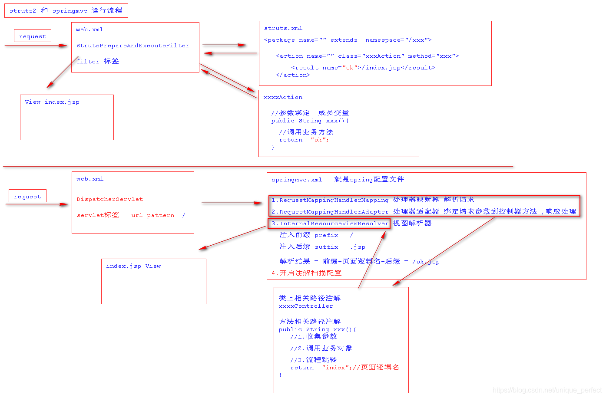
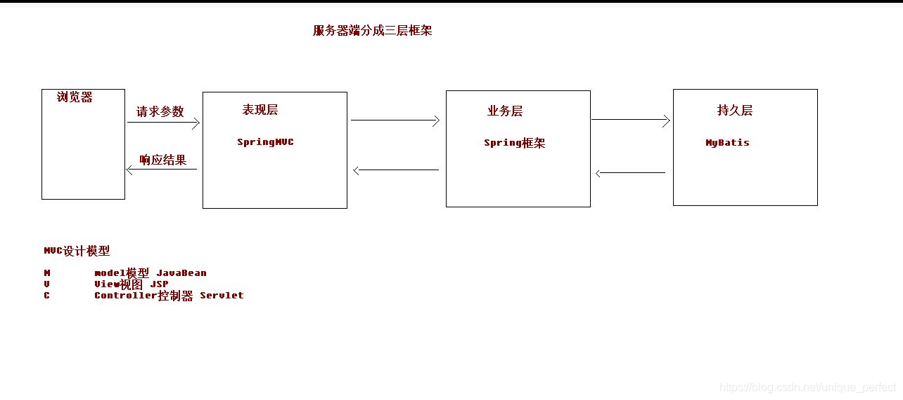
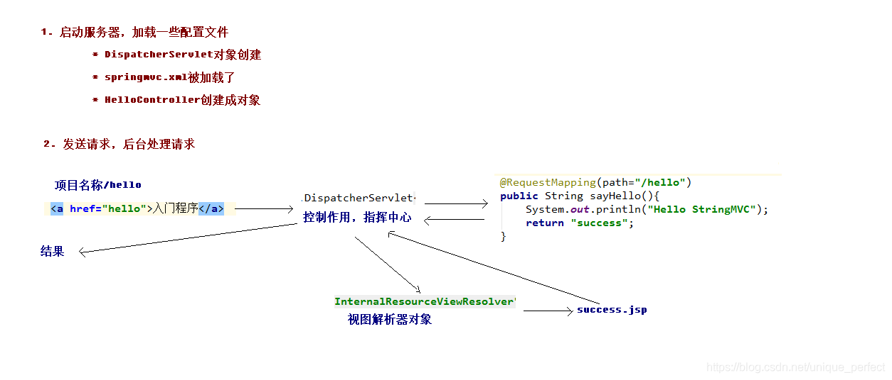
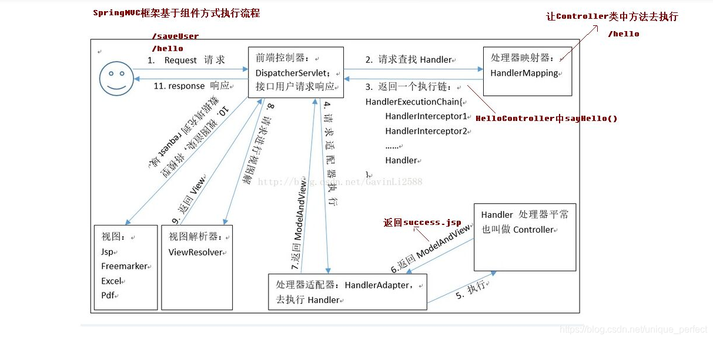

# SpringMVC

## 1 SpringMVC的引言

> 为了使Spring可插入的MVC架构,SpringFrameWork在Spring基础上开发SpringMVC框架,从而在使用Spring进行WEB开发时可以选择使用Spring的SpringMVC框架作为web开发的控制器框架。

## 2 为什么是SpringMVC

- 可以和spring框架无缝整合
- 运行效率高于struts2框架
- 注解式开发更高效

## 3 SpringMVC的特点

> **SpringMVC** 轻量级，典型MVC框架，在整个MVC架构中充当控制器框架,相对于之前学习的struts2框架,SpringMVC运行更快,其注解式开发更高效灵活。

## 4 SpringMVC与Struts2运行流程对比



## 5 第一个环境搭建

### 5.1 引入相关依赖

```xml
<dependency>
	 <groupId>org.springframework</groupId>
	 <artifactId>spring-core</artifactId>
	 <version>4.3.2.RELEASE</version>
</dependency>
<dependency>
	<groupId>org.springframework</groupId>
	<artifactId>spring-context</artifactId>
	<version>4.3.2.RELEASE</version>
</dependency>
<dependency>
	 <groupId>org.springframework</groupId>
	 <artifactId>spring-context-support</artifactId>
	 <version>4.3.2.RELEASE</version>
</dependency>
<dependency>
	 <groupId>org.springframework</groupId>
	 <artifactId>spring-jdbc</artifactId>
	 <version>4.3.2.RELEASE</version>
</dependency>
<dependency>
	 <groupId>org.springframework</groupId>
	 <artifactId>spring-aop</artifactId>
	 <version>4.3.2.RELEASE</version>
</dependency>
<dependency>
	 <groupId>org.springframework</groupId>
	 <artifactId>spring-beans</artifactId>
	 <version>4.3.2.RELEASE</version>
</dependency>
<dependency>
	 <groupId>org.springframework</groupId>
	 <artifactId>spring-expression</artifactId>
	 <version>4.3.2.RELEASE</version>
</dependency>
<dependency>
	 <groupId>org.springframework</groupId>
	 <artifactId>spring-aspects</artifactId>
	 <version>4.3.2.RELEASE</version>
</dependency>
<dependency>
	 <groupId>org.springframework</groupId>
	 <artifactId>spring-tx</artifactId>
	 <version>4.3.2.RELEASE</version>
</dependency>
<dependency>
	 <groupId>org.springframework</groupId>
	 <artifactId>spring-web</artifactId>
	 <version>4.3.2.RELEASE</version>
</dependency>
<!--springmvc核心依赖-->
<dependency>
	 <groupId>org.springframework</groupId>
	 <artifactId>spring-webmvc</artifactId>
	 <version>4.3.2.RELEASE</version>
</dependency>
<!--servlet-api-->
<dependency>
	 <groupId>javax.servlet</groupId>
	 <artifactId>servlet-api</artifactId>
	 <version>2.5</version>
	 <scope>provided</scope>
</dependency>

```

### 5.2 配置文件

不要加中文

```xml
<?xml version="1.0" encoding="UTF-8"?>
<beans xmlns="http://www.springframework.org/schema/beans"
       xmlns:xsi="http://www.w3.org/2001/XMLSchema-instance"
       xmlns:context="http://www.springframework.org/schema/context"
       xmlns:mvc="http://www.springframework.org/schema/mvc"
       xsi:schemaLocation="http://www.springframework.org/schema/beans
       http://www.springframework.org/schema/beans/spring-beans-4.2.xsd
    http://www.springframework.org/schema/mvc
    http://www.springframework.org/schema/mvc/spring-mvc-4.2.xsd
    http://www.springframework.org/schema/context
    http://www.springframework.org/schema/context/spring-context-4.2.xsd">
<!--    &lt;!&ndash;注册处理器映射器&ndash;&gt;-->
<!--    <bean class="org.springframework.web.servlet.mvc.method.annotation.RequestMappingHandlerMapping"/>-->
<!--    &lt;!&ndash;注册处理器适配器&ndash;&gt;-->
<!--    <bean class="org.springframework.web.servlet.mvc.method.annotation.RequestMappingHandlerAdapter"/>-->

    <!--开启注解扫描-->
    <context:component-scan base-package="com.example.mvc_01.controller"/>
    <!--取代上面的两个-->
    <mvc:annotation-driven/>
    <!--注册处理器适配器-->
    <bean class="org.springframework.web.servlet.mvc.method.annotation.RequestMappingHandlerAdapter"/>
    <!--注册视图解析器-->
    <bean class="org.springframework.web.servlet.view.InternalResourceViewResolver">
        <property name="prefix" value="/"/>
        <property name="suffix" value=".jsp"/>
    </bean>

</beans>
```

### 5.3 配置springmvc的核心Servlet

web.xml

```xml
<servlet>
	<servlet-name>springmvc</servlet-name>
	<servlet-class>org.springframework.web.servlet.DispatcherServlet</servlet-class>
	<!--指定springmvc配置文件位置-->
	<init-param>
	<param-name>contextConfigLocation</param-name>
	<param-value>classpath:springmvc.xml</param-value>
	</init-param>
</servlet>

<servlet-mapping>
	<servlet-name>springmvc</servlet-name>
	<url-pattern>/</url-pattern>
</servlet-mapping>

```

*注意*: 这里还要加载spring配置，通过在servlet写init­param标签，还是contextConfigLocation属性，value用来加载springmvc配置文件

### 5.4 创建控制器

```java
@Controller
@RequestMapping("/hello")
public class HelloController {
    @RequestMapping("/hello")
    public String hello(){
        System.out.println("hello springmvc");
        return "index";//解析结果:前缀+返回值+后缀
    }
}

```

### 5.5 部署项目,启动项目测试

> 访问路径: http://localhost:8989/springmvc_day1/hello/hello

### 5.6 Springmvc说明

 

 

 

### 5.7  跳转方式

> 1.原始servlet技术中跳转方式?


forward跳转:
请求转发
特点:
服务器内部跳转,跳转之后地址栏不变一次跳转跳转时可以使用request作用域传递数据
redirect跳转:
请求重定向
特点:客户端跳转,跳转之后地址栏改变多次跳转跳转过程不能使用request作用域传递数据

> 2.SpringMVC中跳转方式

> **forward**:
>
> 一次请求服务器内部跳转跳转之后地址栏不变可以使用 request作用域传递数据
>
> **redirect** :
> 多次请求客户端跳转
> 跳转之后地址栏改变不可以使用request作用域传递数据

forward redirect 两种跳转:
a.Controller ----> JSP页面跳转
forward :默认 就是forward跳转到页面
具体语法return"页面逻辑名”
redirect: .
使用springmvc提供关键字redirect: 具体语法: return "redirect:视图全名”---> return "redi rect: /index.jsp"
注意:使用redirect跳转不会经过视图解析器

b. Controller -----> Controller之 间跳转(相同,不同控制器)
forward:使 用springmvc提供关键字forward:
具体语法: return "forward:/ 跳转controller类.上@ requestMapping的路径/跳转类中指定方法.上@RequestMaping的路径"
redirect:使用springmvc提供关键字redi rect:
具体语法: return "redirect:/跳转controller类上@requestMappi ng的路径/跳转类中指定方法上@RequestMapi ng的路径”
总结:
return "forward:  redirect: /跳转controller类.上@requestMapping的路径/跳转类中指定方法.上@RequestMaping的路径”

## 6 SpringMVC中参数接收

> 接收参数语法说明：springmvc中使用控制器方法参数来收集客户端的请求参数，因此在接收请求参数时直接在需要控制器方法声明即可，springmvc可以自动根据指定类型完成类型的转换操作

### 6.1 基本类型或者 String 类型

```markdown
如: 八种基本类型 +  String + 日期类型
要求我们的参数名称必须和控制器中方法的形参名称保持一致。(严格区分大小写)
注意:springmvc 默认日期格式  spring日期格式   yyyy/MM/dd HH:mm:ss 
struts2日期格式:yyyy-MM-dd
修改默认日期格式: @DateTimeFormat 必须使用mvc标签配置
注意:在springmvc中出现400错误说明传递参数的格式存在问题 

```

### 6.2 接收对象类型参数

传递的参数要与实体的参数一致，会自动包装为pojo

```markdown
包括实体类，以及关联的实体类
如果是 POJO 类型，或者它的关联对象：
要求表单中参数名称和 POJO 类的属性名称保持一致。并且控制器方法的参数类型是 POJO 类型。

```

### 6.3 接收数组类型参数

```java
/**
* 接收数组类型参数
* 语法: 将要接收数组作为控制器方法的参数声明即可
* 前台语法: 要求前台传递的多个参数的参数变量名都要与接受数组变量名一致,
*          springmvc自动将多个变量名放入一个数组中
* url?names=zhangsan&names=李四...
*/

```

**注意**:接收数组类型数据时前台传递多个key一致自动放入同一个数组中

### 6.4 接收集合类型参数

```markdown
list set map
注意:
springmvc不能直接通过形参列表方式收集集合类型参数
如果要接收集合类型的参数必须将集合放入对象中接收才可以推荐放入vo对象中接收集合类型

vo = value object 值对象
```

eg:

```java

public class CollectionVO {
    private List<String> lists;

    @Override
    public String toString() {
        return "CollectionVO{" +
                "list=" + lists +
                '}';
    }

    public List<String> getLists() {
        return list;
    }

    public void setLists(List<String> list) {
        this.list = list;
    }
}

```

接收：

```java
    @RequestMapping("list")
    public String list(CollectionVO collectionVO){
        System.out.println(collectionVO.getList());
        return "index";
    }
```

访问：

传递的参数------->就是对象的属性名

http://localhost:8080/mvc_01/list?lists=11&lists=22&lists=33

## 7 接收参数中文乱码解决方案

> **注意**       :    在使用springmvc过程中接收客户端的请求参数时有时会出现中文乱码，这是因为springmvc并没有对象请求参数进行编码控制，如果需要控制需要自行指定

```markdown
get 请求方式：
tomacat 对 GET 和 POST 请求处理方式是不同的，GET 请求的编码问题，要改 tomcat 的 server.xml
配置文件，如下：
<Connector connectionTimeout="20000" port="8080"
protocol="HTTP/1.1" redirectPort="8443"/>
改为：
<Connector connectionTimeout="20000" port="8080"
protocol="HTTP/1.1" redirectPort="8443"
useBodyEncodingForURI="true"/>
如果遇到 ajax 请求仍然乱码，请把：
useBodyEncodingForURI="true"改为 URIEncoding="UTF-8"
即可。


```

针对于post方式中文乱码解决方案:

web.xml

```xml
 <!--配置filter-->
<filter>
	<filter-name>charset</filter-name>
	<filter-class>org.springframework.web.filter.CharacterEncodingFilter</filter-class>
	<init-param>
		<param-name>encoding</param-name>
		<param-value>UTF-8</param-value>
	</init-param>
</filter>
<filter-mapping>
	<filter-name>charset</filter-name>
	<url-pattern>/*</url-pattern>
</filter-mapping>

在 springmvc 的配置文件中可以配置，静态资源不过滤：
<!-- location 表示路径，mapping 表示文件，**表示该目录下的文件以及子目录的文件 -->
<mvc:resources location="/css/" mapping="/css/**"/>
<mvc:resources location="/images/" mapping="/images/**"/>
<mvc:resources location="/scripts/" mapping="/javascript/**"/>
```

## 8 springMVC的数据传递机制

1 存数据具体使用哪种作用域:
跳转方式:
forward  :  一次请求                   request作用域 | Model (springmvc提供)
rdirect  :  多次请求session         作用域application作 用域[不推荐]
? 地址栏传递数据
2 如何在springmvc控制器方法中获取request对象,response对象
public String findAll (HttpServletRequest request, HttpServletResponse response) {

## 9 整合mybatis

### sm整合（spring    mybatis）

**相关依赖**

```xml
 <dependencies>
        <dependency>
            <groupId>junit</groupId>
            <artifactId>junit</artifactId>
            <version>4.12</version>
        </dependency>
<!--        mybatis-->
        <dependency>
            <groupId>org.mybatis</groupId>
            <artifactId>mybatis</artifactId>
            <version>3.5.2</version>
        </dependency>
<!--mysql-connector-java-->
        <dependency>
            <groupId>mysql</groupId>
            <artifactId>mysql-connector-java</artifactId>
            <version>5.1.47</version>
        </dependency>
<!--        spring相关-->
        <dependency>
            <groupId>org.springframework</groupId>
            <artifactId>spring-webmvc</artifactId>
            <version>5.2.13.RELEASE</version>
        </dependency>
        <dependency>
            <groupId>org.springframework</groupId>
            <artifactId>spring-jdbc</artifactId>
            <version>5.2.13.RELEASE</version>
        </dependency>
<!--        mybatis-spring整合包 -->
        <dependency>
            <groupId>org.mybatis</groupId>
            <artifactId>mybatis-spring</artifactId>
            <version>2.0.2</version>
        </dependency>
        <dependency>
            <groupId>com.alibaba</groupId>
            <artifactId>druid</artifactId>
            <version>1.0.9</version>
        </dependency>
    </dependencies>
```

**实体**

```java
    private int id;
    private String name;
    private String pwd;
```

**mapper接口**

```java
@Mapper
public interface UserMapper {
    List<User> selectUser();
}
```

**mapper配置文件**

```xml
<?xml version="1.0" encoding="UTF-8" ?>
<!DOCTYPE mapper
        PUBLIC "-//mybatis.org//DTD Mapper 3.0//EN"
        "http://mybatis.org/dtd/mybatis-3-mapper.dtd">
<mapper namespace="com.example.mapper.UserMapper">

    <select id="selectUser" resultType="User">
        select id,name,pwd from user
    </select>

</mapper>
```

**service**

```java
@Service("userService")
//@Transactional
public class UserServiceImpl implements UserService{

    @Autowired
    private UserMapper mapper;
    @Override
    public List<User> selectUser() {
        return mapper.selectUser();
    }
}

```

**spring.xml**

```xml
<?xml version="1.0" encoding="UTF-8"?>
<beans xmlns="http://www.springframework.org/schema/beans"
       xmlns:xsi="http://www.w3.org/2001/XMLSchema-instance"
       xmlns:context="http://www.springframework.org/schema/context"
       xmlns:mvc="http://www.springframework.org/schema/mvc" xmlns:tx="http://www.springframework.org/schema/tx"
       xsi:schemaLocation="http://www.springframework.org/schema/beans
       http://www.springframework.org/schema/beans/spring-beans-4.2.xsd

    http://www.springframework.org/schema/context
    http://www.springframework.org/schema/context/spring-context-4.2.xsd http://www.springframework.org/schema/tx http://www.springframework.org/schema/tx/spring-tx.xsd">

    <!--开启注解扫描-->
    <context:component-scan base-package="com.example"/>
<!--    创建数据源对象-->
    <bean id="dataSource" class="org.springframework.jdbc.datasource.DriverManagerDataSource">
        <property name="driverClassName" value="com.mysql.jdbc.Driver"/>
        <property name="url" value="jdbc:mysql://localhost:3306/mybatis?useSSL=true&amp;useUnicode=true&amp;characterEncoding=utf8"/>
        <property name="username" value="root"/>
        <property name="password" value="599121412"/>
    </bean>
    <!--配置SqlSessionFactory-->
    <bean id="sqlSessionFactory" class="org.mybatis.spring.SqlSessionFactoryBean">
        <property name="dataSource" ref="dataSource"/>
        <!--关联Mybatis-->
        <property name="mapperLocations" value="classpath:mapper/UserMapper.xml"/>
        <property name="typeAliasesPackage" value="com.example.pojo"/>
    </bean>
<!--    创建mapper-->
    <bean class="org.mybatis.spring.mapper.MapperScannerConfigurer">
        <property name="sqlSessionFactoryBeanName" value="sqlSessionFactory"/>
        <property name="basePackage" value="com.example.mapper"/>
    </bean>

<!--    创建事务管理器-->
    <bean id="transactionManager" class="org.springframework.jdbc.datasource.DataSourceTransactionManager">
        <property name="dataSource" ref="dataSource"/>
    </bean>
<!--    开启注解式事务生效-->
<!--    <tx:annotation-driven transaction-manager="transactionManager"/>-->


</beans>
```

**测试**

```java
public class test {
    public static void main(String[] args) {
        ClassPathXmlApplicationContext context = new ClassPathXmlApplicationContext("spring.xml");
        UserService userService = (UserService) context.getBean("userService");
        List<User> users = userService.selectUser();
        for (User user : users) {
            System.out.println(user);
        }
    }
```

### ss整合

上文加入**springmvc.xml**

```xml
<?xml version="1.0" encoding="UTF-8"?>
<beans xmlns="http://www.springframework.org/schema/beans"
       xmlns:xsi="http://www.w3.org/2001/XMLSchema-instance"
       xmlns:context="http://www.springframework.org/schema/context"
       xmlns:mvc="http://www.springframework.org/schema/mvc"
       xsi:schemaLocation="http://www.springframework.org/schema/beans
       http://www.springframework.org/schema/beans/spring-beans-4.2.xsd
    http://www.springframework.org/schema/mvc
    http://www.springframework.org/schema/mvc/spring-mvc-4.2.xsd
    http://www.springframework.org/schema/context
    http://www.springframework.org/schema/context/spring-context-4.2.xsd">


    <!--开启注解扫描-->
    <context:component-scan base-package="com.example.controller"/>
    <!--取代上面的两个-->
    <mvc:annotation-driven/>
    <!--注册处理器适配器-->
    <bean class="org.springframework.web.servlet.mvc.method.annotation.RequestMappingHandlerAdapter"/>
    <!--注册视图解析器-->
    <bean class="org.springframework.web.servlet.view.InternalResourceViewResolver">
        <property name="prefix" value="/"/>
        <property name="suffix" value=".jsp"/>
    </bean>

</beans>
```

**web.xml**

```xml
<!DOCTYPE web-app PUBLIC
        "-//Sun Microsystems, Inc.//DTD Web Application 2.3//EN"
        "http://java.sun.com/dtd/web-app_2_3.dtd" >

<web-app>
  <display-name>Archetype Created Web Application</display-name>
  <listener>
    <listener-class>org.springframework.web.context.ContextLoaderListener</listener-class>
  </listener>
  <context-param>
    <param-name>contextConfigLocation</param-name>
    <param-value>classpath:spring.xml</param-value>
  </context-param>
  <servlet>
    <servlet-name>springmvc</servlet-name>
    <servlet-class>org.springframework.web.servlet.DispatcherServlet</servlet-class>
    <!--指定springmvc配置文件位置-->
    <init-param>
      <param-name>contextConfigLocation</param-name>
      <param-value>classpath:springmvc.xml</param-value>
    </init-param>
  </servlet>

<servlet-mapping>
  <servlet-name>springmvc</servlet-name>
  <url-pattern>/</url-pattern>
</servlet-mapping>
</web-app>

```

**controller**

```java
@Controller
public class helloController {
    @Autowired
    UserService service;
    @RequestMapping("/findAll")
    public String findAll(){
        List<User> users = service.selectUser();
        System.out.println(users);
        return "index";
    }
}
```

## 10 SpringMVC处理静态资源拦截

**在springmvc.xml中配置拦截规则**

```xml
# 1.处理静态资源拦截

# 问题:当web.xml中配置为"/"时,会拦截项目静态资源
<mvc:default-servlet-handler/>
或者
<mvc:resources location="/css/" mapping="/css/**" />
<mvc:resources location="/images/" mapping="/images/**" />
<mvc:resources location="/js/" mapping="/js/**" />

```

