# springboot整合redis

## 环境准备

###  引入依赖

```xml
<dependency>
  <groupId>org.springframework.boot</groupId>
  <artifactId>spring-boot-starter-data-redis</artifactId>
</dependency>

```

### 配置application.propertie

```properties

# 单节点连接redis，后续配置多节点
spring.redis.host=192.168.47.128
spring.redis.port=6379
spring.redis.database=0

```

## 使用

> **StringRedisTemplate、RedisTemplate和BoundAPI**

### StringRedisTemplate

#### *操作redis中String类型*

```java
//String类型存入
    @Autowired
    StringRedisTemplate stringRedisTemplate;


    @Test
    void contextLoads() {
        stringRedisTemplate.opsForValue().set("name","admin");//存入admin
        System.out.println(stringRedisTemplate.opsForValue().get("name"));//取出admin
    }

   //相关操作
    @Test
    void contextLoads2() {
        //删除一个key
        //stringRedisTemplate.delete("name");
        //判断某个key是否存在
        System.out.println(stringRedisTemplate.hasKey("name"));

        //判断key对应的类型
        System.out.println(stringRedisTemplate.type("name"));

        //获取redis的所有的key
        Set<String> keys = stringRedisTemplate.keys("*");
        for (String key : keys) {
            System.out.println(key);
        }

         //获取某个key超时时间 -1 永不超时    -2 key不存在 >=0 过期时间
        Long expire = stringRedisTemplate.getExpire("age");
        System.out.println(expire);

        //随机获取一个key
        System.out.println(stringRedisTemplate.randomKey());

        //修改key的名字
        stringRedisTemplate.rename("age","Age");
        
       //stringRedisTemplate.renameIfAbsent("name","name1");//修改key名字判断key是否存在
        
        //移动key到指定的库
        //stringRedisTemplate.move("name",1);
    }


    @Test
    void test(){
        //设置key的存在时间
        stringRedisTemplate.opsForValue().set("code","1231", 60,TimeUnit.SECONDS);
        //key值追加值
        stringRedisTemplate.opsForValue().append("name","666");
    }
```

#### ***List***

```java
 //操作redis中list类型   opsForList 实际操作就是redis中list类型
    @Test
    public void testList(){
        //创建一个列表  并放入元素
        //stringRedisTemplate.opsForList().leftPush("name","小明");
        //stringRedisTemplate.opsForList().leftPush("names","小陈");
        
        //创建一个列表 放入多个元素
        //stringRedisTemplate.opsForList().leftPushAll("names","小陈","小张","小王");
        List<String> names = new ArrayList<>();
        names.add("xiaoming");
        names.add("xiaosan");
        
        //创建一个列表 放入List
        stringRedisTemplate.opsForList().leftPushAll("names",names);
      
        //遍历list
        List<String> stringList = stringRedisTemplate.opsForList().range("names", 0, -1);
        stringList.forEach(value-> System.out.println("value = " + value));
       //截取指定区间的list
        stringRedisTemplate.opsForList().trim("names",1,3); 
    }


```

#### ***set***

```java
//操作redis中set类型   opsForSet 实际操作就是redis中set类型
    @Test
    public void testSet(){
        //创建set 并放入多个元素
        stringRedisTemplate.opsForSet().add("sets","张三","张三","小陈","xiaoming");

        //查看set中成员
        Set<String> sets = stringRedisTemplate.opsForSet().members("sets");
        sets.forEach(value-> System.out.println("value = " + value));
        
        //获取set集合元素个数
        Long size = stringRedisTemplate.opsForSet().size("sets");
        System.out.println("size = " + size);
    }

```

#### ***Zset***

> 有序的set

```java
 //操作redis中Zset类型   opsForZSet 实际操作就是redis中Zset类型
    @Test
    public void testZset(){
        //创建并放入元素
        stringRedisTemplate.opsForZSet().add("zsets","小黑",20);
        
        //指定范围查询
        Set<String> zsets = stringRedisTemplate.opsForZSet().range("zsets", 0, -1);

        zsets.forEach(value-> System.out.println(value));
        System.out.println("=====================================");
        
        //获取指定元素以及分数
        Set<ZSetOperations.TypedTuple<String>> zsets1 = stringRedisTemplate.opsForZSet().rangeByScoreWithScores("zsets", 0, 1000);

        zsets1.forEach(typedTuple ->{
            System.out.println(typedTuple.getValue());
            System.out.println(typedTuple.getScore());
        });

    }

```

#### ***Hash***

```java
    //操作redis中Hash类型   opsForHash 实际操作就是redis中Hash类型
    @Test
    public void testHash() {

        //创建一个hash类型 并放入key value
        stringRedisTemplate.opsForHash().put("maps","name","张三");

        //放入多个key value
        Map<String,String> map =  new HashMap<String,String>();
        map.put("age","12");
        map.put("bir","2012-12-12");
        stringRedisTemplate.opsForHash().putAll("maps",map);

        //获取多个key的value
        List<Object> values = stringRedisTemplate.opsForHash().multiGet("maps", Arrays.asList("name", "age", "bir"));
        values.forEach(value -> System.out.println(value));
        
        //获取hash中某个key的值
        String value = (String) stringRedisTemplate.opsForHash().get("maps", "name");
        System.out.println(value);
       
        //获取所有values
        List<Object> vals = stringRedisTemplate.opsForHash().values("maps");
        for (Object val : vals) {
            System.out.println(val);
        }
       
        //获取所有keys
        Set<Object> keys = stringRedisTemplate.opsForHash().keys("maps");
        System.out.println(keys);
    }
```

### RedisTemplate

```java
 //注入RedisTemplate key Object  Value Object  ===>   对象序列化   name  new User() ====>   name序列化  对象序列化结果
    @Autowired
    private RedisTemplate redisTemplate;


    //opsForxxx  Value String  List  Set  Zset  hash
    @Test
    public void testRedisTemplate(){
        /**
         * redisTemplate对象中 key 和 value 的序列化都是 JdkSerializationRedisSerializer
         *      key: string
         *      value: object
         *      修改默认key序列化方案 :  key  StringRedisSerializer
         */

        //修改key序列化方案   String类型序列
        redisTemplate.setKeySerializer(new StringRedisSerializer());
        //修改hash key 序列化方案
        redisTemplate.setHashKeySerializer(new StringRedisSerializer());
        User user = new User();
        user.setId(UUID.randomUUID().toString()).setName("小陈").setAge(23).setBir(new Date());
        redisTemplate.opsForValue().set("user", user);//redis进行设置 对象需要经过序列化

        User user1 = (User) redisTemplate.opsForValue().get("user");
        System.out.println(user1);


       // redisTemplate.opsForList().leftPush("list",user);

        //redisTemplate.opsForSet().add("set",user);

       // redisTemplate.opsForZSet().add("zset",user,10);

       // redisTemplate.opsForHash().put("map","name",user);


    }
```

**封装序列化的bean**

```java
@Configuration
public class RedisConfig {

    @Bean
    public RedisTemplate<String,Object>
    redisTemplate(RedisConnectionFactory factory){
        RedisTemplate<String,Object> redisTemplate = new RedisTemplate<>();
        redisTemplate.setConnectionFactory(factory);
        
        //修改key序列化方案   String类型序列
        redisTemplate.setKeySerializer(new StringRedisSerializer());
        
        //修改hash key 序列化方案
        redisTemplate.setValueSerializer(new JdkSerializationRedisSerializer());
        
        return  redisTemplate;
    }
}


//在@Autowired中可以使用
private RedisTemplate<String,Object> redisTemplate;
```

###  BoundAPI(简化操作)

```java
@SpringBootTest(classes = RedisDay2Application.class)
@RunWith(SpringRunner.class)
public class TestBoundAPI {

    @Autowired
    private RedisTemplate redisTemplate;

    @Autowired
    private StringRedisTemplate stringRedisTemplate;


    //spring data 为了方便我们对redis进行更友好的操作 因此有提供了bound api 简化操作
    @Test
    public void testBound(){

        redisTemplate.setKeySerializer(new StringRedisSerializer());
        redisTemplate.setHashKeySerializer(new StringRedisSerializer());


        //redisTemplate   stringRedisTemplate  将一个key多次操作进行绑定 对key绑定
        //stringRedisTemplate.opsForValue().set("name","zhangsan");
        //stringRedisTemplate.opsForValue().append("name","是一个好人");
        //String s = stringRedisTemplate.opsForValue().get("name");
        //System.out.println(s);


        //对字符串类型key进行绑定 后续所有操作都是基于这个key的操作

        BoundValueOperations<String, String> nameValueOperations = stringRedisTemplate.boundValueOps("name");
        nameValueOperations.set("zhangsan");
        nameValueOperations.append("是一个好人");
        String s1 = nameValueOperations.get();
        System.out.println(s1);

        //对list set zset hash
        BoundListOperations<String, String> listsOperations = stringRedisTemplate.boundListOps("lists");
        listsOperations.leftPushAll("张三","李四","小陈");
        List<String> lists = listsOperations.range(0, -1);
        lists.forEach(list-> System.out.println(list));

        //set
        //redisTemplate.boundSetOps();
        //stringRedisTemplate.boundSetOps()
        //zset
        //stringRedisTemplate.boundZSetOps();
        //redisTemplate.boundZSetOps();
        //hash
        //stringRedisTemplate.boundHashOps();
        //redisTemplate.boundHashOps()


        /**
         * 1.针对于日后处理key value 都是 String 使用 StringRedisTemplate
         * 2.针对于日后处理的key value 存在对象 使用 RedisTemplate
         * 3.针对于同一个key多次操作可以使用boundXXxOps() Value List Set Zset Hash的api 简化书写
         */


    }


}

```

## redis应用场景


```java
 /**
     * redis应用场景
     *
     *  1.利用redis 中字符串类型完成 项目中手机验证码存储的实现
     *  2.利用redis 中字符串类型完成 具有失效性业务功能  12306  淘宝  订单还有:40分钟
     *  3.利用redis 分布式集群系统中 Session共享  memcache 内存 数据存储上限 数据类型比较简单  redis 内存  数据上限  数据类型丰富
     *  4.利用redis zset类型 可排序set类型  元素 分数  排行榜之类功能   dangdang 销量排行  sales(zset) [商品id,商品销量] ......
     *  5.利用redis 分布式缓存  实现
     *  6.利用redis 存储认证之后token信息   微信小程序 微信公众号 |用户 openid   ---> 令牌(token) redis 超时
     *  7.利用redis 解决分布式集群系统中分布式锁问题       redis 单进程 单线程   n 20 定义
     *      jvm  1进程开启多个线程 synchronize int n=20
     *      jvm  1进程开启多个线程 synchronize int n=20
     *      .....  LRA脚本
     *
     */
```
## 分布式缓存*

> mybatis是里面有个<cache></cache>便签，可以实现分布式缓存，只要把里面的实现替换成redis的实现，就可以实现redis分布式缓存。
>
> 注意，增删改都会清除缓存。
>
>  
>
> pojo类型需要实现序列化


### QuickStart

#### ***pom配置文件***

```xml
 <!--引入依赖 spring data redis依赖-->
        <dependency>
            <groupId>org.springframework.boot</groupId>
            <artifactId>spring-boot-starter-data-redis</artifactId>
        </dependency>
        <!--mybatis-->
        <dependency>
            <groupId>org.mybatis.spring.boot</groupId>
            <artifactId>mybatis-spring-boot-starter</artifactId>
            <version>2.1.4</version>
        </dependency>

        <!--mysql-->
        <dependency>
            <groupId>mysql</groupId>
            <artifactId>mysql-connector-java</artifactId>
            <version>5.1.47</version>
        </dependency>

        <!--druid-->
        <dependency>
            <groupId>com.alibaba</groupId>
            <artifactId>druid</artifactId>
            <version>1.0.9</version>
        </dependency>
```

#### ***application***

```properties
spring.redis.host=192.168.47.128

spring.datasource.driver-class-name=com.mysql.jdbc.Driver
spring.datasource.url=jdbc:mysql://localhost:3306/mybatis?characterEncoding=utf-8
spring.datasource.username=root
spring.datasource.password=599121412
spring.datasource.type=com.alibaba.druid.pool.DruidDataSource

mybatis.mapper-locations=classpath:mapper/*.xml
mybatis.type-aliases-package=com.example.springredis2.pojo.User

# 开启log调试
logging.level.com.example.springredis2.mapper = debug
```

#### ***配置redis缓存和RedisTemplate***

redis缓存配置 

```java
//设置自定义缓存为redis
public class RedisCache implements Cache {

    //获取redis的模板
    private RedisTemplate<String, User> redisTemplate = (RedisTemplate) ApplicationContextUtils.getBean("redisTemplate");
    //当前放入缓存的mapper的namespace
    private final String id;
    
    
        //封装一个对key进行md5处理方法
    private String getKeyToMD5(String key){
        return DigestUtils.md5DigestAsHex(key.getBytes());
    }

    
    //必须存在构造方法
    public RedisCache(String id) {
        System.out.println("id:=====================> " + id);
        this.id = id;
    }


    //返回cache唯一标识
    @Override
    public String getId() {
        return this.id;
    }


    //将mybatis的缓存放入redis中
    @Override
    public void putObject(Object key, Object value) {

        System.out.println("开始写入缓存>>>>");
        //使用redishash类型作为缓存存储模型  key   hashkey  value
        //将存入的key进行md5加密处理
        System.out.println(">>>>>>>>>>>>>存入的key"+getKeyToMD5(key.toString()));
        redisTemplate.opsForHash().put(id,getKeyToMD5(key.toString()),value);

    }

    //从redis的缓存中获取值
    @Override
    public Object getObject(Object key) {
        System.out.println("读取缓存的数据.......");
     return redisTemplate.opsForHash().get(id,getKeyToMD5(key.toString()));
    }

    //注意:这个方法为mybatis保留方法 默认没有实现 后续版本可能会实现
    @Override
    public Object removeObject(Object o) {
        System.out.println("根据指定key删除缓存");
        return null;
    }

    @Override
    public void clear() {
        System.out.println("清空缓存~~~");
        //清空namespace，清空所有缓存数据
        redisTemplate.delete(id);
    }
    //用来计算缓存数量
    @Override
    public int getSize() {
        System.out.println("缓存的数量为：>>>>>");
        //获取hash中key value数量
        return redisTemplate.opsForHash().size(id).intValue();
    }
}

```

RedisTemplate配置

```java
@Configuration
public class RedisConfig {

    @Bean
    public RedisTemplate<String,Object>
    redisTemplate(RedisConnectionFactory factory){
        RedisTemplate<String,Object> redisTemplate = new RedisTemplate<>();
        redisTemplate.setConnectionFactory(factory);
        
        //修改key序列化方案   String类型序列
        redisTemplate.setKeySerializer(new StringRedisSerializer());
        
        //修改hash key 序列化方案
        redisTemplate.setValueSerializer(new JdkSerializationRedisSerializer());
        
        return  redisTemplate;
    }
}

```

#### ***调用工厂util***

```java
//用来获取springboot创建好的工厂
@Configuration
public class ApplicationContextUtils implements ApplicationContextAware {

    //保留下来工厂
    private static ApplicationContext applicationContext;

    //将创建好工厂以参数形式传递给这个类
    @Override
    public void setApplicationContext(ApplicationContext applicationContext) throws BeansException {
        this.applicationContext = applicationContext;
    }

    //提供在工厂中获取对象的方法
    // RedisTemplate  redisTemplate
    public static Object getBean(String beanName){
        return applicationContext.getBean(beanName);
    }

}

```


#### ***测试类***

```java
@SpringBootTest
class SpringRedis2ApplicationTests {

    @Autowired
    UserMapper userMapper;
    @Test
    void contextLoads() {
        List<User> all = userMapper.findAll();
        for (User user : all) {
            System.out.println(user.getName());
        }

        List<User> users = userMapper.findAll();
        System.out.println(users);
    }

    //删除数据会清空缓存
    @Test
    void delete(){
        userMapper.deleteOne(1);
    }
}

```

#### ***mapper.xml***

```xml
<?xml version="1.0" encoding="UTF-8" ?>
<!DOCTYPE mapper
        PUBLIC "-//mybatis.org//DTD Mapper 3.0//EN"
        "http://mybatis.org/dtd/mybatis-3-mapper.dtd">

<mapper namespace="com.example.springredis2.mapper.UserMapper">

<!--    开启二级缓存-->
<!--    设置自定义的缓存，调整为redis作为缓存-->
    <cache type="com.example.springredis2.config.RedisCache"/>
    <select id="findAll" resultType="com.example.springredis2.pojo.User">
        select id,name,pwd from user
    </select>

    <delete id="deleteOne" parameterType="int">
        delete from user where id = #{id}
    </delete>
</mapper>
```


pojo ,  mapper...

### 关联关系缓存

在相关的mapp er.xml中配置二级缓存的设置

```xml
<!--关联关系缓存的处理-->
<cache-ref namespace = "com.example.springredis2.UserMapper"/>
```

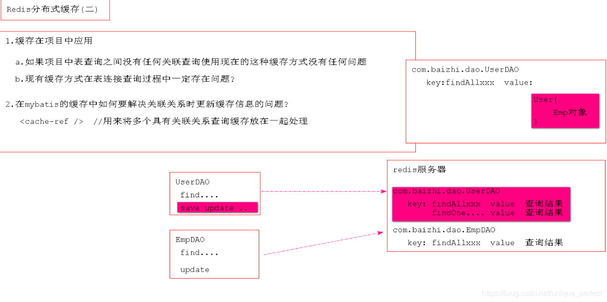


### 缓存击穿(穿透)

> 客户端查询了某个数据库中没有的数据记录，导致缓存在这种情况下无法利用称之为***缓存穿透***或者是***缓存击穿***
> mybatis中cache解决了缓存穿透：将数据库中没有查询到结果也进行缓存
>
> ***应对策略***应该在业务数据分析与预防方面进行，配合运行监控测试与即时调整策略，毕竟单个key的过期监控难度较高，配合雪崩处理策略即可。


### 缓存雪崩

> 在系统运行的某一时刻，突然系统中缓存全部失效，恰好在这一时刻涌来大量客户端请求，导致所有模块缓存无法利用，大量请求涌向数据库导致极端情况，数据库阻塞或挂起
>
> 缓存存储时：业务系统非常大   模块多   业务数据不同
> 不同模块在放入缓存时    ，都会设置一个缓存超时时间
>
> 
>
> ***解决方案***:
>
> 1. 缓存永久存储[不推荐]
> 2. 针对于不同业务数据-定要设置不同超时时间

## Redis主从复制(不建议)

> ***主从复制***架构仅仅用来解决数据的冗余备份，从节点仅仅用来同步数据，不能操作数据
>
> 无法解决:   master节点出现故障的自动故障转移

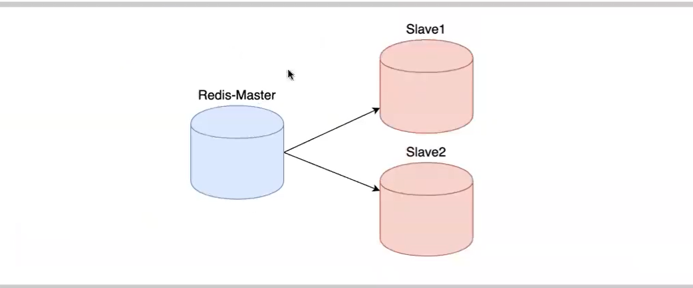

### 搭建主从复制(docker搭建)

将docker文件目录复制三份并命名为：

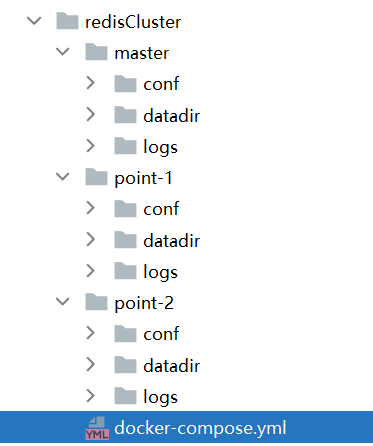

修改redis.conf配置文件

```bash
1.准备3台机器并修改配置redis.conf
master
port 6379
bind 0.0.0.0
如果masterip 为 192.168.47.128,则slaveof masterip masterport 为 slaveof 192.168.47.128 6377


point-1
port 6380
bind 0.0.0.0
slaveof slaveof 192.168.47.128 6379  (高版本 replicaof  masterip masterport )

point-2
port 6381
bind 0.0.0.0
slaveof slaveof 192.168.47.128 6379 (高版本 replicaof  masterip masterport )


```


修改docker-compose文件

```yaml
version: '3'
services:
  redis_master:
    image: redis:5.0.10
    container_name: redis_master
    volumes:
      - ./master/datadir:/data
      - ./master/conf/redis.conf:/usr/local/etc/redis/redis.conf
      - ./master/logs:/logs
    networks:
      - sentinel

    command: redis-server /usr/local/etc/redis/redis.conf
    ports:
      - "6379:6379"
  redis_point_1:
    image: redis:5.0.10
    container_name: redis_point_1
    volumes:
      - ./point-1/datadir:/data
      - ./point-1/conf/redis.conf:/usr/local/etc/redis/redis.conf
      - ./point-1/logs:/logs
    networks:
      - sentinel
    command: redis-server /usr/local/etc/redis/redis.conf
    ports:
      - "6380:6380"
  redis_point_2:
    image: redis:5.0.10
    container_name: redis_point_2
    volumes:
      - ./point-2/datadir:/data
      - ./point-2/conf/redis.conf:/usr/local/etc/redis/redis.conf
      - ./point-2/logs:/logs
    networks:
      - sentinel
    command: redis-server /usr/local/etc/redis/redis.conf
    ports:
      - "6381:6381"
networks:
  sentinel:
```

启动

退回到文件根目录下

 ```bash
docker-compose up
 ```

## Redis哨兵机制*

> ***Sentinel (哨兵)***是Redis 的高可用性解决方案  :  由一个或多个Sentinel实例组成的Sentinel系统可以监视任意多个主服务器，以及这些主服务器属下的所有从服务器，并在被监视的主服务器进入下线状态时，自动将下线主服务器属下的某个从服务器升级为新的主服务器。
>
> 简单的说***哨兵***就是带有自动故障转移功能的主从架构。

> 无法解决: 1.单节点并发压力问题   2.单节点内存和磁盘物理上限

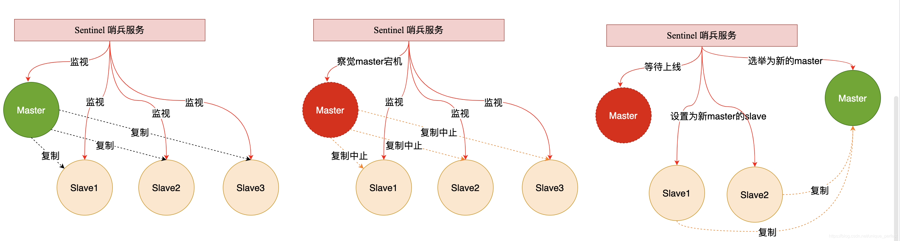

### 搭建环境

在上述的主从复制的条件下  搭建，要修改docker-compose.yml的网桥与上面的一致

1.创建sentinel文件夹存放哨兵文件

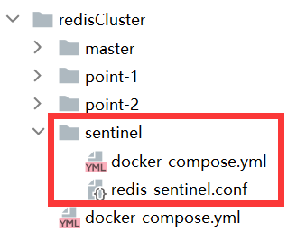

2.redis-sentinel.conf

```properties
# bind 0.0.0.0

# 哨兵的端口号
# 因为各个哨兵节点会运行在单独的Docker容器中
# 所以无需担心端口重复使用
# 如果需要在单机
port 26379

# 设定密码认证
# requirepass 123456

# 配置哨兵的监控参数
# 格式：sentinel monitor <master-name> <ip> <redis-port> <quorum>
# master-name是为这个被监控的master起的名字
# ip是被监控的master的IP或主机名。因为Docker容器之间可以使用容器名访问，所以这里写master节点的容器名
# redis-port是被监控节点所监听的端口号
# quorom设定了当几个哨兵判定这个节点失效后，才认为这个节点真的失效了
sentinel monitor mysentinel 192.168.47.128 6379 1

# 连接主节点的密码
# 格式：sentinel auth-pass <master-name> <password>
# sentinel auth-pass local-master 123456

# master在连续多长时间无法响应PING指令后，就会主观判定节点下线，默认是30秒
# 格式：sentinel down-after-milliseconds <master-name> <milliseconds>
# sentinel down-after-milliseconds local-master 30000
```

3.sentinel的docker-compose配置文件

```yaml
version: '3'
services:
  redis-sentinel:
    image: redis:5.0.10
    container_name: redis-sentinel
    volumes:
      - ./redis-sentinel.conf:/usr/local/etc/redis/redis-sentinel.conf
    ports:
      - "26379:26379"
    networks:
      - sentinel
    command: ["redis-sentinel", "/usr/local/etc/redis/redis-sentinel.conf"]
networks:
  sentinel:
```

4.启动sentinel卫兵

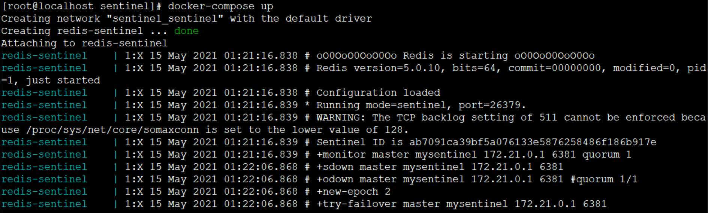

## springboot操作sentinel

```properties

# 设置哨兵模式
# # redis sentinel 配置（这个是启动哨兵机制时的配置）
# master书写是使用哨兵监听的那个名称，比如sentinel monitor mysentinel 192.168.47.128 6379 1
spring.redis.sentinel.master=mysentinel
spring.redis.sentinel.nodes=192.168.47.128:26379

```

***==踩的坑==***

哨兵的配置文件没有开启远程连接，或者docker-compose.yml中没有暴露26379的端口

然后没有删除容器后 ，再重新创建一个...

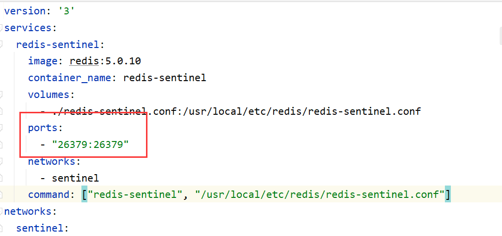

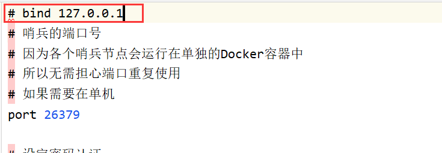

## Redis集群

> Redis在3.0后开始支持***Cluster(集群)***模式，目前redis的集群支持节点的自动发现，支持slave-master选举和容错，支持在线分片(sharding shard )等特性。reshard

### 集群架构图


### 集群细节

所有的redis节点彼此互联(PING-PONG机制)，内部使用二进制协议优化传输速度和带宽。
节点的fail是通过集群中超过半数的节点检测失效时才生效。
客户端与redis节点直连，不需要中间proxy层。客户端不需要连接集群所有节点，连接集群中任何一个可用节点即可
redis-cluster把所有的物理节点映射到[0-16383]slot上，cluster 负责维护node <-> slot <-> value

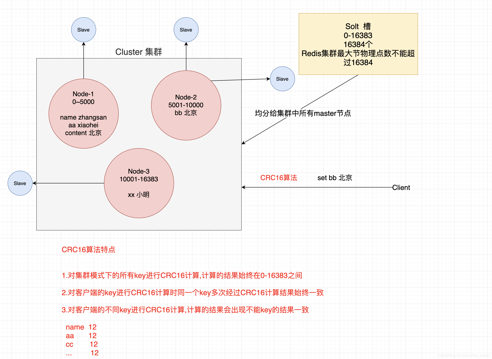

### 集群搭建

> 判断一个是集群中的节点是否可用，是集群中的所用主节点选举过程，如果半数以上的节点认为当前节点挂掉，那么当前节点就是挂掉了，所以搭建redis集群时建议节点数最好为奇数，**搭建集群至少需要三个主节点，三个从节点，至少需要6个节点。

```markdown
1.安装ruby环境
yum install ruby
yum install rubygems
2.安装redis gem
gem install redis 
遇到问题：
[root@localhost ~]# gem install redis
Fetching: redis-4.1.2.gem (100%)
ERROR:  Error installing redis:
redis requires Ruby version >= 2.3.0.

解决方案：先安装rvm，再把ruby版本提升至2.3.0
1.安装curl
yum install curl
2.安装RVM
curl -sSL https://get.rvm.io | bash -s stable
3.安装一个ruby版本
rvm install 2.6.3
可能会报错：执行以下命令
curl -sSL https://rvm.io/mpapis.asc | gpg2 --import -
curl -sSL https://rvm.io/pkuczynski.asc | gpg2 --import -
补充：
1.查看rvm库中已知的ruby版本
rvm list known
2.使用一个ruby版本
rvm use 2.6.3
3.卸载一个已知版本
rvm remove 2.0.0


```

2.在一台机器创建7个目录


```markdown
3.每个目录复制一份配置文件
[root@localhost ~]# cp redis/redis.conf 7000/
[root@localhost ~]# cp redis/redis.conf 7001/
[root@localhost ~]# cp redis/redis.conf 7002/
[root@localhost ~]# cp redis/redis.conf 7003/
[root@localhost ~]# cp redis/redis.conf 7004/
[root@localhost ~]# cp redis/redis.conf 7005/
[root@localhost ~]# cp redi/redis.conf 7006/

```


```markdown
4.修改不同目录配置文件
port 	6379 .....                		 //修改端口
bind  0.0.0.0                   		 //开启远程连接
cluster-enabled  yes 	        			 //开启集群模式
cluster-config-file  nodes-port.conf //集群节点配置文件
cluster-node-timeout  5000      	   //集群节点超时时间
appendonly  yes   		               //开启AOF持久化

5.指定不同目录配置文件启动七个节点
[root@localhost bin]# ./redis-server  /root/7000/redis.conf
[root@localhost bin]# ./redis-server  /root/7001/redis.conf
[root@localhost bin]# ./redis-server  /root/7002/redis.conf
[root@localhost bin]# ./redis-server  /root/7003/redis.conf
[root@localhost bin]# ./redis-server  /root/7004/redis.conf
[root@localhost bin]# ./redis-server  /root/7005/redis.conf
[root@localhost bin]# ./redis-server  /root/7006/redis.conf

```

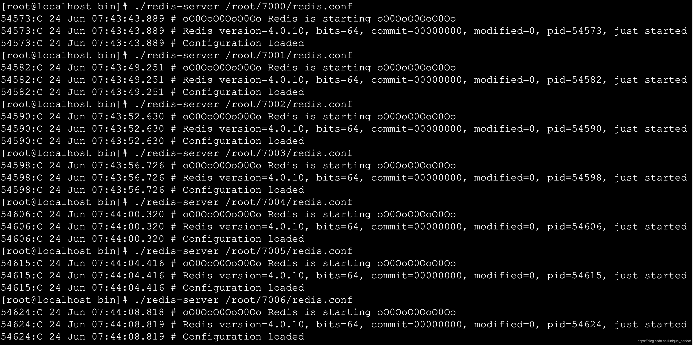

```bash
6.查看进程
[root@localhost bin]# ps aux|grep redis

```

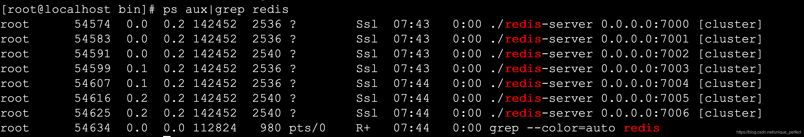

### 创建集群

```bash
1.复制集群操作脚本到bin目录中
[root@localhost bin]# cp /root/redis/src/redis-trib.rb .

2.创建集群
./redis-trib.rb create --replicas 1 192.168.202.205:7000 192.168.202.205:7001 192.168.202.205:7002 192.168.202.205:7003 192.168.202.205:7004 192.168.202.205:7005

```

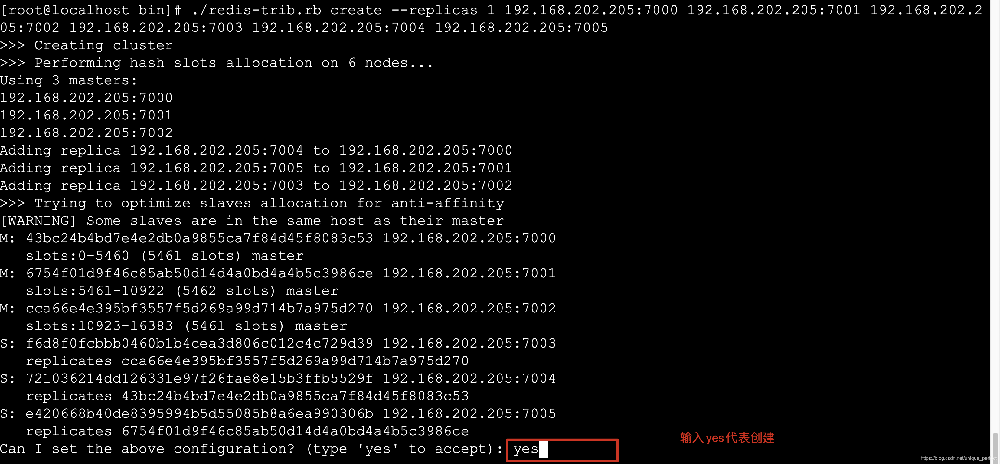

3.集群创建成功出现如下提示

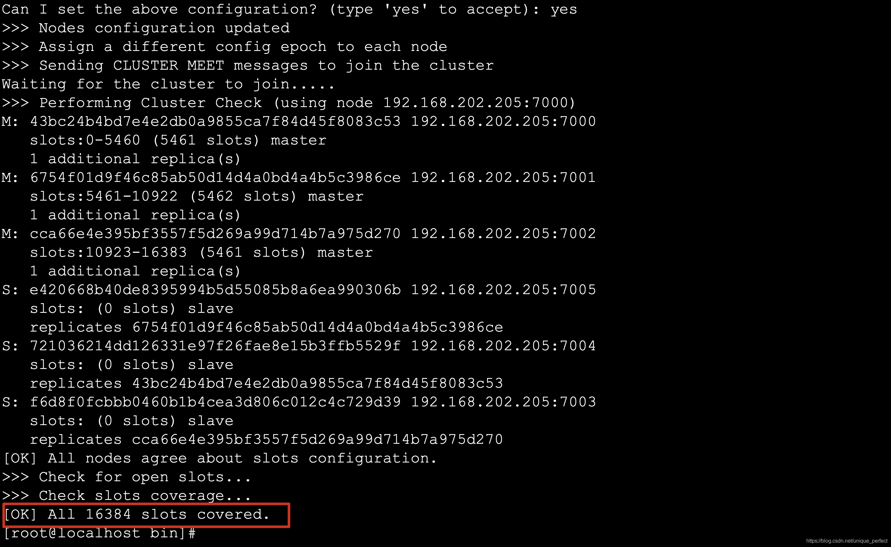

#### 查看集群状态

```markdown
1.查看集群状态 check [原始集群中任意节点]

./redis-trib.rb check 192.168.202.205:7000
2.集群节点状态说明
主节点 
	主节点存在hash slots,且主节点的hash slots 没有交叉
	主节点不能删除
	一个主节点可以有多个从节点
	主节点宕机时多个副本之间自动选举主节点

从节点
	从节点没有hash slots
	从节点可以删除
	从节点不负责数据的写,只负责数据的同步

```

#### 添加主节点

```markdown
1.添加主节点 add-node [新加入节点] [原始集群中任意节点]
 ./redis-trib.rb  add-node 192.168.1.158:7006  192.168.1.158:7005
注意:
	1.该节点必须以集群模式启动
	2.默认情况下该节点就是以master节点形式添加

```

#### 添加从节点

```markdown
1.添加从节点 add-node --slave [新加入节点] [集群中任意节点]
./redis-trib.rb  add-node --slave 192.168.1.158:7006 192.168.1.158:7000
注意:
当添加副本节点时没有指定主节点,redis会随机给副本节点较少的主节点
	
2.为确定的master节点添加主节点 add-node --slave --master-id master节点id [新加入节点] [集群任意节点]
./redis-trib.rb  add-node --slave --master-id 3c3a0c74aae0b56170ccb03a76b60cfe7dc1912e 127.0.0.1:7006  127.0.0.1:7000

```

####  删除副本节点

```markdown
1.删除节点 del-node [集群中任意节点] [删除节点id]
./redis-trib.rb  del-node 127.0.0.1:7002 0ca3f102ecf0c888fc7a7ce43a13e9be9f6d3dd1
注意:
1.被删除的节点必须是从节点或没有被分配hash slots的节点

```

#### 集群在线分片

```markdown
1.在线分片 reshard [集群中任意节点] 
./redis-trib.rb  reshard  192.168.1.158:7000

```

### springboot操作集群

```properties
# redis cluster 操作 书写集群中所有节点
spring.redis.cluster.nodes=192.168.202.206:7000,192.168.202.206:7001,192.168.202.206:7002,192.168.202.206:7003,192.168.202.206:7004,192.168.202.206:7005,192.168.202.206:7006

```

## Redis实现分布式Session管理

> redis的***session管理***是利用spring提供的session管理解决方案,将一个应用session交给Redis存储,整个应用中所有session的请求都会去redis中获取对应的session数据。

 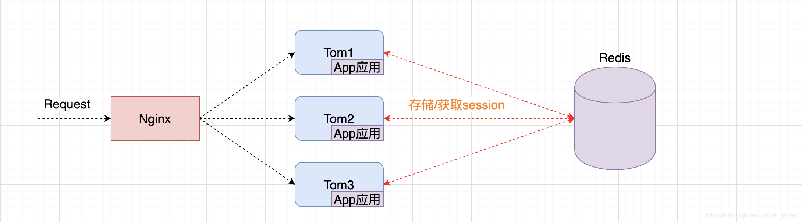

### 开发Session管理

#### 引入依赖

```xml
<dependency>
  <groupId>org.springframework.session</groupId>
  <artifactId>spring-session-data-redis</artifactId>
</dependency>

```

```properties
server.port=8989
server.servlet.context-path=/redissession

# redis cluster
spring.redis.cluster.nodes=192.168.202.206:7000,192.168.202.206:7001,192.168.202.206:7002,192.168.202.206:7003,192.168.202.206:7004,192.168.202.206:7005,192.168.202.206:7006


```

#### 开发Session管理配置类

```java
package com.baizhi.config;

import org.springframework.context.annotation.Configuration;
import org.springframework.session.data.redis.config.annotation.web.http.EnableRedisHttpSession;

@Configuration
@EnableRedisHttpSession  //将整个应用中使用session的数据全部交给redis处理
public class RedisSessionManager {
}

```

#### controller

```java
package com.baizhi.controller;

import org.springframework.stereotype.Controller;
import org.springframework.web.bind.annotation.RequestMapping;

import javax.servlet.http.HttpServletRequest;
import javax.servlet.http.HttpServletResponse;
import java.io.IOException;
import java.util.ArrayList;
import java.util.List;

@Controller
@RequestMapping("test")
public class TestController {


    // redis  session   list    1

    // jvm  list 地址    list.add   list.size  2

    //使用redis 的session管理  注意:当session中数据发生变化时必须将session中变化的数据同步到redis中

    @RequestMapping("test")
    public void test(HttpServletRequest request, HttpServletResponse response) throws IOException {


        List<String> list = (List<String>) request.getSession().getAttribute("list");
        if(list==null){
            list = new ArrayList<>();
        }
        list.add("xxxx");
        request.getSession().setAttribute("list",list);//每次session变化都要同步session
        response.getWriter().println("size: "+list.size());
        response.getWriter().println("sessionid: "+request.getSession().getId());

    }


    @RequestMapping("logout")
    public void logout(HttpServletRequest request){
        //退出登录
        request.getSession().invalidate();//失效
    }
}


```

