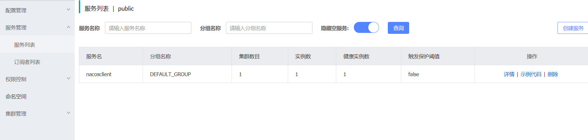
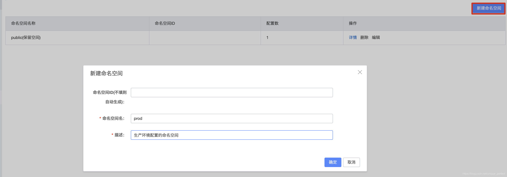
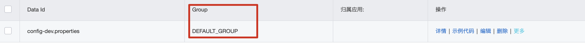
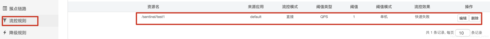

# 1、简介

多端口：-Dserver.port=8092

```markdown
https://spring.io/projects/spring-cloud-alibaba

- 阿里云为分布式应用开发提供了一站式解决方案。它包含了开发分布式应用程序所需的所有组件，使您可以轻松地使用springcloud开发应用程序。
- 有了阿里云，你只需要添加一些注解和少量的配置，就可以将Spring云应用连接到阿里的分布式解决方案上，用阿里中间件搭建一个分布式应用系统。

```

# 2、环境搭建

```xml
<!--定义springcloud版本-->
<properties>
  <spring.cloud.alibaba.version>2.2.1.RELEASE</spring.cloud.alibaba.version>
</properties>

<!--全局引入springcloudalibaba下载依赖地址,并不会引入依赖-->
<dependencyManagement>
  <dependencies>
    <dependency>
      <groupId>com.alibaba.cloud</groupId>
      <artifactId>spring-cloud-alibaba-dependencies</artifactId>
      <version>${spring.cloud.alibaba.version}</version>
      <type>pom</type>
      <scope>import</scope>
    </dependency>
  </dependencies>
</dependencyManagement>

```

# 3、Nacos

##  什么是Nacos 


> https://nacos.io/zh-cn/index.html
> Nacos 致力于帮助您发现、配置和管理微服务。Nacos 提供了一组简单易用的特性集，帮助您快速实现动态服务发现、服务配置、服务元数据及流量管理。

`总结` : Nacos就是微服务架构中服务注册中心以及统一配置中心,用来替换原来的(eureka,consul)以及config组件

```markdown
1 准备环境

64 bit OS，支持 Linux/Unix/Mac/Windows，推荐选用 Linux/Unix/Mac。
64 bit JDK 1.8+；下载 & 配置。
Maven 3.2.x+；下载 & 配置。

2 下载nacos [本次课程版本:][1.3.0版本]
https://github.com/alibaba/nacos/releases 

3 解压缩安装包到指定位置
bin  			启动nacos服务的脚本目录
conf 			nacos的配置文件目录
target 		nacos的启动依赖存放目录
data		  nacos启动成功后保存数据的目录

```

> 4、启动nacos

```markdown
linux/unix/mac启动
打开终端进入nacos的bin目录执行如下命令 
./startup.sh -m standalone

windows启动
在 cmd中 
执行 startup.cmd -m standalone 或者双击startup.cmd运行文件。

```


```markdown
 访问nacos的web服务管理界面
http://localhost:8848/nacos/
用户名 和 密码都是nacos

```


## 开发服务注册到nacos

> 导入依赖(springboot-web也要)

```xml
<!--引入nacos client的依赖-->
<dependency>
    <groupId>com.alibaba.cloud</groupId>
    <artifactId>spring-cloud-starter-alibaba-nacos-discovery</artifactId>
</dependency>

```

>  配置注册地址

```properties
server.port=8789   # 指定当前服务端口
spring.application.name=nacosclient    # 指定服务名称
spring.cloud.nacos.server-addr=localhost:8848	 # 指定nacos服务地址,linux为Linux地址
spring.cloud.nacos.discovery.server-addr=${spring.cloud.nacos.server-addr}  # 指定注册中心地址							
management.endpoints.web.exposure.include=*			# 暴露所有web端点

```

>  加入启动服务注册注解 [注意:][新版本之后这步可以省略不写]


> 服务列表查看




## 服务间通信

​	**`openFeign`组件**:  与springcloud中的OpenFeign组件用法一致

> 要先导入springcloud的版本依赖

```xml
<properties>
    <spring.cloud-version>Hoxton.SR8</spring.cloud-version>
</properties>


//springcloud的版本管理
<!--全局管理springcloud版本,并不会引入具体依赖-->
<dependencyManagement>
    <dependencies>
        <dependency>
            <groupId>org.springframework.cloud</groupId>
            <artifactId>spring-cloud-dependencies</artifactId>
            <version>${spring.cloud-version}</version>
            <type>pom</type>
            <scope>import</scope>
        </dependency>
    </dependencies>
</dependencyManagement>
```

> 创建一个客户端调用接口

```java
//调用商品服务的组件
@FeignClient("products")   //标识该接口是一个feign组件   value为调用服务的  id
public interface ProductClient {
    @GetMapping("/product/showMsg")  //服务中具体方法的名称保持一致
     String findAll();
}
```

> 使用feignClient客户端对象调用服务

```java
@RestController
public class FeignController {
    @Autowired
    private ProductClient productClient;   //注入客户端组件

    @GetMapping("/feign/test")
    public String test(){
        String str = productClient.findAll();
        return "feign调用方法======》"+str;
    }
}
```

## nacos配置中心

`遇到的问题`: 重复拉取远端的配置   ====》重启nacos服务

**开启此服务代表配置一律拉取远端的，需要先配置远端的，本地的配置失效！！！**

> 1 创建项目并引入nacons配置中心依赖

```xml
<!--引入nacos client依赖-->
<dependency>
  <groupId>com.alibaba.cloud</groupId>
  <artifactId>spring-cloud-starter-alibaba-nacos-discovery</artifactId>
</dependency>

<!--引入nacos config 依赖-->
<dependency>
  <groupId>com.alibaba.cloud</groupId>
  <artifactId>spring-cloud-starter-alibaba-nacos-config</artifactId>
</dependency>

```

> 2 配置nacos配置中心地址

```properties
# 远程配置中心的地址
spring.cloud.nacos.config.server-addr=192.168.47.128:8848
# nacos服务注册中心的地址
spring.cloud.nacos.server-addr=${spring.cloud.nacos.config.server-addr}
# 读取配置的分组
spring.cloud.nacos.config.group=DEFAULT_GROUP

# 指定读取文件的前缀
spring.application.name=configclient

# 指定读取文件的具体环境
spring.profiles.active=prod

# 指定读取文件后缀
spring.cloud.nacos.config.file-extension=properties


```

> 3 远端nacos配置


## 配置详解

```markdown
# 1 DataId
用来读取远程配置中心的中具体配置文件其完整格式如下:
${prefix}-${spring.profile.active}.${file-extension}
	a. prefix 默认为 spring.application.name 的值，也可以通过配置项 spring.cloud.nacos.config.prefix来配置。
	
	b. spring.profile.active 即为当前环境对应的 profile，详情可以参考 Spring Boot文档。 注意：当 spring.profile.active 为空时，对应的连接符 - 也将不存在，dataId 的拼接格式变成 ${prefix}.${file-extension}
	
	c. file-exetension 为配置内容的数据格式，可以通过配置项 spring.cloud.nacos.config.file-extension 来配置。目前只支持 properties 和 yaml 类型。
	


```

```markdown
# 2 命名空间(namespace)
https://github.com/alibaba/spring-cloud-alibaba/wiki/Nacos-config
namespace命名空间是nacos针对于企业级开发设计用来针对于不同环境的区分,比如正在企业开发时有测试环境,生产环境,等其他环境,因此为了保证不同环境配置实现隔离,提出了namespace的概念,默认在nacos中存在一个public命名空间所有配置在没有指定命名空间时都在这个命名空间中获取配置,在实际开发时可以针对于不能环境创建不同的namespace空间。默认空间不能删除!


```

>  **创建其他命名空间**
> 每个命名空间都有一个唯一id,这个id是读取配置时指定空间的唯一标识




>  在配置列表查看空间


> 在指定空间下载创建配置文件


> 项目中使用命名空间指定配置
>
> ```properties
> # 指定读取的命名空间下的文件,不指定为默认的public空间
> ```


> 测试配置


```markdown
# 3. 配置分组(group)
配置分组是对配置集进行分组，通过一个有意义的字符串（如 Buy 或 Trade ）来表示，不同的配置分组下可以有相同的配置集（Data ID）。当您在 Nacos 上创建一个配置时，如果未填写配置分组的名称，则配置分组的名称默认采用 DEFAULT_GROUP 。配置分组的常见场景：可用于区分不同的项目或应用，例如：学生管理系统的配置集可以定义一个group为：STUDENT_GROUP。

```




> 读取不同分组的配置


## 配置的自动刷新


> 自动刷新
> 默认情况下nacos已经实现了自动配置刷新功能,如果需要刷新配置直接在控制器中加入@RefreshScope注解即可

```java
@RestController
@RefreshScope  //该注解可实现自动刷新配置
public class UserController {
    @Value("${user.name}")
    private String name;

    @GetMapping("/user/getName")
    public String getName(){
        return "当前的用户名："+name;
    }
}

```

> 远端的config

```properties
server.port=8089
spring.cloud.nacos.discovery.server-addr=${spring.cloud.nacos.server-addr}
user.name=zhangsan123
```

## sentinel 流量卫兵

## 什么是sentinel

```markdown
# 1 说明
https://spring-cloud-alibaba-group.github.io/github-pages/hoxton/en-us/index.html#_how_to_use_sentinel
https://github.com/alibaba/Sentinel/wiki

翻译:随着微服务的普及，服务调用的稳定性变得越来越重要。Sentinel以“流量”为突破口，在流量控制、断路、负载保护等多个领域进行工作，保障服务可靠性。
通俗:用来在微服务系统中保护微服务对的作用 如何 服务雪崩 服务熔断  服务降级 就是用来替换hystrix

# 2 特性
丰富的应用场景：Sentinel 承接了阿里巴巴近 10 年的双十一大促流量的核心场景，例如秒杀（即突发流量控制在系统容量可以承受的范围）、消息削峰填谷、集群流量控制、实时熔断下游不可用应用等。

完备的实时监控：Sentinel 同时提供实时的监控功能。您可以在控制台中看到接入应用的单台机器秒级数据，甚至 500 台以下规模的集群的汇总运行情况。

广泛的开源生态：Sentinel 提供开箱即用的与其它开源框架/库的整合模块，例如与 Spring Cloud、Dubbo、gRPC 的整合。您只需要引入相应的依赖并进行简单的配置即可快速地接入 Sentinel。

```


## sentinel使用

> sentinel提供了两个服务组件：
> 一个是 sentinel 用来实现微服务系统中服务熔断、降级等功能。这点和hystrix 类似
> 一个是 sentinel dashboard 用来监控微服务系统中流量调用等情况。这点和hystrix 类似

###  sentinel dashboard的安装

```markdown
# 1 下载
https://github.com/alibaba/Sentinel/releases

```


```markdown
# 2 启动
仪表盘是个jar包可以直接通过java命令启动 如: java -jar 方式运行 默认端口为 8080
java -Dserver.port=9191 -jar  sentinel-dashboard-1.7.2.jar

```


```markdown
# 3 访问web界面
http://localhost:9191/#/login

```

```markdown
4 登录
用户名&密码: sentinel

```

### sentinel 实时监控服务

> 创建项目  导入依赖

```xml
<!--引入nacos client依赖-->
<dependency>
  <groupId>com.alibaba.cloud</groupId>
  <artifactId>spring-cloud-starter-alibaba-nacos-discovery</artifactId>
</dependency>

<!--引入sentinel依赖-->
<dependency>
    <groupId>com.alibaba.cloud</groupId>
    <artifactId>spring-cloud-starter-alibaba-sentinel</artifactId>
</dependency>

```

> 配置sentinel

```properties
server.port=8789
spring.application.name=nacosclient
spring.cloud.nacos.server-addr=localhost:8848
spring.cloud.nacos.discovery.server-addr=${spring.cloud.nacos.server-addr}
 
 # 开启sentinel 默认开启
spring.cloud.sentinel.enabled=true
# 连接dashboard
spring.cloud.sentinel.transport.dashboard=192.168.47.128:9090
# 与dashboard通信的端口
spring.cloud.sentinel.transport.port=8719
```

```markdown
# 访问dashboard界面查看服务监控
发现界面什么都没有? 
默认情况下sentiel为延迟加载,不会在启动之后立即创建服务监控,需要对服务进行调用时才会初始化

```


### sentinel 流量控制

```markdown
# 1 说明
流量控制（flow control），其原理是监控应用流量的 QPS 或并发线程数等指标，当达到指定的阈值时对流量进行控制，以避免被瞬时的流量高峰冲垮，从而保障应用的高可用性。

同一个资源可以创建多条限流规则。FlowSlot 会对该资源的所有限流规则依次遍历，直到有规则触发限流或者所有规则遍历完毕。

一条限流规则主要由下面几个因素组成，我们可以组合这些元素来实现不同的限流效果：
`resource`：资源名，即限流规则的作用对象，服务调用的路径
`count`: 限流阈值
`grade`: 限流阈值类型（QPS 或并发线程数）
`limitApp`: 流控针对的调用来源，若为 default 则不区分调用来源
`strategy`: 调用关系限流策略
`controlBehavior`: 流量控制效果（直接拒绝、Warm Up、匀速排队）

流量控制主要有两种统计类型，一种是统计并发线程数，另外一种则是统计 QPS
更多细节参见官网:https://github.com/alibaba/Sentinel/wiki/%E6%B5%81%E9%87%8F%E6%8E%A7%E5%88%B6

```

#### QPS限流




>  2 测试
> 每秒只能最大接收1个请求,超过1个报错


#### 线程数限流

限制并发访问的进程数


#### 流控模式

> 说明
> `直接`:标识流量控制规则到达阈值直接触发流量控制
> `关联`: 当两个资源之间具有资源争抢或者依赖关系的时候，这两个资源便具有了关联。比如对数据库同一个字段的读操作和写操作存在争抢，读的速度过高会影响写得速度，写的速度过高会影响读的速度。如果放任读写操作争抢资源，则争抢本身带来的开销会降低整体的吞吐量。可使用关联限流来避免具有关联关系的资源之间过度的争抢，举例来说，read_db 和 write_db 这两个资源分别代表数据库读写，我们可以给 read_db 设置限流规则来达到写优先的目的：设置 strategy 为 RuleConstant.STRATEGY_RELATE 同时设置 refResource 为 write_db。这样当写库操作过于频繁时，读数据的请求会被限流。


> `链路限流`: https://github.com/alibaba/Sentinel/wiki/%E6%B5%81%E9%87%8F%E6%8E%A7%E5%88%B6

#### 流控效果

```markdown
`直接拒绝`:（RuleConstant.CONTROL_BEHAVIOR_DEFAULT）方式是默认的流量控制方式，当QPS超过任意规则的阈值后，新的请求就会被立即拒绝，拒绝方式为抛出FlowException。

`Warm Up`:（RuleConstant.CONTROL_BEHAVIOR_WARM_UP）方式，即预热/冷启动方式。当系统长期处于低水位的情况下，当流量突然增加时，直接把系统拉升到高水位可能瞬间把系统压垮。通过"冷启动"，让通过的流量缓慢增加，在一定时间内逐渐增加到阈值上限，给冷系统一个预热的时间，避免冷系统被压垮。
	`更多`:https://github.com/alibaba/Sentinel/wiki/%E9%99%90%E6%B5%81---%E5%86%B7%E5%90%AF%E5%8A%A8
	
	
`匀速排队`:(RuleConstant.CONTROL_BEHAVIOR_RATE_LIMITER）方式会严格控制请求通过的间隔时间，也即是让请求以均匀的速度通过，对应的是漏桶算法。 只能对请求进行排队等待

更多:https://github.com/alibaba/Sentinel/wiki/%E6%B5%81%E9%87%8F%E6%8E%A7%E5%88%B6-%E5%8C%80%E9%80%9F%E6%8E%92%E9%98%9F%E6%A8%A1%E5%BC%8F

```

### 熔断降级

```markdown
# 1 说明
https://github.com/alibaba/Sentinel/wiki/%E7%86%94%E6%96%AD%E9%99%8D%E7%BA%A7
除了流量控制以外，对调用链路中不稳定的资源进行熔断降级也是保障高可用的重要措施之一。由于调用关系的复杂性，如果调用链路中的某个资源不稳定，最终会导致请求发生堆积。Sentinel 熔断降级会在调用链路中某个资源出现不稳定状态时（例如调用超时或异常比例升高），对这个资源的调用进行限制，让请求快速失败，避免影响到其它的资源而导致级联错误。当资源被降级后，在接下来的降级时间窗口之内，对该资源的调用都自动熔断（默认行为是抛出 DegradeException）。

```

> ##### 降级策略


1. `平均响应时间 `(DEGRADE_GRADE_RT)：当 1s 内持续进入 N 个请求，对应时刻的平均响应时间（秒级）均超过阈值（count，以 ms 为单位），那么在接下的时间窗口（DegradeRule 中的 timeWindow，以 s 为单位）之内，对这个方法的调用都会自动地熔断（抛出 DegradeException）。注意 Sentinel 默认统计的 RT 上限是 4900 ms，超出此阈值的都会算作 4900 ms，若需要变更此上限可以通过启动配置项 -Dcsp.sentinel.statistic.max.rt=xxx 来配置。

   

2. `异常比例` (DEGRADE_GRADE_EXCEPTION_RATIO)：当资源的每秒请求量 >= N（可配置），并且每秒异常总数占通过量的比值超过阈值（DegradeRule 中的 count）之后，资源进入降级状态，即在接下的时间窗口（DegradeRule 中的 timeWindow，以 s 为单位）之内，对这个方法的调用都会自动地返回。异常比率的阈值范围是 [0.0, 1.0]，代表 0% - 100%。


3. `异常数 `(DEGRADE_GRADE_EXCEPTION_COUNT)：当资源近 1 分钟的异常数目超过阈值之后会进行熔断。注意由于统计时间窗口是分钟级别的，若 timeWindow 小于 60s，则结束熔断状态后仍可能再进入熔断状态。

   

### @SentinelResource注解

> 1 说明
> https://github.com/alibaba/Sentinel/wiki/%E6%B3%A8%E8%A7%A3%E6%94%AF%E6%8C%81

> 注意：注解方式埋点不支持 private 方法。

`@SentinelResource` 用于定义资源，并提供可选的异常处理和 fallback 配置项。 `@SentinelResource` 注解包含以下属性：

- `value`：资源名称，必需项（不能为空）

- `entryType`：entry 类型，可选项（默认为 `EntryType.OUT`）

- `blockHandler` / `blockHandlerClass`: `blockHandler` 对应处理 `BlockException` 的函数名称，可选项。blockHandler 函数访问范围需要是 `public`，返回类型需要与原方法相匹配，参数类型需要和原方法相匹配并且最后加一个额外的参数，类型为 `BlockException`。blockHandler 函数默认需要和原方法在同一个类中。若希望使用其他类的函数，则可以指定 `blockHandlerClass` 为对应的类的 `Class` 对象，注意对应的函数必需为 static 函数，否则无法解析。

- ```
  `fallback/fallbackClass`
  ```

  ：fallback 函数名称，可选项，用于在抛出异常的时候提供 fallback 处理逻辑。fallback 函数可以针对所有类型的异常（除了`exceptionsToIgnore`里面排除掉的异常类型）进行处理。fallback 函数签名和位置要求：

  - 返回值类型必须与原函数返回值类型一致；
  - 方法参数列表需要和原函数一致，或者可以额外多一个 `Throwable` 类型的参数用于接收对应的异常。
  - fallback 函数默认需要和原方法在同一个类中。若希望使用其他类的函数，则可以指定 `fallbackClass` 为对应的类的 `Class` 对象，注意对应的函数必需为 static 函数，否则无法解析。

- ```
  defaultFallback（since 1.6.0）：
  ```

  默认的 fallback 函数名称，可选项，通常用于通用的 fallback 逻辑（即可以用于很多服务或方法）。默认 fallback 函数可以针对所有类型的异常（除了`exceptionsToIgnore` 

  里面排除掉的异常类型）进行处理。若同时配置了 fallback 和 defaultFallback，则只有 fallback 会生效。defaultFallback 函数签名要求：

  - 返回值类型必须与原函数返回值类型一致；
  - 方法参数列表需要为空，或者可以额外多一个 `Throwable` 类型的参数用于接收对应的异常。
  - defaultFallback 函数默认需要和原方法在同一个类中。若希望使用其他类的函数，则可以指定 `fallbackClass` 为对应的类的 `Class` 对象，注意对应的函数必需为 static 函数，否则无法解析。

- `exceptionsToIgnore`（since 1.6.0）：用于指定哪些异常被排除掉，不会计入异常统计中，也不会进入 fallback 逻辑中，而是会原样抛出。

1.8.0 版本开始，`defaultFallback` 支持在类级别进行配置。

> 注：1.6.0 之前的版本 fallback 函数只针对降级异常（`DegradeException`）进行处理，**不能针对业务异常进行处理**。

特别地，若 blockHandler 和 fallback 都进行了配置，则被限流降级而抛出 `BlockException` 时只会进入 `blockHandler` 处理逻辑。若未配置 `blockHandler`、`fallback` 和 `defaultFallback`，则被限流降级时会将 `BlockException` **直接抛出**（若方法本身未定义 throws BlockException 则会被 JVM 包装一层 `UndeclaredThrowableException`）。


**例子**

```java
package com.me.controller;

import com.alibaba.csp.sentinel.annotation.SentinelResource;
import com.alibaba.csp.sentinel.slots.block.BlockException;
import com.alibaba.csp.sentinel.slots.block.degrade.DegradeException;
import com.alibaba.csp.sentinel.slots.block.flow.FlowException;
import com.me.client.Productclient;
import org.springframework.beans.factory.annotation.Autowired;
import org.springframework.beans.factory.annotation.Value;
import org.springframework.web.bind.annotation.GetMapping;
import org.springframework.web.bind.annotation.RestController;

import java.util.HashMap;
import java.util.Map;

@RestController
public class UserController {
    @Autowired
    private Productclient productclient;
    @Value("${server.port}")
    private int port;

    @GetMapping("/user/findAll")
    @SentinelResource(value = "/user/findAll",blockHandler = "findAllblockHandler",fallback = "findAllfallback")
    
    //value 为调用sentinel端的资源名
    public Map<String,Object> findAll(){
        //调用商品端的服务
        Map<String, Object> map = productclient.findAll();
        map.put("str","user端服务");
        map.put("port",port);
        return map;
    }
    //处理降级 | 流控异常的自定义方法
    public Map<String,Object> findAllblockHandler(BlockException blockException){
        Map<String, Object> map = new HashMap<>();
        if (blockException instanceof FlowException){
            map.put("str","当前服务已被限流！"+blockException.getClass().getName());
        }
        if (blockException instanceof DegradeException){
            map.put("str","当前服务已被降级！"+blockException.getClass().getName());
        }
        return map;
    }
    
    //处理抛出的异常
    public Map<String,Object> findAllfallback(){
        Map<String, Object> map = new HashMap<>();
        map.put("str","product端未启动，请稍后重试");
         return map;
    }
}

```

# 4、结束

