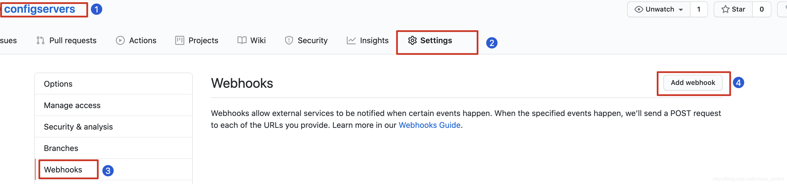

# 1、什么是微服务

● 官方定义:  微服务就是由一系列围绕自己业务开发的微小服务构成,他们独立部署运行在自己的进程里,基于分布式的管理

● 通俗定义:  微服务是-种架构，这种架构是将单个的整体应用程序分割成更小的项目关联的独立的服务。一个服务通常实现一组独立的特性或功能，包含自己的业务逻辑和适配器。各个微服务之间的关联通过暴露api来实现。这些独立的微服务不需要部署在同一个虚拟机，同一个系统和同一个应用服务器中。

# 2、为什么是微服务

## 单体应用


```markdown
# 1.优点 
- 单一架构模式在项目初期很小的时候开发方便，测试方便，部署方便，运行良好。
# 2.缺点
- 应用随着时间的推进，加入的功能越来越多，最终会变得巨大，-个项目中很有可能数百万行的代码，互相之间繁琐的jar包。
- 久而久之，开发效率低，代码维护困难
- 还有一个如果想整体应用采用新的技术，新的框架或者语言，那是不可能的。
- 任意模块的漏洞或者错误都会影响这个应用，降低系统的可靠性
```

## 微服务架构应用


```markdown
# 1.优点
- 将服务拆分成多个单- 职责的小的服务，进行单独部署，服务之间通过网络进行通信
- 每个服务应该有自己单独的管理团队，高度自治
- 服务各自有自己单独的职责，服务之间松耦合，避免因-个模块的问题导致服务崩溃
# 2.缺点
- 开发人员要处理分布式系统的复杂性
- 多服务运维难度，随着服务的增加，运维的压力也在增大
- 服务治理和服务监控关键
```

## 架构的演变

```markdown
# 1.架构的演变过程
- [单一应用架构]===> [垂直应用架构]===> [分布式服务架构] ===> [流动计算架构]|| [微服务架构] ===> [未知]
```

# 3、微服务的解决方案


```markdown
# Spring Cloud:
- Spring Cloud NetFlix
   基于美国Netflix公司开源的组件进行封装,提供了微服务一栈式的解决方案。
- Spring Cloud alibaba  
   在Spring cloud netflix基础 上封装了阿里巴巴的微服务解决方案。
- Spring Cloud Spring   
   目前spring官方趋势正在逐渐吸收Netflix组件的精华,并在此基础进行二次封装优化,打造spring专有的解决方案
```


# 4、什么是springcloud

## 官方

```markdown
# 通俗理解
- springcloud是一 个含概多个子项目的开发工具集，集合了众多的开源框架，他利用了Spring Boot开发的便利性实现了很多功能,如服务注册，服务注册发现，负载均衡等. Spr ingCloud在整合过程中主要是针对Netflix (耐非)开源组件的封装. Spr ingCloud的出现真正的简化了分布式架构的开发。
- NetFlix是美国的一个在线视频网站,微服务业的翘楚,他是公认的大规模生产级微服务的杰出实践者NetFlix的开源组件已经在他大规模分布式微服务环境中经过多年的生产实战验证，因此Spring Cloud中很多组件都是基于NetFlix组件的封装。

# 微服务架构下所存在问题?
- 基于独立业务拆分成一个微小的服务   每个服务独立部署运行在自己的进程里面  服务之间使用http rest的方式进行通信
- 单体应用分类模块 视频模块用户模块  产生  测试  前端pc app 统一 入口localhost :8989
- 微服务架构应用分类服务 8080视频服务 8081用户服务 8082 8083  。。。


- 问题
   1.要有个组件帮助我们记录服务,监控服务,服务发现服务注册和发现组件 注册中心
   2.服务调用问题http rest方式调用  ---如何调用?服务调用时如何实现服务负载均衡?
   3.服务雪崩效应?
   4.服务配置文件管理?
   5.网关组件?
```

## 核心架构及其组件

```markdown
 # 1.核心组件说明
 - eurekaserver. consul、nacos 服务注册中心组件
 - rabbion & openfeign  服务负载均衡和服务调用组件
 - hystrix & hystrix dashboard 服务断路器和服务 监控组件
 - zuu1、gateway 服务网关组件
 - config  统一配置中心组件
 - bus 消息总线组件
 ...
```


# 5、环境搭建

## 版本命名

```markdown
# 1.翻译
- springcloud 版本管理方式:命名方式 Angel. SRI~6
- springcloud是一 个由众 多独立子项目组成的大型综合项目，原则每个子项目上有不同的发布节奏，都维护自己发布版本号。为了更好的管理springcloud的版本，通过一个资源清单BOM(Bil1 of Materials) ，为避免与子项目的发布号混淆，所以没有采用版本号的方式，而是通过命名的方式。这些名字是按字母顺序排列的。如伦敦地铁站的名称("天使”是第一个版本， "布里斯顿”是第二个版本， "卡姆登”是第三个版本)。当单个项目的点发布累积到一个临界量，或者其中一个项目中有-一个关键缺陷需要每个人都可以使用时，发布序列将推出名称以”. SRX"结尾的“服务发布"，其中“X"是一个数字。
# 2.伦敦地铁站名称[ 了解]
- Angel、Brixton、Camden、 Dalston、 Edgware、 Finchley、 Greenwich、 Hoxton

```

## 版本选择

```markdown
# 1.版本选择官方建议https://spring. io/projects/spring-cloud
- Angel
版本基于spr ingboot1.2 . x版本构建与1.3版本不兼容
- Brixton
版本基于spr ingboot1.3. x版本构建与1.2版本不兼容
” 2017年Brixton and Angel release官方宣布报废
- Camden
版本基于springboot1.4. x版本构建并在1. 5版本通过测试
、201 8年Camden release官 方宣布报废
- Dalston、 Edgware
版本基于springboot1.5. x版本构建目前不能再spr ingboot2.0. x版本中使用
、Dalston(达尔斯顿)将于2018年12月官方宣布报废。Edgware将遵循Spring Boot 1.5. x的生命周期结束。
Finchley
版本基于springboot2.0. x版本进行构建，不能兼容1. x版本
- Greenwich
版本基于spr ingboot2.1. x版本进行构建，不能兼容1. x版本
- Hoxton
版本基于spr ingboot2.2. x版本进行构建

```


## **导入springcloud的环境管理**

```xml
<properties>
    <spring.cloud-version>Hoxton.SR8</spring.cloud-version>
</properties>


//springcloud的版本管理
<!--全局 管理springcloud版本,并不会引入具体依赖-->
<dependencyManagement>
    <dependencies>
        <dependency>
            <groupId>org.springframework.cloud</groupId>
            <artifactId>spring-cloud-dependencies</artifactId>
            <version>${spring.cloud-version}</version>
            <type>pom</type>
            <scope>import</scope>
        </dependency>
    </dependencies>
</dependencyManagement>
```

# 6、服务注册中心

> 所谓   **服务注册中心**    就是在整个的微服务架构中单独提出一个服务,这个服务不完成系统的任何的业务功能，仅仅用来完成对整个微服务系统的服务注册和服务发现，以及对服务健康状态的监控和管理功能。


```markdown
# 1.服务注册中心
可以对所有的微服务的信息进行存储，如微服务的名称、IP、端口等
- 可以在进行服务调用时通过服务发现查询可用的微服务列表及网络地址进行服务调用
- 可以对所有的微服务进行心跳检测，如发现某实例长时间无法访问，就会从服务注册表移除该实例。

```

## 常用的注册中心

> springcloud支持的多种注册中心Eureka(netflix)、Consul、 Zookeeper、 以及阿里巴巴推出Nacos组件。这些注册中心在本质上都是用来管理服务的注册和发现以及服务状态的检查的。

## 1、Eureka

过时(1.0版本还有公司在用)

## 2、Consul

```markdown
# 0.consul 简介
- https://www.consul.io
- consul是一 个可以提供服务发现，健康检查，多数据中心Key /Value存储等功能的分布式服务框架，用于实现分布式系统的服务发现与配置。与其他分布式服务注册与发现的方案，使用起来也较为简单。Consu1用Golang实现，因此具有天然可移植性(支持Linux、Windows和Mac0S X);安装包仅包含一个可执行文件，方便部署。

```


### 安装和启动服务器端

官网下载consul    https://www.consul.io

解压，cmd运行   consul.exe agent -dev

访问  localhost:8500   进入主页

### 开发consul客户端（微服务）

> 创建项目并引入客户端相关依赖

```xml
<!--引入consul依赖-->
<dependency>
   <groupId>org.springframework.cloud</groupId>
     <artifactId> spring-cloud-starter-consul-discovery</ artifactId>
</dependency> 

```


> 健康检查依赖

```xml
<!--
注意:必须引入健康检查依赖，如果没有引入这个依赖,及时服务可用
但是在consul服务注册中获取不到服务状态, consul注册中心始终认为不可用
-->
     <!--  健康检查的包-->
        <dependency>
            <groupId>org.springframework.boot</groupId>
            <artifactId> spring-boot-starter-actuator</artifactId>
        </dependency>
```

> 编写properties相关配置

```properties
server.port=8889
spring.application.name=consulclient8889
# 注册consul服务的主机
spring.cloud.consul.host=localhost
 # 注册consu1服务的端口号
spring.cloud.consul.port=8500                  
#关闭consu了服务的健康检查[不推荐]
# spring.cloud.consul.discovery.register-health-check=false

#指定 注册的服务名称默认就是应用名（可不写，写了就是取别名）
# spring.cloud.consul.discovery.service-name=${spring.application.name} 

```


## 不同注册中心的区别

```markdown
# 1.CAP定理
 - CAP定理: CAP定理又称CAP原则，指的是在一个分布式系统中，一 致性 (Consistency) 、可用性(Availability) 、 分区容错性(Partition tolerance) 。CAP原则指的是，这三个要素最多只能同时实现两点，不可能三者兼顾。
i一致性(C) :在分布式系统中的所有数据备份，在同一时刻是否同样的值。(等同于所有 节点访问同一份最新的数据副本)
可用性(A) :在集群中一部分节点故障后，集群整体是否还能响应客户端的读写请求。 (对数据更新具备高可用性)
分区容忍性(P)：就是高可用性，一个节点崩了，并不影响其它的节点(100个节点，挂了几个，不影响服务，越多机器越好)

# 2.Eureka特点
- Eureka中没有使用任何的数据强- 致性算 法保证不同集群间的Server的数据一致， 仅通过数据拷贝的方式争取注册中心数据的最终-致性，虽然放弃数据强一致性但是换来了Server的可用性，降低了注册的代价，提高了集群运行的健壮性。

# 3.Consul特点
- 基于Raft算法，Consul提供强一致性的注册中心服务，但是由于Leader节点承担了所有的处理工作，势必加大了注册和发现的代价，降低了服务的可用性。通过Gossip协议，Consul可以很好地监 控Consul集群的运行，同时可以方便通知各类事件，如Leader选择发生、 Server地址变更等。

# 4.zookeeper特点，
- 基于Zab协议， Zookeeper 可以用于构建具备数据强一致性的服务注册与 发现中心，而与此相对地牺牲了服务的可用性和提高了注册需要的时间。

```


# 7、服务间通信方式

接下来在整个微服务架构中，我们比较关心的就是服务间的服务改如何调用，有哪些调用方式?


> 总结 : 在 **springcloud** 中服务间调用方式主要是使用  **http restful** 方式进行 服务间调用

## 7.1  基于RestTemplate的服务调用

> 该方法没有经过注册中心`consul`

**创建一个商品的微服务，端口为8888，新建controller**

```java
import org.springframework.beans.factory.annotation.Value;
import org.springframework.web.bind.annotation.GetMapping;
import org.springframework.web.bind.annotation.RestController;

@RestController
public class productController {

    @Value("${server.port}")
    private int port;
    @GetMapping("/product/showMsg")
    public String findAll(){
        return "进入商品服务 , 现在的端口为"+port;
    }
}
```


**创建一个用户的微服务，端口为8889，新建controller**

```java
import org.springframework.web.bind.annotation.GetMapping;
import org.springframework.web.bind.annotation.RestController;
import org.springframework.web.client.RestTemplate;

@RestController
public class UserController {
    @GetMapping("/user/findProduct")
    public String findProduct(){
        //调用的服务地址，返回String类型
        RestTemplate restTemplate = new RestTemplate();

        //参数1：请求路径      参数2：返回类型
        String forObject = restTemplate.getForObject("http://localhost:8888/product/showMsg", String.class);
        return forObject;
    }
}
```


```markdown
# 总结
- rest Template是直接基于服务地址调用没有在服务注册中心获取服务,也没有办法完成服务的负载均衡如果需要实现服务的负载均衡需要自
己书写服务负载均衡策略。
# restTemplate 直接调用存在问题
  1.直接使用restTemplate方式调用没有经过服务注册中心获取服务地址,代码写死不利于维护,当服务宕机时不        能高效剔除
  2.调用服务时没有负载均衡需要自己实现负载均衡策略

```

## 7.2  基于Ribbon的服务调用

服务多开：-Dserver.port = 8887

```markdown
# 1.项目中引入依赖
-说明:
1.如果使用的是eureka client 和consul client, 无须引入依赖，因为在eureka, consul中默认集成了ribbon组件
2.如果使用的client中没有ribbon依赖需要显式引入如下依赖

```

```xml
<!--引入ribbon依赖-->
<dependency>
<groupId>org. springframework. cloud</groupId>
<artifactId>spring-cloud-starter -netflix- ribbon</artifactId>
</dependency>

```

```markdown
# 3.使用restTemplate + ribbon进行服务调用
- 使用discovery client 进行客户端调用
- 使用loadBalanceClient 进行客户端调用
- 使用@loadBalanced进行客户端调用

```

#### 使用discovery client

```java
@RestController
public class UserController {
    @Autowired
    private DiscoveryClient discoveryClient;
    @GetMapping("/user/findProduct")
    public List findProduct(){
     //2.使用discovery client调用，返回全部服务端口
        List<ServiceInstance> product = discoveryClient.getInstances("product");
        System.out.println(product);
        return product;
    }
}
```


#### 使用loadBalanceClient

```java
@RestController
public class UserController {
      @Autowired
    LoadBalancerClient loadBalancerClient;

    @GetMapping("/user/findProduct")
    public ServiceInstance findProduct(){
         //3. 使用loadBalanceClient
        //根据负载均衡选择一个调用，再用restTemplate拿到一个路径
        ServiceInstance product = loadBalancerClient.choose("product");
        log. info("服务主机:[{}]" , product . getHost() ) ;
        log. info( "服务端口:[{}]" ,product . getPort());
        log . info("服务地址:[{}]", product . getUri());

        return product;

    }
}

```

#### 使用@LoadBalanced

配置LoadBalanced

```java
@Configuration
public class RestTemplateConfig {
    @Bean
    @LoadBalanced
    public RestTemplate getRestTemplate(){
        return new RestTemplate();
    }
}
```


```java
public class UserController {


    @Autowired
    private RestTemplate restTemplate;
    @GetMapping("/user/findProduct")
    public String findProduct(){
        //4.使用@LoadBalanced
        String forObject = restTemplate.
            getForObject("http://product(这一项为服务主机名)/product/showMsg",                       String.class);
        return forObject;
    }
}
```

## 7.3 Ribbon负载均衡策略

**策略永远都是基于客户端的**

```markdown
# 1.ribbon负载均衡算法
- RoundRobinRule
轮训策略按顺序循环选择 Server
- RandomRule
随机策略随机选择 Server   product 1        2处理业务等待网络

- AvailabilityFilteringRule 可用过滤策略
、会先过滤由于多次访问故障而处于断路器跳闸状态的服务，还有并发的连接数量超过阈值的服务，然后对剩余的服务列表按照轮询策略进行访问

- WeightedResponseTimeRule响应时间加权策略
、根据平均响应的时间计算所有服务的权重，响应时间越快服务权重越大被选中的概率越高，刚启动时如果统计信息不足，则使用RoundRobinRule策略，等统计信息足够会切换到


- RetryRule 重试策略
先按照RoundRobinRule的策略获取服务，如果获取失败则在制定时间内进行重试，获取可用的服务。

- BestAviableRule   最低并发策略
  会先过滤掉由于多次访问故障而处于断路器跳闸状态的服务，然后选择一 个并发量最小的服务

```

### 修改服务的负载均衡策略

```markdown
# 在配置文件中修改

# 1.修改服务默认随机策略
- 服务id.ribbon.NFLoadBalancerRuleClassName=com.netflix.loadbalancer.RandomRule

- 下面的products为服务的唯一标识
products.ribbon.NFLoadBalancerRuleClassName=com.netflix.loadbalancer.RandomRule

```

# 8、OpenFeign 组件

为什么要使用Feign组件？

```markdown
# 存在问题:
- 1.每次调用服务都需要写这些代码，存在大量的代码冗余
- 2.服务地址如果修改,维护成本增高
- 3.使用时不够灵活

```

## 使用OpenFeign

### 1.导入依赖

```xml
<!--引入openfei gn依赖-->
         <!--OpenFeign组件-->
        <dependency>
            <groupId>org.springframework.cloud</groupId>
            <artifactId>spring-cloud-starter-openfeign</artifactId>
        </dependency>

```

### 2.入口类加入启动支持

```java
@SpringBootApplication
@EnableFeignClients
public class HelloSpringcloudApplication {

    public static void main(String[] args) {
        SpringApplication.run(HelloSpringcloudApplication.class, args);
    }

}
```

### 3.创建一个客户端调用接口

```java
//调用商品服务的组件
@FeignClient("products")   //标识该接口是一个feign组件   value为调用服务的  id
public interface ProductClient {
    @GetMapping("/product/showMsg")  //服务中具体方法的名称保持一致
     String findAll();
}
```

### 4.使用feignClient客户端对象调用服务

```java
@RestController
public class FeignController {
    @Autowired
    private ProductClient productClient;   //注入客户端组件

    @GetMapping("/feign/test")
    public String test(){
        String str = productClient.findAll();
        return "feign调用方法======》"+str;
    }
}
```


## Feign组件的参数传递

### 1、GET方式传参

```markdown
# 1. GET方式调用服务传递参数
- 在商品服务中加入需要传递参数的服务方法来进行测试
- 在用户服务中进行调用商品服务中需要传递参数的服务方法进行测试

```

```java
//1、商品中添加
    @GetMapping("/product/findOne")
    public Map<String,String> findOne(String productId){
        Map<String,String> map = new HashMap<>();
        map.put("productId",productId);
        map.put("msg","商品查询成功！当前端口为"+port);
        return map;
    }
```

**客户端调用接口**

```java
    //用户服务在product客户端中声明方法，并设置参数  传递普通参数用  @RequestParam接受
    @GetMapping("/product/findOne")
     Map<String,String> findOne(@RequestParam("productId") String productId);
```

**客户服务中调用并传递参数**

```java
    @Autowired
    private ProductClient productClient;
//用户服务调用product方法并传递参数
    @GetMapping("/feign/findOne")
    public Map<String,String> findOne(String productId){
        Map<String, String> one = productClient.findOne(productId);
        return one;
    }
```


### 2、POST方式传参(对象)

```markdown
# 传递对象类型参数
- 商品服务定义对象
- 商品服务定义对象接收方法
- 用户服务调用商品服务定义对象参数方法进行参数传递

```

```java
//商品服务 

@PostMapping("/product/save")
    public Map<String,Object> save(@RequestBody Product product){
        Map<String,Object> map = new HashMap<>();
        System.out.println("当前调用的商品为："+product);
        map.put("msg","商品保存成功！当前端口为"+port);
        map.put("product",product);
        return map;
    }
```

**客户端调用接口**

```java
//用户服务在product客户端中声明方法，并设置参数,传入对象设置 @RequestBody 接受   
    @PostMapping("/product/save")
    Map<String,Object> save(@RequestBody Product product);
```

**客户服务中调用并传递参数**

```java
    @PostMapping("/feign/save")
    public Map<String, Object> save(Product product){
        System.out.println("客户端接受的信息"+product);
        Map<String, Object> save = productClient.save(product);
        return save;
    }
```


## OpenFeign的超时设置

```markdown
# 0.超时说明
- 默认情况下，openFiegn在进行服务调用时，要求服务提供方处理业务逻辑时间必须在1S内返回，如果超过1 S没有返回则0penFeign会直接报错，不会等待服务执行，但是往往在处理复杂业务逻辑是可能会超过1S,因此需要修改OpenFeign的默认服务调用起超时时间。
- 调用超时会出现如下错误:

# 1.模拟超时
一服务提供方加入线程等待阻塞

```

```java
    @GetMapping("/feign/test")
    public String test() throws InterruptedException {
        Thread.sleep(3000);  //是该方法休眠3秒
        String str = productClient.findAll();
        return "feign调用方法======》"+str;
    }
```


**配置自定义响应时间**

```properties
#配置指定服务 连接超时
feign.client.config.PRODUCTS.connectTimeout=5000 
feign.client.config.PRODUCTS.readTimeout=5000
#配置指定服务等待超时
#feign.client.config.default.connectTimeout=5000 #配置所有服务连接超时
#feign.client.config.default.readTimeout=5000
#配置所有服务等待超时

```

## OpenFeign调用详细日志

```markdown
# 0.说明
- 往往在服务调用时我们需 要详细展示feign的日志,默认feign在调用是并不是最详细日志输出，因此在调试程序时应该开启feign的详细日志展示。feign对 日志的处理非常灵活可为每个feign客户端指定日志记录策略，每个客户端都会创建一个logger默认情况 下logger的名称是feign的全限定名
    需要注意的是，feign日志的打印只会DEBUG级别做出响应。
- 我们可以为feign客户端配置各 自的logger . leve1对象，告诉feign记录那些日志logger . leve1有以    下的几种值


、NONE 不记录任何日志
、BASIC仅仅记录请求方法，url,响应状态代码及执行时间
、HEADERS 记录Basic级别的基础上，记录请求和响应的header
、FULL记录请求和响应的header, body和元数据

```


```markdown
# 1.开启日志展示
feign. client . config . PRODUCTS. loggerLevel=fu1l #开启指定服务 日志展示
#feign. client . config . default . loggerLevel=full #全局开 启服务日志展示
logging.1evel . com . baizhi . feignclients=debug
#指定feign调用客户端对象所在包，必须是debug级别

```

# 9、Hystrix组件


> **java高并发测试工具**   `Jmeter`

## 什么是Hystrix

```markdown
# 0.说明
- https://gi thub. com/Netflix/Hystrix
- 译:在分布式环境中，许多服务依赖项不可避免地会失败。Hystrix是一个库，它通过添加延迟容忍和容错逻辑来帮助您控制这些分布式服务之间的交互。Hystrix通过隔离服务之间的访问点、停止它们之间的级联故障以及提供后备选项来实现这一点，所有这些都可以提高系统的整体弹性。

- 通俗定义: Hystrix是一 个用于处理分布式系统的延迟和容错的开源库，在分布式系统中，许多依赖不可避免的会调用失败，超时、异常等，Hystrix能够保证在一个依赖出问题的情况下， 不会导致整体服务失败，避免级联故障(服务雪崩现象)，提高分布式系统的弹性。

```

## 1、服务雪崩

```markdown

# 1.服务雪崩

- 在微服务之间进行服务调用是由于某一 个服务故障，导致级联服务故障的现象，称为雪崩效应。雪崩效应描述的是提供方不可用，导致消费方不可用并将不可用逐渐放大的过程。
# 2.图解雪崩效应
 - 如存在如下调用链路:

```


```markdown
- 而此时，Service A的流量波动很大，流量经常会突然性增加!那么在这种情况下，就算Service A能扛得住请求，Service B和Service C未必能扛得住这突发的请求。此时，如果Service C因为抗不住请求，变得不可用。那么Service B的请求也会阻塞，慢慢耗尽Service B的线程资源，Service B就会变得不可用。紧接着，Service A也会不可用，这一过程如下图所示

```


## 2、服务熔断

```markdown
# 服务熔断
- ”熔断器"本身是一 种开关装置，当某个服务单元发生故障之后，通过断路器的故障监控，某个异常条件被触发，直接熔断整个服务。向调用方法返回一个符合预期的、可处理的备选响应(FallBack)，而不是长时间的等待或者抛出调用方法无法处理的异常，就保证了服务调用方的线程不会被长时间占用，避免故障在分布式系统中蔓延，乃至雪崩。如果目标服务情况好转则恢复调用。服务熔断是解决服务雪崩的重要手段。


# 服务熔断图示

```


## 3、服务降级

```markdown
# 服务降级说明
- 服务压力剧增的时候根据当前的业务情况及流量对一些服务和页面有策略的降级，以此环节服务器的压力，以保证核心任务的进行。同时保证部分甚至大部分任务客户能得到正确的相应。也就是当前的请求处理不了了或者出错了，给一个默认的返回。
- 通俗: 关闭系统中边缘服务保证系统核心服务的正常运行称之 为服务降级
# 服务降级图示

```


## 4、降级和熔断总结

```markdown
# 1.共同点
- 目的很一致，都是从可用性可靠性着想，为防止系统的整体缓慢甚至崩溃，采用的技术手段;
- 最终表现类似，对于两者来说，最终让用户体验到的是某些功能暂时不可达或不可用;
- 粒度一般都是服务级别，当然，业界也有不少更细粒度的做法，比如做到数据持久层(允许查询，不允许增删改);
- 自治性要求很高，熔断模式-般都是服务基于策略的自动触发，降级虽说可人工干预，但在微服务架构下，完全靠人显然不可能，开关预置、配置中心都是必要手段;

# 2.异同点
- 触发原因不太一样，服务熔断- 般是某个服务(下游服务)故障引起，而服务降级-般是从整体负荷考虑;
- 管理目标的层次不太一样，熔断其实是一个框架级的处理， 每个微服务都需要(无层级之分)，而降级一 般需要对业务有层级之分(比如降级一般是从最外围服务开始)

# 3.总结
- 熔断必会触发降级, 所以熔断也是降级一种, 区别在于熔断是对调用链路的保护, 而降级是对系统过载的一种保护处理

```


## 5、服务熔断的实现

```markdown
# 服务熔断的实现思路
- 引入hystrix依赖，并开启熔断器(断路器)
- 模拟降级方法
- 进行调用测试


```

> **1.项目中引入hystrix依赖**

```xml

<!--引入hystrix-->
<dependency>
   <groupId>org.springframework.cloud</groupId>
    <artifactId>spring-cloud-starter-netflix-hystrix</artifactId>
</dependency>
```


> **2.开启断路器**`@EnableCircuitBreaker`

```java
@SpringBootApplication
@EnableCircuitBreaker  //开启断路器
public class Product8888Application {

    public static void main(String[] args) {
        SpringApplication.run(Product8888Application.class, args);
    }

}
```


> **3.使用`HystrixCommand`注解实现断路**

```java
 //熔断hystrixtest
    @GetMapping("/product/findId")
    @HystrixCommand(fallbackMethod = "findIdBreakFall")//熔断时调用findIdBreakFall方法
    public String findId(Integer id){
        if (id>0){
            return "这个商品的id为---->"+id;
        }else {
            throw new RuntimeException("数据不合法！");
        }

    }

    public String findIdBreakFall(Integer id){
        return "当前id不合法--->"+id;

    }
```


> 注意： 

```markdown
# 打开关闭的条件:
- 1、当满足一定的阀值的时候 (默认10秒内超过20个请求次数)
- 2、当失败率达到一定的时候(默认10秒内超过50%的请求失败)
- 3、到达以上阀值，断路器将会开启
- 4、当开启的时候， 所有请求都不会进行转发
- 5、 一段时间之后(默认是5秒)，这个时候断路器是半开状态，会让其中一一个请求进行转发。如果成功，断路器会关闭，若失败，继续开启。重复4和5。

```


> **默认的服务FallBack处理方法**

```markdown
- 如果为每一个服务方法开发一个降级， 对于我们来说，可能会出现大量的代码的冗余，不利于维护,这个时候就需要加入默认服务降级处理方法
- 在每一个方法上添加@HystrixCommand(defaultFallback = "defaultFallback")//默认熔断方法他会                                                                        调用默认熔断方法
```

```java
 //熔断hystrixtest
    @GetMapping("/product/findId")
    @HystrixCommand(defaultFallback = "defaultFallback")//默认熔断方法
    public String findId(Integer id){
        if (id>0){
            return "这个商品的id为---->"+id;
        }else {
            throw new RuntimeException("数据不合法！");
        }

    }

    public String defaultFallback(){
        return "默认熔断方法";

    }
```


## 6、服务降级的实现

> **服务降级只是针对客户端**

```markdown
# 1.客户端openfeign + hystrix实现服务降级实现
引入hystrix依赖
- 配置文件开启feign支持hystrix
- 在feign客户端调用加入fallback指定降级处理
- 开发降级处理方法

# 2.开启openfeign支持服务降级
`feign.hystrix.enabled=true `
#开启openfeign支持降级

```


```markdown
# 3.开发fallback处理类


## 当调用服务端的服务挂掉时，则会调用这个fallback处理类
##  服务端重启后则会重新开启
```

```java


@Component
public class ProductFallBack implements ProductClient {

    private Map<String,String> map;
    @Override
    public String findAll() {
        return "findAll服务降级了~";
    }

    @Override
    public Map<String, String> findOne(String productId) {
        map.put("code","200");
        map.put("msg","findOne服务降级");
        return map;
    }

    @Override
    public String save(Product product) {
        return "save服务降级~";
    }
}

```


```markdown
# 4.在openfeign客户端中加Hystrix
```

```java

//标识该接口是一个feign组件   value为调用服务的  id
@FeignClient(value = "products",fallback = ProductFallBack.class)   
public interface ProductClient {
    @GetMapping("/product/showMsg")
     String findAll();

    //用户服务在product客户端中声明方法，并设置参数
    @GetMapping("/product/findOne")
     Map<String,String> findOne(@RequestParam("productId") String productId);

    @PostMapping("/product/save")
    String save(@RequestBody Product product);
}

```


```markdown
# controller端
```

```java
@RestController
public class FeignController {
    @Autowired
    private ProductClient productClient;

    @GetMapping("/feign/test")
    public String test()  {
        String str = productClient.findAll();
        return "feign调用方法======》"+str;
    }

    //用户服务调用product方法并传递参数
    @GetMapping("/feign/findOne")
    public Map<String,String> findOne(String productId){
        Map<String, String> one = productClient.findOne(productId);
        return one;
    }

    @PostMapping("/feign/save")
    public String save(Product product){

        System.out.println("客户端接受的信息"+product);
        String save = productClient.save(product);
        return save;
    }
}
```


# 10、GateWay组件

## 什么是服务网关

```markdown
# 1.说明
网关统一服务入口， 可方便实现对平台众多服务接口进行管控，对访问服务的身份认证、防报文重放与防数据篡改、功能调用的业务鉴权、响应数据的脱敏、流量与并发控制，甚至基于API调用的计量或者计费等等。
   网关=路由转发+过滤器
路由转发:接收一切外界请求，转发到后端的微服务上去;
 在服务网关中可以完成一 系列的横切功能，例如权限校验、限流以及监控等，这些都可以通过过滤器完成
# 2.为什么需要网关
- 1. 网关可以实现服务的统一管理
- 2. 网关可以解决微服务中通用代码的冗余问题(如权限控制，流量监控,限流等)
# 3.网关组件在微服务中架构

```


## 服务网关组件

### zuul

已废弃


### GateWay

```markdown
# 0.原文翻译
- https://spring. io/projects/spr ing- cloud-gateway
- 这个项目提供了 -一个在springmvc之上构建API网关的库。spr ingcloudgateway旨在提供一种简 单而有效的方法来路由到api,并为api提供横切关注点，比如:安全性、监控/度量和弹性。
# 1.特性
- 基于springboot2.x 和spring webF1ux 和Reactor 构建响应式异步非阻塞I0模型
- 动态路由
- 请求过滤

```

#### 1、开发网关动态路由


> 1.导入网关依赖

```xml
     <!--需要先导入springcloud的相关依赖，以及consul注册中心和健康检查的依赖-->


   <!--  springcloud版本-->
        <spring.cloud-version>Hoxton.SR6</spring.cloud-version>


     <!--导入网关依赖，不能导入web依赖-->
       <dependency>
            <groupId>org.springframework.cloud</groupId>
            <artifactId>spring-cloud-starter-gateway</artifactId>
        </dependency>

        <!--引入consul依赖-->
        <dependency>
            <groupId>org.springframework.cloud</groupId>
            <artifactId>spring-cloud-starter-consul-discovery</artifactId>
        </dependency>


          <!--健康检查-->
        <dependency>
            <groupId>org.springframework.boot</groupId>
            <artifactId>spring-boot-starter-actuator</artifactId>
        </dependency>


   <!--    springcloud依赖-->
    <dependencyManagement>
        <dependencies>
            <dependency>
                <groupId>org.springframework.cloud</groupId>
                <artifactId>spring-cloud-dependencies</artifactId>
                <version>${spring.cloud-version}</version>
                <type>pom</type>
                <scope>import</scope>
            </dependency>
        </dependencies>


```


> 编写网关配置，`Path路径`为具体服务的访问路径

```yaml
server:
  port: 8080

spring:
  application:
    name: gateway
  cloud:
    consul:
      host: localhost
      port: 8500
    gateway:
      routes:
        - id: user_route
          uri: http://localhost:8889
          predicates:
            - Path=/feign/**

        - id: product_route
          uri: http://localhost:8888
          predicates:
            - Path=/products/**

```


>  `通过网关`的地址就可以访问具体的服务，不用通过具体服务的端口


> 或者通过Java代码的方式配置

```java
//配置了products的路由

@Configuration
public class GateWayConfig {
    @Bean
    public RouteLocator userRouteLocator(RouteLocatorBuilder builder){
        return builder.routes().
          route("product_route",r->r.path("/products/**").
                uri("http://localhost:8888")).build();
    }
}
```


#### 2、路由网关规则列表

```markdown
# 1.说明
- gateway提供路由访问规则列表web界面,但是默认是关闭的，如果想要查看服务路由规则可以在配置文件中开启

```

开启方法

```yaml
management:
  endpoints:
    web:
      exposure:
        include: "*"   #开启所有web端点暴露
```

```markdown
# 访问路由管理列表
- http://localhost:8080/actuator/gateway/routes
```


#### 3、配置路由服务负载均衡

```yaml
server:
  port: 8080

spring:
  application:
    name: gateway
  cloud:
    consul:
      host: localhost
      port: 8500
    gateway:
      routes:
        - id: user_route
          uri: lb://usersClient #lb代表转发后台服务使用负载均衡，
                                #usersClient代表服务注册中心上的服务名

          predicates:
            - Path=/feign/**

        - id: product_route
          uri: lb://products  #lb(loadbalance )代表负载均衡转发路由
          predicates:
            - Path=/products/**
     discovery:
        locator:
          enabled: true  # 开启根据服务名动态获取路由 
 management:
  endpoints:
    web:
      exposure:
        include: "*"

```


#### 4.常用路由predicate(断言,验证)

> **1. Gateway支持多种方式的predicate**


```markdown
- After-2020-07-21T11:33 :33 .993+08 :00[Asia/ Shanghai]
、 指定日期之后的请求进行路由

- Before=2020-07-21T11:33 :33.993+08:00[Asia/ Shanghai ]
: 指定日期之前的请求进行路由

- Between=2017-01 -20T17:42 :47.789-07 :00 [America/Denver ]，2017-01-21T17 :42:47.789- 07 : 00 [Amer ica/Denver]
: 指定日期之间的请求进行路由

- Cookie=use rname , chenyn
、基于指定cookie的请求进行路由

- Cookie=username, [A-Za-z0-9]+
、 基于指定cookie的请求进行路由,,带有username的cookie且满足正则


- Header=X- Request-Id, \d+
- 基于请求头中的指定属性的正则匹配路由(这里全是整数)


- Method=GET , POST
、 基于指定的请求方式请求进行路由

- 官方更多: https://cloud . spring . io/spring-cloud-static/spring-cloud-
gateway/2.2.3.RELEASE/ reference/html/#the-cookie- route-predicate-factory

```

> **2.使用predicate**

```yaml
 gateway:
      routes:
        - id: user_route
          uri: lb://usersClient #lb代表转发后台服务使用负载均衡，
                                #usersClient代表服务注册中心上的服务名

          predicates:
            - Path=/feign/**

        - id: product_route
          uri: lb://products  #lb(loadbalance )代表负载均衡转发路由
          predicates:
            - Path=/products/**
            - After-2020-07-21T11:33 :33 .993+08 :00[Asia/ Shanghai]
```

#### 5、常用Filter及自定义Filter

```markdown
# 解释
路由过滤器允许以某种方式修改传入的HTTP请求或传出的HTTP响应。路由筛选器的作用域是特定路由。springc loudgateway包括许多
内置的GatewayFilter工厂。

# 2.作用
- 当我们有很多 个服务时，比如下图中的user-service、order-service、 product-service等服务，客户端请求各个服务的Api时，每个服务都需要做相同的事情，比如鉴权、限流、日志输出等。

```


> **使用内置过滤器**

查看  `GatewayFilterFactory`的接口

eg : 

```yaml
    gateway:
      routes:
        - id: user_route

          uri: lb://usersClient
          predicates:
            - Path=/feign/**

        - id: product_route

          uri: lb://products
          predicates:
            - Path=/products/**
          filters:
            - AddRequestParameter=id, 34
            - AddRe sponseHeader=username , zhangsan
```

> **使用自定义的Filter**


```java
public class UserFilterConfig implements GlobalFilter, Ordered {
    @Override
    public Mono<Void> filter(ServerWebExchange exchange, GatewayFilterChain chain) {
        System.out.println("进入自定义的Filter");
        if (exchange.getRequest().getQueryParams().get("username")!=null){
            System.out.println("请求通过！放行");
            return chain.filter(exchange);
        }
        System.out.println("请求拒绝");
        return exchange.getResponse().setComplete();
    }

    @Override
    public int getOrder() {
        return -1;   //数字越小执行级别越高，-1最先执行
    }
}
```


# 11、config组件(Git)

## 什么是config

config(配置)又称为统一配置中心顾名思义，就是将配置统一管理， 配置统一管理的好处是在 日后大规模集群部署服务应用时相同的服务配置一致， 日后再修改配置只需要统一修改全部同步 ，不需要一个一 个服务手动维护。

> 1.**统一配置中心组件流程图**


## Config Server 开发

> **1.导入依赖**

```xml
<!--springcloud版本-->
        <spring.cloud-version>Hoxton.SR6</spring.cloud-version>


<dependencies>
 <!--引入consul依赖-->
        <dependency>
            <groupId>org.springframework.cloud</groupId>
            <artifactId>spring-cloud-starter-consul-discovery</artifactId>
        </dependency>
        <!--健康检查-->
        <dependency>
            <groupId>org.springframework.boot</groupId>
            <artifactId>spring-boot-starter-actuator</artifactId>
        </dependency>

        <!--引入统一配置中心-->
        <dependency>
            <groupId>org.springframework.cloud</groupId>
            <artifactId>spring-cloud-config-server</artifactId>
        </dependency>
    </dependencies>

    <!--    springcloud依赖-->
    <dependencyManagement>
        <dependencies>
            <dependency>
                <groupId>org.springframework.cloud</groupId>
                <artifactId>spring-cloud-dependencies</artifactId>
                <version>${spring.cloud-version}</version>
                <type>pom</type>
                <scope>import</scope>
            </dependency>
        </dependencies>
    </dependencyManagement>
```

> **2.开启统一配置中心服务**

```java
@SpringBootApplication
@EnableConfigServer
public class ConfigserverApplication {

    public static void main(String[] args) {
        SpringApplication.run(ConfigserverApplication.class, args);
    }

}
```

> 3.修改配置文件

```properties
server.port=8787
spring.application.name=configserver
spring.cloud.consul.host=localhost
spring.cloud.consul.port=8500


# 指定远端仓库的地址
spring.cloud.config.server.git.uri=https://github.com/winterbokehs/springcloudconfig.git
#spring.cloud.config.server.git.username=               私有仓库访问用户名
#spring.cloud.config.server.git.password=				私有仓库访问密码

# 指定配置下载的缓存路径
spring.cloud.config.server.git.basedir=D:/IDEA/springcloud/configserver/src/main/resources/prop
```


> 5.拉取远端仓库

```markdown
# 拉取远端配置[三种方式][]
- 1. http://localhost : 7878/test-xxxx. properties
- 2. http://localhost :7878/test- xxxx. json
- 3. http://localhost :7878/test-xxxx. yml


# 规则
# .拉取远端配置规则
- label /name -profiles . yml
label
代表去那个分支获取默认使用master分支

name
代表读取那个具体的配置文件文件名称

profile 
代表读取配置文件环境


```


## Config Client开发

> 导入依赖

```xml
<!--引入configclient-->
<dependency>
<groupId>org.springframework.cloud</groupId>
<artifactId> spring-cloud-starter-config</artifactId>
</dependency>


```

> 编写配置文件`bootstrapt.properties`

```properties
# 2.编写配置文件
#开启统一配置中心服务
spring.cloud.config.discovery.enabled=true
#指定统一配置服务中心的服务唯一标识
spring.cloud.config.discovery.service-id=configserver
#指定从仓库的那个分支拉取配置
spring.cloud.config.label=master
#指定拉取配置文件的名称
spring.cloud.config.name=client
#指定拉取配置文件的环境
spring.cloud.config.profile=dev


```

> 远端仓库配置文件

```markdown
# 3.远程仓库创建配置文件
- client . properties                 [用来存放公共配置][]
spring.application.name=configclient
spring.cloud.consul.host=localhost
spring.cloud.consul.port=8500

- client- dev . properties          [用来存放研发相关配置]

server.port=9099                   [注意:这里端口为例，以后不同配置分别存放]
- client-prod. properties


[用来存放生产相关配置][]
server.port=9098

```

## 手动配置刷新

```markdown
# 1.说明
-在生产环境中，微服务可能非常多,每次修改完远端配置之后,不可能对所有服务进行重新启动,这个时候需要让修改配置的服务能够刷新远
端修改之后的配置，从而不要每次重启服务才能生效，进一步提高微服务系统的维护效率。在springcloud中也为我们提供了手动刷新配置和
自动刷新配置两种策略,这里我们先试用手动配置文件刷新。
# 2.在config client端加入刷新暴露端点

management.endpoints.web.exposure.include=*
#开启所有web端点暴露
推荐使用这种

```

> **3.在需要刷新代码的类中加入刷新配置的注解**`@RefreshScope`

> 4.远端配置好文件

# 12、Bus组件

## 什么是Bus

```markdown
- springcloudbus使用轻量级消息代理将分布式系统的节点连接起来。然后，可以使用它来广播状态更改(例如配置更改)或其他管理指令。AMQP和Kafka broker实现包含在项目中。或者，在类路径上找到的任何spr ingcloudstream绑定器都可以作为传输使用。

- 通俗定义: bus称之为spr ingcloud中消息总线,主要用来在微服务系统中实现远端配置更新时通过广播形式通知所有客户端刷新配置信息，避免手动重启服务的工作

```

## 实现配置刷新原理


## 搭建RabbitMQ

> 1 下载rabbitmq安装包 [可以直接使用docker安装更方便] 官方安装包下载:
>
> https://www.rabbitmq.com/install-rpm.html#downloads 
>
> [这里安装包只能用于centos7.x系统]


```markdown

2 将rabbitmq安装包上传到linux系统中
	erlang-22.0.7-1.el7.x86_64.rpm
	rabbitmq-server-3.7.18-1.el7.noarch.rpm

3 安装Erlang依赖包
	rpm -ivh erlang-22.0.7-1.el7.x86_64.rpm

4 安装RabbitMQ安装包(需要联网)
	yum install -y rabbitmq-server-3.7.18-1.el7.noarch.rpm
		注意:默认安装完成后配置文件模板在:/usr/share/doc/rabbitmq-server-3.7.18/rabbitmq.config.example目录中,需要将配置文件复制到/etc/rabbitmq/目录中,并修改名称为rabbitmq.config

5 复制配置文件
	cp /usr/share/doc/rabbitmq-server-3.7.18/rabbitmq.config.example /etc/rabbitmq/rabbitmq.config

6 查看配置文件位置
	ls /etc/rabbitmq/rabbitmq.config

7 修改配置文件(参见下图:)
	vim /etc/rabbitmq/rabbitmq.config 

```


> 将上图中配置文件中红色部分去掉`%%`,以及最后的`,`逗号 修改为下图:


```markdown
8 执行如下命令,启动rabbitmq中的插件管理
rabbitmq-plugins enable rabbitmq_management

出现如下说明:
Enabling plugins on node rabbit@localhost:
rabbitmq_management
The following plugins have been configured:
 rabbitmq_management
 rabbitmq_management_agent
 rabbitmq_web_dispatch
Applying plugin configuration to rabbit@localhost...
The following plugins have been enabled:
 rabbitmq_management
 rabbitmq_management_agent
 rabbitmq_web_dispatch

set 3 plugins.
Offline change; changes will take effect at broker restart.

9 启动RabbitMQ的服务
systemctl start rabbitmq-server
systemctl restart rabbitmq-server
systemctl stop rabbitmq-server


10 查看服务状态(见下图:)
systemctl status rabbitmq-server
rabbitmq-server.service - RabbitMQ broker
Loaded: loaded (/usr/lib/systemd/system/rabbitmq-server.service; disabled; vendor preset: disabled)
Active: active (running) since 三 2019-09-25 22:26:35 CST; 7s ago
Main PID: 2904 (beam.smp)
Status: "Initialized"
CGroup: /system.slice/rabbitmq-server.service
        ├─2904 /usr/lib64/erlang/erts-10.4.4/bin/beam.smp -W w -A 64 -MBas ageffcbf -MHas ageffcbf -
        MBlmbcs...
        ├─3220 erl_child_setup 32768
        ├─3243 inet_gethost 4
        └─3244 inet_gethost 4
 .........

```


```markdown
11 关闭防火墙服务
	systemctl disable firewalld
    Removed symlink /etc/systemd/system/multi-user.target.wants/firewalld.service.
    Removed symlink /etc/systemd/system/dbus-org.fedoraproject.FirewallD1.service.
	systemctl stop firewalld   

12 访问web管理界面
	http://10.15.0.8:15672/

```


13 登录管理界面
	username:  guest
	password:  guest


## 实现配置自动刷新

> 1 导入依赖

```xml
<!--引入bus依赖-->
<dependency>
  <groupId>org.springframework.cloud</groupId>
  <artifactId>spring-cloud-starter-bus-amqp</artifactId>
</dependency>

```

> 2 配置统一配置中心连接到mq

```properties
spring.rabbitmq.host=localhost							#连接主机
spring.rabbitmq.port=5672							    #连接mq端口
spring.rabbitmq.username=user							#连接mq用户名
spring.rabbitmq.password=password						#连接mq密码

```

> 3 远端配置中加入连接mq配置


> 4 启动统一配置中心服务
> 正常启动

> 5 启动客户端服务
> 加入bus组件之后客户端启动报错
> 原因springcloud中默认链接不到远程服务器不会报错,但是在使用bus消息总线时必须开启连接远程服务失败报错


```properties
spring.cloud.config.fail-fast=true

```


> 6 修改远程配置后在配置中心服务通过执行post接口刷新配置
> curl -X POST http://localhost:7878/actuator/bus-refresh

## 指定服务刷新配置

```markdown
1 说明
默认情况下使用curl -X POST http://localhost:7878/actuator/bus-refresh这种方式刷新配置是全部广播形式,也就是所有的微服务都能接收到刷新配置通知,但有时我们修改的仅仅是某个服务的配置,这个时候对于其他服务的通知是多余的,因此就需要指定服务进行通知

2 指定服务刷新配置实现
指定端口刷新某个具体服务: curl -X POST http://localhost:7878/actuator/bus-refresh/configclient:9090
指定服务id刷新服务集群节点: curl -X POST http://localhost:7878/actuator/bus-refresh/configclient
 	[注意:][configclient代表刷新服务的唯一标识]

```

## 集成webhook实现自动刷新

```markdown
1 配置webhooks
添加webhooks
在webhooks中添加刷新配置接口

```




> 2 解决400错误问题
> 在配置中心服务端加入过滤器进行解决(springcloud中一个坑)

```java
@Component
public class UrlFilter  implements Filter {
    @Override
    public void init(FilterConfig filterConfig) throws ServletException {
 
    }
 
    @Override
    public void doFilter(ServletRequest request, ServletResponse response, FilterChain chain) throws IOException, ServletException {
        HttpServletRequest httpServletRequest = (HttpServletRequest)request;
        HttpServletResponse httpServletResponse = (HttpServletResponse)response;
 
        String url = new String(httpServletRequest.getRequestURI());
 
        //只过滤/actuator/bus-refresh请求
        if (!url.endsWith("/bus-refresh")) {
            chain.doFilter(request, response);
            return;
        }
 
        //获取原始的body
        String body = readAsChars(httpServletRequest);
 
        System.out.println("original body:   "+ body);
 
        //使用HttpServletRequest包装原始请求达到修改post请求中body内容的目的
        CustometRequestWrapper requestWrapper = new CustometRequestWrapper(httpServletRequest);
 
        chain.doFilter(requestWrapper, response);
 
    }
 
    @Override
    public void destroy() {
 
    }
 
    private class CustometRequestWrapper extends HttpServletRequestWrapper {
        public CustometRequestWrapper(HttpServletRequest request) {
            super(request);
        }
 
        @Override
        public ServletInputStream getInputStream() throws IOException {
            byte[] bytes = new byte[0];
            ByteArrayInputStream byteArrayInputStream = new ByteArrayInputStream(bytes);
 
            return new ServletInputStream() {
                @Override
                public boolean isFinished() {
                    return byteArrayInputStream.read() == -1 ? true:false;
                }
 
                @Override
                public boolean isReady() {
                    return false;
                }
 
                @Override
                public void setReadListener(ReadListener readListener) {
 
                }
 
                @Override
                public int read() throws IOException {
                    return byteArrayInputStream.read();
                }
            };
        }
    }
 
    public static String readAsChars(HttpServletRequest request)
    {
 
        BufferedReader br = null;
        StringBuilder sb = new StringBuilder("");
        try
        {
            br = request.getReader();
            String str;
            while ((str = br.readLine()) != null)
            {
                sb.append(str);
            }
            br.close();
        }
        catch (IOException e)
        {
            e.printStackTrace();
        }
        finally
        {
            if (null != br)
            {
                try
                {
                    br.close();
                }
                catch (IOException e)
                {
                    e.printStackTrace();
                }
            }
        }
        return sb.toString();
    }
}

```

