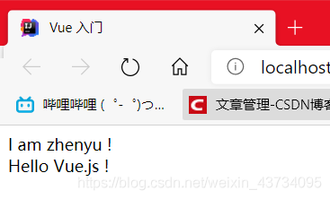

# 1.Vue 简介

- 渐进式 JavaScript 框架

- 易用 html css javascript
  高效 开发前端页面 非常高效
  灵活 开发灵活 多样性
  Vue 是渐进式 javascript 框架: 让我们通过操作很少的 DOM，甚至不需要操作页面中任何 DOM 元素，就很容易的完成 数据和视图绑定、双向绑定 MVVM。

- 注意：日后在使用 Vue 过程中页面中不需要再引入 Jquery 框架。

## 1.下载 Vue

开发版本：

```html
<!-- 开发环境版本，包含了有帮助的命令行警告 -->
<script src="https://cdn.jsdelivr.net/npm/vue/dist/vue.js"></script>
```


生产版本：

```html
<!-- 生产环境版本，优化了尺寸和速度 -->
<script src="https://cdn.jsdelivr.net/npm/vue"></script>
```

# 2.{ {  } }：插值表达式


```html

<head>
    <meta charset="UTF-8">
    <title>Vue 入门</title>
</head>
<body>

    <div id="app">
        <span> I am {{name}} ! </span>
        <br>
        <span>
            {{ msg }}
        </span>
    </div>

    <!--引入vue.js-->
	    <script src="https://cdn.jsdelivr.net/npm/vue/dist/vue.js"></script>
    <script>
        const app = new Vue({
            el : "#app", // element 用来给 Vue 实例定义一个作用范围
            data : {     // 用来给 Vue 定义一些相关数据
                msg : "Hello Vue.js !",
                name : "zhenyu"
            }
        });
    </script>

</body>

```



### 总结：

- Vue 实例对象中 el 属性：代表 Vue 的作用范围，在 Vue 的作用范围内都可以使用 Vue 的语法。

- Vue 实例对象中 data 属性：用来给 Vue 实例绑定一些相关数据，绑定的数据可以通过 {{ xx }} 在 Vue 作用范围内取出。

- 在使用 {{ xx }} 进行获取 data 中数据时,可以在 {{ }}中书写表达式、运算符、调用相关方法以及逻辑运算等。

- el 属性中可以书写任意的 CSS选择器[jquery选择器]，但是在使用 Vue 开发推荐使用 id选择器。

  

# 3.  v-text 和 v-html

## 3.1.使用 v-text：

v-text：显示文本

> v-text：用来获取 data 中数据将数据以文本的形式渲染到指定标签内部，类似于 javascript 中 innerText。


```html

<head>
  <meta charset='utf-8'>
  <title>v-text</title>
</head>
<body>
  <div id="app">
    <h3 v-text="msg"></h3>
    <h3>姓名：<span v-text="user.name"/></h3>
    <h3>年龄: <span v-text="user.age"/></h3>
    <h3>{{lists[0]}}---{{lists[1]}}---{{lists[2]}}</h3>
    <h3 v-text="users[0].name"></h3>
  </div>
  <!--引入vue.js-->
  <script src="https://cdn.jsdelivr.net/npm/vue/dist/vue.js"></script>
  <script>
    const app = new Vue({
      el: "#app",
      data: {
        msg: "Hello Vue.js !",
        user: { name: "zhenyu", age: 20 },
        age: 23,
        lists: ["北", "南", "西", "东"],
        users: [{ name: "zhangsan", age: 20 }, { name: "lisi", age: 19 }]
      }
    });
  </script>
</body>


```


使用 `{{}}`：

```html
<body>

<div id="app">
    <h3>{{ msg }}</h3>

    <h3>名称: {{ user.name }}</h3>

    <h3>年龄: {{ user.age }}</h3>

    <h3>{{ lists[0] }} --- {{ lists[1] }} --- {{ lists[2] }} </h3>

    <h3>{{ users[0].name }}</h3>
</div>

<!--引入vue.js-->
<script src="https://cdn.jsdelivr.net/npm/vue/dist/vue.js"></script>
<script>
    const app = new Vue({
        el: "#app",
        data: {
            msg: "Hello Vue.js !",
            user: {name: "zhenyu", age: 20},
            age: 23,
            lists: ["北", "南", "西", "东"],
            users: [{name: "zhangsan", age: 20}, {name: "lisi", age: 19}]
        }
    });
</script>
</body>
```


### 区别

{{ xx }}（插值表达式）和 v-text 获取数据的在于：

- 使用 v-text 取值会将标签中原有的数据覆盖，插值表达式的形式不会覆盖标签原有的数据。
- 使用 v-text 可以避免在网络环境较差的情况下出现插值闪烁。（已修复）

## 3.2 使用v-html


# 4、v-on : 事件绑定

`v-on`：事件绑定

- `v-on:click` 可以简化成 `@click`
- 事件函数可以简写，`dowork: function() {}` 可以简写成 `dowork() {}`

```html
<head>
  <meta charset='utf-8'>
  <title>v-on</title>
</head>
<body>
  <div id="app">
    <h2>鼠标点击次数: {{count}}</h2>
    <h2>年龄: {{age}}</h2>
    <input type="button" value="通过v-on事件修改年龄每次+1" v-on:click="changeage">
    <input type="button" value="通过@绑定事件修改年龄每次-1" @click="editage">
    <input type="button" value="统计点击次数" @click="clickcount">
  </div>
  <script src="https://cdn.jsdelivr.net/npm/vue/dist/vue.js"></script>
  <script>
    const app = new Vue({
      el : "#app",
      data : {
        age: 23,
        count: 0,
      },
      methods : {
        changeage : function() {
          this.age++;
        },
        editage() {
          this.age--;
        },
        clickcount() {
          this.count++;
        }
      } 
    });
  </script>
</body>

```


>  参数传递

```html
<body>
    <div id="app">
        {{msg}} <br>
        年龄： {{age}}
        <button @click="addAge">点我添加年龄</button>
        <button @click="subAge">点我减少年龄</button><br>
        点击次数：{{clickCount}}<br>
        <button @click="change(21,'小明')">改变为指定的值</button>
    </div>
</body>
<script src="../../vue.js"></script>
<script>
    var app = new Vue({
        el: "#app",
        data: {
            msg: "welcome to Vue!",
            age: 22,
            clickCount: 0,
        },
        methods: {
            addAge() {
                this.age++;
                this.clickCount++;
            },
            subAge() {
                this.age--;
                this.clickCount++;
            },
            change(aa,name){
                this.age = aa;
                alert(name);
            }
        }
    })
</script>
```

> **在使用事件时，可以直接在事件调用出给事件进行参数传递，在事件定义出通过定义对应变量接收传递的参数**

# 5、v-show、v-if、v-bind

## 5.1 ：控制页面元素隐藏与显示(display控制)

**v-show**：用来控制页面中某个标签元素是否展示，底层通过控制元素的 display 属性来进行标签的显示和不显示控制。

- 在 v-show 中可以直接书写 boolean 值控制元素展示
- 在 v-show 中可以通过 变量 控制标签展示和隐藏。
- 在 v-show 中可以通过 boolean表达式 控制标签的展示和隐藏。
  

```html
<head>
  <meta charset='utf-8'>
  <title>v-html</title>
</head>

<body>
  <div id="app">
    <h2 v-show="false">hello Vue.j</h2>
    <!--直接书写boolean隐藏标签-->
    <h2> 年龄: {{ age }} </h2>
      
      
    <h2 v-show="show">恭喜你发现了隐藏内容！</h2>
    <!--利用变量show控制是否显示, 只有show为true才会显示-->
    <input type="button" value="展示隐藏标签" @click="showmsg">
   
      
      <!--利用表达式控制隐藏与显示, age>=30才会显示-->
    <h2 v-show="age >= 30">年龄达到了30，显示该内容！</h2>
    <input type="button" @click="changeAge" value="age>=30显示标签">
      
  </div>
  <!--引入vue.js-->
  <script src="https://cdn.jsdelivr.net/npm/vue/dist/vue.js"></script>
  
    
    <script>
    const app = new Vue({
      el: "#app",
      data: {
        show: false,
        age: 23,
      },
      methods: {
        showmsg() {
          this.show = !this.show;
        },
        changeAge() {
          this.age++;
          console.log(this.age);
        }
      }
    });
  </script>
</body>

```


点击 `展示隐藏标签` 后会显示内容。
点击 `增加年龄` 将年龄增大到 30 后会显示内容。


## 5.2 、v-if：控制页面元素隐藏与显示(dom操作)

`v-if`：用来控制页面中的标签元素是否展示，底层通过对 dom 树节点进行添加和删除来控制展示和隐藏。

与 `v-show` 的用法一模一样，参考 `v-show` 即可。

```html
<body>
<div id="app">
  <h2 v-if="false">hello Vue.js!</h2>
  <!--隐藏-->
  <h2 v-if="show">hello Vue.js!</h2>
  <!--隐藏-->
</div>
<!--引入vue.js-->
<script src="https://cdn.jsdelivr.net/npm/vue/dist/vue.js"></script>
<script>
  const app = new Vue({
    el: "#app",
    data: {
      show: true
    },
    methods: {}
  });
</script>
</body>

```

## 5.3、v-bind：绑定标签的属性

`v-bind`：用来绑定 **标签的属性** 从而通过 vue 动态修改标签的属性。

- `v-bind : 属性` 可以简写成 `: 属性`

```html
<head>
  <meta charset='utf-8'>
  <title>v-bind</title>
  <style>
    .aa {
      border: 10px red solid;
    }
  </style>
</head>

<body>
  <div id="app">
    
    <input type="button" value="动态控制加入样式" @click="addCss">
    <input type="button" value="改变图片" @click="changeSrc">
  </div>
  <script src="https://cdn.jsdelivr.net/npm/vue/dist/vue.js"></script>
  <script>
    const app = new Vue({
      el: "#app",
      data: {
        msg: "这是一个logo!!!!",
        showCss: false,
        src: "https://timgsa.baidu.com/timg?image&quality=80&size=b9999_10000&sec=1583490365568&di=52a82bd614cd4030f97ada9441bb2d0e&imgtype=0&src=http%3A%2F%2Fimg.kanzhun.com%2Fimages%2Flogo%2F20160714%2F820a68f65b4e4a3634085055779c000c.jpg"
      },
      methods: {
        addCss() {
          this.showCss = !this.showCss;
        },
        changeSrc() {
          this.src = "https://ss2.bdstatic.com/70cFvnSh_Q1YnxGkpoWK1HF6hhy/it/u=1925088662,1336364220&fm=26&gp=0.jpg";
        }
      }
    });
  </script>
</body>


```


点击 `动态控制加入样式` 和 `改变图片`：


# 6、v- for

> `v-for`：用来对 **对象** 进行遍历的（JavaScript 中数组也是对象的一种）
>
> - 在使用 `v-for` 的时候一定要注意加入`:key` 用来给 Vue 内部提供重用和排序的唯一 key
> - 遍历时可以获取 索引 `index`、…

```html

<head>
  <meta charset='utf-8'>
  <title>v-for</title>
</head>

<body>
  <div id="app">
    <span> {{ user.name }} {{ user.age }} </span>
    <br>
    <!--通过 v-for 遍历对象-->
    <span v-for="(value, key, index) in user">
      {{index}} : {{key}} : {{value}} <br>
    </span>
    <!--通过 v-for 遍历数组-->
    <ul>
      <li v-for="(a, index) in array">
        {{index + 1}} : {{a}}
      </li>
    </ul>
    <!--
     通过 v-for 遍历数组中对象
     :key 便于vue内部做重用和排序
    -->
    <ul>
      <li v-for="user, index in users" :key="user.id">
        {{index + 1}}<br>
        name: {{user.name}}<br>
        age: {{user.age}}<br>
        hobby: {{user.hobby}}
      </li>
    </ul>
  </div>
  <!--引入vue.js-->
  <script src="https://cdn.jsdelivr.net/npm/vue/dist/vue.js"></script>
  <script>
    const app = new Vue({
      el: "#app",
      data: {
        user: { name: 'zhenyu', age: 20 },
        array: ["North", "South", "West", "East"],
        users: [
          { id: 1, name: "zhangsan", age: 18, hobby: "html、css、javascript" },
          { id: 2, name: "lisi", age: 122, hobby: "java、python、c++" },
          { id: 3, name: "wangwu", age: 20, hobby: "go、rust、Ruby" }
        ]
      },
      methods: {}
    });
  </script>
</body>

```


# 7、v-model：实现双向绑定

> `v-model`：用来绑定 **标签元素的值** 与 **vue实例对象中data数据** 保持一致，从而实现 **双向的数据绑定机制**。

- **所谓双向绑定，就是表单中数据变化导致 vue 实例 data 数据变化，vue 实例中 data 数据的变化导致表单中数据变化。**

> MVVM 架构 双向绑定机制
> Model：数据 Vue实例中绑定数据
> View：页面 页面展示的数据
> VM：ViewModel 监听器

```html

<body>
  <div id="app">
    <input type="text" v-model="message">
    <span> {{ message }} </span>
    <hr>
    <input type="button" value="改变data中的值" @click="changeValue">
  </div>
  <!-- 引入Vue-->
  <script src="../../vue.js"></script>
  <script>
    const app = new Vue({
      el: "#app",
      data: {
        message: ""
      },
      methods: {
        changeValue() {
          this.message = "hello Vue.js!"
        }
      },
    });
  </script>
</body>

</html>

```


# 综合案例

```html

<head>
    <meta charset="UTF-8">
    <meta http-equiv="X-UA-Compatible" content="IE=edge">
    <meta name="viewport" content="width=device-width, initial-scale=1.0">
    <title>Document</title>
</head>

<body>
    <div id="app">
        <h1>记事本综合案例</h1>
        <input type="text" v-model="msg"><input type="button" value="添加到记事本" @click="add">
        <ul></ul>
        <li v-for="item,index in datas">{{index+1}} {{item}}
            <button @click="deleteItem(index)">删除</button>
        </li>
        共有{{datas.length }}条记录
        </ul>
        <button @click="deleteAll" v-if="this.datas.length!=0">删除所有</button>
    </div>
</body>
<script src="../../vue.js"></script>
<script>
    //  1.完成记事本的查询所有思路: 
    //   1).将所有数据绑定为vue实例 
    //   2).遍历vue实例中数据到页面
    // 添加 
    //   1).添加按钮绑定事件中 
    //   2).在事件中获取输入框中数据 
    //   3).将获取的数据放入到lists里面
    //  1.完成记事本的查询所有思路: 
    //   1).将所有数据绑定为vue实例 
    //   2).遍历vue实例中数据到页面
    // 2.添加 
    //   1).添加按钮绑定事件中 
    //   2).在事件中获取输入框中数据 
    //   3).将获取的数据放入到datas里面
    // 3.删除  
    //   1).删除所有  
    //   2).总数量
    

    var app = new Vue({
        el: "#app",
        data: {
            datas: ["今天天气很好啊", "下饭了"],
            msg: "",
        },
        methods: {
            add() {//添加到记事本
                if (this.msg != '') {
                    this.datas.push(this.msg);
                    this.msg = '';
                }
            },
            deleteItem(index) {
                //删除事件
                this.datas.splice(index, 1);
            },
            deleteAll() {
                //删除所有记事
                this.datas = [];
            }
        },
    })
</script>

```


# 8、事件修饰符

> 修饰符作用：用来和事件连用，决定事件触发条件或者是阻止事件的触发机制。

常用的事件修饰符：

- **.stop**：用来阻止事件冒泡。
- **.prevent**：用来阻止标签的默认行为。
- **.self：**只触发自己标签的上特定动作的事件，不监听事件冒泡。
- **.once：**让指定事件只触发一次。

```html

<head>
    <meta charset="UTF-8">
    <meta http-equiv="X-UA-Compatible" content="IE=edge">
    <meta name="viewport" content="width=device-width, initial-scale=1.0">
    <title>Document</title>
</head>
<body>
    <div id="app">
        <div  @click.self="divClick()" style="border: 1px solid black; height: 200px;width: 200px;">
           <input type="button" @click="btn()" value="btn">
        <a href="http://www.baidu.com" @click.prevent>百度</a>
        </div>
        <div  @click.self="divClick()" style="border: 1px solid black; height: 200px;width: 200px;">
            <input type="button" @click.stop="btn()" value="阻止事件冒泡">
          <a href="#" @click.once="btn()">只能点一次</a>
         </div>
    </div>
</body>
<script src="../../vue.js"></script>
<script>
    var app = new Vue({
        el: "#app",
        data: {

        },
        methods: {
            divClick(){
                alert("div被点击了")
            },
            btn(){
                alert("btn被点击了");
            }
        }
    })
</script>

```

# 9、按键修饰符

>  作用：用来与键盘中按键事件绑定在一起,用来修饰特定的按键事件的修饰符。

常用按键修饰符：`@keyup.xxx="function "`

- .enter
-  .tab （捕捉通过tab跳转到当前按标签） 
- .delete (捕获“删除”和“退格”键) 
- .esc
- .space 
- .up 
- .down 
- .left 
- .right

```html

<head>
  <meta charset="UTF-8">
  <title>02.按键修饰符</title>
</head>

<body>
  <div id="app">
    <!--enter按键修饰符, 在回车之后触发事件-->
    <input type="text" v-model="msg" @keyup.enter="keyups" placeholder="enter"><br>
    <!--当使用tab键切换到这个标签时触发-->
    <input type="text" @keyup.tab="tabups" placeholder="tab"><br>
    <input type="text" @keyup.delete="deleteups" placeholder="delete"><br>
    <input type="text" @keyup.esc="escups" placeholder="esc"><br>
    <input type="text" @keyup.space="spaceups" placeholder="space"><br>
    <input type="text" @keyup.up="ups" placeholder="up"><br>
    <input type="text" @keyup.left="lefts" placeholder="left"><br>
    <input type="text" @keyup.right="rights" placeholder="right"><br>
    <input type="text" @keyup.down="downs" placeholder="down"><br>
  </div>

  <script src="../../vue.js"></script>
  <script>
    const app = new Vue({
      el: "#app",
      data: {
        msg: '',
      },
      methods: {
        keyups() { alert(this.msg); },
        tabups() { alert("tab键触发") },
        deleteups() { alert("delete键触发") },
        escups() { alert("esc键触发") },
        spaceups() { alert("space键触发") },
        ups() { alert("↑") },
        lefts() { alert("←") },
        rights() { alert("→") },
        downs() { alert("↓") },
      },
    });
</script>
</body>

```

# 10、Axios 基本使用

> 中文网站：https://www.kancloud.cn/yunye/axios/234845
>
> 安装：https://unpkg.com/axios/dist/axios.min.js       在线cdn

脚手架导入并使用：

```
//导入axios
import axios from 'axios'
Vue.prototype.$http = axios;
```


## 10.1 GET请求

```html

<head>
    <meta charset="UTF-8">
    <meta http-equiv="X-UA-Compatible" content="IE=edge">
    <meta name="viewport" content="width=device-width, initial-scale=1.0">
    <title>Document</title>
</head>

<body>
    <div id="app"></div>
</body>
<script src="../../vue.js"></script>
<script src="../../axios.min.js"></script>
<script>
     // 发送GET方式的请求
    axios.get('http://localhost:8080/findAll')//请求后端的findAll请求
        .then(function (response) {//response处理后端的JSON数据
            console.log(response.data)
        })
        .catch(function (err) {//捕获请求时的异常
            console.log(err);
        })
</script>

```

## 10.2 POST请求

```html


<head>
  <meta charset='utf-8'>
  <title>Axios - Get</title>
</head>

<body>
  <!--引入Axios-->
  <script src="https://unpkg.com/axios/dist/axios.min.js"></script>
  <script>
    // 发送POST方式的请求
    axios.post("http://localhost:8989/user/save", {
      id: "996",
      username: "zhenyu",
      age: 20,
      email: "zhenyu@123.com",
      phone: "123456789"
    }).then(function (response) {
      console.log(response.data);
    }).catch(function (err) {
      console.log(err);
    });

    const app = new Vue({
      el: "#app",
      data: {},
      methods: {},
    });
  </script>
</body>


```

## 10.3  Axios 并发请求

> **并发请求**：将多个请求在同一时刻发送到后端服务接口，最后在集中处理每个请求的响应结果。

```html

<head>
  <meta charset='utf-8'>
  <title>Axios - Get</title>
</head>

<body>
  <!--引入Axios-->
  <script src="https://unpkg.com/axios/dist/axios.min.js"></script>

  <script>
    // 1.创建一个查寻所有的请求
    function findAll() {
      return axios.get("http://localhost:8989/user/findAll?name=zhangsan");
    }
    // 2.创建一个保存的请求
    function save() {
      return axios.post("http://localhost:8989/user/save", {
        id: "996",
        username: "zhenyu",
        age: 20,
        email: "zhenyu@123.com",
        phone: "123456789"
      });
    }
    // 3.并发执行
    axios.all([findAll(), save()]).then(
      axios.spread(function (res1, res2) { // 用来将一组函数的响应结果汇总处理
        console.log(res1.data);
        console.log(res2.data);
      })); // 发送一组并发请求

    const app = new Vue({
      el: "#app",
      data: {},
      methods: {},
    });
  </script>
</body>

```

## axios综合案例

#### 前端

```html

<head>
    <meta charset="UTF-8">
    <meta http-equiv="X-UA-Compatible" content="IE=edge">
    <meta name="viewport" content="width=device-width, initial-scale=1.0">
    <title>Document</title>
</head>

<body>
    <div id="app">
        <input type="text" v-model="name" @keyup.delete="lab=false"></input>
        <button @click="findWeacher()">搜索</button>
        <br>
        <span v-for="item in hotCity"><a href="#" @click="findhotCity(item)">{{item}}</a>&nbsp;</span>
        <br>
        <label v-show="lab">{{ name }}：今天的天气是{{msg}}</label>

    </div>
</body>
<script src="../../vue.js"></script>
<script src="../../axios.min.js"></script>
<script>
    var app = new Vue({
        el: "#app",
        data: {
            msg: "",
            name: "",
            hotCity: ['北京', '上海', '天津', '武汉'],
            lab: false
        },
        methods: {
            findWeacher() {
                _this = this;
                axios.get("http://localhost:8080/getWeather?name=" + this.name)
                    .then(function (response) {
                        console.log(response);
                        if (response.data.weatherMsg != null) {
                            _this.msg = response.data.weatherMsg;
                            _this.lab = true
                        }else{
                            _this.lab = false
                        }

                    }).catch(function (err) {
                        console.log(err)
                    })
            },

            findhotCity(name) {
                _this = this;
                axios.get("http://localhost:8080/getWeather?name=" + name)
                    .then(function (response) {
                        console.log(response);
                        _this.name = name;
                        _this.msg = response.data.weatherMsg;
                        _this.lab = true;

                    }).catch(function (err) {
                        console.log(err)
                    })
            }
        }
    })
</script>

```

#### 后端 

```java
package com.example.demo.controller;

import org.springframework.web.bind.annotation.CrossOrigin;
import org.springframework.web.bind.annotation.GetMapping;

import org.springframework.web.bind.annotation.RestController;

import java.util.HashMap;
import java.util.Map;

@RestController
public class AxiosController {
    @CrossOrigin
    @GetMapping("/getWeather")
    public Map<String,String> getWeather( String name){
        System.out.print(name);
        Map<String,String> map = new HashMap<>();
        String CityWeather = getWeatherByCityName(name);
        //返回前端输入的城市名和相应的天气
        System.out.println(CityWeather);
        map.put("weatherMsg",CityWeather);
        return map;
    }

    public String getWeatherByCityName(String name){
        Map<String,String> map = new HashMap<>();
        map.put("北京","晴天");
        map.put("天津","多云");
        map.put("上海","大雨");
        map.put("武汉","小雨");
        return map.get(name);
    }

}
```

# 11、vue的生命周期

> **生命周期钩子** ====> **生命周期函数**


```html

<head>
  <meta charset="UTF-8">
  <title>vue生命周期函数</title>
</head>

<body>
  <div id="app">
    <span id="sp"> {{ msg }} </span>
    <input type="button" value="改变data的值" @click="changeData">
  </div>
  <!-- 引入Vue  -->
  <script src="https://cdn.jsdelivr.net/npm/vue/dist/vue.js"></script>
  <script>
    const app = new Vue({
      el: "#app",
      data: {
        msg: "hello Vue.js!",
      },
      methods: {
        changeData() {
          // this.msg = "Vue.js niubility!";
          this.msg = Math.random();
        }
      },
        
        
      // ====================初始化阶段====================
      // 1.生命周期中第一个函数,该函数在执行时Vue实例仅仅完成了自身事件的绑定和生命周期函数的初始化            工作,Vue实例中还没有 Data el methods相关属性
      beforeCreate() {
        console.log("beforeCreate: " + this.msg);
      },
      // 2.生命周期中第二个函数,该函数在执行时Vue实例已经初始化了data属性和methods中相关方法
      created() {
        console.log("created:" + this.msg);
      },
        
        
        
      // 3.生命周期中第三个函数,该函数在执行时Vue将El中指定作用范围作为模板编译
      beforeMount() {
        console.log("beforeMount: " + document.getElementById("sp").innerText);
      },
      // 4.生命周期中第四个函数,该函数在执行过程中,已经将数据渲染到界面中并且已经更新页面
      mounted() {
        console.log("Mounted: " + document.getElementById("sp").innerText);
      },
        
        
      // ====================运行阶段====================
      // 5.生命周期中第五个函数,该函数是data中数据发生变化时执行 这个事件执行时仅仅是Vue实例中            data数据变化页面显示的依然是原始数据
      beforeUpdate() {
        console.log("beforeUpdate-vue: " + this.msg);
        console.log("beforeUpdate-dom: " + document.getElementById("sp").innerText);
      },
      // 6.生命周期中第六个函数,该函数执行时data中数据发生变化,页面中数据也发生了变化  页面中数据已经和data中数据一致
      updated() {
        console.log("updated-vue: " + this.msg);
        console.log("updated-dom: " + document.getElementById("sp").innerText);
      },
        
        
        
        
      // ====================销毁阶段====================
      // 7.生命周期第七个函数,该函数执行时,Vue中所有数据 methods componet 都没销毁
      beforeDestory() { },
      // 8.生命周期的第八个函数,该函数执行时,Vue实例彻底销毁
      destoryed() { }
    });
  </script>
</body>

```


# 12、Vue 中组件（Component）

> **组件作用**：用来减少 Vue 实例对象中代码量，日后在使用 Vue 开发过程中，可以根据不同业务功能将页面中划分不同的多个组件，然后由多个组件去完成整个页面的布局，便于日后使用 Vue 进行开发时页面管理，方便开发人员维护。

## 12.1 全局组件的开发

> **全局组件注册给 Vue 实例，可以在任意 Vue 实例的范围内使用该组件。**

### 12.1.1  全局组件的开发：

```js
 // 开发全局组件
    // 参数1: 组件名称
    // 参数2: 组件配置对象 template:用来书写组件的html代码(注意:在template中必须存在一个容器)
    Vue.component('login', {
      template : '<div><h1>用户登录</h1></div>'
    });

//使用全局组件，在vue的实例范围内
<login></login>
```


```html

<head>
  <meta charset='utf-8'>
  <title>全局组件的开发</title>
</head>
<body>
  <div id="app">
    <!-- 使用全局组件 -->
    <login></login>
   
    <user-login></user-login>
  </div>
    <template id="temp"><h1>登录</h1></template>
  <script src="https://cdn.jsdelivr.net/npm/vue/dist/vue.js"></script>
  <script>
    // 开发全局组件
    // 参数1: 组件名称
    // 参数2: 组件配置对象 template:用来书写组件的html代码(注意:在template中必须存在一个容器)
    Vue.component('login',{
        template: '#temp'   //id选择器绑定该模板，模板用template标签，不会被解析
    })
    // 驼峰命名法的组件会被特殊处理, userLogin 使用时必须写成 user-login
    Vue.component('userLogin', {
      template : '<div><input type="button" value="登录"></div>'
    });
    const app = new Vue({
      el: "#app",
      data: {},
      methods: {},
    });
  </script>
</body>

```

### 12.1.2  局部组件的开发：

> 通过将组件注册给对应 Vue 实例中一个 `components` 属性来完成组件注册，这种方式不会对 Vue 实例造成累加。

第一种开发方式：

```html

<head>
  <meta charset='utf-8'>
  <title>局部组件的开发</title>
</head>

<body>
  <div id="app">
    <login></login>
    <login></login>
    <login></login>
  </div>
  <script src="https://cdn.jsdelivr.net/npm/vue/dist/vue.js"></script>
  <script>
    // 定义变量用来保存模板配置对象
    const login = {
      template: '<div><h2>用户登录</h2></div>'
    };
    const app = new Vue({
      el: "#app",
      data: {},
      methods: {},
      components: { // 局部组件
        login: login // 注册局部组件
      }
    });
  </script>
</body>

```


第二种开发方式**(推荐)：**

```html


<head>
  <meta charset="UTF-8">
  <title>局部组件的开发2</title>
</head>

<body>
  <div id="app">
    <login></login>
    <login></login>
    <login></login>
  </div>

  <!--声明局部组件模板  template标签 注意:在 Vue 实例作用范围外声明-->
  <template id="loginTemplate">
    <h2>用户登录</h2>
  </template>

  <script src="https://cdn.jsdelivr.net/npm/vue/dist/vue.js"></script>
  <script>
    // 定义变量用来保存模板配置对象
    const login = { // 具体局部组件名称
      template: '#loginTemplate' // 定义template标签选择器即可
    };
    const app = new Vue({
      el: "#app",
      data: {},
      methods: {},
      components: { // 局部组件
        login: login // 注册局部组件
      }
    });
  </script>
</body>

```

## 12.2 组件中 props 的使用

> `props` 用来给组件传递相应静态数据或者是动态数据；

### 12.2.1 在组件上声明静态数据传递给组件内部

```html

<head>
  <meta charset="UTF-8">
  <title>在局部组件中使用props接收静态数据</title>
</head>

<body>
  <div id="app">
    <!--使用组件, 通过组件进行静态数据传递-->
    <login username="GEASS" age="20"></login>
  </div>
  <script src="https://cdn.jsdelivr.net/npm/vue/dist/vue.js"></script>
  <script>
    // 声明一个组件模板配置对象
    let login = {
      template: '<div><h2>欢迎: {{ userName }} 年龄: {{ age }}</h2></div>',
      props: ['username', 'age'] // props: 用来接收使用组件时通过组件标签传递的数据
    }
    const app = new Vue({
      el: "#app",
      data: {},
      methods: {},
      components: {
        login // 组件注册
      }
    });
  </script>
</body>

```

### 12.2.2 在组件上声明动态数据传递给组件内部

```html

<head>
  <meta charset="UTF-8">
  <title>在局部组件中使用prop接收动态数据</title>
</head>

<body>
  <div id="app">
    <!--使用组件接收 Vue 实例中的动态数据-->
    <!--使用 v-bind 形式将数据绑定到 Vue 实例中 data 属性, data 属性发生变化, 组件内部数据跟着变化-->
    <login v-bind:name="username" :age="userage"></login>
  </div>
  <script src="https://cdn.jsdelivr.net/npm/vue/dist/vue.js"></script>
  <script>
    const login = {
      template: '<div><h2>欢迎: {{ name }} 年龄: {{ age }}</h2></div>',
      props: ['name', 'age']
    }
    const app = new Vue({
      el: "#app",
      data: {
        username: "GEASS",
        userage: 25
      },
      methods: {},
      components: {
        login // 注册组件
      }
    });
  </script>
</body>


```

### 12.2.3  props 的单向数据流

> 所有的 props 都使得其父子 props 之间形成了一个``**单向下行绑定**``：父级 props 的更新会向下流动到子组件中，但是反过来则不行。
>
> 这样会防止从子组件意外改变父级组件的状态，从而导致你的应用的数据流向难以理解。
>
> 额外的，每次父级组件发生更新时，子组件中所有的 props 都将会刷新为最新的值。这意味着你不应该在一个子组件内部改变 props。如果你这样做了，Vue 会在浏览器的控制台中发出警告。—摘自官网
> 

## 12.3 组件中定义数据和事件使用

### 12.3.1  组件中定义属于组件的数据

```js
 <script>
    const login = {
      template: '<div><h2>{{ msg }}</h2><ul><li v-for="item,index in lists"> {{index+1}} : {{ item }} </li></ul></div>',
      data() {
        return {
          msg: "hello Vue.js !",
          lists: ['java', 'C++', 'python'],
        }; // 组件内部的数据
      }
    };
    const app = new Vue({
      el: "#app",
      data: {},
      methods: {},
      components: {
        login // 注册组件
      }
    });
  </script>

```

### 12.3.2 组件中事件定义

```js
<script>
    const login = {
      // 组件中定义了属于组件的事件 @click="change"
      template: '<div><h2>{{ hello }}</h2><input type="button" value="点我触发组件的事件" @click="change"></div>',
      data() {
        return {
          hello: 'Hello Vue.js!',
        };
      },
      // 组件中定义的 @click="change" 事件
      methods: {
        change() {
          alert(this.hello);
        }
      }
    }
    const app = new Vue({
      el: "#app",
      data: {},
      methods: {},
      components: {
        login // 注册组件
      }
    });
  </script>

```

> \#总结
>
> 1.组件中定义事件和直接在Vue中定义事件基本-致直接在组件内部对应的htm1代码上加入@事件名=函数名方式即可
>
> 2.在组件内部使用methods属性用来定义对应的事件函数即可,事件函数中this指向的是当前组件的实例

## 12.4 向子组件中传递事件并在子组件中调用该事件

在子组件中调用传递过来的相关事件使用 `this.$emit('函数名')` 方式调用；

```html

<head>
  <meta charset="UTF-8">
  <title>向组件中传递事件并调用</title>
</head>

<body>
  <div id="app">
    <!--v-bind:name="msg" 是绑定了Vue实例中的动态数据-->
    <!--@aaa="findAll" 是将Vue实例中的函数绑定给了aaa, 在组件中通过this.$emit('aaa')来调用-->
    <login :name="msg" @aaa="findAlll"></login>
  </div>

  <!-- 引入Vue -->
  <script src="https://cdn.jsdelivr.net/npm/vue/dist/vue.js"></script>
  <script>
    // 组件
    const login = {
      template: '<div><h2>{{ show }}</h2><input type="button" value="点我触发事件" @click="change"></div>',//调用本方法区的change方法
      data() {
        return {
          show: this.name,
        }
      },
      props: ['name'],
      methods: {
        change() { // 组件自身的函数
          // 调用vue实例中函数
          this.$emit('aaa')
        }
      }
    }
    // Vue实例
    const app = new Vue({
      el: "#app",
      data: {
        msg: 'Hello Vue.js!'
      },
      methods: {
        findAlll() {
          alert('Vue实例中的事件触发了！');
        }
      },
      components: {
        login // 注册组件
      }
    });
  </script>
</body>


```

# 13、Vue路由

> 路由：根据请求的路径按照一定的路由规则进行请求的转发从而实现统一请求的管理；

> 路由的作用：用来在 Vue 中实现 组件之间的动态切换；


在项目中使用路由：

```js
<script src="https://cdn.jsdelivr.net/npm/vue/dist/vue.js"></script>
<script src="https://unpkg.com/vue-router@3.3.4/dist/vue-router.js"></script>
`路由的使用一定要在vue的之后`
```


## 13.1 路由的基本使用

```markdown
1.创建组件对象；

// 1、创建组件对象
    const login = {
        template: "<h1>登录</h1>"
    };
    const register = {
        template: "<h1>注册</h1>"
    };
    
    
2.定义路由对象的规则；

  // 2、创建路由对象
    const router = new VueRouter({
        routes: [ // 定义路由对象的规则
            // path:设置路由的路径, component:路径对应的组件
            {path: "/login", component: login},
            {path: "/register", component: register}
        ]
    });


3.将路由对象注册到 vue 实例；

const app = new Vue({
        el: "#app",
        data: {},
        methods: {},
        router: router // 3、在vue实例中注册路由对象
    });
    
    
4.在页面中显示路由的组件；
 <!--4、在页面中显示路由的组件, 用来展示组件对象-->
    <router-view></router-view>

5.根据链接切换路由；

<!--5、根据链接切换路由组件-->
    <a href="#/login">点我登录</a>
    <a href="#/register">点我注册</a>
    
```


```html
<!DOCTYPE html>
<html lang="en">
<head>
    <meta charset="UTF-8">
    <title>路由的基本使用</title>
</head>
<body>
<div id="app">
    <!--4、在页面中显示路由的组件-->
    <router-view></router-view>
    <!--5、根据链接切换路由组件-->
    <a href="#/login">点我登录</a>
    <a href="#/register">点我注册</a>
</div>
</body>
</html>
<script src="https://cdn.jsdelivr.net/npm/vue/dist/vue.js"></script>
<script src="https://unpkg.com/vue-router@3.3.4/dist/vue-router.js"></script>
<script>

    // 1、创建组件对象
    const login = {
        template: "<h1>登录</h1>"
    };
    const register = {
        template: "<h1>注册</h1>"
    };

    // 2、创建路由对象
    const router = new VueRouter({
        routes: [ // 定义路由对象的规则
            // path:设置路由的路径, component:路径对应的组件
            {path: "/login", component: login},
            {path: "/register", component: register}
        ]
    });
    
    const app = new Vue({
        el: "#app",
        data: {},
        methods: {},
        router: router // 3、在vue实例中注册路由对象
    });
</script>

```

## 13.2  router-link 使用

>  作用：在切换路由时可以自动给路由路径加入#不需要手动加入。

使用 a标签 切换路由： 需要在路径前面加`#` ；

```html
<a href="#/login">点我登录</a>
<a href="#/register">点我注册</a>
```


使用 router-link 切换路由：

to属性书写路由路径；tag属性将 router-link 渲染成指定的标签；

```html
<router-link to="/login" tag="a">我要登录</router-link>
<router-link to="/register" tag="button">点我注册</router-link>
```

## 13.3  默认路由

作用：用来在第一次进入界面是显示一个默认的组件；

```js
const router = new VueRouter({
    routes: [
        // {path: "/", component: login},
        {path: "/", redirect:"/login"}, // redirect:当访问的是默认路由"/"时, 跳转到指定的路由展示[推荐]
        {path: "/login", component: login},
        {path: "/register", component: register}
    ]
});

```

## 13.4 路由中参数的传递

### 13.4.1 传统方式传递参数

1. URL 中通过 ? 拼接参数：

```html
<router-link to="/login?username=zhenyu&password=12345" tag="a">我要登陆</router-link>
```

2. 在组件中获取参数：通过 `this.$route.query.xxx` 来获取参数；

```js
const login = {
    template: "<h1>用户登录</h1>",
    data() {return{}},
    methods: {},
    created() {
        console.log("name=" + this.$route.query.name + ", pwd=" + this.$route.query.pwd)
    }
};

```

### 13.4.2 restful 方式传递参数

1. 通过使用路径方式传递参数：

```js
const router = new VueRouter({
    routes: [
        {path: "/register/:name/:pwd", component: register}
    ]
});
```

```html
<router-link to="/register/zhenyu/12345" tag="a">我要注册</router-link>
```

2. 在组件中获取参数：通过 `this.$route.params.xxx` 来获取参数；

```js
const register = {
    template: "<h1>用户注册</h1>",
    data() {return{}},
    methods: {},
    created() {
        console.log("name=" + this.$route.params.name + ", pwd=" + this.$route.params.pwd);
    }
};

```

### 完整示例

```html
<!DOCTYPE html>
<html lang="en">

<head>
    <meta charset="UTF-8">
    <title>路由中传递参数</title>
</head>

<body>
<div id="app">
    <router-view></router-view>
    <router-link to="/login?name=zhangsan&pwd=12345" tag="a">我要登陆</router-link>
    <router-link to="/register/zhangsan/12345" tag="a">我要注册</router-link>
</div>
</body>
</html>
<script src="https://cdn.jsdelivr.net/npm/vue/dist/vue.js"></script>
<script src="https://unpkg.com/vue-router@3.3.4/dist/vue-router.js"></script>
<script>
    const login = {
        template: "<h1>用户登录 {{this.$route.query.name}}</h1>",
        data() {return{}},
        methods: {},
        created() {
            console.log("name=" + this.$route.query.name + ", pwd=" + this.$route.query.pwd);
        }
    };
    const register = {
        template: "<h1>用户注册 {{this.$route.params.name}} </h1>",
        data() {return{}},
        methods: {},
        created() {
            console.log("name=" + this.$route.params.name + ", pwd=" + this.$route.params.pwd);
        }
    };
    const router = new VueRouter({
        routes: [
            {path: "/", redirect: "/login"},
            {path: "/login", component: login},
            {path: "/register/:name/:pwd", component: register}
        ]
    });
    const app = new Vue({
        el: "#app",
        data: {},
        methods: {},
        router // 注册路由
    });
</script>

```

## 13.5 嵌套路由

**同一个页面的使用**

1. 声明最外层和内层组件对象；
2. 创建含有路由对象的路由对象(嵌套路由)，通过 `chidren` 嵌套；
3. 注册与使用路由；

```html
<!DOCTYPE html>
<html lang="en">

<head>
    <meta charset="UTF-8">
    <title>路由中传递参数</title>
</head>

<body>
<div id="app">
    <router-link to="/product">商品管理</router-link>
    <router-view></router-view>
</div>
<template id="product">
    <div>
        <h1>商品管理</h1>
        <router-link to="/product/add">商品添加</router-link>
        <router-link to="/product/edit">商品编辑</router-link>
        <router-view></router-view>
    </div>
</template>
</body>
</html>
<script src="https://cdn.jsdelivr.net/npm/vue/dist/vue.js"></script>
<script src="https://unpkg.com/vue-router@3.3.4/dist/vue-router.js"></script>
<script>
    // 声明最外层和内层组件对象
    const product = {
        template: '#product'
    };
    const add = {
        template: "<h4>商品添加</h4>"
    };
    const edit = {
        template: "<h4>商品编辑</h4>"
    };
    // 创建含有路由对象的路由对象(嵌套路由), 通过children嵌套
    const router = new VueRouter({
        routes: [
            {
                path: "/product",
                component: product,
                children: [
                    {path: "add", component: add},
                    {path: "edit", component: edit},
                ]
            },
        ]
    });

    const app = new Vue({
        el: "#app",
        data: {},
        methods: {},
        router // 注册路由
    });
</script>

```

## 13.6 路由结合 SpringBoot 案例

### 后台控制器

**这是一个简单的演示性的小项目，后台控制器返回一串 Json 字符串。**

```java


@RestController
@RequestMapping("user")
@CrossOrigin
public class UserController {
    @GetMapping("findAll")
    public List<User> findAll() {
        List<User> list = Arrays.asList(
                new User("21", "zhenyu", 21, new Date()),
                new User("22", "小三", 24, new Date()),
                new User("23", "小明", 25, new Date())
        );
        return list;
    }
}
```


### 前端页面

```html

<head>
    <meta charset="UTF-8">
    <title>使用vue开发简单页面</title>
    <link rel="stylesheet" href="https://cdn.jsdelivr.net/npm/bootstrap@3.3.7/dist/css/bootstrap.min.css">
</head>
<body>

<div id="app">
    <div class="container">
        <div class="row" style="margin-top: 70px;">
            <div class="col-md-10 col-md-offset-1">
                <ul class="nav nav-pills nav-justified">
                    <li role="presentation" :class="showAtice=='home'?'active':''"><a href="#/home" @click="changActive('home')">主页</a></li>
                    <li role="presentation" :class="showAtice=='user'?'active':''"><a href="#/user" @click="changActive('user')" >用户管理</a></li>
                    <li role="presentation" :class="showAtice=='student'?'active':''"><a href="#/student" @click="changActive('student')">学生管理</a></li>
                </ul>
            </div>
        </div>
        <div class="row">
            <div class="col-md-10 col-md-offset-1">
                <!--显示路由组件内容-->
                <router-view></router-view>
            </div>
        </div>
    </div>
</div>

<template id="home">
    <div>
        <div class="jumbotron" style="margin-top: 100px;">
            <h1>Hello, world!</h1>
            <p>This is a simple hero unit, a simple jumbotron-style component for calling extra attention to featured content or information.</p>
            <p><a class="btn btn-primary btn-lg" href="#" role="button">Learn more</a></p>
        </div>
    </div>
</template>

<template id="user">
    <div>
        <table class="table table-strip" style="margin-top: 100px;">
            <tr>
                <th>id</th>
                <th>姓名</th>
                <th>年龄</th>
                <th>生日</th>
                <th>操作</th>
            </tr>
            <tr v-for="user in users">
                <td>{{user.id}}</td>
                <td>{{user.name}}</td>
                <td>{{user.age}}</td>
                <td>{{user.bir}}</td>
                <td><a href="" class="btn btn-default">修改</a>
                    <a href="" class="btn btn-danger">删除</a>
                </td>
            </tr>

        </table>
    </div>
</template>

<template id="student">
    <div>
        <table class="table table-strip" style="margin-top: 100px;">
            <tr>
                <th>id</th>
                <th>学生姓名</th>
                <th>学历</th>
                <th>邮箱</th>
                <th>操作</th>
            </tr>
            <tr>
                <td>1</td>
                <td>张三</td>
                <td>23</td>
                <td>2012-12-12</td>
                <td><a href="" class="btn btn-default">修改</a>
                    <a href="" class="btn btn-danger">删除</a>
                </td>
            </tr>
        </table>
    </div>
</template>

<script src="https://cdn.jsdelivr.net/npm/vue/dist/vue.js"></script>
<script src="https://unpkg.com/vue-router/dist/vue-router.js"></script>
<script src="https://unpkg.com/axios/dist/axios.min.js"></script>
<script>
    // 1. 主页组件配置对象
    const home = {
        template : "#home",
    }
    // 2.用户管理组件配置对象
    const user = {
        template: "#user",
        data(){
            return {
                users:[],
            }
        },
        methods: {},
        created() {
            //发送查询所有用户信息
            _this = this;
            axios.get("http://localhost:8080/user/findAll").then((res)=>{
                console.log(res.data);
                _this.users = res.data;
            });
        }
    }
    // 3.学生管理组件的配置对象
    const student = {
        template: "#student",
    }

    // 路由对象
    const router = new VueRouter({
        routes: [
            {path: '/', redirect: '/home'},
            {path: '/home', component: home},
            {path: '/user', component: user},
            {path: '/student', component: student},
        ]
    });

    const app = new Vue({
        el: "#app",
        data: {
            showAtice: 'home',
        },
        methods: {
            changActive(value) {
                console.log(value);
                this.showAtice = value;
                console.log(this.showAtice);
            }
        },
        router: router // 注册路由
    });
</script>
</body>


```


# 14、Vue-CLI脚手架

> **CLI是什么?**
> 命令行界面（英语：command-line interface，缩写：*CLI*）是在图形用户界面得到普及之前使用最为广泛的用户界面，它通常不支持鼠标，用户通过键盘输入指令，计算机接收到指令后，予以执行。也有人称之为字符用户界面（CUI）。

**Vue CLI 是什么？**
Vue CLI 是一个基于 Vue.js 进行快速开发的完整系统。使用 Vue 脚手架之后我们开发的页面将是一个完整系统(项目)。

------

**Vue CLI 的优势：**

- 通过 vue-cli 搭建交互式的项目脚手架。
- 主流前端框架比如 bootstrap、jquery 等可以通过执行命令方式下载相关依赖
- 通过 @vue/cli + @vue/cli-service-global 快速开始 零配置原型开发
- 一个运行时依赖 (@vue/cli-service)，该依赖：
  - 可升级（一条命令）；
  - 基于 webpack 构建，并带有合理的默认配置；
  - webpack 是一种项目打包方式：将编译好的项目源码 ===>部署到服务器上直接使用；
  - 可以通过项目内的配置文件进行配置；通过修改默认配置文件达到自己想要的项目环境。
  - 可以通过插件进行扩展。vue、v-charts、elementui …

- 一个丰富的官方插件集合，集成了前端生态中最好的工具。
  Nodejs、Vue、VueRouter、Webpack、yarn …
- 一套完全图形化的创建和管理 Vue.js 项目的用户界面；

`npm `介绍：**
nodejs包管理工具（node package mangager）:

npm 对前端主流技术进行统一管理

可以将 nodejs 想象成 Maven：
maven 管理 java 后端依赖 — 远程仓库(中心仓库) — 阿里云镜像；
npm 管理前端系统依赖 — 远程仓库(中心仓库) — 配置淘宝镜像；

## 14.1 Vue CLI 安装

**Node.js 环境准备**

1. 前往这里下载 Node.js：http://nodejs.cn/download/
2. 配置 Node.js 环境变量；（建议百度）
3. 使用 node -v 验证 Node.js 是否安装成功


**npm 介绍：**
nodejs包管理工具（node package mangager）:

- npm 对前端主流技术进行统一管理

- 可以将 nodejs 想象成 Maven：
  maven 管理 java 后端依赖 — 远程仓库(中心仓库) — 阿里云镜像；
  npm 管理前端系统依赖 — 远程仓库(中心仓库) — 配置淘宝镜像；

Node.js 配置淘宝镜像：

>  npm config set registry https://registry.npm.taobao.org


查看 Node.js 配置的远程仓库：

>  npm config get registry
> 

Node.js 配置 npm 依赖下载位置：（位置自定义）

> npm config set cache "D:\CodeTool\nodereps\npm_cache"
> npm config set prefix "D:\CodeTool\nodereps\npm_global"

验证 Node.js 环境配置：

> npm config ls
> 

## 14.2 安装 Vue 脚手架

Vue CLI 官网：https://cli.vuejs.org/zh/guide/

> npm uninstall -g @vue/cli  # 卸载3.x版本脚手架
> npm uninstall -g vue-cli   # 卸载2.x版本脚手架

安装 2.x 版本的 Vue CLI：

> npm install -g vue-cli
>
> 3.0
>
> cnpm install -g @vue/cli 


验证安装成功：（如果显示无法识别 “vue”，需要将 vue.cmd 配置到环境变量）

查看npm的配置 npm config ls   -----------》查看prefix的路径


b2.png

然后找到这个红色线里面的路径，看看有没有vue.md的文件：

然后把这个路径添加的系统环境变量的path里面，如下图：


> vue --version       查看有没有生效

## 14.3 第一个 Vue 脚手架项目

Vue CLI 中项目开发方式：**一切皆组件！**

1. VueCLI 开发方式是在项目中开发一个一个组件对应一个业务功能模块，日后可以将多个组件组合到一起形成一个前端系统。
2. 日后在使用 Vue CLI 进行开发时不再书写html，编写的是一个个组件(.vue文件)，打包时 Vue CLI 会将组件编译成运行的 html 文件。

## 14.4 命令创建项目

（1）使用以下命令来创建一个新项目：

>  vue init webpack 项目名

（2）我们选择 手动配置：用方向键 ↑ ↓ 操控选项，Enter 确定；

> Please pick a preset: (Use arrow keys)
>
> default (babel, eslint) # 默认配置
> Manually select features # 手动配置

（3）选择配置，勾选如下即可：方向键 ↑ ↓ 操作，按空格选中，Enter 确定；

> Vue CLI v4.4.6
> Please pick a preset: Manually select features
> Check the features needed for your project:
>  (*) Babel
>  ( ) TypeScript
>  ( ) Progressive Web App (PWA) Support
>  (*) Router
>  (*) Vuex
>  (*) CSS Pre-processors
>  (*) Linter / Formatter
>  ( ) Unit Testing
>
> ( ) E2E Testing


（4）首先检查刚才选择的配置；
然后问我们是否使用 history mode，其实就是页面路由含不含有 #；这里我们选择 Y

> Check the features needed for your project: Babel, Router, Vuex, CSS Pre-processors, Linter
> Use history mode for router? (Requires proper server setup for index fallback in production) (Y/n) 
> y
>
> 

（5）选择CSS预编译器，这里我们选择Less；


> Pick a CSS pre-processor (PostCSS, Autoprefixer and CSS Modules are supported by default): (Use arrow keys)
>
> Sass/SCSS (with dart-sass)
> Sass/SCSS (with node-sass)
> Less
> Stylus
>
> 

（6）选择 ESLint 代码校验规则，提供一个插件化的 javascript 代码检测工具，这里我们选择 ESLint + Prettier;

> Pick a linter / formatter config:
>   ESLint with error prevention only
>   ESLint + Airbnb config
>   ESLint + Standard config
>
> ESLint + Prettier


（7）选择什么时候进行代码校验，Lint on save：保存就检查，
Lint and fix on commit：fix 或者 commit 的时候检查，这里我们选择第一个；

> Pick additional lint features: (Press <space> to select, <a> to toggle all, <i> to invert selection)
>
> (*) Lint on save
>  ( ) Lint and fix on commit
>
> 


（8）选择把配置保存到哪个文件中，
In dedicated config files 存放到独立文件中，In package.json 存放到 package.json 中，
这里我们选择放到 package.json 中；

> Where do you prefer placing config for Babel, ESLint, etc.? (Use arrow keys)
>   In dedicated config files In package.json

（9）问我们是否保存刚才的配置，以后的文件可以直接使用，选择 N。

> Save this as a preset for future projects? (y/N)
> N

至此项目搭建完毕。

使用如下命令运行项目：

cd hello # 首先进入项目根路径

npm run serve  运行项目

浏览器输入如下路径来访问项目：

http://localhost:8080


## 14.5 vue-cli4 目录结构

## 

- node_modules：用于存放我们项目的各种依赖；
- public：用于存放静态资源（不会变动的）；
- public/index.html：模板文件，作用是生成项目的入口文件。浏览器访问项目的时候就会默认打开的是生成好的 index.html。
- src：是存放各种 .vue 文件的地方。
- src/assets：用于存放着各种静态文件（可能会变动），比如图片。
- src/components：存放公共组件（可复用），比如 header.vue、footer.vue 等。
- src/router/index.js：vue-router 路由文件。需要引入 src/views 文件夹下的 .vue，配置 path、name、component。
- src/store/index.js：是 vuex 的文件，主要用于项目里边的一些状态保存。
  比如 state、mutations、actions、getters、modules。
- src/views，存放页面组件（不可复用），比如 Login.vue，Home.vue。
- src/App.vue：App.vue 是项目的主组件；
- App.vue 中使用 router-link 引入其他模块，所有的页面都是在 App.vue 下切换的。
- src/main.js：入口文件，主要作用是初始化 vue 实例，同时可以在此文件中引用某些组件库或者局挂载一些变量。
- .gitignore：配置 git 上传想要忽略的文件格式。
- babel.config.js：一个工具链，主要用于在当前和较旧的浏览器或环境中将 ES6 的代码转换向后容（低版本ES）。
- package.json：模块基本信息项目开发所需要的模块，版本，项目名称。
- package-lock.json：是在 npm install 时候生成的一份文件，用于记录当前状态下实际安装的各npm package 的具体来源和版本号。
  